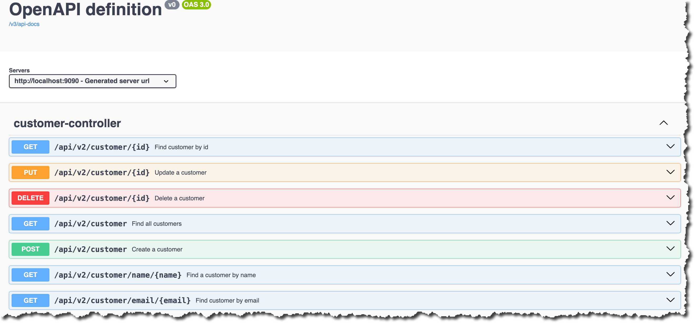
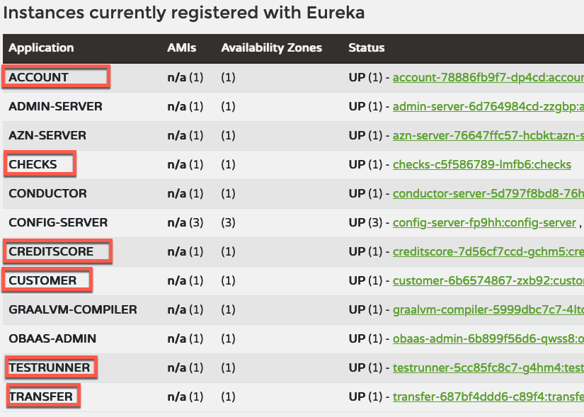
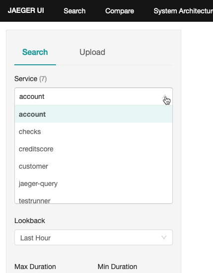
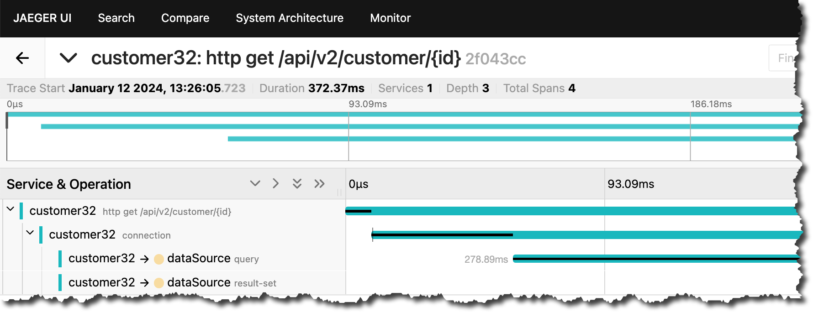
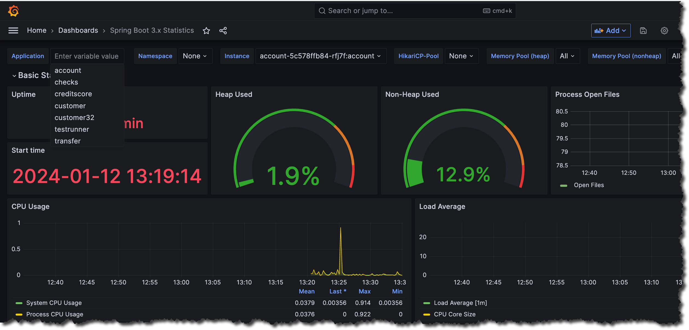

# CloudBank Version 3.2

**NOTE:** This document and application is WIP.

To run Cloud Bank you need OBaaS version 1.1.1 [Oracle Backend for Spring Boot and Microservices](https://cloudmarketplace.oracle.com/marketplace/en_US/listing/138899911)

## Build CloudBank

1. Clone the source repository

   ```shell
   git clone https://github.com/oracle/microservices-datadriven.git
   ```

1. Got to the `cloudbank-v32` directory

   ```shell
   cd microservices-datadriven/cloudbank-v32
   ```

1. Build CloudBank

   ```shell
   mvn clean package
   ```

   Output should look similar to this:

   ```text
   [INFO] ------------------------------------------------------------------------
   [INFO] Reactor Summary for CloudBank 0.0.1-SNAPSHOT:
   [INFO]
   [INFO] CloudBank .......................................... SUCCESS [  0.950 s]
   [INFO] account ............................................ SUCCESS [  2.904 s]
   [INFO] checks ............................................. SUCCESS [  1.168 s]
   [INFO] customer ........................................... SUCCESS [  1.198 s]
   [INFO] customer32 ......................................... SUCCESS [  1.133 s]
   [INFO] creditscore ........................................ SUCCESS [  0.956 s]
   [INFO] transfer ........................................... SUCCESS [  0.463 s]
   [INFO] testrunner ......................................... SUCCESS [  1.009 s]
   [INFO] ------------------------------------------------------------------------
   [INFO] BUILD SUCCESS
   [INFO] ------------------------------------------------------------------------
   [INFO] Total time:  10.160 s
   [INFO] Finished at: 2024-01-12T10:41:10-06:00
   [INFO] ------------------------------------------------------------------------
   ```

## Establish connection with OBaaS Admin service

1. Start the tunnel

    ```shell
    kubectl port-forward -n obaas-admin svc/obaas-admin 8080
    ```

1. Get the password for the `obaas-admin` user

    ```shell
    kubectl get secret -n azn-server oractl-passwords -o jsonpath='{.data.admin}' | base64 -d
    ```

1. Start `oractl` from the `cloudbank-v32` directory and login as the `obaas-admin` user.

    ```text
      _   _           __    _    ___
   / \ |_)  _.  _. (_    /  |   |
   \_/ |_) (_| (_| __)   \_ |_ _|_
   ========================================================================================
   Application Name: Oracle Backend Platform :: Command Line Interface
   Application Version: (1.1.1)
   :: Spring Boot (v3.2.1) ::

   Ask for help:
      - Slack: https://oracledevs.slack.com/archives/C03ALDSV272
      - email: obaas_ww@oracle.com

   oractl:>connect
   ? username obaas-admin
   ? password *************
   Credentials successfully authenticated! obaas-admin -> welcome to OBaaS CLI.
   oractl:>
    ```

## Deploy CloudBank

CloudBank can be deployed using the `--script` command in `oractl`. CloudBank will be deployed in the namespace `application`. You are going to be asked for passwords when the `bind` command executes.

```text
oractl:>script --file deploy-cmds/deploy-cb.txt
```

The output should look similar to this:

```text
Database/Service Password: *************
Schema {account} was successfully Created and Kubernetes Secret {application/account} was successfully Created.
Database/Service Password: *************
Schema {account} was successfully Not_Modified and Kubernetes Secret {application/checks} was successfully Created.
Database/Service Password: *************
Schema {customer} was successfully Created and Kubernetes Secret {application/customer} was successfully Created.
Database/Service Password: *************
Schema {customer} was successfully Not_Modified and Kubernetes Secret {application/customer32} was successfully Created.
Database/Service Password: *************
Schema {account} was successfully Not_Modified and Kubernetes Secret {application/testrunner} was successfully Created.
uploading: account/target/account-0.0.1-SNAPSHOT.jar
building and pushing image...

creating deployment and service...
obaas-cli [deploy]: Application was successfully deployed.
NOTICE: service not accessible outside K8S
uploading: checks/target/checks-0.0.1-SNAPSHOT.jar
building and pushing image...

creating deployment and service...
obaas-cli [deploy]: Application was successfully deployed.
NOTICE: service not accessible outside K8S
uploading: customer/target/customer-0.0.1-SNAPSHOT.jar
building and pushing image...

creating deployment and service...
obaas-cli [deploy]: Application was successfully deployed.
NOTICE: service not accessible outside K8S
uploading: customer32/target/customer32-0.0.1-SNAPSHOT.jar
building and pushing image...

creating deployment and service...
obaas-cli [deploy]: Application was successfully deployed.
NOTICE: service not accessible outside K8S
uploading: creditscore/target/creditscore-0.0.1-SNAPSHOT.jar
building and pushing image...

creating deployment and service...
obaas-cli [deploy]: Application was successfully deployed.
NOTICE: service not accessible outside K8S
uploading: testrunner/target/testrunner-0.0.1-SNAPSHOT.jar
building and pushing image...

creating deployment and service...
obaas-cli [deploy]: Application was successfully deployed.
NOTICE: service not accessible outside K8S
uploading: transfer/target/transfer-0.0.1-SNAPSHOT.jar
building and pushing image...

creating deployment and service...
obaas-cli [deploy]: Application was successfully deployed.
NOTICE: service not accessible outside K8S
```

The following commands are executed:

```script
bind --service-name account
bind --service-name checks --username account
bind --service-name customer
bind --service-name customer32 --username customer
bind --service-name testrunner --username account
deploy --service-name account --artifact-path account/target/account-0.0.1-SNAPSHOT.jar --image-version 0.0.1 --liquibase-db admin
deploy --service-name checks --artifact-path checks/target/checks-0.0.1-SNAPSHOT.jar --image-version 0.0.1
deploy --service-name customer --artifact-path customer/target/customer-0.0.1-SNAPSHOT.jar --image-version 0.0.1 --liquibase-db admin
deploy --service-name customer32 --artifact-path customer32/target/customer32-0.0.1-SNAPSHOT.jar --image-version 0.0.1 --liquibase-db admin
deploy --service-name creditscore --artifact-path creditscore/target/creditscore-0.0.1-SNAPSHOT.jar --image-version 0.0.1
deploy --service-name testrunner --artifact-path testrunner/target/testrunner-0.0.1-SNAPSHOT.jar --image-version 0.0.1
deploy --service-name transfer --artifact-path transfer/target/transfer-0.0.1-SNAPSHOT.jar --image-version 0.0.1
```

## Create APISIX Routes

1. Get APISIX Gateway Admin Key

    ```shell
    kubectl -n apisix get configmap apisix -o yaml
    ```

1. Create tunnel to APISIX

    ```shell
    kubectl port-forward -n apisix svc/apisix-admin 9180
    ```

1. Create routes

    In the CloudBank directory run the following command. *NOTE*, you must add the API-KEY to the command

    ````shell
    (cd apisix-routes; source ./create-all-routes.sh <YOUR-API-KEY>)
    ```

## Optional - autoscaling

Create autoscalers for CloudBank.

```text
oractl:>script --file deploy-cmds/autoscale-cmd.txt
```

The following commands are executed:

```script
create-autoscaler --service-name account --min-replicas 1 --max-replicas 4 --cpu-request 100m --cpu-percent 80 
create-autoscaler --service-name checks --min-replicas 1 --max-replicas 4 --cpu-request 100m --cpu-percent 80
create-autoscaler --service-name customer --min-replicas 1 --max-replicas 4 --cpu-request 100m --cpu-percent 80
create-autoscaler --service-name customer32 --min-replicas 1 --max-replicas 4 --cpu-request 100m --cpu-percent 80
create-autoscaler --service-name creditscore --min-replicas 1 --max-replicas 4 --cpu-request 100m --cpu-percent 80
create-autoscaler --service-name testrunner --min-replicas 1 --max-replicas 4 --cpu-request 100m --cpu-percent 80
create-autoscaler --service-name transfer --min-replicas 1 --max-replicas 4 --cpu-request 100m --cpu-percent 80
```

## OpenAPI

All services have OpenAPI documentation and can be reached via the Swagger UI. For example after starting a port forward to anyone of the services you can the URL http://localhost:*port*/swagger-ui/index.html to see the documentation. Replace *port* with the port used in the port forward command.

For example, to see the API documentation for the `customer32` application do the following:

```shell
kubectl port-forward -n application svc/customer32 8080
```

And open a browser window and go to [Swagger UI](http://localhost:8080)

This is an example of the `customer32` application:



## Test CloudBank Services

1. Get the external IP address

    ```shell
    kubectl -n ingress-nginx get service ingress-nginx-controller
    ```

    Result. Make a note of the EXTERNAL-IP it will be used in the tests.
2.

   ```text
    NAME                       TYPE           CLUSTER-IP      EXTERNAL-IP       PORT(S)                      AGE
    ingress-nginx-controller   LoadBalancer   10.96.172.148   146.235.207.230   80:31393/TCP,443:30506/TCP   158m
    ```

1. Test `account` service

   1. Rest endpoint

      ```shell
      curl -s http://<EXTERNAL-IP>/api/v1/accounts | jq
      ```

      Should return:

      ```json
      [
        {
          "accountBalance": -20,
          "accountCustomerId": "qwertysdwr",
          "accountId": 1,
          "accountName": "Andy's checking",
          "accountOpenedDate": "2023-06-26T17:39:37.000+00:00",
          "accountOtherDetails": "Account Info",
          "accountType": "CH"
        },
        {...}
      ]
      ```

1. Test `customer` service

   1. REST endpoint

      ```shell
      curl -s http://<EXTERNAL-IP>/api/v1/customer | jq
      ```

      Should return:

      ```json
      [
        {
          "customerEmail": "andy@andy.com",
          "customerId": "qwertysdwr",
          "customerName": "Andy",
          "customerOtherDetails": "Somekind of Info",
          "customerPassword": "SuperSecret",
          "dateBecameCustomer": "2023-11-02T17:30:12.000+00:00"
        },
        {...}
      ]
      ```

1. Test `customer32` service

   1. REST endpoint

      ```shell
      curl -s http://<EXTERNAL-IP>/api/v2/customer | jq
      ```

      Should return:

      ```json
      [
         {
            "email": "andy@andy.com",
            "id": "qwertysdwr",
            "name": "Andy"
         },
        {...}
      ]
      ```

1. Test `creditscore` service

    1. REST endpoint

       ```shell
       curl -s http://<EXTERNAL-IP>/api/v1/creditscore | jq
       ```

       Should return:

       ```json
       {
         "Date": "2023-12-26",
         "Credit Score": "574"
       }
       ```

1. Test `check` service

    1. REST endpoint - deposit check. *NOTE*: Make sure you use an existing account number

       ```shell
       curl -i -X POST -H 'Content-Type: application/json' -d '{"accountId": 1, "amount": 256}' http://<EXTERNAL-IP>/api/v1/testrunner/deposit
       ```

       Should return:

       ```text
       HTTP/1.1 201
       Content-Type: application/json
       Transfer-Encoding: chunked
       Date: Thu, 02 Nov 2023 18:02:06 GMT

       {"accountId":1,"amount":256}
       ```

    1. Check application log

         ```shell
         kubectl logs -n application svc/checks
         ```

         Should contain:

         ```log
         Received deposit <CheckDeposit(accountId=1, amount=256)>
         ```

    1. Check journal entries. Replace '1' with the account number you used.

        ```shell
        curl -i http://<EXTERNAL-ID>/api/v1/account/1/journal
        ```

        output should be similar to:

        ```log
        HTTP/1.1 200 
        Content-Type: application/json
        Transfer-Encoding: chunked
        Date: Thu, 02 Nov 2023 18:06:45 GMT

        [{"journalId":7,"journalType":"PENDING","accountId":1,"lraId":"0","lraState":null,"journalAmount":256}]
        ```

    1. Clearance of check - Note the JournalID from earlier step

         ```shell
         curl -i -X POST -H 'Content-Type: application/json' -d '{"journalId": 7}' http://<EXTERNAL-ID>/api/v1/testrunner/clear
         ```

        output should be similar to:

        ```text
         HTTP/1.1 201 
         Content-Type: application/json
         Transfer-Encoding: chunked
         Date: Thu, 02 Nov 2023 18:09:17 GMT

         {"journalId":7}
         ```

    1. Check application log

       ```shell
       kubectl logs -n application svc/checks
       ```

       Output should be similar to:

       ```log
       ...
       Received clearance <Clearance(journalId=1)>
       ...
       ```

    1. Check journal -- DEPOSIT

       ```shell
       curl -i http://<EXTERNAL-IP>/api/v1/account/21/journal
       ```

       Output should look like this -- DEPOSIT

       ```text
       HTTP/1.1 200
       Content-Type: application/json
       Transfer-Encoding: chunked
       Date: Thu, 02 Nov 2023 18:36:31 GMT

       [{"journalId":7,"journalType":"DEPOSIT","accountId":1,"lraId":"0","lraState":null,"journalAmount":256}]`
       ```

1. Run LRA Test Cases

    1. Check account balances. Note that the account numbers 1 and 2 can be different in your environment

       ```shell
       curl -s http://<EXTERNAL-IP>/api/v1/account/1 | jq ; curl -s http://<EXTERNAL-IP>/api/v1/account/2 | jq 
       ```

       Output should be similar to this, make a note of the account balance:

       ```json
       {
         "accountId": 1,
         "accountName": "Andy's checking",
         "accountType": "CH",
         "accountCustomerId": "qwertysdwr",
         "accountOpenedDate": "2023-11-02T17:23:53.000+00:00",
         "accountOtherDetails": "Account Info",
         "accountBalance": -20
       },
       {
         "accountId": 2,
         "accountName": "Mark's CCard",
         "accountType": "CC",
         "accountCustomerId": "bkzLp8cozi",
         "accountOpenedDate": "2023-11-02T17:23:53.000+00:00",
         "accountOtherDetails": "Mastercard account",
         "accountBalance": 1000
       }
       ```

    1. Perform transfer between two accounts. Note account numbers

       ```shell
       curl -X POST "http://<EXTERNAL-IP>/transfer?fromAccount=22&toAccount=21&amount=100"
       ```

       Output should look like this:

       ```text
       transfer status:withdraw succeeded deposit succeeded
       ```

    1. Check accounts to see that the transfer have occurred

       ```shell
       curl -s http://<EXTERNAL-IP>/api/v1/account/1 | jq ; curl -s http://<EXTERNAL-IP>/api/v1/account/2 | jq 
       ```

       Output should be similar to this:

       ```json
       {
         "accountId": 1,
         "accountName": "Andy's checking",
         "accountType": "CH",
         "accountCustomerId": "qwertysdwr",
         "accountOpenedDate": "2023-11-02T17:23:53.000+00:00",
         "accountOtherDetails": "Account Info",
         "accountBalance": 80
       },
       {
         "accountId": 2,
         "accountName": "Mark's CCard",
         "accountType": "CC",
         "accountCustomerId": "bkzLp8cozi",
         "accountOpenedDate": "2023-11-02T17:23:53.000+00:00",
         "accountOtherDetails": "Mastercard account",
         "accountBalance": 900
       }
       ```

    1. Check the application log to confirm

       ```shell
       kubectl logs -n application svc/transfer
       ```

       Output should look similar to this:

       ```text
       2023-12-26T16:50:45.138Z  INFO 1 --- [transfer] [nio-8080-exec-9] [] com.example.transfer.TransferService     : Started new LRA/transfer Id: http://otmm-tcs.otmm.svc.cluster.local:9000/api/v1/lra-coordinator/ea98ebae-2358-4dd1-9d7c-09f4550d7567
       2023-12-26T16:50:45.139Z  INFO 1 --- [transfer] [nio-8080-exec-9] [] com.example.transfer.TransferService     : withdraw accountId = 2, amount = 100
       2023-12-26T16:50:45.139Z  INFO 1 --- [transfer] [nio-8080-exec-9] [] com.example.transfer.TransferService     : withdraw lraId = http://otmm-tcs.otmm.svc.cluster.local:9000/api/v1/lra-coordinator/ea98ebae-2358-4dd1-9d7c-09f4550d7567
       2023-12-26T16:50:45.183Z  INFO 1 --- [transfer] [nio-8080-exec-9] [] com.example.transfer.TransferService     : withdraw succeeded
       2023-12-26T16:50:45.183Z  INFO 1 --- [transfer] [nio-8080-exec-9] [] com.example.transfer.TransferService     : deposit accountId = 1, amount = 100
       2023-12-26T16:50:45.183Z  INFO 1 --- [transfer] [nio-8080-exec-9] [] com.example.transfer.TransferService     : deposit lraId = http://otmm-tcs.otmm.svc.cluster.local:9000/api/v1/lra-coordinator/ea98ebae-2358-4dd1-9d7c-09f4550d7567
       2023-12-26T16:50:45.216Z  INFO 1 --- [transfer] [nio-8080-exec-9] [] com.example.transfer.TransferService     : withdraw succeeded deposit succeeded
       2023-12-26T16:50:45.216Z  INFO 1 --- [transfer] [nio-8080-exec-9] [] com.example.transfer.TransferService     : LRA/transfer action will be confirm
       2023-12-26T16:50:45.226Z  INFO 1 --- [transfer] [nio-8080-exec-1] [] com.example.transfer.TransferService     : Received confirm for transfer : http://otmm-tcs.otmm.svc.cluster.local:9000/api/v1/lra-coordinator/ea98ebae-2358-4dd1-9d7c-09f4550d7567
       2023-12-26T16:50:45.233Z  INFO 1 --- [transfer] [io-8080-exec-10] [] com.example.transfer.TransferService     : Process confirm for transfer : http://otmm-tcs.otmm.svc.cluster.local:9000/api/v1/lra-coordinator/ea98ebae-2358-4dd1-9d7c-09f4550d7567
       ```

## Observability and Tracing

1. Check Eureka dashbaord

   1. Port forward

      ```shell
      kubectl -n eureka port-forward svc/eureka 8761
      ```

   1. Open <http://localhost:8761> in a browser and verify that all services are registered

      

1. Check Jaeger dashbaord

   1. Port forward

      ```shell
      kubectl -n observability port-forward svc/jaegertracing-query 16686
      ```

   1. Open <http://localhost:16686> in a browser and verify that all services are registered

      

   1. Choose `customer32` Service and click *Find Traces*

      

1. Check the Grafana Dashboard

   1. Port forward

      ```shell
      kubectl -n grafana port-forward svc/grafana 7070:80
      ```

   1. Open <http://localhost:7070> in a browser and verify that all services are registered and you can see some data (you may have to select the dashboard you want to see)

      
