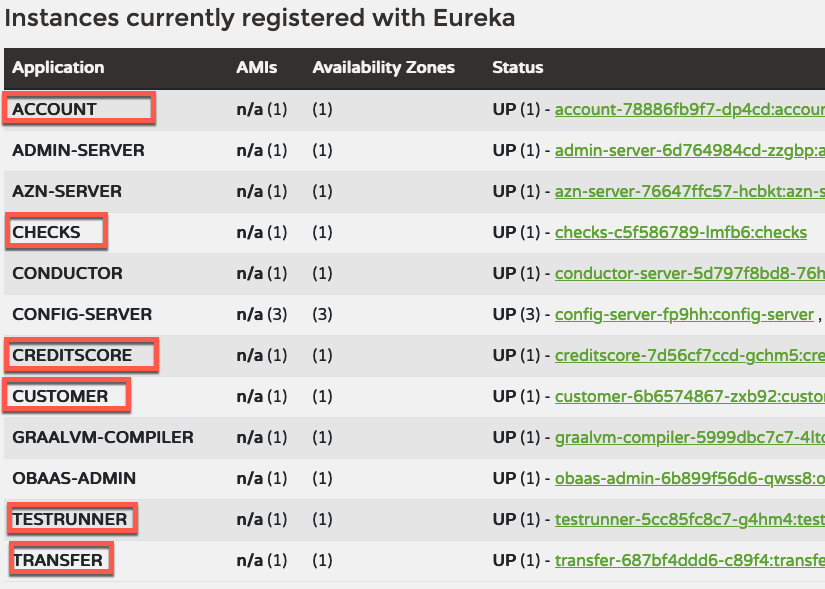

# CloudBank Version 4 - 9/26/24

**NOTE:** This document and application is WIP.

To run Cloud Bank you need OBaaS version 1.3.0 [Oracle Backend for Microservices and AI](https://cloudmarketplace.oracle.com/marketplace/en_US/listing/138899911) and Java 21 installed.

## Build CloudBank

1. Clone the source repository

   ```shell
   git clone https://github.com/oracle/microservices-datadriven.git
   ```

1. Got to the `cloudBank-v4` directory

   ```shell
   cd microservices-datadriven/cloudbank-v4
   ```

1. Build CloudBank

   ```shell
   mvn clean package
   ```

   Output should look similar to this:

   ```text
    [INFO] ------------------------------------------------------------------------
    [INFO] Reactor Summary for CloudBank 0.0.1-SNAPSHOT:
    [INFO]
    [INFO] CloudBank .......................................... SUCCESS [  0.975 s]
    [INFO] account ............................................ SUCCESS [  3.489 s]
    [INFO] chatbot ............................................ SUCCESS [  0.995 s]
    [INFO] checks ............................................. SUCCESS [  1.518 s]
    [INFO] customer ........................................... SUCCESS [  1.410 s]
    [INFO] creditscore ........................................ SUCCESS [  1.170 s]
    [INFO] transfer ........................................... SUCCESS [  0.623 s]
    [INFO] testrunner ......................................... SUCCESS [  1.220 s]
    [INFO] ------------------------------------------------------------------------
    [INFO] BUILD SUCCESS
    [INFO] ------------------------------------------------------------------------
    [INFO] Total time:  11.817 s
    [INFO] Finished at: 2024-10-10T13:49:51-05:00
    [INFO] ------------------------------------------------------------------------
   ```

## Establish connection with OBaaS Admin service

1. Start the tunnel

    ```shell
    kubectl port-forward -n obaas-admin svc/obaas-admin 8080
    ```

1. Get the password for the `obaas-admin` user

    ```shell
    kubectl get secret -n azn-server oractl-passwords -o jsonpath='{.data.admin}' | base64 -d
    ```

1. Start `oractl` from the `cloudbank-v4` directory and login as the `obaas-admin` user.

    ```text
       _   _           __    _    ___
      / \ |_)  _.  _. (_    /  |   |
      \_/ |_) (_| (_| __)   \_ |_ _|_
      ========================================================================================
      Application Name: Oracle Backend Platform :: Command Line Interface
      Application Version: (1.3.1)
      :: Spring Boot (v3.3.3) ::

      Ask for help:
         - Slack: https://oracledevs.slack.com/archives/C06L9CDGR6Z
         - email: obaas_ww@oracle.com

      oractl:>init connect
      ? username obaas-admin
      ? password *************
      obaas-admin -> Welcome!
    ```

## Deploy CloudBank

CloudBank can be deployed using the `--script` command in `oractl`. CloudBank will be deployed in the namespace `application`. You are going to be asked for passwords when the `bind` command executes. **NOTE:** This will *NOT* deploy the chatbot service as it's an optional infrastructure deployment.

```text
oractl:>script --file deploy-cmds/deploy-cb-java21.txt
```

The output should look similar to this:

```text
Database/Service Password: *************
Schema {account} was successfully Created and Kubernetes Secret {application/account} was successfully Created.
Database/Service Password: *************
Schema {account} was successfully Not_Modified and Kubernetes Secret {application/checks} was successfully Created.
Database/Service Password: *************
Schema {customer} was successfully Created and Kubernetes Secret {application/customer} was successfully Created.
Database/Service Password: *************
Schema {account} was successfully Not_Modified and Kubernetes Secret {application/testrunner} was successfully Created.
uploading: account/target/account-0.0.1-SNAPSHOT.jar
building and pushing image...

creating deployment and service...
obaas-cli [deploy]: Application was successfully deployed.
NOTICE: service not accessible outside K8S
uploading: checks/target/checks-0.0.1-SNAPSHOT.jar
building and pushing image...

creating deployment and service...
obaas-cli [deploy]: Application was successfully deployed.
NOTICE: service not accessible outside K8S
uploading: customer/target/customer-0.0.1-SNAPSHOT.jar
building and pushing image...

creating deployment and service...
obaas-cli [deploy]: Application was successfully deployed.
NOTICE: service not accessible outside K8S
uploading: creditscore/target/creditscore-0.0.1-SNAPSHOT.jar
building and pushing image...

creating deployment and service...
obaas-cli [deploy]: Application was successfully deployed.
NOTICE: service not accessible outside K8S
uploading: testrunner/target/testrunner-0.0.1-SNAPSHOT.jar
building and pushing image...

creating deployment and service...
obaas-cli [deploy]: Application was successfully deployed.
NOTICE: service not accessible outside K8S
uploading: transfer/target/transfer-0.0.1-SNAPSHOT.jar
building and pushing image...

creating deployment and service...
obaas-cli [deploy]: Application was successfully deployed.
NOTICE: service not accessible outside K8S
```

The following commands are executed:

```script
bind --service-name account
bind --service-name checks --username account
bind --service-name customer
bind --service-name testrunner --username account
deploy --service-name account --artifact-path account/target/account-0.0.1-SNAPSHOT.jar --image-version 0.0.1 --liquibase-db admin --java-version ghcr.io/oracle/graalvm-native-image-obaas:21
deploy --service-name checks --artifact-path checks/target/checks-0.0.1-SNAPSHOT.jar --image-version 0.0.1 --java-version ghcr.io/oracle/graalvm-native-image-obaas:21
deploy --service-name customer --artifact-path customer/target/customer-0.0.1-SNAPSHOT.jar --image-version 0.0.1 --liquibase-db admin --java-version ghcr.io/oracle/graalvm-native-image-obaas:21
deploy --service-name creditscore --artifact-path creditscore/target/creditscore-0.0.1-SNAPSHOT.jar --image-version 0.0.1 --java-version ghcr.io/oracle/graalvm-native-image-obaas:21
deploy --service-name testrunner --artifact-path testrunner/target/testrunner-0.0.1-SNAPSHOT.jar --image-version 0.0.1 --java-version ghcr.io/oracle/graalvm-native-image-obaas:21
deploy --service-name transfer --artifact-path transfer/target/transfer-0.0.1-SNAPSHOT.jar --image-version 0.0.1 --java-version ghcr.io/oracle/graalvm-native-image-obaas:21
```

## Deploy **optional** Chatbot

If you have deployed OBaas with a GPU cluster and installed Ollama on the GPU cluster [Install Ollama](https://oracle.github.io/microservices-datadriven/cloudbank/springai/simple-chat/index.html) you can deploy the `chatbot` service.

> Note if you already have a running session with `oractl` you can skip step 1-3.

1. Start the tunnel

    ```shell
    kubectl port-forward -n obaas-admin svc/obaas-admin 8080
    ```

1. Get the password for the `obaas-admin` user

    ```shell
    kubectl get secret -n azn-server oractl-passwords -o jsonpath='{.data.admin}' | base64 -d
    ```

1. Start `oractl` from the `cloudbank-v4` directory and login as the `obaas-admin` user.

1. Run the following command in `oractl`:

    ```shell
    deploy --service-name chatbot --artifact-path chatbot/target/chatbot-0.0.1-SNAPSHOT.jar --image-version 0.0.1 --java-version ghcr.io/oracle/graalvm-native-image-obaas:21
    ```

1. Start a tunnel to the `chatbot` application

    ```shell
    kubectl -n application port-forward svc/chatbot 7575:8080
   ```
   
1. Test the `chatbot` application.

    ```shell
    curl -X POST -d 'what is spring boot?'  http://localhost:7575/chat
    ```
    The command should return something similar to this:

    ```text
    A popular question!

    Spring Boot is an open-source Java-based framework that provides a simple and efficient wait to build web applications, RESTful APIs, and microservices. It's built on top of the Spring  Framework, but with a more streamlined and opinionated approach.
    ```
   
## Create APISIX Routes

1. Get APISIX Gateway Admin Key

    ```shell
    kubectl -n apisix get configmap apisix -o yaml
    ```

1. Create tunnel to APISIX

    ```shell
    kubectl port-forward -n apisix svc/apisix-admin 9180
    ```

1. Create routes

    In the CloudBank directory run the following command. *NOTE*, you must add the API-KEY to the command

    ```shell
    (cd apisix-routes; source ./create-all-routes.sh <YOUR-API-KEY>)
    ```

## Optional - autoscaling

Create autoscalers for CloudBank.

```text
oractl:>script --file deploy-cmds/autoscale-cmd.txt
```

The following commands are executed:

```script
create-autoscaler --service-name account --min-replicas 1 --max-replicas 4 --cpu-request 100m --cpu-percent 80 
create-autoscaler --service-name checks --min-replicas 1 --max-replicas 4 --cpu-request 100m --cpu-percent 80
create-autoscaler --service-name customer --min-replicas 1 --max-replicas 4 --cpu-request 100m --cpu-percent 80
create-autoscaler --service-name creditscore --min-replicas 1 --max-replicas 4 --cpu-request 100m --cpu-percent 80
create-autoscaler --service-name testrunner --min-replicas 1 --max-replicas 4 --cpu-request 100m --cpu-percent 80
create-autoscaler --service-name transfer --min-replicas 1 --max-replicas 4 --cpu-request 100m --cpu-percent 80
```

## OpenAPI

All services have OpenAPI documentation and can be reached via the Swagger UI. For example after starting a port forward to anyone of the services you can the URL swagger-ui/index.html to see the documentation. Replace *port* with the port used in the port forward command. For example, to see the API documentation for the `customer32` application do the following:

```shell
kubectl port-forward -n application svc/customer32 8080
```

And open a browser window and go to [Swagger UI](http://localhost:8080)

This is an example of the `customer32` application:


## Test CloudBank Services

1. Get the external IP address

    ```shell
    kubectl -n ingress-nginx get service ingress-nginx-controller
    ```

    Result. Create a variable called IP with the value of the **EXTERNAL-IP** it will be used in the tests.

    ```text
    NAME                       TYPE           CLUSTER-IP      EXTERNAL-IP       PORT(S)                      AGE
    ingress-nginx-controller   LoadBalancer   10.96.172.148   146.235.207.230   80:31393/TCP,443:30506/TCP   158m
    ```

1. Test `account` service

   1. Rest endpoint

      ```shell
      curl -s http://$IP/api/v1/accounts | jq
      ```

      Should return:

      ```json
      [
        {
          "accountBalance": -20,
          "accountCustomerId": "qwertysdwr",
          "accountId": 1,
          "accountName": "Andy's checking",
          "accountOpenedDate": "2023-06-26T17:39:37.000+00:00",
          "accountOtherDetails": "Account Info",
          "accountType": "CH"
        },
        {...}
      ]
      ```

1. Test `customer` service

   1. GET REST endpoint.

      ```shell
      curl -s http://$IP/api/v1/customer | jq
      ```

      Should return:

      ```json
      [
        {
          "customerEmail": "andy@andy.com",
          "customerId": "qwertysdwr",
          "customerName": "Andy",
          "customerOtherDetails": "Somekind of Info",
          "customerPassword": "SuperSecret",
          "dateBecameCustomer": "2023-11-02T17:30:12.000+00:00"
        },
        {...}
      ]
      ```

   1. POST endpoint to create a customer.

      ```shell
      curl -i -X POST -H 'Content-Type: application/json' -d '{"customerId": "bobsmith", "customerName": "Bob Smith", "customerEmail": "bob@smith.com"}' http://$IP/api/v1/customer
      ```

      Should return the URI of the created object:

      ```text
      HTTP/1.1 201
      Location: http://localhost:8080/api/v1/customer/bobsmith
      Content-Length: 0
      Date: Tue, 03 Sep 2024 21:01:25 GMT
      ```

1. Test `creditscore` service

    1. REST endpoint

       ```shell
       curl -s http://$IP/api/v1/creditscore | jq
       ```

       Should return:

       ```json
       {
         "Date": "2023-12-26",
         "Credit Score": "574"
       }
       ```

1. Test `check` service

    1. REST endpoint - deposit check. *NOTE*: Make sure you use an existing account number

       ```shell
       curl -i -X POST -H 'Content-Type: application/json' -d '{"accountId": 1, "amount": 256}' http://$IP/api/v1/testrunner/deposit
       ```

       Should return:

       ```text
       HTTP/1.1 201
       Content-Type: application/json
       Transfer-Encoding: chunked
       Date: Thu, 02 Nov 2023 18:02:06 GMT

       {"accountId":1,"amount":256}
       ```

    1. Check application log

         ```shell
         kubectl logs -n application svc/checks
         ```

         Should contain:

         ```log
         Received deposit <CheckDeposit(accountId=1, amount=256)>
         ```

    1. Check journal entries. Replace '1' with the account number you used.

        ```shell
        curl -i http://$IP/api/v1/account/1/journal
        ```

        output should be similar to:

        ```log
        HTTP/1.1 200 
        Content-Type: application/json
        Transfer-Encoding: chunked
        Date: Thu, 02 Nov 2023 18:06:45 GMT

        [{"journalId":1,"journalType":"PENDING","accountId":1,"lraId":"0","lraState":null,"journalAmount":256}]
        ```

    1. Clearance of check - Note the JournalID from earlier step

         ```shell
         curl -i -X POST -H 'Content-Type: application/json' -d '{"journalId": 1}' http://$IP/api/v1/testrunner/clear
         ```

        output should be similar to:

        ```text
         HTTP/1.1 201 
         Content-Type: application/json
         Transfer-Encoding: chunked
         Date: Thu, 02 Nov 2023 18:09:17 GMT

         {"journalId":1}
         ```

    1. Check application log

       ```shell
       kubectl logs -n application svc/checks
       ```

       Output should be similar to:

       ```log
       ...
       Received clearance <Clearance(journalId=1)>
       ...
       ```

    1. Check journal -- DEPOSIT. Replace '1' with the account number you used.

       ```shell
       curl -i http://$IP/api/v1/account/1/journal
       ```

       Output should look like this -- DEPOSIT

       ```text
       HTTP/1.1 200
       Content-Type: application/json
       Transfer-Encoding: chunked
       Date: Thu, 02 Nov 2023 18:36:31 GMT

       [{"journalId":1,"journalType":"DEPOSIT","accountId":1,"lraId":"0","lraState":null,"journalAmount":256}]`
       ```

1. Run LRA Test Cases

    1. Check account balances. Note that the account numbers 1 and 2 can be different in your environment

       ```shell
       curl -s http://$IP/api/v1/account/1 | jq ; curl -s http://$IP/api/v1/account/2 | jq 
       ```

       Output should be similar to this, make a note of the account balance:

       ```json
       {
         "accountId": 1,
         "accountName": "Andy's checking",
         "accountType": "CH",
         "accountCustomerId": "qwertysdwr",
         "accountOpenedDate": "2023-11-02T17:23:53.000+00:00",
         "accountOtherDetails": "Account Info",
         "accountBalance": -20
       },
       {
         "accountId": 2,
         "accountName": "Mark's CCard",
         "accountType": "CC",
         "accountCustomerId": "bkzLp8cozi",
         "accountOpenedDate": "2023-11-02T17:23:53.000+00:00",
         "accountOtherDetails": "Mastercard account",
         "accountBalance": 1000
       }
       ```

    1. Perform transfer between two accounts. Note account numbers

       ```shell
       curl -X POST "http://$IP/transfer?fromAccount=2&toAccount=1&amount=100"
       ```

       Output should look like this:

       ```text
       transfer status:withdraw succeeded deposit succeeded
       ```

    1. Check accounts to see that the transfer have occurred

       ```shell
       curl -s http://$IP/api/v1/account/1 | jq ; curl -s http://$IP/api/v1/account/2 | jq 
       ```

       Output should be similar to this:

       ```json
       {
         "accountId": 1,
         "accountName": "Andy's checking",
         "accountType": "CH",
         "accountCustomerId": "qwertysdwr",
         "accountOpenedDate": "2023-11-02T17:23:53.000+00:00",
         "accountOtherDetails": "Account Info",
         "accountBalance": 80
       },
       {
         "accountId": 2,
         "accountName": "Mark's CCard",
         "accountType": "CC",
         "accountCustomerId": "bkzLp8cozi",
         "accountOpenedDate": "2023-11-02T17:23:53.000+00:00",
         "accountOtherDetails": "Mastercard account",
         "accountBalance": 900
       }
       ```

    1. Check the application log to confirm

       ```shell
       kubectl logs -n application svc/transfer
       ```

       Output should look similar to this:

       ```text
       2023-12-26T16:50:45.138Z  INFO 1 --- [transfer] [nio-8080-exec-9] [] com.example.transfer.TransferService     : Started new LRA/transfer Id: http://otmm-tcs.otmm.svc.cluster.local:9000/api/v1/lra-coordinator/ea98ebae-2358-4dd1-9d7c-09f4550d7567
       2023-12-26T16:50:45.139Z  INFO 1 --- [transfer] [nio-8080-exec-9] [] com.example.transfer.TransferService     : withdraw accountId = 2, amount = 100
       2023-12-26T16:50:45.139Z  INFO 1 --- [transfer] [nio-8080-exec-9] [] com.example.transfer.TransferService     : withdraw lraId = http://otmm-tcs.otmm.svc.cluster.local:9000/api/v1/lra-coordinator/ea98ebae-2358-4dd1-9d7c-09f4550d7567
       2023-12-26T16:50:45.183Z  INFO 1 --- [transfer] [nio-8080-exec-9] [] com.example.transfer.TransferService     : withdraw succeeded
       2023-12-26T16:50:45.183Z  INFO 1 --- [transfer] [nio-8080-exec-9] [] com.example.transfer.TransferService     : deposit accountId = 1, amount = 100
       2023-12-26T16:50:45.183Z  INFO 1 --- [transfer] [nio-8080-exec-9] [] com.example.transfer.TransferService     : deposit lraId = http://otmm-tcs.otmm.svc.cluster.local:9000/api/v1/lra-coordinator/ea98ebae-2358-4dd1-9d7c-09f4550d7567
       2023-12-26T16:50:45.216Z  INFO 1 --- [transfer] [nio-8080-exec-9] [] com.example.transfer.TransferService     : withdraw succeeded deposit succeeded
       2023-12-26T16:50:45.216Z  INFO 1 --- [transfer] [nio-8080-exec-9] [] com.example.transfer.TransferService     : LRA/transfer action will be confirm
       2023-12-26T16:50:45.226Z  INFO 1 --- [transfer] [nio-8080-exec-1] [] com.example.transfer.TransferService     : Received confirm for transfer : http://otmm-tcs.otmm.svc.cluster.local:9000/api/v1/lra-coordinator/ea98ebae-2358-4dd1-9d7c-09f4550d7567
       2023-12-26T16:50:45.233Z  INFO 1 --- [transfer] [io-8080-exec-10] [] com.example.transfer.TransferService     : Process confirm for transfer : http://otmm-tcs.otmm.svc.cluster.local:9000/api/v1/lra-coordinator/ea98ebae-2358-4dd1-9d7c-09f4550d7567
       ```

## Observability and Tracing

1. Check the ServiceOPS Center

   1. Get the external IP

      ```shell
      kubectl -n ingress-nginx get service ingress-nginx-controller
      ```

   1. Get the *obaas-admin* user password

      ```shell
      kubectl get secret  -n azn-server oractl-passwords -o jsonpath='{.data.admin}' | base64 -d
      ```

   1. Login into [ServiceOPS Dashboard](https://EXTERNAL-IP/soc)

      

   1. Explore the dashboard

      

1. Check Eureka dashboard

   1. Port forward

      ```shell
      kubectl -n eureka port-forward svc/eureka 8761
      ```

   1. Open [Eureka Dashboard](http://localhost:8761) in a browser and verify that all services are registered

      

1. Check Admin Server dashboard

   1. Port forward

      ```shell
      kubectl port-forward -n admin-server svc/admin-server 8989
      ```

   1. Open [Admin Server Dashboard](http://localhost:8989) in a browser and verify that all services are registered

      

1. Check Jaeger dashboard

   1. Port forward

      ```shell
      kubectl -n observability port-forward svc/jaegertracing-query 16686
      ```

   1. Open [Jaeger Dashboard](http://localhost:16686) in a browser and verify that all services are registered

      

   1. Choose `customer` Service and click *Find Traces*

      

1. Check the Grafana Dashboard

   1, Get the *admin* password for Grafana

      ```shell
      kubectl get secret -n grafana grafana-dashboard-authn -o jsonpath='{.data.password}' | base64 -d
      ```

   1. Port forward

      ```shell
      kubectl -n grafana port-forward svc/grafana 7070:80
      ```

   1. Open [Grafana Login](http://localhost:7070/grafana/) in a browser and login with the username *admin* and the password you have retrieved.

      

   1. Explore the pre-installed dashboards.

      

1. Check Prometheus dashboard

   1. Port forward

      ```shell
      kubectl port-forward -n prometheus svc/prometheus 9090
      ```

   1. Open [Prometheus Dashboard](http://localhost:9090)

      

   1. Select `application_ready_time_seconds` in the search bar and click *Execute*. You should get a table back with some data about the cloudbank application deployed.

      

1. Check Hashicorp Vault dashboard (Development mode)

   1. Port forward

      ```shell
      kubectl port-forward -n vault svc/vault 8200
      ```

   1. Open [Hashicorp Vault Login](https://localhost:8200) and login using the Token method with the `root`

      

   1. You should now see the Hashicorp Vault dashboard

      
