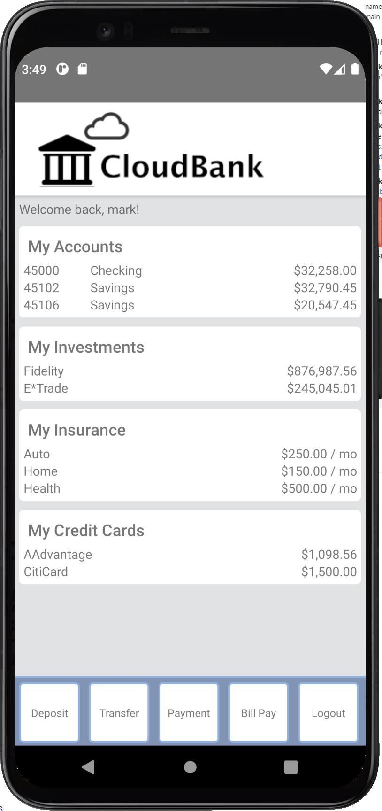

# CloudBank React Native User Interface



This directory contains an implementation of a mobile user interface for CloudBank written with [React Native](https://reactnative.dev/).  The image to the right shows a preview of the main screen.  This application is intended as a demonstration of using Parse Server and Oracle Autonomous Database to provide a 'Mobile Backend-as-a-Service' for mobile application development.

## Application overview

The CloudBank mobile app has the following features:

* Login screen allows you to specify your Parse Server IP address, username and passowrd.  The Parse Server address is stored in the device (emulator) local storage so that you will not need to remember it.  You can point at any Parse Server running the CloudBank backend.  This screen has basic input validation.
* The main screen (as shown to the right) has a list of accounts, investments, insurance and credit cards.  In this initial version, only the accounts section is live data from the backend.  The others are just hardcoded sample data. 
* You can touch (click on) an account to go to the account details screen which shows details of that account, including recent transactions sorted from most to least recent.
* At the bottom of the main screen are some 'buttons' for common functions.
* The Deposit button will allow you to add funds to an account.  The deposit screen will allow you to select an account from a list retrieved from the backend, and specify an amount.  You can press the back button (top left corner) or the device's back button to cancel from this screen (or any of the others) and return to main screen.
* The Transfer button will allow you to transfer funds between two of your own accounts.  The to and from accounts can be chose from a list retrieved from the backend.
* The Payment button will allow you to transfer funds from one of your accounts to another account at the same bank (CloudBank) or at the second bank (ReggieBank) that is used in this sample.  You must choose which bank and specify the target account number.
* The Logout button allows you to return to the login screen.


## Requirements

To use this sample you will require the following:

* Either Android Studio or XCode and a device emulator.  For Android it must be Android version 11.0 Google APIs 30 (for compatibility with react-native tools)
* NodeJS, version 16.14.2 or later recommended, earlier versions *may* work but are not tested
* The react-native tools, version 7.0.3 recommended, no other versions are tested


## Building and running

To build the application, open it in Android Studio (or XCode) and use the IDE's build function to perform a full build.  This is important so that 'linking' will be performed for React Native libraries.

To run the application:

* Start your device emulator
* Use Adroid Studio (or XCode) IDE's run function and target the emulator
* In the root directory of the project, start the metro server:

    ```npx react-native start```

* If the emulator does not automatically connect, hit `r` in the metro console to reload the app.

## About the application

The application attempts to follow established React Native (and React) standards and conventions.  No claim is made that the code is perfect :)  We certainly could do some more refactoring and plan to do that in future versions.  For example, we plan to introduce the `useContext` hook for some of the state information that is used in many parts of the applications and to reduce some of the props chains.

* The entry point is `index.js` which loads the `App` component.
* `App` uses `react-navigation` to control navigation between screens.
* Components are stores in the `components` directory and grouped into sub-directories by function. 
* UI-only components are stored in the `UI` directory. 
* A `common` directory contains functions that are used by various components, but which are not part of any component.
* The `useState` hook is used for most component-local state.
* The `useEffect` hook is used for backend integration.
* Code is commented throughout, formatted according to `prettier` and linted with `eslint`.
* React Native StyleSheet is used for all styles.