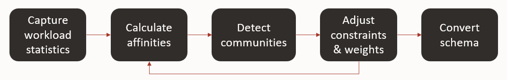

# Data Refactoring Advisor

Data Refactoring Advisor, which is currently in development, is a tool to help refactor monolithic
data stores for microservices.

Microservices typically have their own data stores (domain, bounded context) and to communicate only by APIs.
The data store is part of the service’s implementation and is private.
Data is exposed indirectly by the service’s API.
This helps to promote loose coupling and strong contracts.

Monolithic applications typically have a large, shared database, which makes it easy for different parts
of the application to access whatever data they need, but tends to create increasingly complex interdependencies,
makes it difficult to refactor the application or the data model, and obscures data (domain) ownership.

Data Refactoring Advisor helps identify bounded contexts based on how the data are used.
It collects information about actual usage patterns (e.g. how often tables are joined) in SQL Tuning Sets,
calculates the affinity of each pair of tables based on usage,
and uses the InfoMap algorithm (in Graph Studio) to identify communities/clusters.

The diagram below shows the basic flow:

More information can be found in the [Data Refactoring Advisor for Migrating a Monolith to Microservices](https://bit.ly/datarefactoringadvisor) Live Lab.