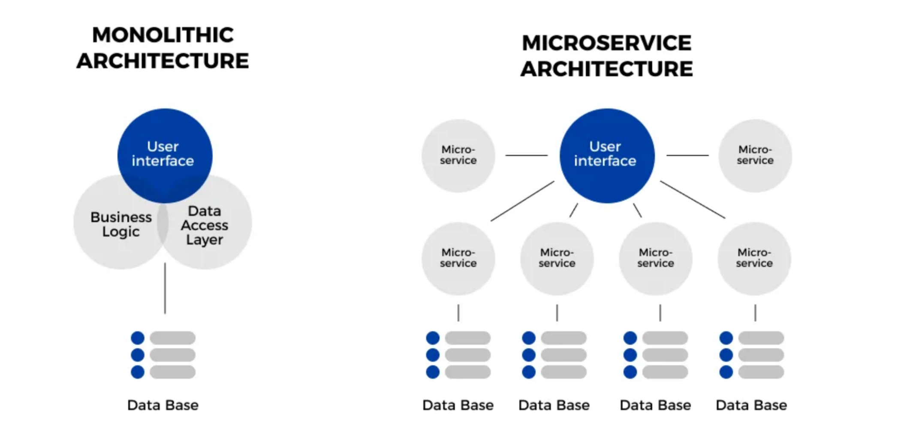

# Discovering Bounded Contexts from your SQL Schema using Community Detection

Data Refactoring Advisor is an innovative methodology designed to assist existing Oracle Database users in refactoring their schemas and identifying communities based on join activity. Here’s how it works:

Process Overview:

1. Data Collection: Gathers SQL tuning sets data to create an affinity matrix.
2. Graph Modeling: Translates the affinity matrix into a graph for community detection.
3. Community Detection: Identifies communities within the graph, representing potential bounded contexts.

Data Refactoring Advisor simplifies the complex task of transforming monolithic applications into agile microservices. By focusing on join activity and leveraging advanced community detection techniques, it helps users optimize their database schemas, improve performance, and enhance the scalability of their applications. This methodology is particularly valuable for existing Oracle Database users seeking to modernize their infrastructure and adopt a microservices architecture.

It works by helping users refactor the data access layer, transitioning from a monolithic architecture to a microservices architecture.

## 1. User Permissions

Have ADMIN apply the [following grants](./user-perms/README.md) to the user capturing workload in a SQL Tuning Set

## 2. Collect Database Workload

To begin optimizing an existing application, the initial task involves gathering the workload based upon the SQL statements being run against the database instance. For applications utilizing an Oracle database and accessing tables through SQL queries, a recommended approach is to analyze how the application interacts with these tables. SQL Tuning Sets serve as a valuable tool for capturing and providing detailed access pattern data, once they are correctly configured by following the steps outlined below.

[Collect Database Workload with a SQL Tuning Set](./collect-database-workload/README.md)

## 3. Create Graph Tables

 To facilitate community detection analysis, we need to set up two key metadata tables.

• The NODES table will catalog all tables in our dataset, detailing their access frequency and participation in joins with other tables. This provides a clear view of how each table is utilized and interacts within the dataset.

• The EDGES table, on the other hand, will record the relationships (affinities) between pairs of tables, forming the edges in our dataset’s graph representation.

These tables are essential for applying community detection algorithms like Infomap, as they establish the foundation for identifying clusters or communities of interconnected tables based on their usage and relationships. 

[Create Graph Tables](./create-graph-tables/README.md)

## 4. Create Graph with Graph Studio

Oracle’s Graph Studio is a powerful tool designed to create, query, and analyze graphs from tables within your Autonomous Database, simplifying graph analytics.

[Create Graph with Graph Studio](./create-graph/README.md)

## 5. Run Community Detection with a Notebook

We create a notebook in Graph Studio for running Community Detection. A notebook is used to run queries against a graph. 

[Run Community Detection with a Notebook](./community-detection/README.md)
