# Run Community Detection using a NoteBook

Create a Notebook using Graph Studio, click `Create`

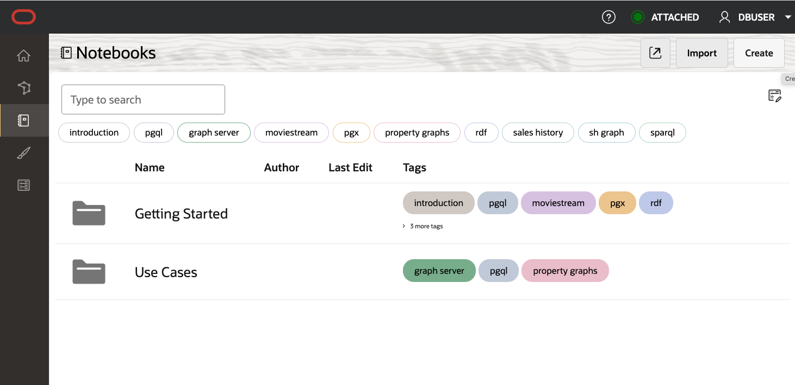

Give a Name and Description and click `Create`

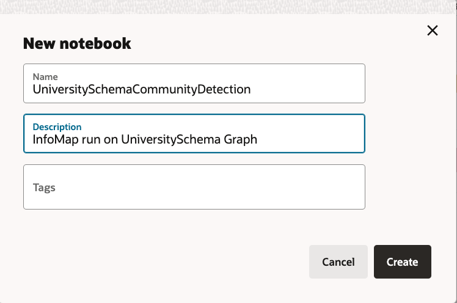

A notebook is used to run queries against a graph

[PGX (Parallel Graph AnalytiX)](https://labs.oracle.com/pls/apex/f?p=94065:12:11060783655161:127) is Oracle's in-memory graph analytics engine.

[PGQL (Property Graph Query Language)](https://pgql-lang.org/) is a graph query language developed by Oracle for querying property graphs.

For this notebook example, two graph query languages will be used

[java-pgx](https://docs.oracle.com/en/cloud/paas/autonomous-database/csgru/java-pgx-interpreter.html) involves writing Java code to work with graphs and perform analytics.

[pgql-pgx](https://docs.oracle.com/en/cloud/paas/autonomous-database/csgru/pgql-pgx-interpreter.html) refers to using PGQL (the query language) with PGX, allowing users to query graphs using PGQL syntax within the PGX environment.

in the picture below, select java-pgx as the interpreter used in a new paragraph

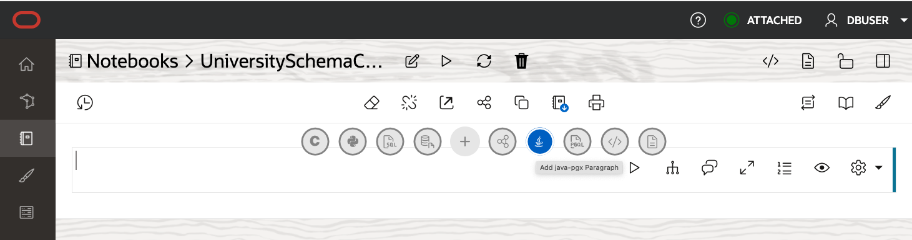


## Load Graph into Notebook

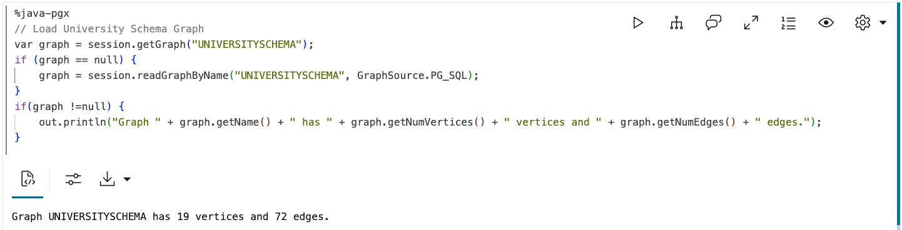

```
// Load StudentFaculty Graph
var graph = session.getGraph("STUDENTFACULTY");
if (graph == null) {
    graph = session.readGraphByName("STUDENTFACULTY", GraphSource.PG_VIEW);
}
if(graph !=null) {
    out.println("Graph " + graph.getName() + " has " + graph.getNumVertices() + " vertices and " + graph.getNumEdges() + " edges.");
}
```

## List Graphs Loaded

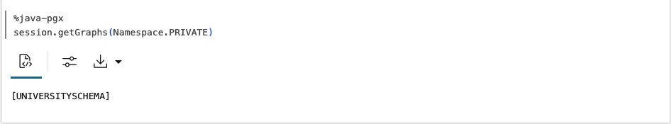

```
// Get a list of graphs loaded into the graph server memory
session.getGraphs();
```

## Render Graph using pgql-pgx

Create a pgl-pgx paragraph, update GRAPH_NAME and run

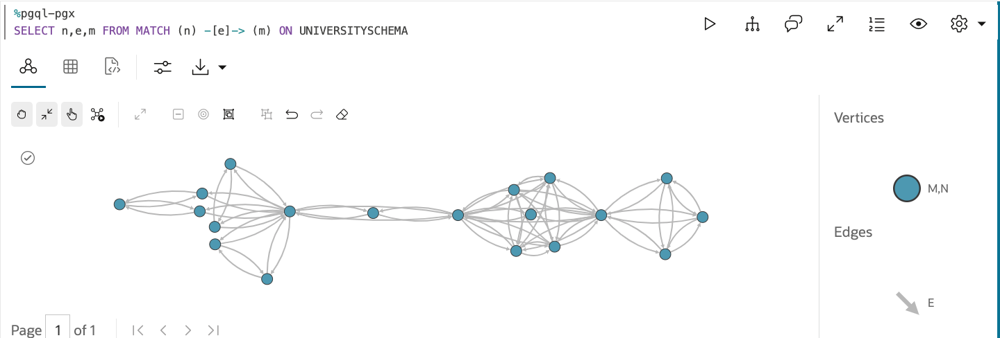

Add Labeling

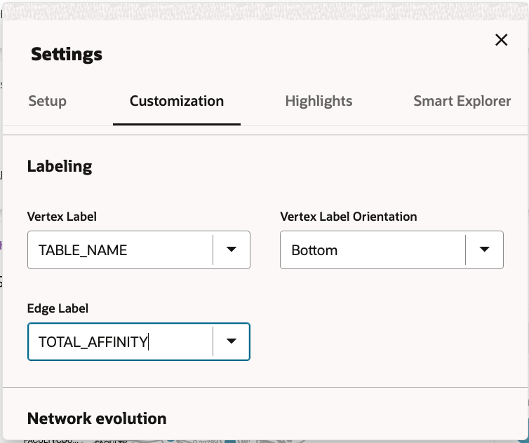

Looks Better

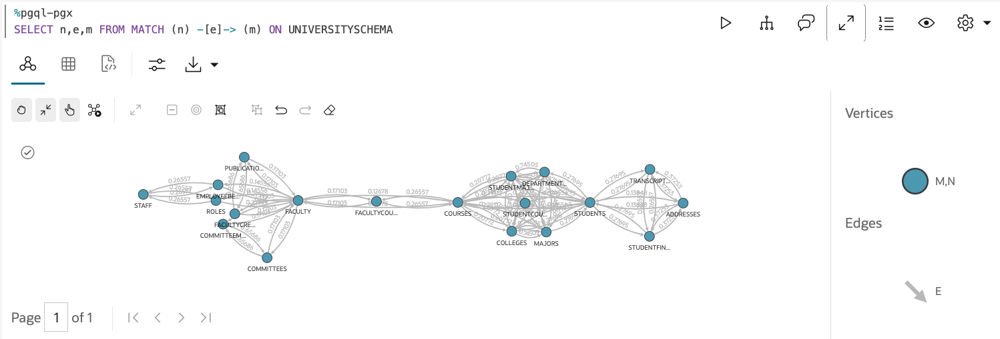

## Set Edge Weight to TOTAL_AFFINITY
Prepare for running the weighted PageRank algorithm. It requires an edge weight so we use the TOTAL_AFFINITY value

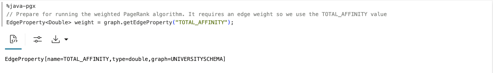

```
// Prepare for running the weighted PageRank algorithm. It requires an edge weight so we use the TOTAL_AFFINITY value
EdgeProperty<Double> weight = graph.getEdgeProperty("TOTAL_AFFINITY");
```


## Compute the Weighted Pagerank

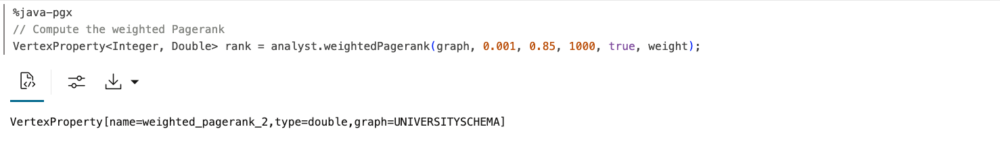

```
// Compute the weighted Pagerank
VertexProperty<Integer, Double> rank = analyst.weightedPagerank(graph, 0.001, 0.85, 1000, true, weight);
```

## Create a Vertex Property to hold the Community ID values

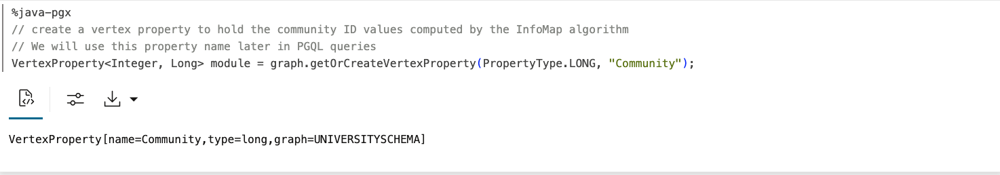

```
// create a vertex property to hold the community ID values computed by the InfoMap algorithm
// We will use this property name later in PGQL queries
VertexProperty<Integer, Long> module = graph.getOrCreateVertexProperty(PropertyType.LONG, "Community");
```

## Run the Infomap algorithm

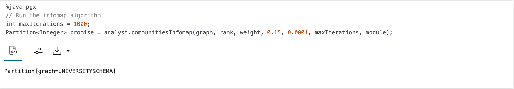

```
// Run the infomap algorithm
int maxIterations = 1;
Partition<Integer> promise = analyst.communitiesInfomap(graph, rank, weight, 0.15, 0.0001, maxIterations, module);
```

## How Many Communities Detected?

Switch to pgql-pgx

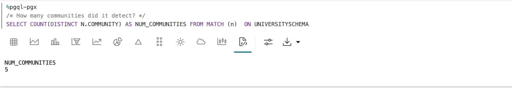

```
/* How many communities did it detect? */

SELECT COUNT(DISTINCT N.COMMUNITY) AS NUM_COMMUNITIES FROM MATCH (n)  ON STUDENTFACULTYWORKLOAD
```

6 communities detected, lets see what we have

## View Community Graph

Basically run the same graph command we did before community detection and get the same graph


To view the communities, we need to define a new vertices based on communityID

Go into Settings/Highlight and click `New Highlight`

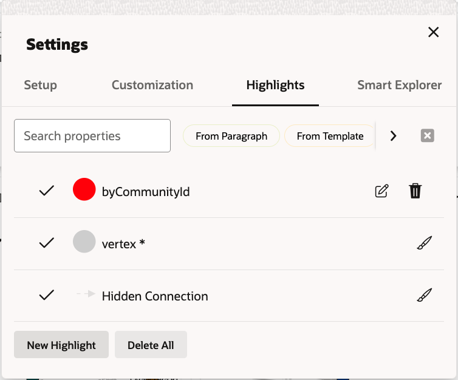


Values for the New Vertex

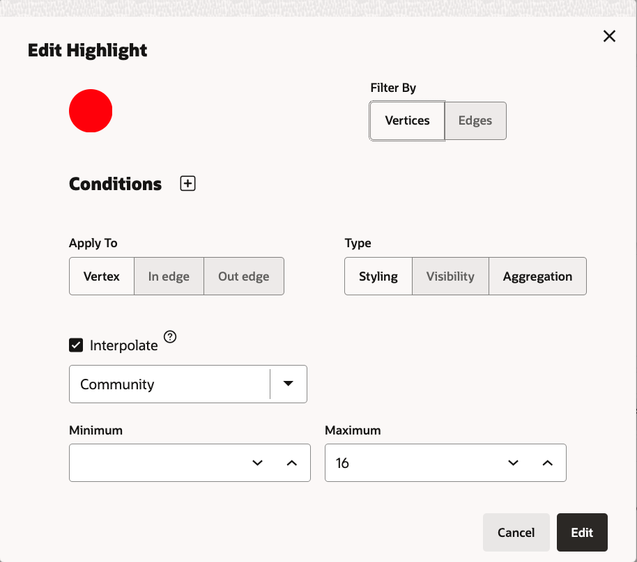
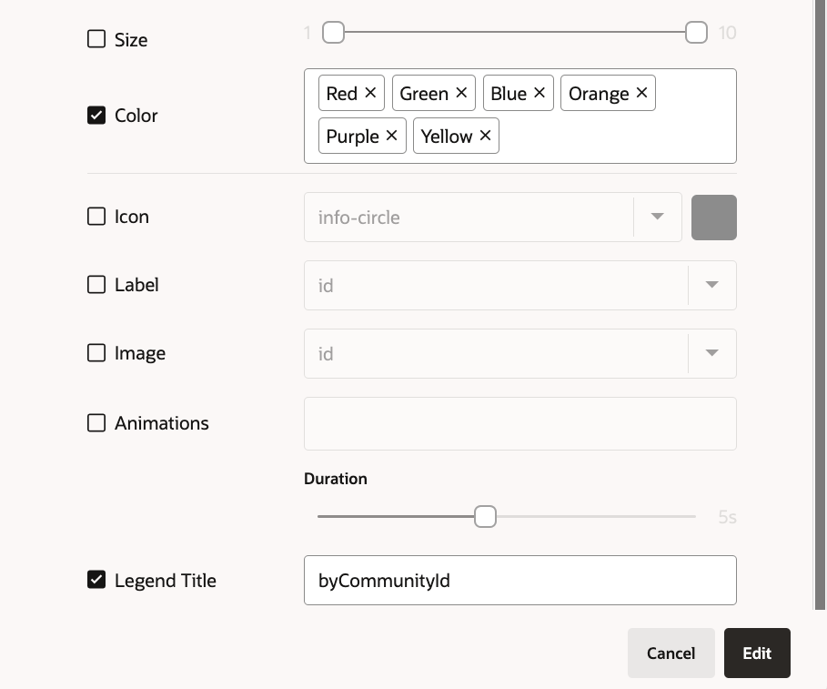

Save the vertex and the graph should start using the new Vertex. See it in the legend on the right hand side.

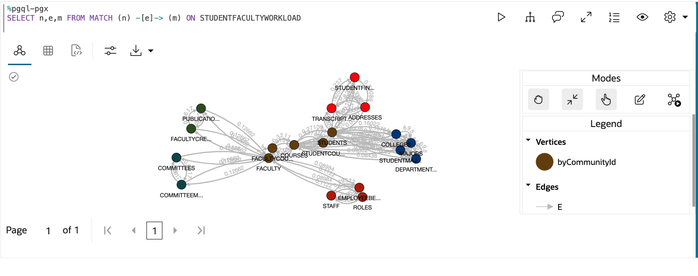

And there are the 6 communities.

**Community 1**

 Publications

 FacultyCredentials


**Community 2**

Committees

CommitteeMembers


**Community 3**

Faculty

FacultyCourses

Courses

StudentCourses

Students

**Community 4**

Colleges

Departments

Majors

StudentMajors

**Community 5**

Addresses

Transcripts

StudentFinances


If those communities were to map to a service, what would they be?  Could the communities be made better be modifying an edge condition?