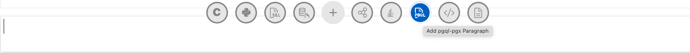
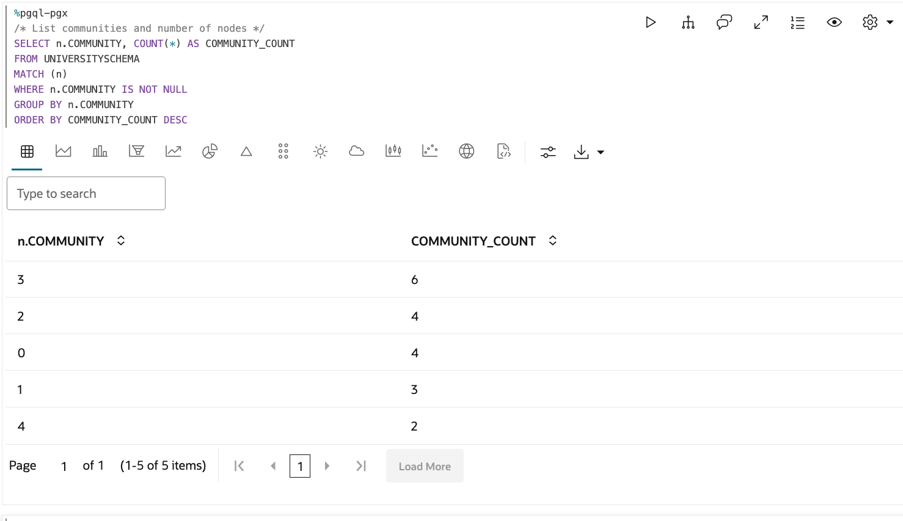
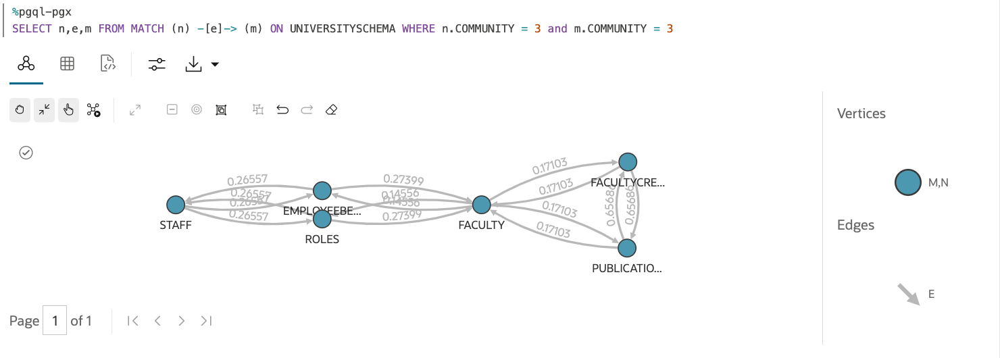
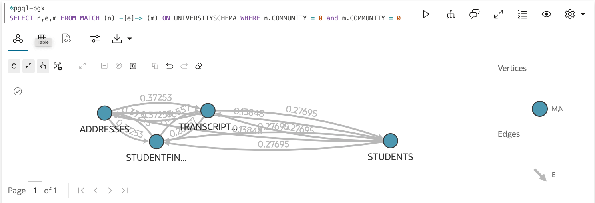

# Run Community Detection using a NoteBook

The [Graph Studio Notebook](https://docs.oracle.com/en/cloud/paas/autonomous-database/csgru/work-notebooks-graph-studio.html) is designed to simplify the process of exploring, analyzing, and visualizing graph data, making it accessible to developers, analysts, and data scientists without requiring extensive graph expertise. It integrates seamlessly with other features of Graph Studio, providing a comprehensive environment for graph-based data analysis and application development.

A notebook is used to run queries against a graph

[PGX (Parallel Graph AnalytiX)](https://labs.oracle.com/pls/apex/f?p=94065:12:11060783655161:127) is Oracle's in-memory graph analytics engine.

[PGQL (Property Graph Query Language)](https://pgql-lang.org/) is a graph query language developed by Oracle for querying property graphs.

For this notebook example, two graph query languages will be used

[java-pgx](https://docs.oracle.com/en/cloud/paas/autonomous-database/csgru/java-pgx-interpreter.html) involves writing Java code to work with graphs and perform analytics.

[pgql-pgx](https://docs.oracle.com/en/cloud/paas/autonomous-database/csgru/pgql-pgx-interpreter.html) refers to using PGQL (the query language) with PGX, allowing users to query graphs using PGQL syntax within the PGX environment.

In this example, community detection is run against the graph. It will identify the communities contain the tables with high join activity.

Create a Notebook using Graph Studio, click `Create`


Give a Name and Description and click `Create`


in the picture below, select java-pgx as the interpreter used in a new paragraph


## Load Graph into Notebook


```
// Load University Schema Graph
var graph = session.getGraph("UNIVERSITYSCHEMA");
if (graph == null) {
    graph = session.readGraphByName("UNIVERSITYSCHEMA", GraphSource.PG_SQL);
}
if(graph !=null) {
    out.println("Graph " + graph.getName() + " has " + graph.getNumVertices() + " vertices and " + graph.getNumEdges() + " edges.");
}
```

## List Graphs Loaded


```
// Get a list of graphs loaded into the graph server memory
session.getGraphs(Namespace.PRIVATE)
```

## Render Graph using pgql-pgx

Select pgql-pgx as the interpreter used in a new paragraph



Create a pgl-pgx paragraph, update GRAPH_NAME and run


Add Labeling


Looks Better


## Set Edge Weight to TOTAL_AFFINITY
Prepare for running the weighted PageRank algorithm. It requires an edge weight so we use the TOTAL_AFFINITY value


```
// Prepare for running the weighted PageRank algorithm. It requires an edge weight so we use the TOTAL_AFFINITY value
EdgeProperty<Double> weight = graph.getEdgeProperty("TOTAL_AFFINITY");
```


## Compute the Weighted Pagerank


```
// Compute the weighted Pagerank
VertexProperty<Integer, Double> rank = analyst.weightedPagerank(graph, 0.001, 0.85, 1000, true, weight);
```

## Create a Vertex Property to hold the Community ID values


```
// create a vertex property to hold the community ID values computed by the InfoMap algorithm
// We will use this property name later in PGQL queries
VertexProperty<Integer, Long> module = graph.getOrCreateVertexProperty(PropertyType.LONG, "Community");
```

## Run the Infomap algorithm


```
// Run the infomap algorithm
int maxIterations = 1;
Partition<Integer> promise = analyst.communitiesInfomap(graph, rank, weight, 0.15, 0.0001, maxIterations, module);
```

## How Many Communities Detected?

Switch to pgql-pgx


```
/* How many communities did it detect? */

SELECT COUNT(DISTINCT N.COMMUNITY) AS NUM_COMMUNITIES FROM MATCH (n)  ON UNIVERSITYSCHEMA
```

5 communities detected, lets see what we have

## List Communities and Number of Nodes in Each



```
/* List communities and number of nodes */
SELECT n.COMMUNITY, COUNT(*) AS COMMUNITY_COUNT
FROM UNIVERSITYSCHEMA
MATCH (n)
WHERE n.COMMUNITY IS NOT NULL
GROUP BY n.COMMUNITY
ORDER BY COMMUNITY_COUNT DESC
```

## View Communities

Look at Community 3



```
SELECT n,e,m FROM MATCH (n) -[e]-> (m) ON UNIVERSITYSCHEMA WHERE n.COMMUNITY = 3 and m.COMMUNITY = 3
```

Could be a Faculty/Staff Service Bounded Context

Look ar Community 0



```
SELECT n,e,m FROM MATCH (n) -[e]-> (m) ON UNIVERSITYSCHEMA WHERE n.COMMUNITY = 0 and m.COMMUNITY = 0
```

This could be a StudentInfo Bounded Context

## Summary

In this exercise, we

1. Loaded data that represented Join Activity into a Nodes and Edges table
2. Turned that data into a graph
3. Ran algorithms and Queries on that graph to identify comminities

These communities could represent the surface area of a bounded context. And in turn, that bounded context could define the API set for a micro service.

## Defining a VirtualBoundedContext

Define a [Virtual Bounded Context](../virtualpdb/README.md) using [JSON Relational Duality Views](https://www.oracle.com/database/json-relational-duality/)