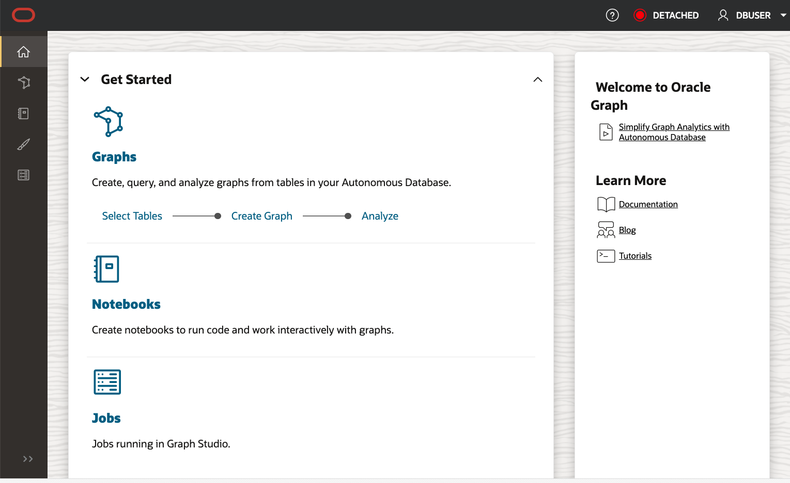
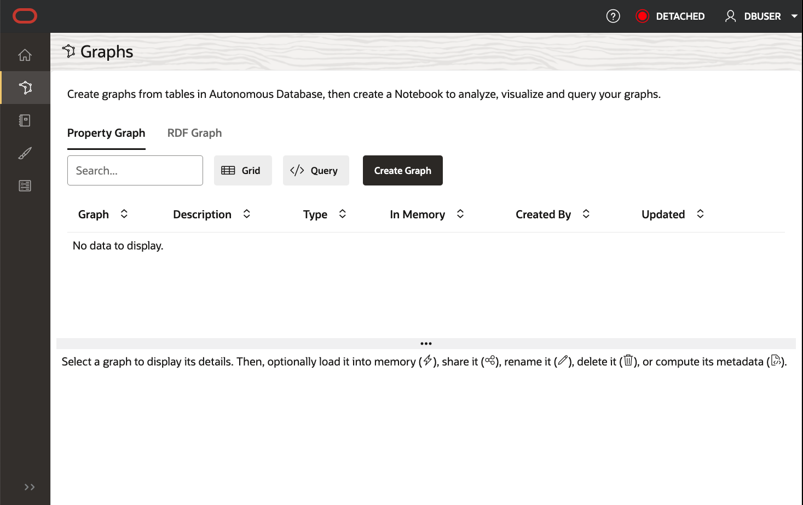
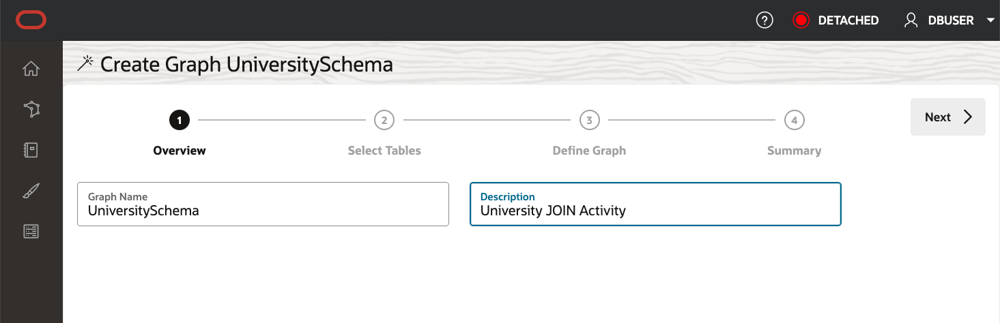
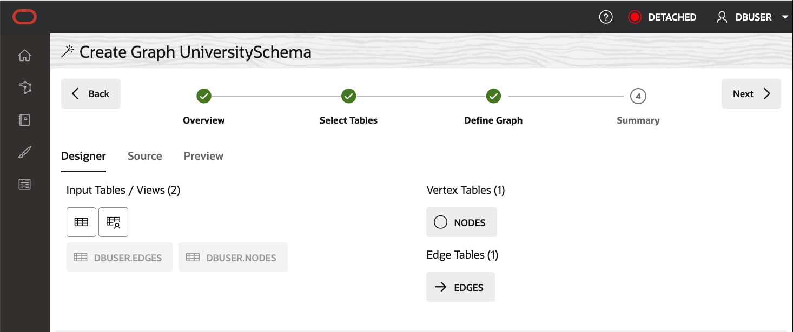
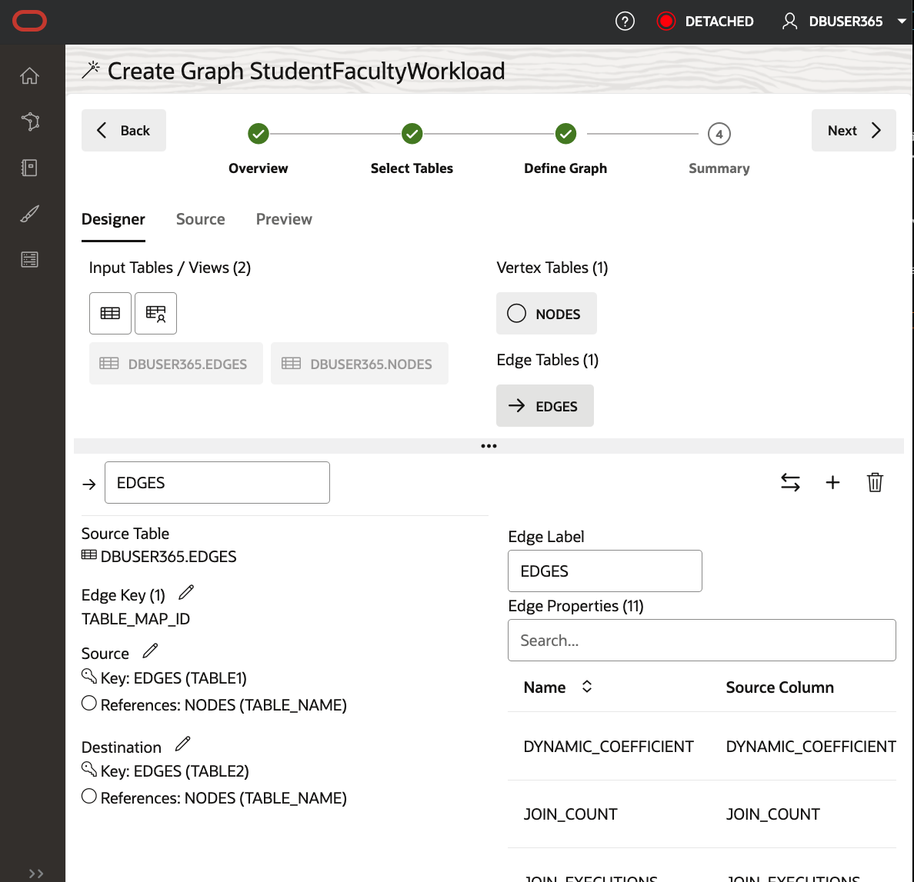
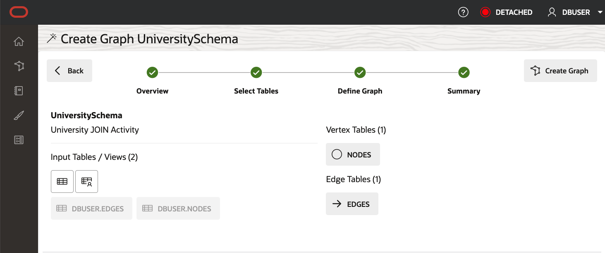
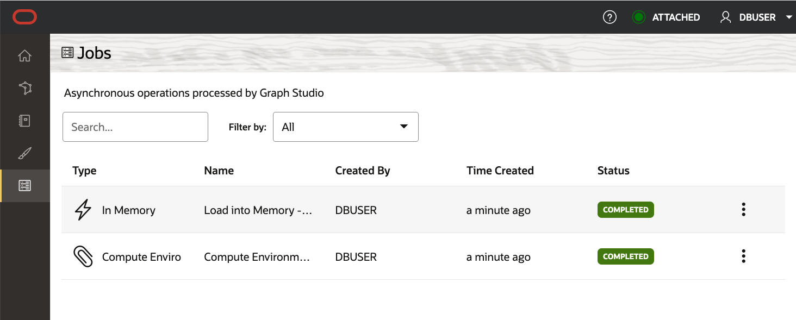
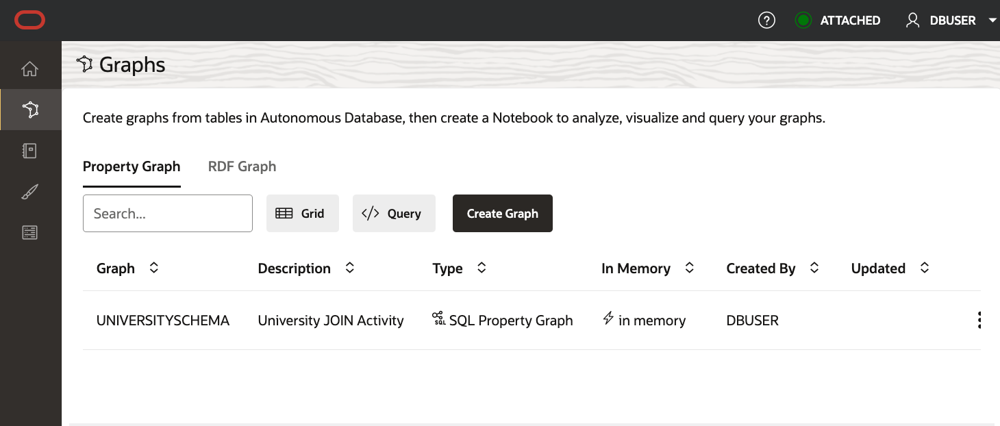

# Create Graph

Login to Graph Studio

And click `Create Graph`

Give a Name and Description

Select Edges and Node Tables for Graph Analysis

Define Graph

We will edit and update this model to add an edge and a vertex label.

The suggested model has the `NODES` as a vertex table since foreign key constraints are specified on `EDGES` that reference it.

And EDGES is a suggested edge table.
Select the EDGES table

Since these are directed edges, a best practice is verifying that the direction is correct.
In this instance, we want to confirm that the direction is from table1 to table2.

Note the Source Vertex and Destination Vertex information on the left.

Notice that the direction is wrong. The Source Key is table2 instead of what we want, which is table1.

Click the swap edge icon on the right to swap the source and destination vertices and reverse the edge direction.

Note that the Source Vertex is now the correct one, i.e., the TABLE1.

Click `Next` and Click `Create Graph`

Graph Studio will now save the metadata and start a job to create the graph.
The Jobs page shows the status of this job. Make sure that the status of all the jobs are Succeeded.

Congratulations, Graph Created 

