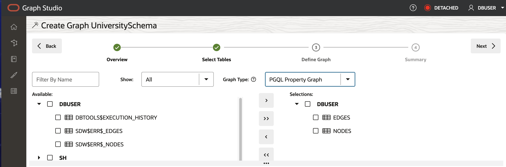

# Create Graph

Welcome to the wonderful world of [Oracle Graph Studio](https://www.oracle.com/database/integrated-graph-database/graph-faq/), where data relationships come to life in vibrant color! If you've ever found yourself tangled in a web of data, trying to make sense of connections and patterns, you're in for a treat. Oracle Graph Studio is here to transform that complexity into clarity, allowing you to create stunning graphs and perform insightful analyses with just a few clicks. 

Imagine being able to visualize your data as a network of nodes and edges, revealing hidden insights and relationships that traditional databases might keep under wraps. Whether you're a developer, analyst, or data scientist, Oracle Graph Studio simplifies the graph creation process, making it accessible to everyone—yes, even those who might not have a PhD in graph theory!

In this example, a graph will be created from the Nodes and Edges tables.

Login to Graph Studio from Database Actions

Graph Studio Landing Page

Go to Graphs And click `Create Graph`

Give a Name and Description

Select Edges and Node Tables for Graph Analysis

Define Graph

We will edit and update this model to add an edge and a vertex label.

The suggested model has the `NODES` as the vertex table since foreign key constraints are specified on `EDGES` that reference it.
And EDGES is a suggested edge table.

Click `Next` and Click `Create Graph`

Load the graph into memory to run algorithms and queries against it

Graph Studio will now save the metadata and start a job to create the graph.
The Jobs page shows the status of this job. Make sure that the status of all the jobs are Succeeded.

Congratulations, Graph Created 

## Run Algorithms and Queries

On the Graph with a [Notebook](../community-detection/README.md)  
