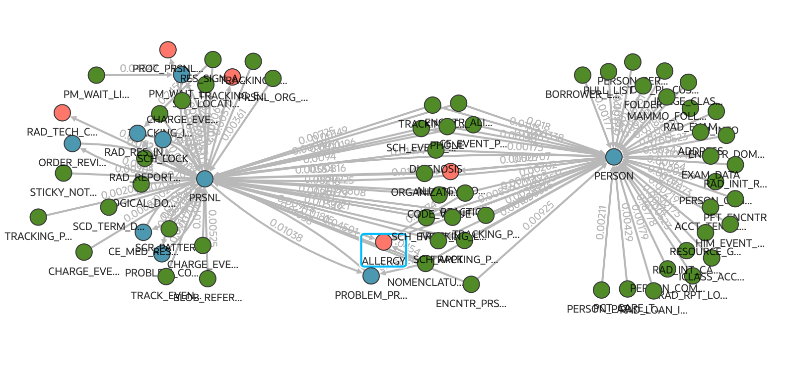
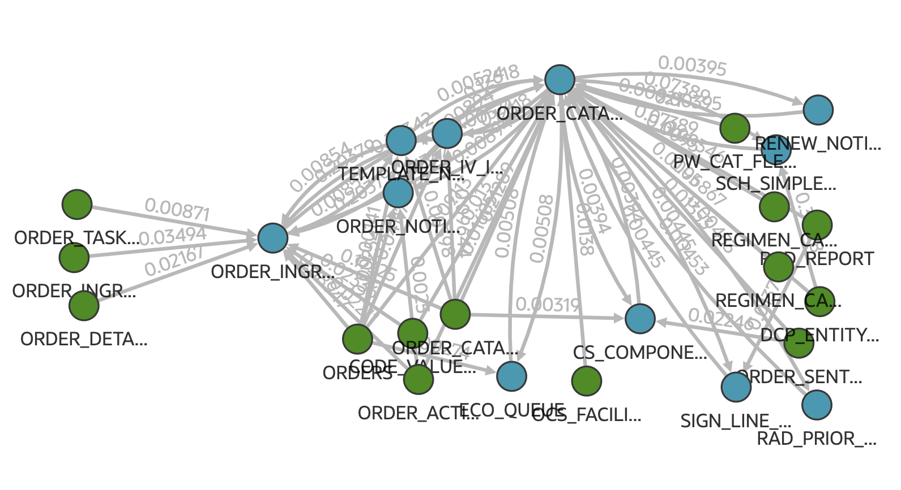
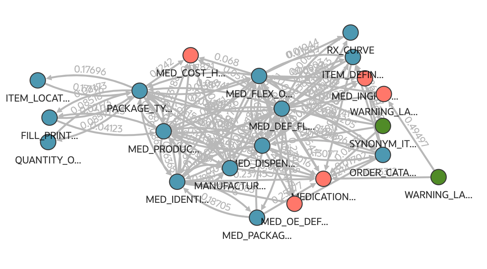

# Community Detection using Medical Records Data

## Load Data into Tables
Use the following medical records csv files to populate the Nodes and Edges tables using the process described in the [QuickStart](../quickstart/)

[Medical Records Nodes](../import-data/MED_RECS_IMPORT_NODES.csv)

[Medical Records Edges](../import-data/MED_RECS_IMPORT_EDGES.csv)

After successfully populating the Nodes and Edges tables, run [Graph Creation](../create-graph/) and [Community Detection](../community-detection/)

## Examine the Communities

Graph CERNER has 211 vertices and 615 edges.

28 communities were identified

|n.COMMUNITY | COMMUNITY_COUNT|
|-------------|-----------------|
|16	|106|
|22	|25|
|7	|23|
|15	|12|
|20	|6|
|25	|3|
|27	|3|
|0	|3|
|8	|2|
|26	|2|
|18	|2|
|17	|2|
|12	|2|
|9	|2|
|5	|2|
|23	|2|
|24	|2|
|1	|1|
|2	|1|
|3	|1|
|4	|1|
|6	|1|
|10	|1|
|11	|1|
|13	|1|
|14	|1|
|19	|1|
|21	|1|
|28	|1|

Lets look at a few starting at the top

### Defined Communities

**Community 16 with 106 nodes**

Looking at this rather large community, there are 2 nodes that stand out, PERSON (Person Data) and PRSNL (Personal Data) and a number of shared nodes.

**Community 22 with 25 nodes**

This appears to be an Order Management community.

1. ORDER_CATALOG: Stores a catalog of standard or frequently used orders that can be selected when creating new orders.
2. ORDER_ACTION: Stores actions or events related to orders, such as creation, modification, or cancellation. 
3. ORDER_NOTIFICATION: Contains information about notifications sent regarding orders, possibly to staff or patients.
4. ORDER_INGREDIENT_DOSE: Holds details about dosages of ingredients in medication orders.
5. ORDERS: The main table for storing all types of medical orders, including medications, tests, and procedures.
6. ORDER_TASK_XREF: A cross-reference table linking orders to specific tasks that need to be performed.
7. ORDER_IV_INFO: Contains specific information related to intravenous (IV) medication orders.
8. ORDER_SENTENCE: Likely stores structured text representations of orders, possibly for display or processing purposes.
9. ORDER_CATALOG_SYNONYM: Holds alternative names or synonyms for items in the order catalog, aiding in search and selection.
10. ORDER_DETAIL: Stores additional details or attributes related to specific orders.
11. ORDER_INGREDIENT: Contains information about individual ingredients used in medication orders.
12. RAD_PRIOR_PREFS: Likely stores preferences or prior information related to radiology orders.
13. RAD_REPORT: Contains radiology reports associated with imaging orders.
14. REGIMEN_CATALOG: Stores predefined treatment regimens, possibly for complex medication orders or chemotherapy protocols.
15. REGIMEN_CAT_SYNONYM: Holds alternative names or synonyms for items in the regimen catalog.
16. CS_COMPONENT: Might store information about components of clinical systems or order sets.
17. SCH_SIMPLE_ASSOC: Likely relates to scheduling associations, possibly linking orders to appointments or time slots.
18. SIGN_LINE_DTA_R: Could store signature line data, possibly for order authentication or approval processes.
19. CODE_VALUE_EVENT_R: Might contain coded values related to order events or statuses.
20. DCP_ENTITY_RELTN: Could store relationships between different entities in the system, possibly including orders.
21. ECO_QUEUE: Might represent a queue for electronic care orders or notifications.
22. OCS_FACILITY_R: Could store relationships between orders and specific facilities or locations.

**Community 7 with 23 nodes**

This looks to be a Pharmacy and Medication Management Community

1. MED_DISPENSE: Stores information about medication dispensing events.
2. MED_PACKAGE_TYPE: Contains details about different types of medication packaging.
3. MANUFACTURER_ITEM: Holds information about items as defined by manufacturers.
4. MED_FLEX_OBJECT_IDX: Likely an index table for flexible medication-related objects.
5. MED_DEF_FLEX: Stores flexible definitions or attributes for medications.
6. ITEM_LOCATION_COST: Contains cost information for items at specific locations.
7. QUANTITY_ON_HAND: Tracks the current inventory levels of items.
8. SYNONYM_ITEM_R: Relates synonyms or alternative names to specific items.
9. ITEM_DEFINITION: Stores basic definitions and attributes of inventory items.
10. RX_CURVE: Likely contains data about medication dosage curves or trends.
11. ORDER_CATALOG_ITEM_R: Relates order catalog entries to specific items.
12. FILL_PRINT_ORD_HX: Stores history of fill and print events for medication orders.
13. WARNING_LABEL_XREF: Cross-references medications with appropriate warning labels.
14. PACKAGE_TYPE: Defines various types of packaging used for items.
15. MED_IDENTIFIER: Contains unique identifiers for medications.
16. MED_PRODUCT: Stores information about specific medication products.
17. FILL_PRINT_HX: Holds historical data about fill and print events.
18. WARNING_LABEL: Contains definitions and text for medication warning labels.
19. MEDICATION_DEFINITION: Stores comprehensive definitions and attributes of medications.
20. MED_COST_HX: Tracks historical cost information for medications.
21. MED_INGRED_SET: Defines sets of ingredients used in medications.
22. MED_OE_DEFAULTS: Stores default values for medication order entry.
23. ROUTE_FORM_R: Relates medication routes to their appropriate forms.

What communities will be defined by your schema join activity?  [Create Nodes and Edges tables for your data.](../collect-database-workload/README.md)