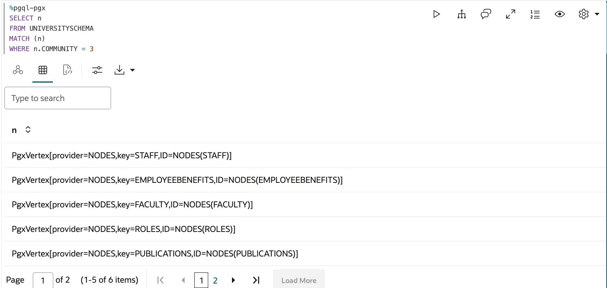
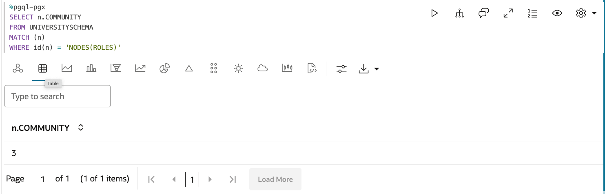
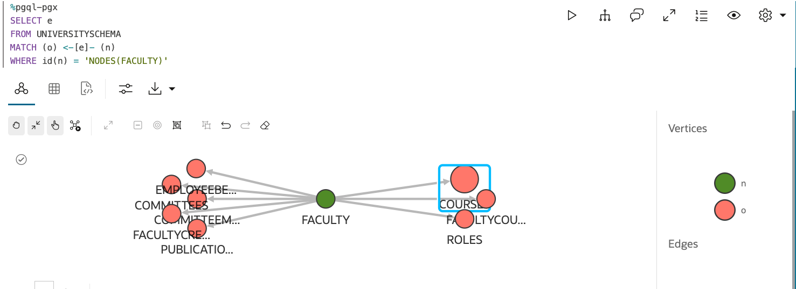
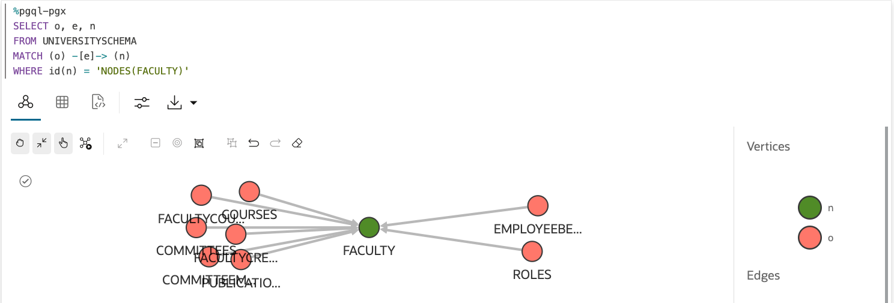

# PGQL Cheat Sheet

PGQL is a graph query language built on top of SQL, bringing graph pattern matching capabilities to existing SQL users as well as to new users who are interested in graph technology but who do not have an SQL background.

The following is a collection of queries used for community detection investigation. Each pgql query is explained.

## The Classic

```
SELECT n,e,m FROM MATCH (n) -[e]-> (m) ON UNIVERSITYSCHEMA
```
**What it does**

This PGQL (Property Graph Query Language) query performs a basic graph traversal on a graph named UNIVERSITYSCHEMA. Here's a breakdown of what it does:

    SELECT n, e, m: This part specifies what to return in the query results.
        n: Represents the source node
        e: Represents the edge
        m: Represents the target node
    FROM MATCH (n) -[e]-> (m): This defines the graph pattern to match.
        (n): Any node in the graph
        -[e]->: An outgoing edge from n to m
        (m): Any node that n connects to via e
    ON UNIVERSITYSCHEMA: This specifies that the query should be executed on the graph named UNIVERSITYSCHEMA.

In essence, this query does the following:

    It starts by considering every node in the UNIVERSITYSCHEMA graph as a potential starting point (n).
    For each of these nodes, it looks for all outgoing edges (e).
    For each outgoing edge, it identifies the node at the other end of that edge (m).
    It returns all such triplets of (source node, edge, target node) that exist in the graph.

This query will return all connections in the UNIVERSITYSCHEMA graph, showing which nodes are connected to which other nodes, and by what edges. It's a way to explore the overall structure of the graph without any specific filtering criteria.Keep in mind that for large graphs, this query could potentially return a very large number of results, as it will match every single connection in the entire graph.


## How Many Communities Detected

```
SELECT COUNT(DISTINCT N.COMMUNITY) AS NUM_COMMUNITIES FROM MATCH (n)  ON UNIVERSITYSCHEMA
```

**What it does**

This PGQL (Property Graph Query Language) query performs a specific operation on the UNIVERSITYSCHEMA graph. Let's break it down:

    SELECT COUNT(DISTINCT N.COMMUNITY) AS NUM_COMMUNITIES:

        This part of the query counts the number of distinct values in the COMMUNITY property of nodes.

        The DISTINCT keyword ensures that each unique COMMUNITY value is counted only once.

        The result is aliased as NUM_COMMUNITIES.

    FROM MATCH (n) ON UNIVERSITYSCHEMA:

        This specifies that we're matching all nodes (n) in the UNIVERSITYSCHEMA graph.

        The (n) pattern matches any node in the graph.

What this query does:

    It considers all nodes in the UNIVERSITYSCHEMA graph.

    For each node, it looks at the COMMUNITY property.

    It counts how many different (distinct) COMMUNITY values exist across all nodes.

    It returns this count as a single number, labeled as NUM_COMMUNITIES.

In essence, this query is answering the question: "How many different communities are there in the UNIVERSITYSCHEMA graph?"
The result will be a single row with a single column (NUM_COMMUNITIES) containing the count of distinct communities in the graph. T
his can be useful for understanding the diversity of communities or groupings within your graph data.


## List all the communities

```
SELECT n.COMMUNITY, COUNT(*) AS COMMUNITY_COUNT
FROM UNIVERSITYSCHEMA
MATCH (n)
WHERE n.COMMUNITY IS NOT NULL
GROUP BY n.COMMUNITY
ORDER BY COMMUNITY_COUNT DESC
```

What it does

This PGQL (Property Graph Query Language) query performs a more detailed analysis of the communities in the UNIVERSITYSCHEMA graph. Let's break it down:

    SELECT n.COMMUNITY, COUNT(*) AS COMMUNITY_COUNT:
        This selects the COMMUNITY property of each node and counts how many nodes are in each community.
        The count is aliased as COMMUNITY_COUNT.
    FROM UNIVERSITYSCHEMA:
        This specifies that we're querying the UNIVERSITYSCHEMA graph.
    MATCH (n):
        This matches all nodes in the graph.
    WHERE n.COMMUNITY IS NOT NULL:
        This filters out any nodes that don't have a COMMUNITY property or where it's set to NULL.
    GROUP BY n.COMMUNITY:
        This groups the results by the COMMUNITY property, so we get a count for each unique community.
    ORDER BY COMMUNITY_COUNT DESC:
        This sorts the results in descending order based on the count, so communities with the most nodes appear first.

What this query does:

    It considers all nodes in the UNIVERSITYSCHEMA graph that have a non-null COMMUNITY property.
    It groups these nodes by their COMMUNITY value.
    For each community, it counts how many nodes belong to that community.
    It then sorts these communities based on their size (number of nodes), from largest to smallest.

The result will be a list of communities and their sizes, ordered from the largest community to the smallest. Each row in the result will have two columns:

    COMMUNITY: The value of the COMMUNITY property
    COMMUNITY_COUNT: The number of nodes in that community

This query is useful for:

    Identifying the most populous communities in your graph.
    Understanding the distribution of nodes across different communities.
    Potentially identifying outliers (very large or very small communities).

It's a great way to get an overview of how nodes are grouped or clustered within your graph structure.


## List the Nodes of a Specific Community

```
SELECT n
FROM UNIVERSITYSCHEMA
MATCH (n)
WHERE n.COMMUNITY = 3
```

**What it does**

This PGQL (Property Graph Query Language) query is performing a specific selection operation on the UNIVERSITYSCHEMA graph. Let's break it down:

    SELECT n:
        This part specifies that we want to return entire node objects.
    FROM UNIVERSITYSCHEMA:
        This indicates that we're querying the graph named UNIVERSITYSCHEMA.
    MATCH (n):
        This matches all nodes in the graph.
    WHERE n.COMMUNITY = 3:
        This is a filter condition that selects only the nodes where the COMMUNITY property is equal to 3.

What this query does:

    It considers all nodes in the UNIVERSITYSCHEMA graph.
    It filters these nodes to include only those where the COMMUNITY property is exactly 3.
    It returns these nodes as the result set.

In essence, this query is answering the question: "Which nodes in the UNIVERSITYSCHEMA graph belong to community 3?"The result will be a set of node objects, each representing a node in the graph that has its COMMUNITY property set to 3. This can be useful for:

    Examining all nodes in a specific community.
    Understanding the composition of a particular community.
    Preparing for further analysis or operations on nodes within this specific community.

Each returned node (n) will include all its properties and can be used for further inspection or processing in your application.Remember that if there are no nodes with COMMUNITY equal to 3, this query will return an empty result set.



## Show the Community Graph

```
SELECT n,e,m FROM MATCH (n) -[e]-> (m) ON UNIVERSITYSCHEMA WHERE n.COMMUNITY = 3 and m.COMMUNITY = 3
```

**What it does**

This PGQL (Property Graph Query Language) query performs a specific operation on the UNIVERSITYSCHEMA graph. Let's break it down:

    SELECT n, e, m:
        This selects the source node (n), the edge (e), and the target node (m) for each match.
    FROM MATCH (n) -[e]-> (m) ON UNIVERSITYSCHEMA:
        This specifies the graph pattern to match in the UNIVERSITYSCHEMA graph.
        It looks for any node (n) connected by an outgoing edge (e) to another node (m).
    WHERE n.COMMUNITY = 3 and m.COMMUNITY = 3:
        This adds a condition to filter the matches.

What this query does:

    It searches the UNIVERSITYSCHEMA graph for pairs of nodes that are directly connected by an edge.
    It only considers nodes where the COMMUNITY property is equal to 3 for both the source node (n) and the target node (m).
    For each matching pair, it returns:
        The source node (n)
        The edge connecting them (e)
        The target node (m)

In essence, this query is answering the question: "What are all the connections between nodes within community 3?"This query is useful for:

    Examining the internal structure of community 3.
    Identifying all relationships between nodes within this specific community.
    Potentially visualizing or analyzing the subgraph formed by nodes in community 3.

The results will show all the internal connections within community 3, allowing you to see how nodes in this community are related to each other. This can be valuable for understanding the cohesion and structure within a specific community in your graph.


## Find the Community ID for a Node

```
SELECT n.COMMUNITY
FROM UNIVERSITYSCHEMA
MATCH (n)
WHERE id(n) = 'NODES(ROLES)'
```

**What it does**

This PGQL (Property Graph Query Language) query is performing a specific lookup operation on the UNIVERSITYSCHEMA graph. Let's break it down:

    SELECT n.COMMUNITY:
        This specifies that we want to return the COMMUNITY property of the matched node.
    FROM UNIVERSITYSCHEMA:
        This indicates that we're querying the graph named UNIVERSITYSCHEMA.
    MATCH (n):
        This matches a node in the graph.
    WHERE id(n) = 'NODES(ROLES)':
        This is a filter condition that selects only the node with the specific ID 'NODES(ROLES)'.

What this query does:

    It looks for a specific node in the UNIVERSITYSCHEMA graph that has the ID 'NODES(ROLES)'.
    Once it finds this node, it retrieves the value of the COMMUNITY property for this node.
    It returns this COMMUNITY value as the result.

In essence, this query is answering the question: "What community does the node with ID 'NODES(ROLES)' belong to in the UNIVERSITYSCHEMA graph?"This query is useful for:

    Quickly determining the community assignment of a specific, known node.
    Potentially as part of a larger operation where you need to know the community of a particular entity (in this case, likely a roles node).

The result will be a single value (assuming the node exists and has a COMMUNITY property):

    If the node exists and has a COMMUNITY property, it will return that value.
    If the node exists but doesn't have a COMMUNITY property, it might return NULL (depending on how your graph database handles missing properties).
    If no node with the ID 'NODES(ROLES)' exists, the query might not return any rows.

This type of query is often used when you have a specific node of interest and you want to quickly retrieve a particular property of that node, in this case, its community assignment.



## Show all Outgoing Edges for a Node

```
SELECT e
FROM UNIVERSITYSCHEMA
MATCH (o) <-[e]- (n)
WHERE id(n) = 'NODES(FACULTY)'
```

**What it does**


This PGQL (Property Graph Query Language) query is performing a specific operation on the UNIVERSITYSCHEMA graph. Let's break it down:

    SELECT e:
        This specifies that we want to return the edge(s) that match our criteria.
    FROM UNIVERSITYSCHEMA:
        This indicates that we're querying the graph named UNIVERSITYSCHEMA.
    MATCH (o) <-[e]- (n):
        This defines the graph pattern we're looking for:
            (n): A source node
            <-[e]-: An incoming edge to o from n
            (o): A target node
    WHERE id(n) = 'NODES(FACULTY)':
        This is a filter condition that selects only the node with the specific ID 'NODES(FACULTY)'.

What this query does:

    It starts by identifying a specific node in the UNIVERSITYSCHEMA graph that has the ID 'NODES(FACULTY)'. This is a node representing a faculty member.
    From this node, it looks for all outgoing edges (which appear as incoming edges to other nodes).
    It returns these edges as the result.

In essence, this query is answering the question: "What are all the relationships (edges) originating from the node representing FACULTY in the UNIVERSITYSCHEMA graph?"This query is useful for:

    Identifying all connections or relationships that a specific FACULTY node has with other nodes in the graph.
    Understanding the role or interactions of this FACULTY within the system represented by the graph.
    Potentially as part of a larger analysis of staff connections or responsibilities.

The result will be a set of edge objects. Each edge object typically includes:

    The type or label of the edge (which often represents the type of relationship)
    Any properties associated with the edge
    Information about the source node (FACULTY in this case) and target node

This type of query is often used when you want to explore all the relationships originating from a specific, known node in your graph. It can provide insights into how this node (representing a person in this case) is connected to other entities in your system.



## Show all Incoming Edges for a Node

```
SELECT o, e, n
FROM UNIVERSITYSCHEMA
MATCH (o) -[e]-> (n)
WHERE id(n) = 'NODES(FACULTY)'
```
This PGQL (Property Graph Query Language) query is performing a specific operation on the UNIVERSITYSCHEMA graph. Let's break it down:

    SELECT e:
        This specifies that we want to return the edge(s) that match our criteria.
    FROM UNIVERSITYSCHEMA:
        This indicates that we're querying the graph named UNIVERSITYSCHEMA.
    MATCH (o) <-[e]- (n):
        This defines the graph pattern we're looking for:
            (n): A source node
            -[e]->: An incoming edge from o to n
            (o): A target node
    WHERE id(n) = 'NODES(FACULTY)':
        This is a filter condition that selects only the node with the specific ID 'NODES(FACULTY)'.

What this query does:

    It starts by identifying a specific node in the UNIVERSITYSCHEMA graph that has the ID 'NODES(FACULTY)'. This is a node representing a FACULTY member.
    From this node, it looks for all incoming edges (which appear as outgoing edges to other nodes).
    It returns these edges as the result.

In essence, this query is answering the question: What nodes are connected to (pointing to) the Faculty node in the UNIVERSITYSCHEMA graph, and what are these connections? This query is useful for:

    Identifying all entities in the graph that have a relationship with a specific faculty.
    Understanding the incoming connections to these two specific nodes.
    Potentially analyzing the context or relationships surrounding faculty entities in the system.

The result will be a set of edge objects. Each edge object typically includes:

    All nodes that have a connection to either the Faculty node
    The nature of these connections (the properties of the edges)
    The specific properties of both the source and target nodes

This type of query is often used when you want to explore the immediate context or "neighborhood" of specific, important nodes in your graph. It can provide insights into how faculty entities are referenced or connected within the broader system represented by the UNIVERSITYSCHEMA graph.


