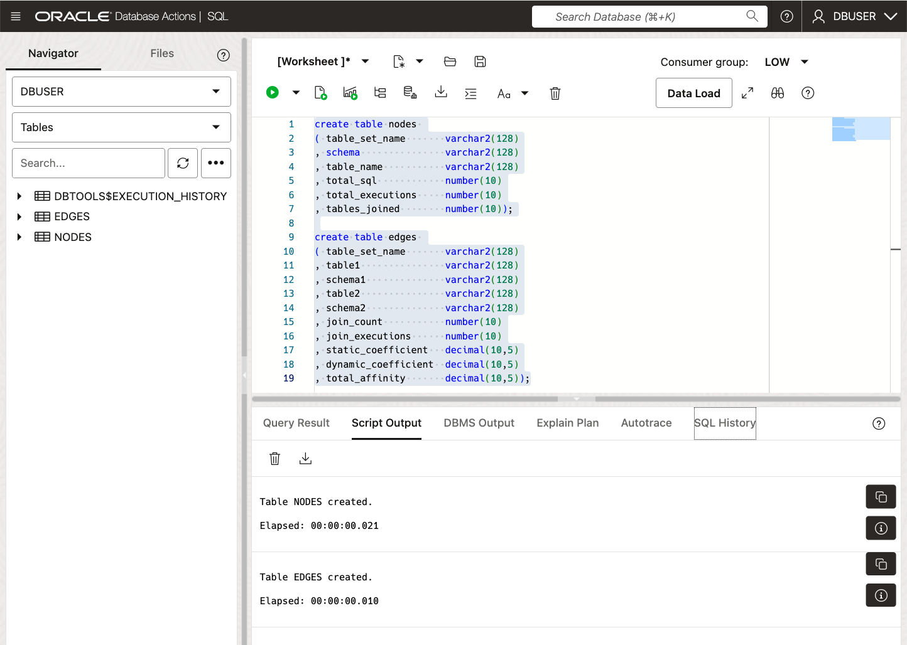
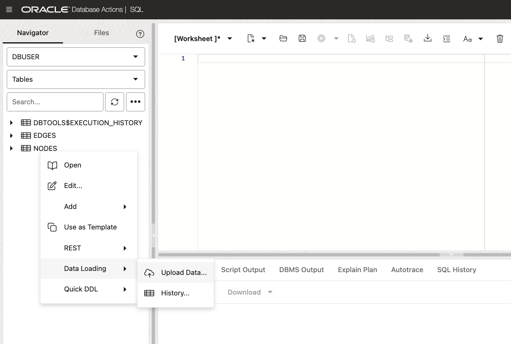
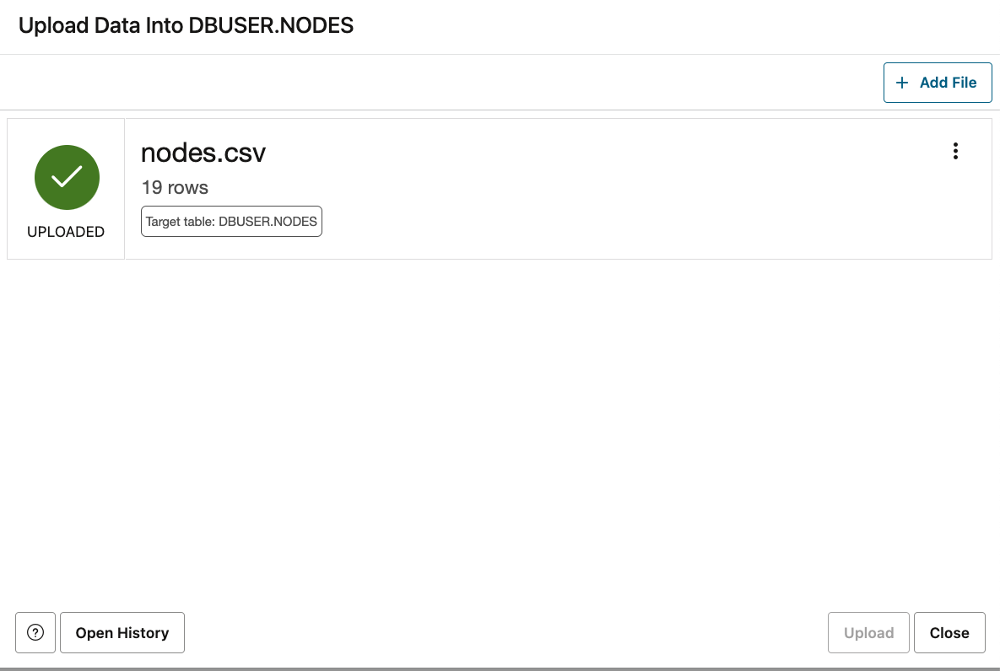

# Quick Start

Create a populate the Nodes and Edges table. 

Later in the lab, the process of creating these tables from actual database workload will be explored, but for now, just import the data.

## Create the Tables

    create table nodes 
    ( table_set_name       varchar2(128)
    , schema               varchar2(128)
    , table_name           varchar2(128)
    , total_sql            number(10)
    , total_executions     number(10)
    , tables_joined        number(10));

    create table edges 
    ( table_set_name       varchar2(128)
    , table1               varchar2(128)
    , schema1              varchar2(128)
    , table2               varchar2(128)
    , schema2              varchar2(128)
    , join_count           number(10)
    , join_executions      number(10)
    , static_coefficient   decimal(10,5)
    , dynamic_coefficient  decimal(10,5)
    , total_affinity       decimal(10,5));

Copy the above into Oracle SQL Database Actions and click `Run Script`

Following is a succinct description of the columns in the NODE table

| Name   | Description |
|--------|-------|
|table_set_name | name of the SQL Tuning Set|
|schema | owner of the tables|
|table_name | name of the table|
|total_sql |  total number of distinct SQL statements|
|total_executions| total number of executions of the SQL statements|
|tables_joined| the number of distinct tables that are joined with the current table|

And the EDGES table

| Name   | Description |
|--------|-------|
|table_set_name | name of the SQL Tuning Set|
|table1 | first edge table |
|schema1 | owner of the first edge table|
|table2 | second edge table |
|schema2 | owner of the second edge table |
|join count |  the number of distinct join SQL statements |
|join_executions| total number of executions where table1 and table 2 are joined |
|static_coefficient| the ratio of join_count to all_sql_statements - join_count |
|dynamic_coefficient| the ratio of join_executions to all_sql_executions - join_executions |
|total_affinity| the average of the static and dynamic coefficients |

## Import the Data

Download the Nodes and Edges data for the University database. It was created from the SQL run against the database

[Nodes.csv](../import-data/nodes.csv)

[Edges.csv](../import-data/edges.csv)

And import

Success

Once Node and Edges tables have been populated successfully, add constraints

## Add Table Constraints

Add the constraints for the newly created tables, where TABLE1 and TABLE2 of EDGES table are foreign keys referencing the TABLE_NAME column of the NODES table.

	ALTER TABLE NODES ADD PRIMARY KEY (TABLE_NAME);

	ALTER TABLE EDGES ADD TABLE_MAP_ID NUMBER;
	UPDATE EDGES SET TABLE_MAP_ID = ROWNUM;
	COMMIT;

	ALTER TABLE EDGES ADD PRIMARY KEY (TABLE_MAP_ID);
	ALTER TABLE EDGES MODIFY TABLE1 REFERENCES NODES (TABLE_NAME);
	ALTER TABLE EDGES MODIFY TABLE2 REFERENCES NODES (TABLE_NAME);
	COMMIT;

Congratulations! You have successfully populated the tables used to create the graph.

 Next Step, [Create a Graph](../create-graph/README.md) 

