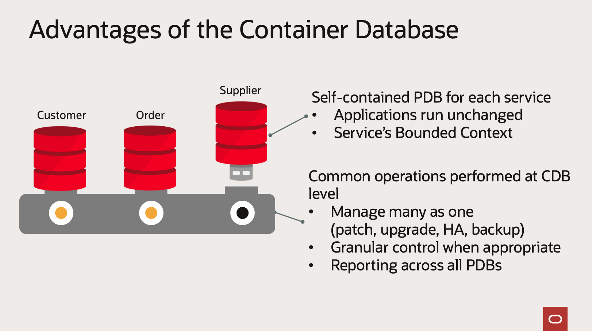

# Refactor Communities

These communities represent join activity based on your workload, your users.  It is a beginning but there are areas for improvement. This is an exercise in defining plausible bounded contexts for microservice development. Before analyzing the communities found for the StudentFaculty Workload, lets briefly touch on what a `Pluggable Database  PDB` is

Oracle Database 23ai is a [Container Database](https://www.oracle.com/database/container-database/) which supports many instances of a [Pluggable Database](https://docs.oracle.com/en-us/iaas/base-database/doc/pluggable-databases.html)

In a microservices architecture, a pluggable database can be scoped to a Services Bounded Context. For example, the Supplier service, Customer Service and Order Service.

Or, in this case, the bounded contexts found through comminity detection. 

## Communities Found

There are 6 unique communities

### Blue Community
- Colleges
- Departments
- Majors
- StudentMajors

### Brown Community   
- Faculty
- FacultyCourses
- Courses
- StudentCourses
- Students

### Pink Community 
- Addresses
- Transcripts
- StudentFinances

### Red Community 
- Staff
- Roles
- Employee Benefits

### Green Community
- Publications
- FacultyCredentials

### Dark Blue Community
- Committees
- CommitteeMembers

## REFACTORING OPTIONS

The Brown community seems broad, 5 tables, two of which are join tables. If I 
- moved Students and StudentCourses to the Pink Community 
- moved Faculty and FacultyCourses to the Red Community
- moved Courses to the Blue Community

Then I would have 5 communities with a bounded contexts suitable for microservice development.

### Blue Community - Course Catalog
- Colleges
- Departments
- Majors
- StudentMajors
- Courses

### Pink Community - Student Info
- Addresses
- Transcripts
- StudentFinances
- Students
- StudentCourses

### Red Community - Faculty and Staff
- Staff
- Roles
- Employee Benefits
- Faculty
- FacultyCourses

### Green Community - Faculty Achievements
- Publications
- FacultyCredentials

### Dark Blue Community - University Committees
- Committees
- CommitteeMembers

These communities are starting to look like a bounded context for a microservices development team, one that would be responsible for all CRUD operations against these explicit table groupings.

And you may say, how can that be done?  I would have to revisit my schema, create and load Pluggabe Databases, make sure these development teams have isolation. That's alot of work

Yes it is, unless you use [JSON Duality Views](https://blogs.oracle.com/database/post/json-relational-duality-app-dev).  You could be doing microservice development against your SQL database same day.