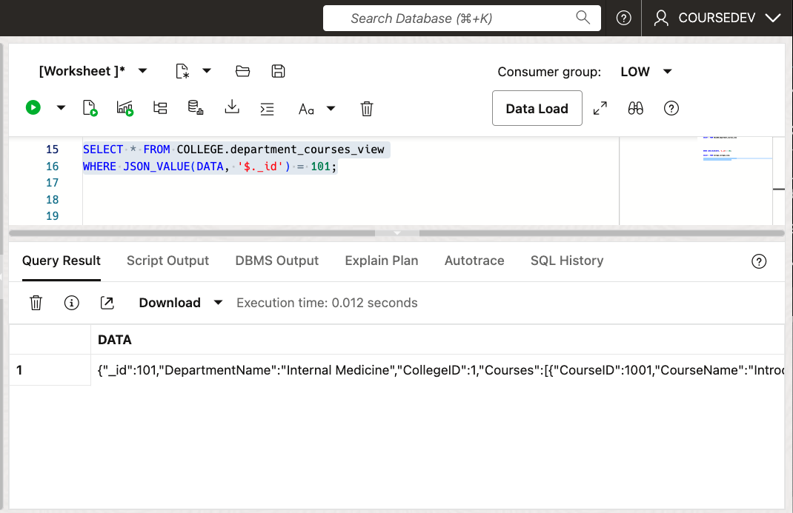

# Create Virtual PDBs using JSON Duality Views

The following proposal uses JSON Duality Views to expose an an existing database as a set of service focused bounded contexts, a Virtual PDB.

But First
## REVISIT THE PROBLEM

We have identified and defined a set of tables that represent a service context.  How does that get surfaced as an API specific to a CourseCatalog Service, Student Service, etc?

Earlier, the course catalog service was defined by the following table community
### Blue Community - Course Catalog
- Colleges
- Departments
- Majors
- Courses

Maybe I could create new PDBs? Migrate that data. Let the service team own the PDB but that takes time. Another downside, all that data needs migrating before being able to test in the new service oriented dev team structure.

What if there was an easier way?  less risk, more reward

## JSON Duality Views and Virtual PDB

[JSON Duality Views](https://blogs.oracle.com/database/post/json-relational-duality-app-dev) are a powerful feature in Oracle databases that allow you to work with relational data as JSON documents. 

Here are some key use cases and benefits of JSON Duality Views:

1. Simplified Application Development: Duality Views allow developers to work with relational data using a document-oriented approach, which can simplify application development, especially for modern applications that prefer working with JSON.

2. Bridging Relational and Document Models: They provide a way to combine the advantages of using JSON documents with the benefits of the relational model, avoiding the limitations of each.

3. Flexible Data Representation: You can represent complex relational data structures as nested JSON documents, which can be more intuitive for certain types of data and queries

These JSON Duality Views can define a new API set (`Virtual PDB`) that can be accessed only by members of the service team.


## Course Catalog Service

Staying with the CourseCatalog Service

Here is an API, a JSON Duality view that gets all courses for a department. 
It is a read only view. It is created by the owner of the `SCHEMA`, most likely the Database Administrator. In this case, the College user.

```
CREATE OR REPLACE JSON RELATIONAL DUALITY VIEW department_courses_view AS
SELECT JSON {
  '_id': d.DepartmentID,
  'DepartmentName': d.DepartmentName,
  'CollegeID': d.CollegeID,
  'Courses': (
    SELECT JSON_ARRAYAGG(
      JSON {
        'CourseID': c.CourseID,
        'CourseName': c.CourseName,
        'CourseDescription': c.CourseDescription,
        'Credits': c.Credits,
        'Room': c.Room,
        'CourseTime': c.CourseTime
      }
    )
    FROM Courses c
    WHERE c.DepartmentID = d.DepartmentID
  )
}
FROM Departments d;
```

A collection of views like these, oriented towards the course catalog tables, would become the API for the  course catalog service team.  

## Enforcing Isolation

View definition would be controlled by Admin therefore having control of the surface area exposed to each service team.

Using Standard Role Based Access Control, the Database Adninistrator would define a service team role and then grant permission to work with JSON Duality Views.  The API surface area would be the set of views exposed by the DBA.

The role `CourseCatalogDeveloper` would be associated with all the developers on the service team thereby enforcing isolation.

```
### As ADMIN
### Create Service Team Role
CREATE ROLE CourseCatalogDeveloper

### Grant the SELECTs to that ROLE
GRANT SELECT ON GRANT SELECT ON College.department_courses_view to CourseCatalogDeveloper

### then grant the role to the user coursedev
GRANT CourseCatalogDeveloper TO coursedev;
```

Now, the coursedev user can attach to the database and run queries on the view

## Running Read Only Queries using the JSON Duality View 

User `COURSEDEV` has Role of `CourseCatalogDeveloper` and can now access the JSON Duality View department_courses_view.

Get all departments with their courses:

Note the schema prefix


Get a specific department by ID:



Find departments by name:


Find courses with more than 3 credits:


## Student Service

Another community defined was StudentInfo comprised of the following tables

- Addresses
- Transcripts
- StudentFinances
- Students
- StudentCourses

This time, create a JSON Duality View that allows insert, update and delete on the Students table

Again, create the view as the owner of the schema `College`

```
CREATE OR REPLACE JSON RELATIONAL DUALITY VIEW students_view AS
  SELECT json {
    '_id'    : s.StudentID,
    'FirstName'    : s.FirstName,
    'LastName'     : s.LastName,
    'DateOfBirth'  : s.DateOfBirth,
    'Gender'       : s.Gender,
    'Email'        : s.Email,
    'PhoneNumber'  : s.PhoneNumber
  }
  FROM Students s WITH INSERT UPDATE DELETE;
```

Appending the view with `WITH INSERT UPDATE DELETE` is what makes this view writable


## Enforcing Isolation

Using Standard Role Based Access Control, the Database Adninistrator would define a service team role and then grant permission to work with JSON Duality Views.  The API surface area would be the set of views exposed by the DBA.

The role `StudentDeveloper` would be associated with all the developers on the service team thereby enforcing isolation.

```
### As ADMIN
### Create Service Team Role
CREATE ROLE StudentDeveloper;

### Grant the SELECTs to that ROLE
GRANT SELECT ON College.students_view to StudentDeveloper

## Grant Writable Perms
GRANT INSERT ON College.students_view to StudentDeveloper
GRANT UPDATE ON College.students_view to StudentDeveloper
GRANT DELETE ON College.students_view to StudentDeveloper

### then grant the role to the user studentdev
GRANT StudentDeveloper TO studentdev;
```
Now, the studentdev user can attach to the database and run CRUD operations on the view

## Running CRUD Queries using the JSON Duality View 

Insert a New Student:


Update a Student:


Delete a Student:


Try to access a Course View:


## Summary

Using Community Detection and Virtual PDBs, development teams can quickly protoype and implement micro service architectures running against their existing database

Here are some advantages
- Quick to prototype
    - Define Communities
    - Define Virtual PDB
    - Test
- Access Control in the purview of DBAs who can define the views and which users can access them
- JSON developers are restricted to using only the views created by the DBA
- Quickly develop Mobile and Web services using SpringBoot, Javascript, ORDS

Using this approach, a development team can quickly prototype and iterate on micro service development. And, it can do this piecemeal, through the [Strangler Pattern](https://medium.com/@josesousa8/the-strangler-pattern-kill-legacy-like-a-boss-db3db41564ed) approach.

Low Risk, High Reward!