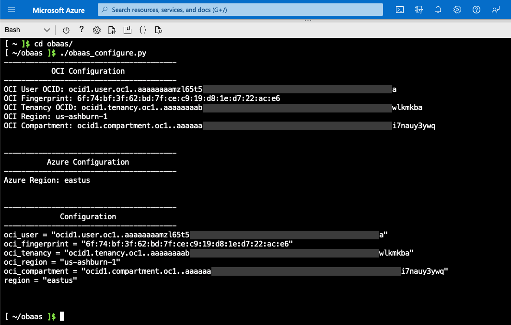

# Microsoft Azure/OCI Multicloud Installation

The Oracle Backend for Parse Platform is available to install in Multicloud (Microsoft Azure and Oracle Cloud Infrastructure (OCI)). This installation
deplpoys the Oracle Backend for Parse Platform in Azure with an Oracle Autonomous Database running in OCI.

## Prerequisites

You must meet the following prerequisites to use the Oracle Backend for Spring Boot Multicloud (Microsoft Azure and OCI). You need:

* An account on Microsoft Azure (Azure)
* An account on OCI

## Download

Download [Oracle Backend for Parse Server](https://github.com/oracle/microservices-datadriven/releases/download/OBAAS-1.0.0/azure-mbaas_latest.zip).

## Setup

A few setup steps are required in both OCI and Azure to deploy the Oracle Backend for Parse Platform application.

### Oracle Cloud Infrastructure (OCI)

The Multicloud installation provisions an Oracle Autonomous Database in OCI using the [OCI Service Operator for Kubernetes (OraOperator)](https://github.com/oracle/oracle-database-operator).  

To allow the OraOperator access to OCI, an [API key](https://docs.oracle.com/en-us/iaas/Content/API/Concepts/apisigningkey.htm) must be generated. Process these steps:

1. Log in to OCI.

2. Open the **Profile** menu  and click **My profile**.

3. In the **Resources** section at the lower left, click **API Keys**.

4. Click **Download Private Key** and save the key as `private_key.pem`. You do not need to download the public key.

5. Click **Add**.

The key is added and the **Configuration File Preview** is displayed. The file snippet includes the required parameters and values that you need. Copy and paste
the configuration file snippet from the text box and save for later steps.

### Microsoft Azure

The Multicloud installation is done using the Azure Cloud Shell.  The following steps are required in Azure to prepare for the installation.

1. Log in to Azure.

2. Open the Azure Cloud Shell. For example:

    
	
3. Upload the [Oracle Backend for Spring Boot and Microservices](https://github.com/oracle/microservices-datadriven/releases/download/OBAAS-1.0.0/azure-mbaas_latest.zip) stack. For example:

    
	
4. Upload the **API Private Key** (`private_key.pem`).

5. Unzip the stack to the following directory:

    `unzip azure-mbaas_latest.zip -d obaas`
	
6. Move the `private_key.pem` file to:

    `mv private_key.pem obaas/`
	
5. Run the configuration helper script, specifying the values from the API key. For example:

    * `cd ~/obaas`
    * `./obaas_configure.py`
	
    

## Install Ansible

Install Ansible to run the Configuration Management Playbook.  The helper scripts create a Python virtual environment and installs Ansible
and any additional modules. For example:

```bash
cd ~/obaas/ansible
./setup_ansible.sh
source ./activate.env
```

## Deploy the Infrastructure

Deploy the infrastructure from the Azure Cloud Shell using these commands:

```bash
cd ~/obaas
terraform init
terraform plan -out=multicloud.plan
terraform apply "multicloud.plan"
```

Next, go to the [On-Premises Installation](../on-premises/) page to learn how to use the newly installed environment.
