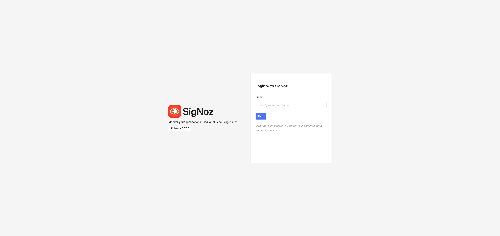

## How to access SigNoz

:::note Namespace Configuration
All `kubectl` commands in this guide use `-n observability` as the default namespace. If SigNoz is installed in a different namespace, replace `observability` with your actual namespace name in all commands.

To find your namespace, run:
```bash
kubectl get pods -A | grep signoz
```
:::

1. Get the _admin_ email and password for SigNoz:

   ```shell
   kubectl -n observability get secret signoz-authn -o jsonpath='{.data.email}' | base64 -d
   kubectl -n observability get secret signoz-authn -o jsonpath='{.data.password}' | base64 -d
   ```

1. Expose the SigNoz user interface (UI) using this command:

   ```shell
   kubectl -n observability port-forward svc/obaas-signoz-frontend 3301:3301
   ```

1. Open [SigNoz Login](http://localhost:3301/login) in a browser and login with the _admin_ email and the _password_ you have retrieved.



## Getting Help

- [#oracle-db-microservices Slack channel](https://oracledevs.slack.com/archives/C06L9CDGR6Z) in the Oracle Developers slack workspace.
- [Open an issue in GitHub](https://github.com/oracle/microservices-datadriven/issues/new).
