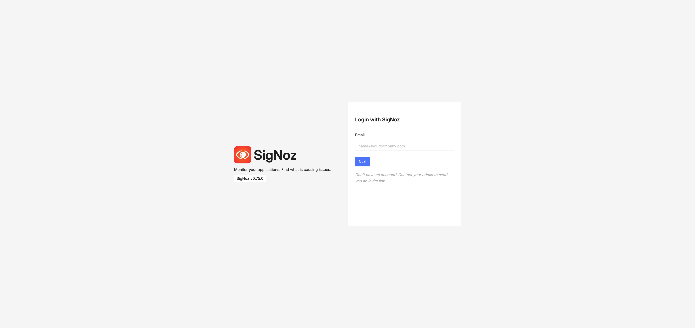

## Accessing SigNoz Observability Platform

SigNoz is the observability platform included with OBaaS that provides metrics, traces, and logs visualization. This guide shows you how to access the SigNoz UI and retrieve your admin credentials.

### Prerequisites

- OBaaS deployed and running
- kubectl configured with access to your cluster
- Your OBaaS namespace name (referred to as `<namespace>` below)

:::tip Finding Your Namespace
If you deployed with Terraform, your namespace is typically your `label_prefix` value.
If you deployed with Helm, it's the namespace you specified during installation (e.g., `obaas-prod`, `tenant1`, etc.).
:::

### Retrieve SigNoz Credentials

SigNoz admin credentials are stored in a Kubernetes secret named `<namespace>-signoz` in your OBaaS namespace.

**Get the admin email/username:**

```bash
kubectl -n <namespace> get secret <namespace>-signoz \
  -o jsonpath='{.data.email}' | base64 -d && echo
```

**Get the admin password:**

```bash
kubectl -n <namespace> get secret <namespace>-signoz \
  -o jsonpath='{.data.password}' | base64 -d && echo
```

### Access the SigNoz UI

Expose the SigNoz UI using kubectl port-forward:

:::note About the Service Name
`obaas` is the default Helm release name used when installing the SigNoz chart. The service name follows the pattern `<release-name>-signoz`. If you used a different release name during installation replace `<release-name>` with your release name:

```bash
kubectl -n <namespace> port-forward svc/<release-name>-signoz 8080
```
:::

**Finding the correct service name:**

If you're unsure of the service name, list all services in your namespace:

```bash
kubectl get svc -n <namespace> | grep signoz
```

Look for a service with a name ending in `-signoz` (e.g., `obaas-signoz`, `tenant1-signoz`).

### Log In to SigNoz

1. Open your browser and navigate to:
   - **Port-forward**: [http://localhost:8080](http://localhost:8080)

2. Enter the credentials you retrieved in Step 1:
   - **Email**: The email from the secret
   - **Password**: The password from the secret

3. Click **Login**

**SigNoz Dashboard:**


