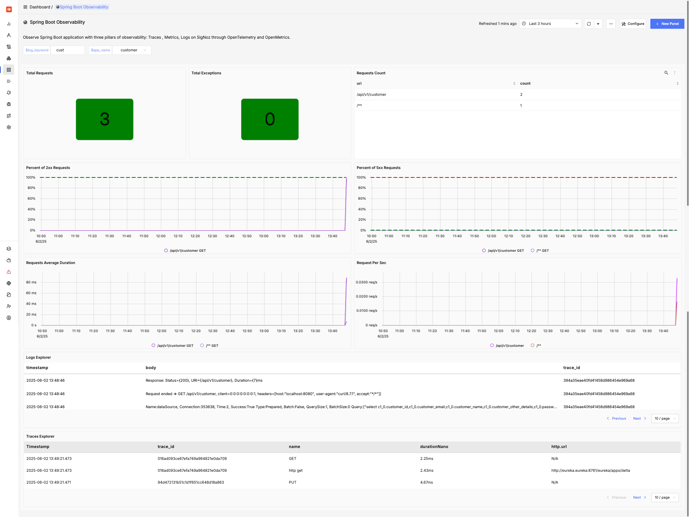
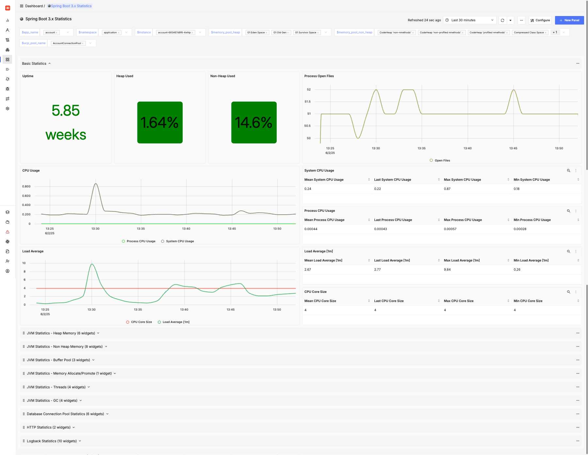
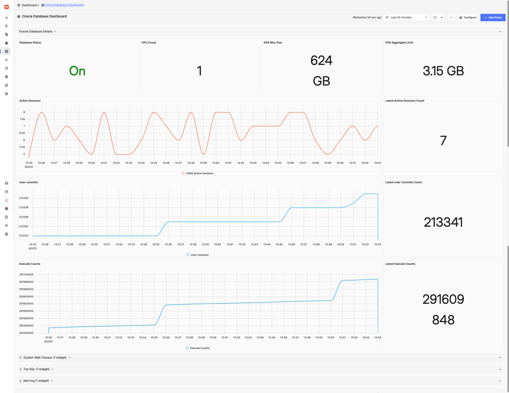
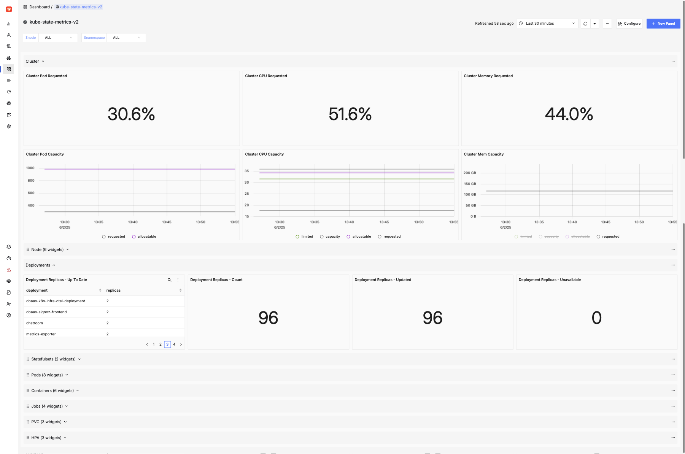
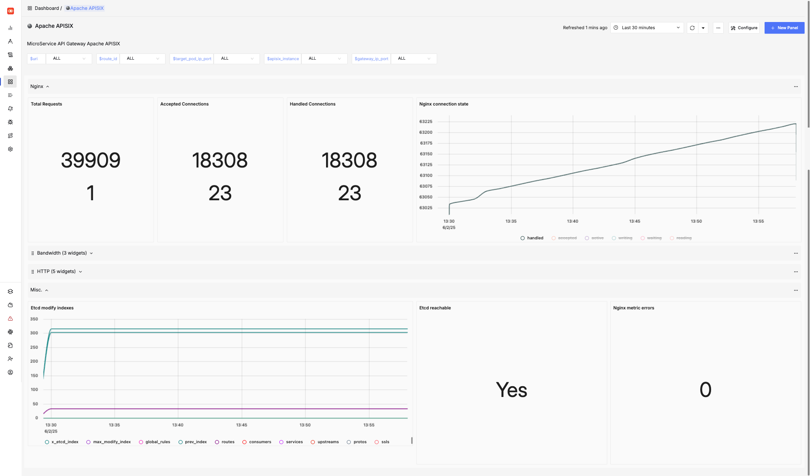

:::note
More details can be found in the [SigNoz Documentation](https://signoz.io/docs/introduction/).
:::

## Pre-installed dashboards

The following dashboards are pre-installed in SigNoz:

- [Spring Boot Observability](#spring-boot-observability)
- [Spring Boot Statistics](#spring-boot-statistics)
- [Oracle Database Dashboard](#oracle-database-dashboard)
- [Kube State Metrics Dashboard](#kube-state-metrics-dashboard)
- [Apache APISIX Dashboard](#apache-apisix-dashboard)

### Spring Boot Observability

This dashboard provides details of one or more Spring Boot applications including the following:

- The number of HTTP requests received by the application
- A breakdown of which URL paths requests were received for
- The average duration of requests by path
- The number of exceptions encountered by the application
- Details of 2xx (that is, successful) and 5xx (that is, exceptions) requests
- The request rate per second over time, by path
- Log messages from the service

You may adjust the time period and to drill down into issues, and search the logs for particular messages. This dashboard is designed for Spring Boot 3.x applications. Some features may work for Spring Boot 2.x applications.

Here is an example of this dashboard displaying data for a simple application:

### Spring Boot Statistics

This dashboard provides more in-depth information about services including the following:

- JVM statistics like heap and non-heap memory usage, and details of garbage collection
- Load average and open files
- Database connection pool statistics (for HikariCP)
- HTTP request statistics
- Logging (logback) statistics

You may adjust the time period and to drill down into issues, and search the logs for particular messages. This dashboard is designed for Spring Boot 3.x applications. Some features may work for Spring Boot 2.x applications.

Here is an example of this dashboard displaying data for a simple application:

### Oracle Database Dashboard

This dashboard provides details about the Oracle Database including:

- SGA and PGA size
- Active sessions
- User commits
- Execute count
- CPU count and platform
- Top SQL
- Wait time statistics by class

Here is an example of this dashboard:

### Kube State Metrics Dashboard

This dashboard provides details of the Kubernetes cluster including:

- Pod capacity and requests for CPU and memory
- Node availability
- Deployment, Stateful Set, Pod, Job and Container statistics
- Details of horizontal pod autoscalers
- Details of persistent volume claims

Here is an example of this dashboard:

### Apache APISIX Dashboard

This dashboard provides details of the APISIX API Gateway including:

- Total Requests
- NGINX Connection State
- Etcd modifications

Here is an example of this dashboard:

