:::note
More details can be found in the [SigNoz Documentation](https://signoz.io/docs/introduction/).
:::

## Pre-installed dashboards

There are several dashboards that are pre-installed in SigNoz, For example:

- [Pre-installed dashboards](#pre-installed-dashboards)
  - [Spring Boot Observability](#spring-boot-observability)
  - [Spring Boot Statistics](#spring-boot-statistics)
  - [Oracle Database Dashboard](#oracle-database-dashboard)
  - [Kube State Metrics Dashboard](#kube-state-metrics-dashboard)
  - [Apache APISIX Dashboard](#apache-apisix-dashboard)
  - [Helidon Main Dashboard](#helidon-main-dashboard)
  - [Helidon MP Details](#helidon-mp-details)
  - [Helidon SE Details](#helidon-se-details)
  - [Helidon JVM Details](#helidon-jvm-details)
  - [APM Metrics](#apm-metrics)
  - [Kafka Server Monitoring Dashboard](#kafka-server-monitoring-dashboard)
  - [Kubernetes Pod Metrics - Overall](#kubernetes-pod-metrics---overall)
  - [Kubernetes Pod Metrics - Detailed](#kubernetes-pod-metrics---detailed)
  - [Kubernetes PVC Metrics](#kubernetes-pvc-metrics)
  - [Kubernetes Node Metrics - Overall](#kubernetes-node-metrics---overall)
  - [Kubernetes Node Metrics - Detailed](#kubernetes-node-metrics---detailed)
  - [DB Calls Monitoring](#db-calls-monitoring)
  - [Host Metrics (k8s)](#host-metrics-k8s)
  - [HTTP API Monitoring](#http-api-monitoring)
  - [JVM Metrics](#jvm-metrics)
  - [NGINX (OTEL)](#nginx-otel)
  - [MicroTx](#microtx)

### Spring Boot Observability

This dashboard provides details of one or more Spring Boot applications including the following:

- The number of HTTP requests received by the application
- A breakdown of which URL paths requests were received for
- The average duration of requests by path
- The number of exceptions encountered by the application
- Details of 2xx (that is, successful) and 5xx (that is, exceptions) requests
- The request rate per second over time, by path
- Log messages from the service

You may adjust the time period and to drill down into issues, and search the logs for particular messages. This dashboard is designed for Spring Boot 3.x applications. Some features may work for Spring Boot 2.x applications.

Here is an example of this dashboard displaying data for a simple application:

### Spring Boot Statistics

This dashboard provides more in-depth information about services including the following:

- JVM statistics like heap and non-heap memory usage, and details of garbage collection
- Load average and open files
- Database connection pool statistics (for HikariCP)
- HTTP request statistics
- Logging (logback) statistics

You may adjust the time period and to drill down into issues, and search the logs for particular messages. This dashboard is designed for Spring Boot 3.x applications. Some features may work for Spring Boot 2.x applications.

Here is an example of this dashboard displaying data for a simple application:

### Oracle Database Dashboard

This dashboard provides details about the Oracle Database including:

- SGA and PGA size
- Active sessions
- User commits
- Execute count
- CPU count and platform
- Top SQL
- Wait time statistics by class

Here is an example of this dashboard:

### Kube State Metrics Dashboard

This dashboard provides details of the Kubernetes cluster including:

- Pod capacity and requests for CPU and memory
- Node availability
- Deployment, Stateful Set, Pod, Job and Container statistics
- Details of horizontal pod autoscalers
- Details of persistent volume claims

Here is an example of this dashboard:

### Apache APISIX Dashboard

This dashboard provides details of the APISIX API Gateway including:

- Total Requests
- NGINX Connection State
- Etcd modifications

Here is an example of this dashboard:

In addition, following dashboards are also pre-installed:

 ### Helidon Main Dashboard
Combined dashboard for Heap memory usage statistics about all [Helidon SE](https://helidon.io/docs/v3/about/introduction) and [Helidon MP](https://helidon.io/docs/v4/mp/introduction) applications deployed in cluster.

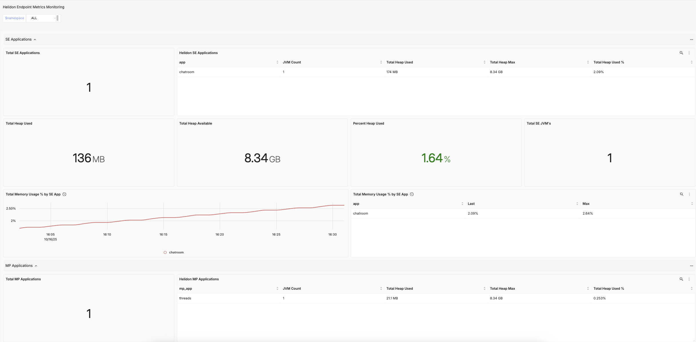

 ### Helidon MP Details
Details about CPU and Memory usage of [Helidon MP](https://helidon.io/docs/v4/mp/introduction) applications along with statistics about HTTP/REST requests per JVM.

 ### Helidon SE Details
Details about Memory usage of [Helidon SE](https://helidon.io/docs/v3/about/introduction) applications along with statistics about HTTP/REST requests per JVM.

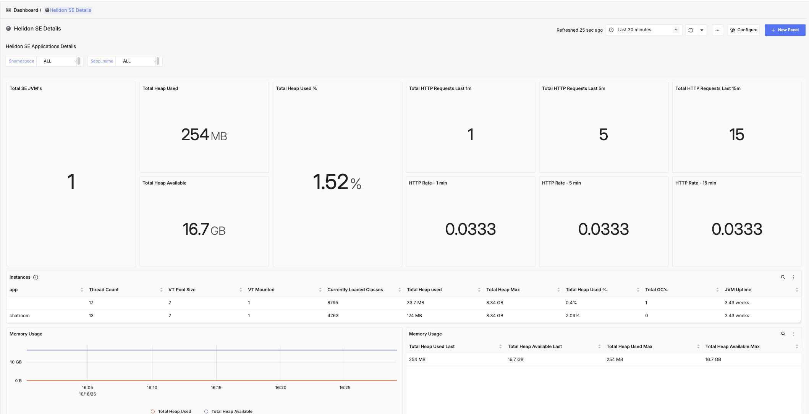

 ### Helidon JVM Details
JVM level details about Helidon applications, including statistics about [Virtual Threads](https://docs.oracle.com/en/java/javase/24/core/virtual-threads.html), CPU and Memory usage and HTTP requests

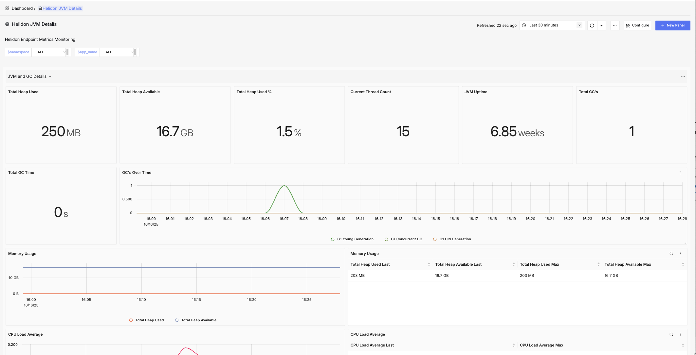

 ### APM Metrics
Application Performance overview for all deployed services in terms of request execution times and consistency.

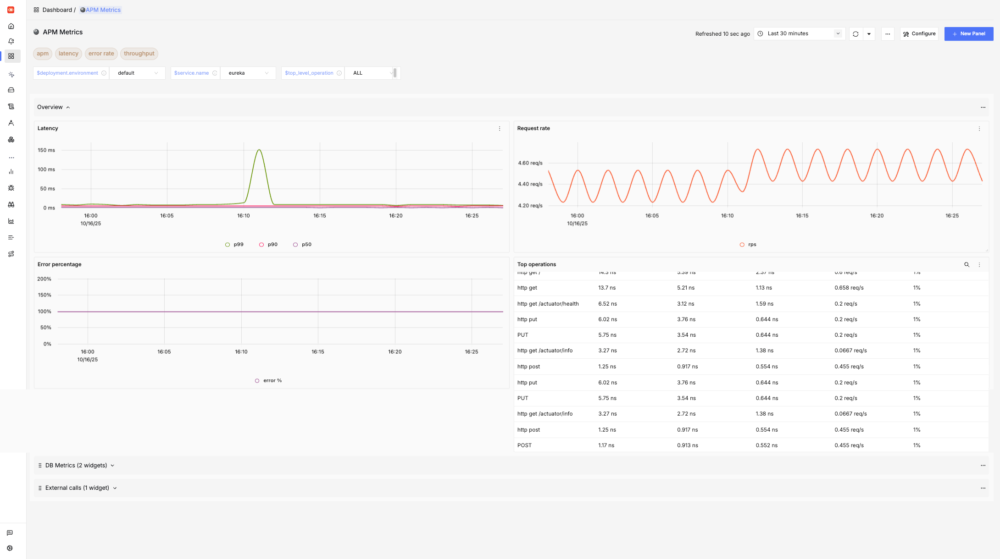

 ### Kafka Server Monitoring Dashboard
Details about Kafka brokers, partitions, consumers, topics and partitions etc.

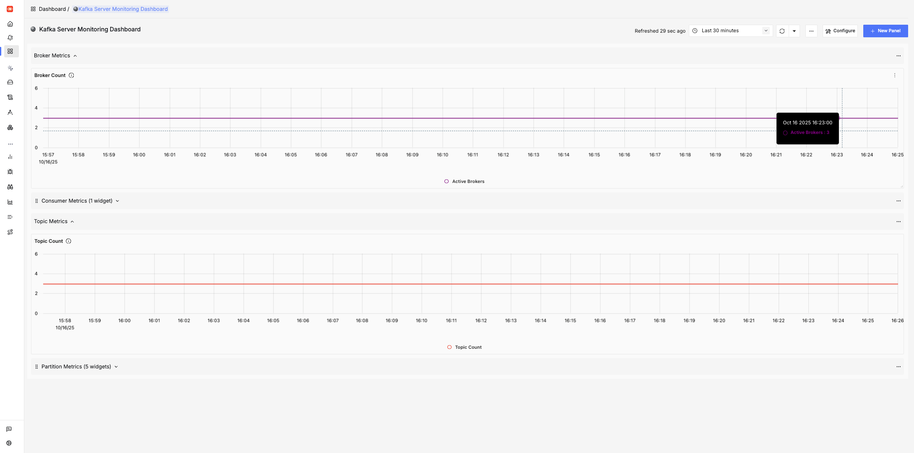

 ### Kubernetes Pod Metrics - Overall
Aggregated view of CPU, Memory, FileSystem, and Network usage by pods.

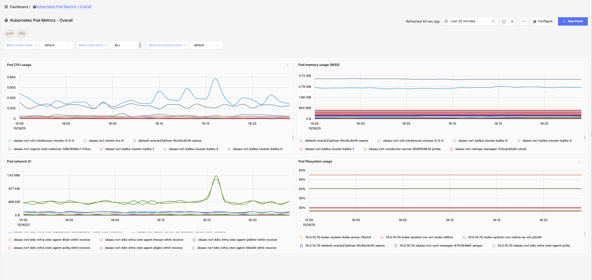

 ### Kubernetes Pod Metrics - Detailed
Detailed view of CPU, Memory, FileSystem, and Network usage by pods.

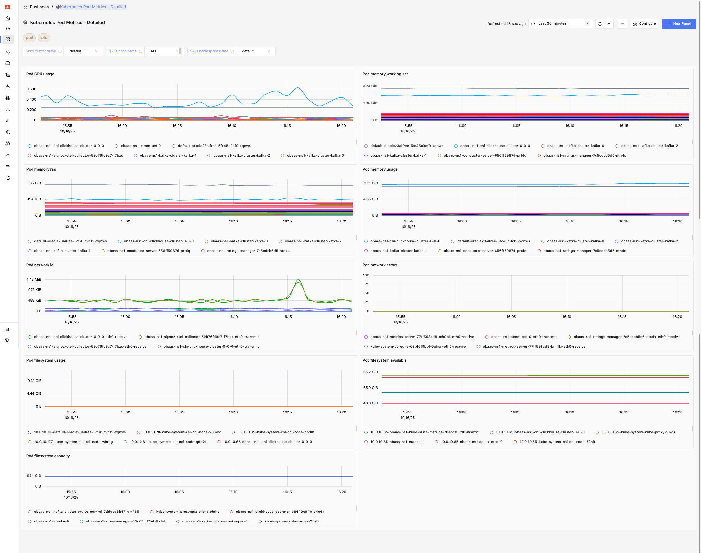

 ### Kubernetes PVC Metrics
Capacity and Usage statistics about Persistent Volume Claims in the cluster.

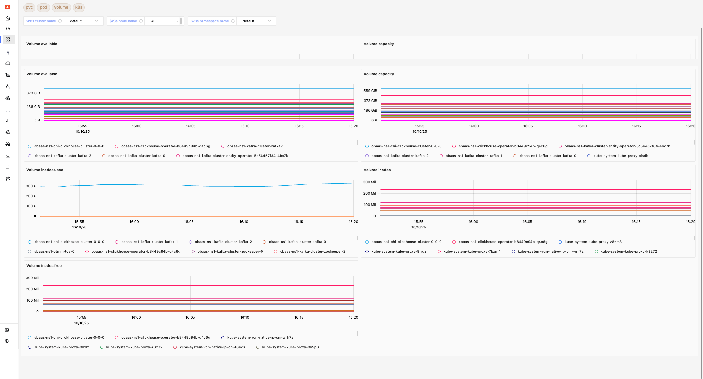

 ### Kubernetes Node Metrics - Overall
Aggregated view of CPU, Memory, FileSystem, and Network usage by Nodes in the cluster.

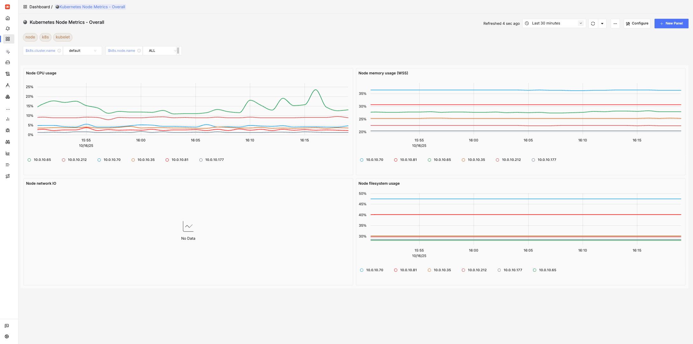

 ### Kubernetes Node Metrics - Detailed
Detailed view of CPU, Memory, FileSystem, and Network usage by Nodes in the cluster.

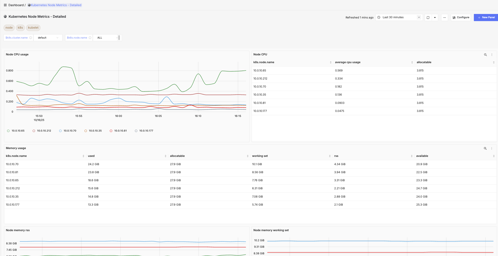

 ### DB Calls Monitoring
Details about [DB attributes from opentelemetry](https://opentelemetry.io/docs/specs/semconv/attributes-registry/db/).

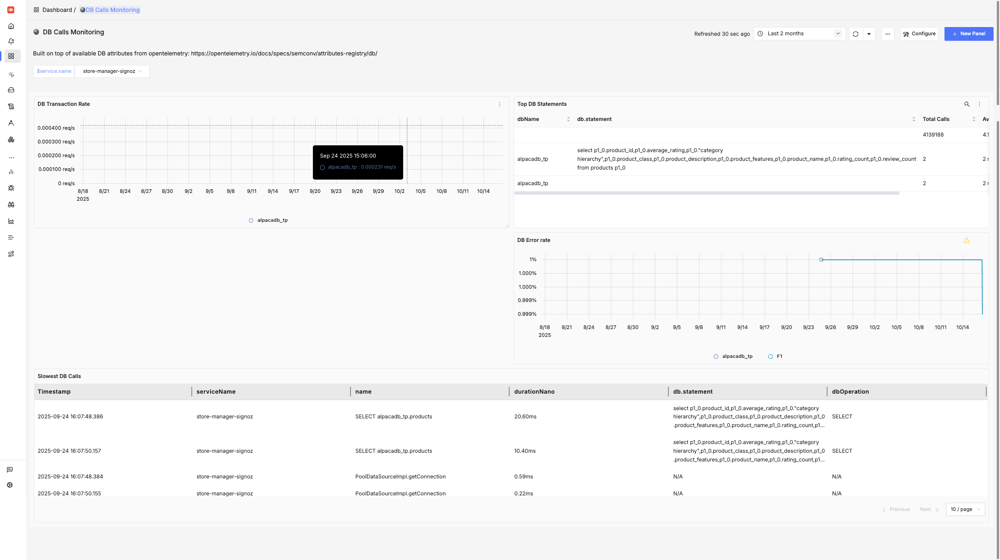

 ### Host Metrics (k8s)
This dashboard uses the system metrics collected from the [hostmetrics receiver](https://uptrace.dev/opentelemetry/collector/host-metrics) to show CPU, Memory, Disk, Network and Filesystem usage

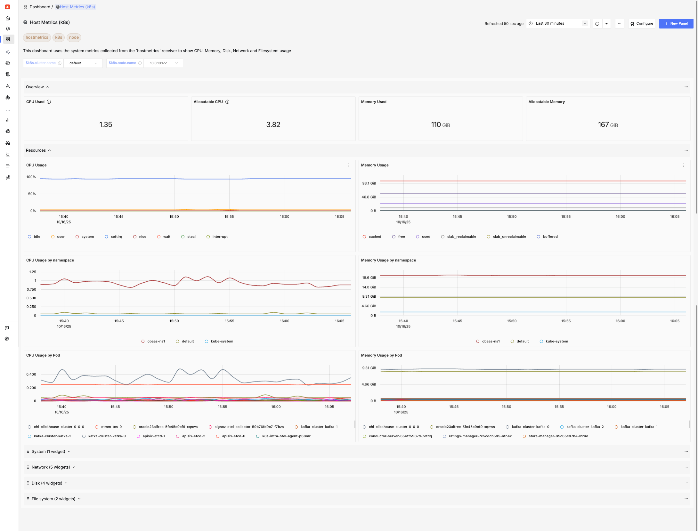

 ### HTTP API Monitoring
This dashboard is built on top of available [HTTP attributes from opentelemetry](https://opentelemetry.io/docs/specs/semconv/attributes-registry/http/) and provides insights about endpoint level performance indicators for HTTP calls.

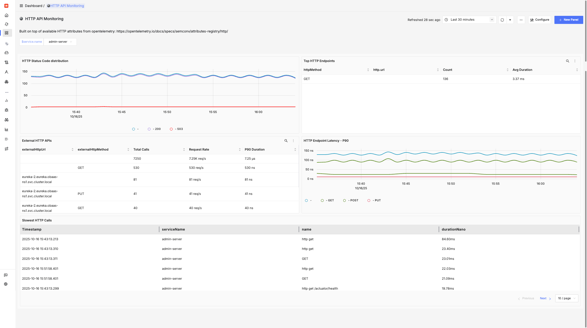

 ### JVM Metrics
JVM Runtime metrics for all services deployed in cluster in terms of CPU/Memory usage, Garbage collection events, threads and class loading/unloading.

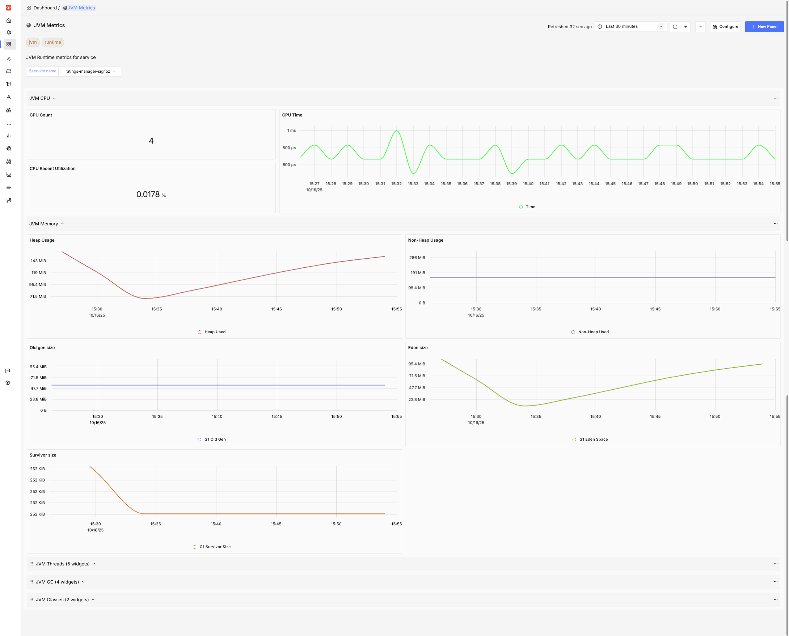

 ### NGINX (OTEL)
Details about connections/requests being handled by the the [NGINX Ingress controller](https://github.com/kubernetes/ingress-nginx).

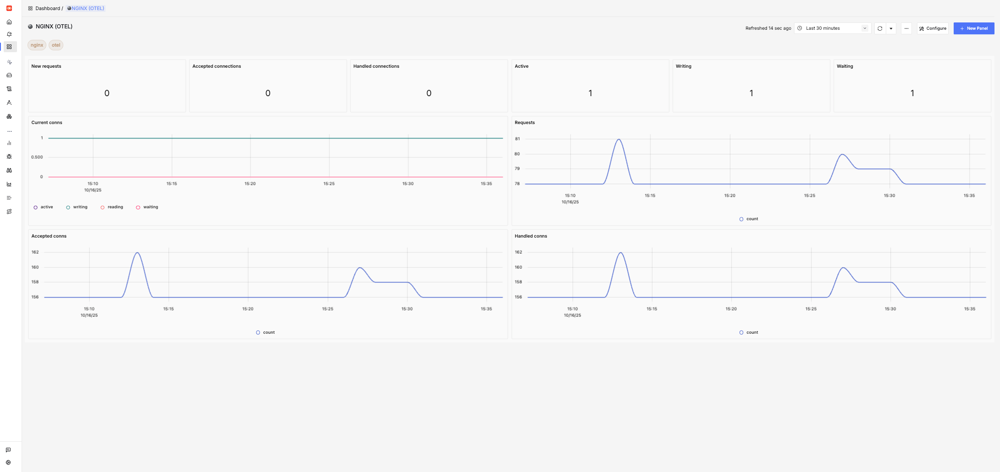

 ### MicroTx
Details about Transaction Manager for Microservices(https://docs.oracle.com/en/database/oracle/transaction-manager-for-microservices/24.2/tmmdg/oracle-transaction-manager-microservices.html) component and statistics about participating transactions.

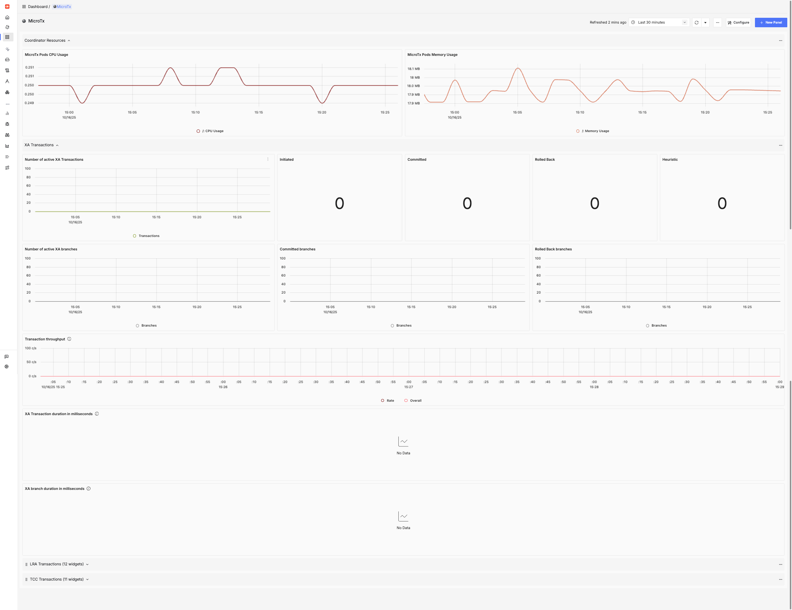

## Getting Help

- [#oracle-db-microservices Slack channel](https://oracledevs.slack.com/archives/C06L9CDGR6Z) in the Oracle Developers slack workspace.
- [Open an issue in GitHub](https://github.com/oracle/microservices-datadriven/issues/new).

