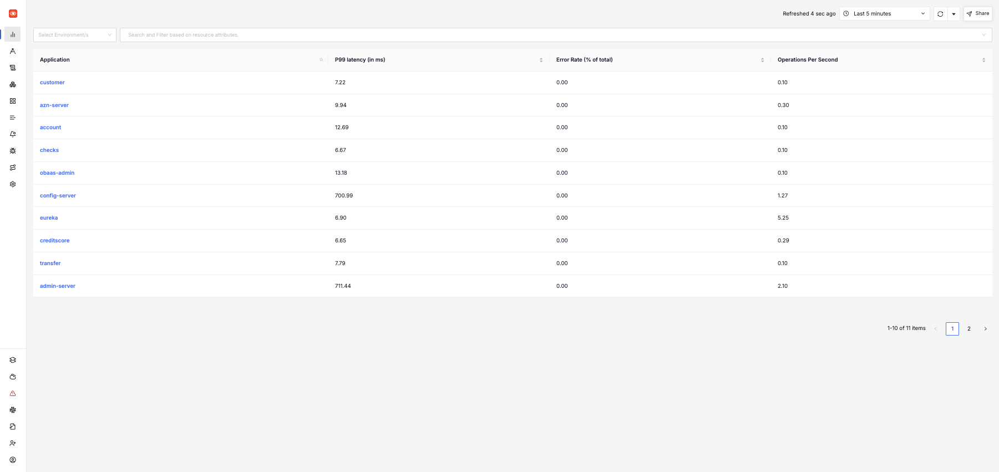
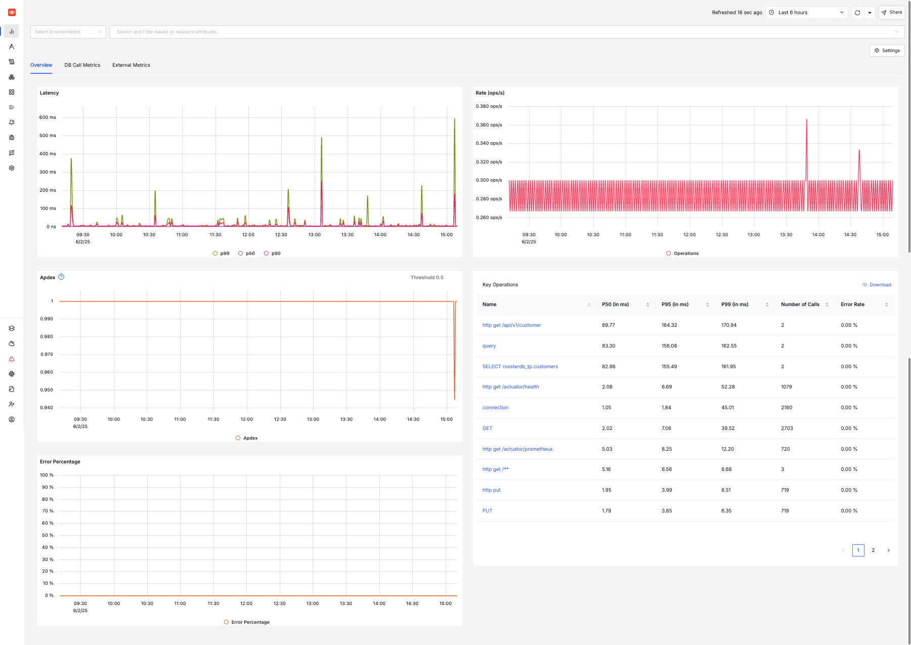
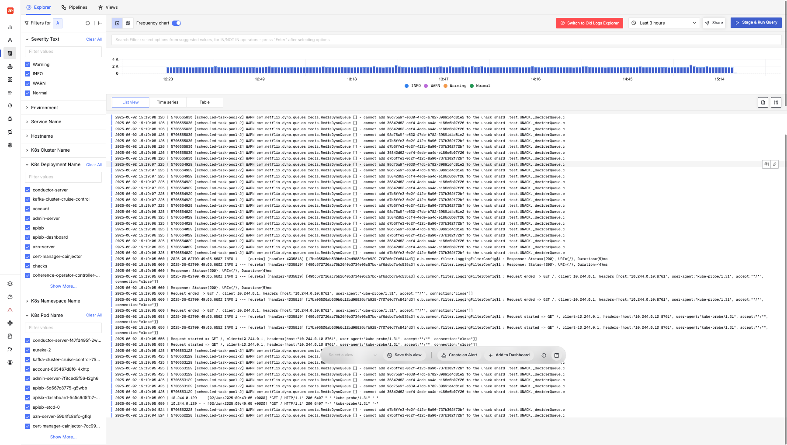
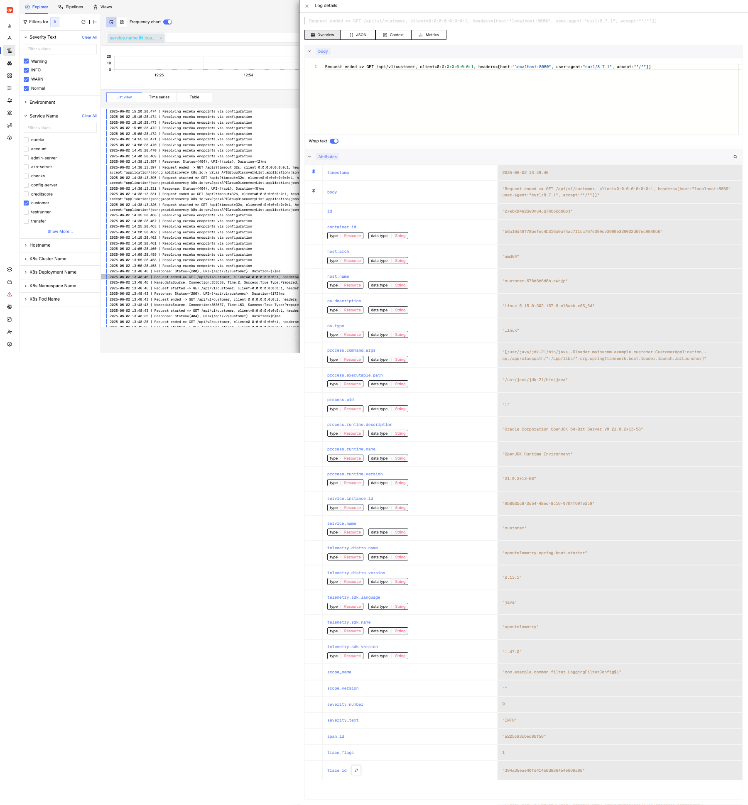
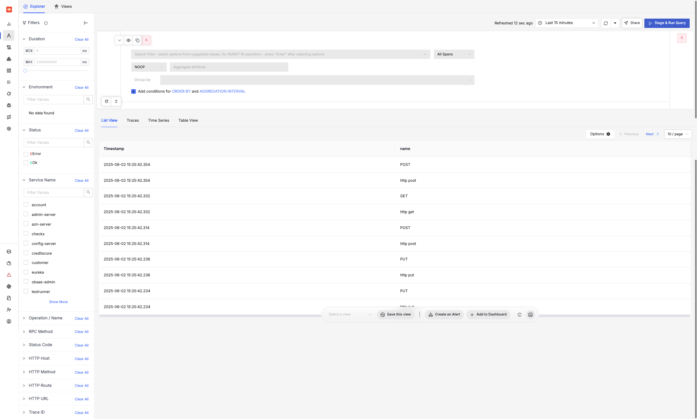
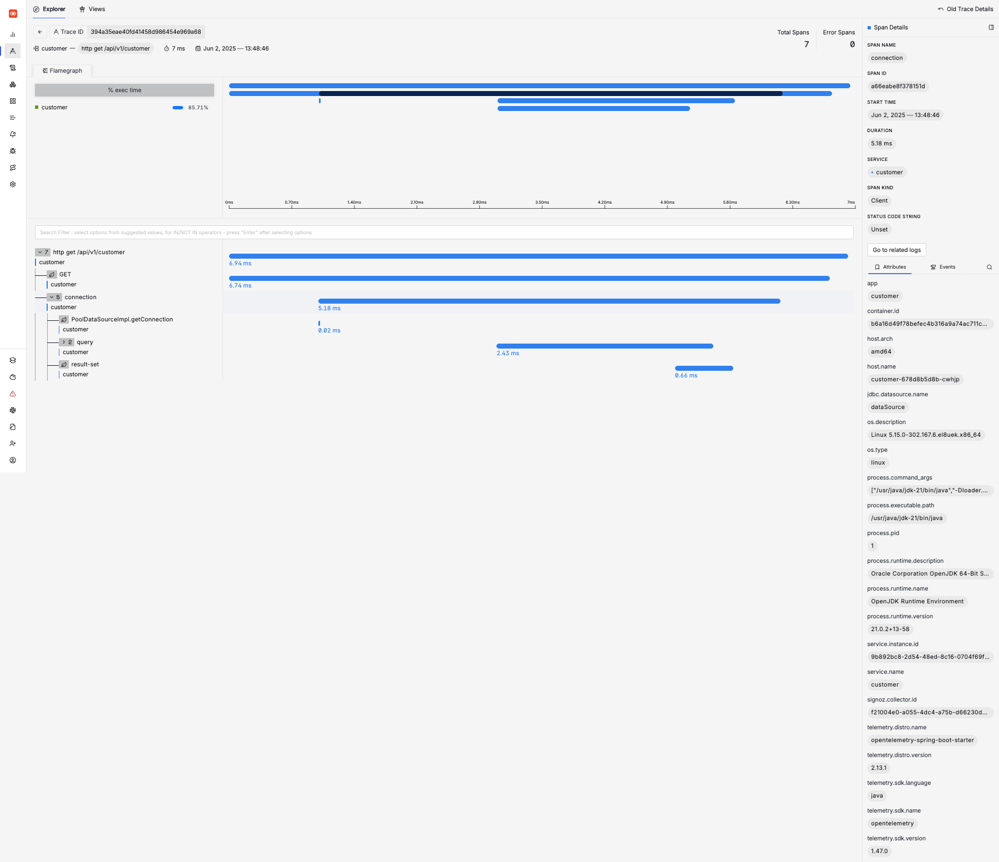

:::note
More details can be found in the [SigNoz Documentation](https://signoz.io/docs/introduction/).
:::

## Metrics

To access metrics in SigNoz, click on _Services_ in the menu to see the list of applications.

Click on any of the services, to see its metrics in a dashboard.

## Logs

To access logs in SigNoz, click on _Logs_ in the menu to access the Log Explorer where logs for all the applications and platform services can be accessed.

Logs can be filtered based on Namespaces, Deployments, Pods etc. Clicking on any log line will show more details regarding a log event.

## Traces

To access Traces in SigNoz, click on _Traces_ in the menu to access the Traces view where all trace events can be accessed.

Traces can be filtered based on Service, HTTP Routes etc. Click on a trace to see its details.

Logs for a trace event can directly be accessed using the _Go to related logs_ link.
