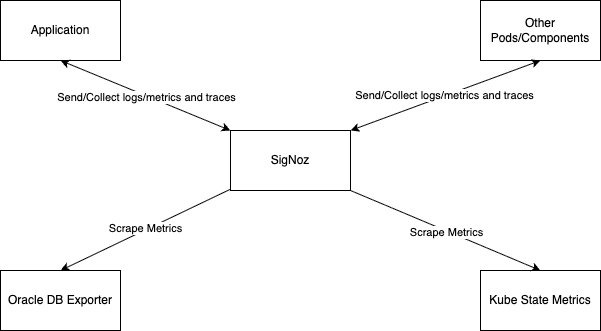

## Overview

Oracle Backend for Microservices and AI includes SigNoz, which is an observability platform to collect and provide access to logs, metrics, and traces for the platform itself and for your applications.

The diagram below provides an overview of SigNoz:

In the diagram above:

- You may deploy applications into the platform and can either send the metrics, logs, and traces to the SigNoz OpenTelemetry collector or configure annotations on the application pod for SigNoz to scrape metrics endpoints from the application pod directly. Similarly, traces can be generated and sent to the SigNoz OpenTelemetry collector using the OpenTelemetry SDK. Please refer to the [OpenTelemetry Collector - architecture and configuration guide](https://signoz.io/blog/opentelemetry-collector-complete-guide/) for details.
- The [Oracle Database Exporter](./dbexporter.md) and Kube State Metrics are pre-installed and SigNoz is configured to collect metrics from them.
- SigNoz is populated with a set of [pre-installed dashboards](./dashboards.md).

:::note
More details can be found in the [SigNoz Documentation](https://signoz.io/docs/introduction/).
:::

### Oracle Database Monitoring Explorer

With Oracle Backend for Microservices and AI, you can choose to install [Oracle Database Monitoring Explorer](https://oracle.github.io/oracle-db-appdev-monitoring/). The tool provides observability for Oracle Database so that users can understand performance and diagnose issues easily across applications and the database. The project also provides dashboards for SigNoz.

### Next Steps

- [Access SigNoz](./access.md) — Retrieve credentials and connect to the SigNoz UI
- [Configure your applications](./configure.md) — Add OpenTelemetry and Micrometer to your services
- [Explore dashboards](./dashboards.md) — Browse the 20+ pre-installed dashboards
