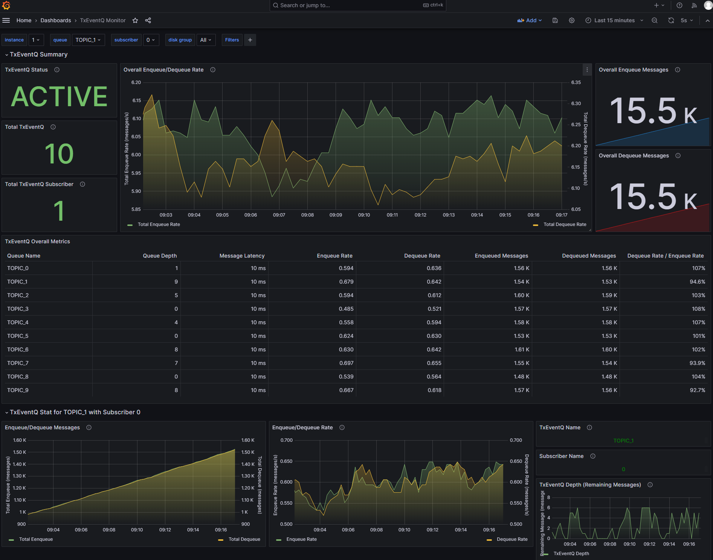

## Oracle Database Metrics Exporter

This project provides observability for Oracle Database, helping users understand performance and diagnose issues across applications and the database. Over time, it will expand beyond metrics to include logging, tracing, and integrations with popular frameworks such as Spring Boot. It targets both cloud and on-premises deployments, including databases running in Kubernetes and containers.

[Full documentation](https://github.com/oracle/oracle-db-appdev-monitoring).

### Installing Oracle Database Metrics Exporter

Oracle Database Metrics Exporter will be installed if the `oracle-database-exporter.enabled` is set to `true` in the `values.yaml` file. The default namespace for Oracle Database Metrics Exporter is `oracle-database-exporter`.

### Oracle Database Grafana Dashboard

### Transactional Event Queue Grafana Dashboard

