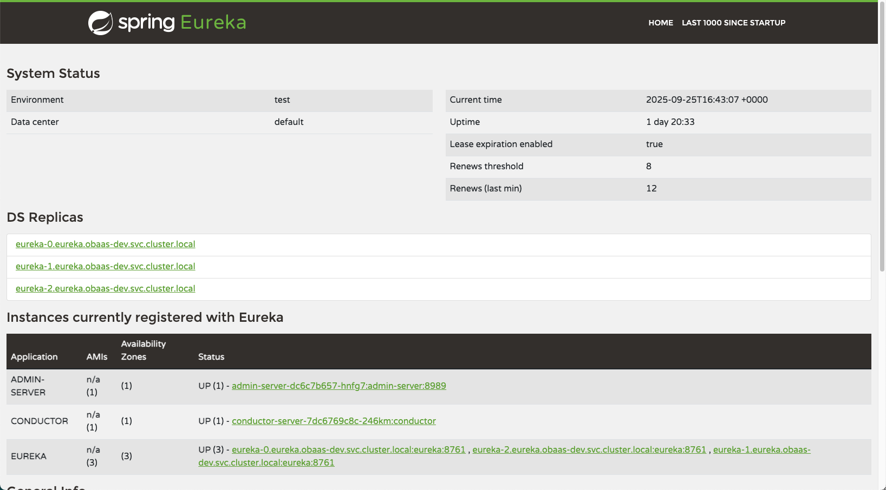

## Spring Boot Eureka Server

Oracle Backend for Microservices and AI includes the Spring Boot Eureka service registry, which stores information about client services. Typically, each microservice registers with Eureka at startup. Eureka maintains a list of all active service instances, including their IP addresses and ports. Other services can look up this information using a well-known key, enabling service-to-service communication without hardcoding addresses at development or deployment time.

### Installing Spring Boot Eureka Server

Spring Boot Eureka Server will be installed if the `eureka.enabled` is set to `true` in the `values.yaml` file. The default namespace for Spring Boot Eureka Server is `eureka`.

### Access Eureka Web User Interface

To access the Eureka Web User Interface, use kubectl port-forward to create a secure channel to `service/eureka`. Run the following command to establish the secure tunnel (replace the example namespace `obaas-dev` with the namespace where the Spring Boot Eureka Server is deployed):

```shell
kubectl port-forward -n obaas-dev svc/eureka 8761
```

Open the [Eureka web user interface](http://localhost:8761)



### Enable a Spring boot application for Eureka

To Spring boot application you need to add the following dependency

```xml
<dependency>
    <groupId>org.springframework.cloud</groupId>
    <artifactId>spring-cloud-starter-netflix-eureka-client</artifactId>
</dependency>
```

And to configure the application to register with Eureka add the following to the `application.yaml` file:

```yaml
eureka:
  instance:
    hostname: ${spring.application.name}
    preferIpAddress: true
  client:
    service-url:
      defaultZone: ${eureka.service-url}
    fetch-registry: true
    register-with-eureka: true
    enabled: true
```

### Enable a Helidon application for Eureka

To Spring boot application you need to add the following dependency

```xml
<dependency>
    <groupId>io.helidon.integrations.eureka</groupId>
    <artifactId>helidon-integrations-eureka</artifactId>
    <scope>runtime</scope>
</dependency>
```

And to configure the application to register with Eureka add the following to the `aaplication.yaml` file:

```properties
server.features.eureka.enabled=true
server.features.eureka.instance.name=${eureka.instance.hostname}
server.features.eureka.client.base-uri=${eureka.client.service-url.defaultZone}
server.features.eureka.client.register-with-eureka=true
server.features.eureka.client.fetch-registry=true
server.features.eureka.instance.preferIpAddress=true
```
