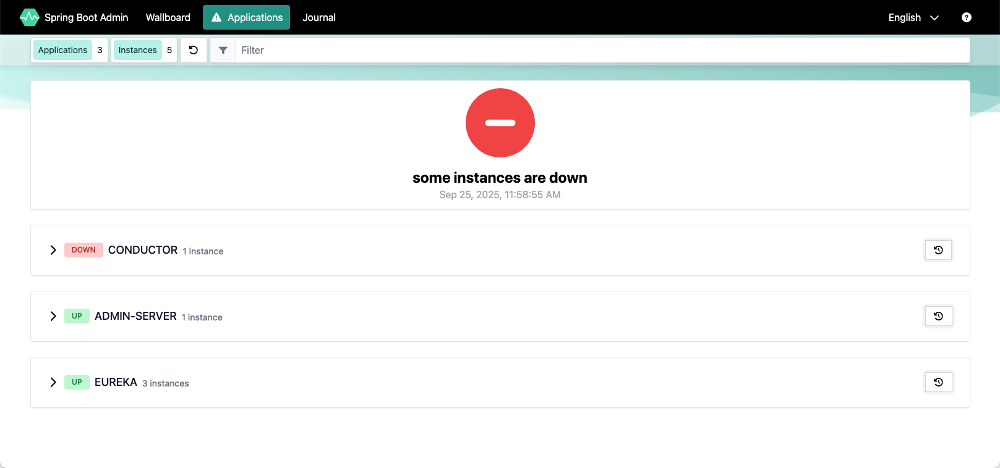

## Spring Boot Admin Server

Spring Boot Admin works by registering Spring Boot applications that expose Actuator endpoints. Each application's health and metrics data is polled by Spring Boot Admin Server, which aggregates and displays this information in a web dashboard. The registered applications can either self-register or be discovered using service discovery tools like Eureka or Consul. Through the dashboard, users can monitor the health, memory usage, logs, and more for each application, and even interact with them via management endpoints for tasks like restarting or updating configurations.

[Spring Boot Admin Documentation](https://docs.spring-boot-admin.com/3.5.5/docs/installation-and-setup/)

### Installing Spring Boot Admin

Spring Boot Admin will be installed if the `admin-server.enabled` is set to `true` in the `values.yaml` file. The default namespace for Spring Boot Admin is `admin-server`.

### Access Spring Boot Admin Web Interface

:::note Namespace Configuration
All `kubectl` commands in this guide use `-n admin-server` as the default namespace. If the Spring Boot Admin Server is installed in a different namespace, replace `admin-server` with your actual namespace name in all commands.

To find your namespace, run:
```bash
kubectl get pods -A | grep admin-server
```
:::

To access the Spring Boot Admin Web Interface, use kubectl port-forward to create a secure channel to `service/admin-server`. Run the following command to establish the secure tunnel:

```shell
kubectl port-forward -n admin-server svc/admin-server 8989
```

Open the [Spring Boot Admin dashboard](http://localhost:8989)



## Getting Help

- [#oracle-db-microservices Slack channel](https://oracledevs.slack.com/archives/C06L9CDGR6Z) in the Oracle Developers slack workspace.
- [Open an issue in GitHub](https://github.com/oracle/microservices-datadriven/issues/new).
