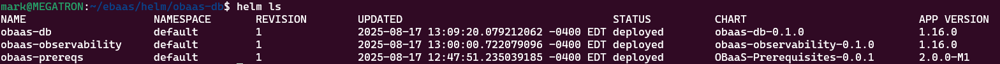

## Prepare and Install the OBaaS Database Helm chart

For this step, you will need the **obaas-db** directory in which you will see the following files:

```bash
cd obaas-db/
ls
Chart.yaml scripts templates values.yaml
```

You must edit the **values.yaml** file as follows:

- If you are using a private repository, you must update each **image** entry to point to your private repository instead of the public repositories.

- You must update the values in the **database.oci_config** section as follows:

  - The **oke** setting must be **false**. Setting this to true is not supported in M12.0.0-M3.

  - Supply your **tenancy**, **user** ocid, **fingerprint** and **region**. These must match the details you provided when you created the OCI configuration secret earlier. This information can be found in the OCI configuration file.

- (Optional) If you want to install any components in this chart into their own separate namespace, you can override the global namespace by setting a value in the **namespace** property inside the section for that component.

**Important note**: Please pause to double check all of the values are correct. If there are any errors here, the database provisioning will fail.

Install the Helm chart using the following command:

```bash
helm install obaas-db --set global.obaasName="obaas-dev" --set
global.targetNamespace="obaas-dev" ./
NAME: obaas-db
LAST DEPLOYED: Sun Aug 17 13:09:20 2025
NAMESPACE: default
STATUS: deployed
REVISION: 1
TEST SUITE: None
```

When the installation has completed, you can use this command to view the installed charts:



If you overrode the namespace for this component, you will see a new namespace called **oracle-database-operator-system** (for example) and the following pods. Otherwise the pods will be in the **obaas-dev** namespace (or whatever name you chose).


**Note**: If you are installing multiple OBaaS instances in your cluster, each one MUST have a different release name, `obaasName` and `targetNamespace`.  For example:

```bash
# for obaas-dev:
helm install obaas-db --set global.obaasName="obaas-dev"
--set global.targetNamespace="obaas-dev" ./

# for obaas-prod
helm install obaas-prod-db --set global.obaasName="obaas-prod"
--set global.targetNamespace="obaas-prod" ./
```
