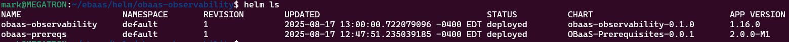

## Prepare and Install the OBaaS Observability Helm Chart

**Note**: This step is **optional**.

For this step, you will need the **obaas-observability** directory in
which you will see the following files:

```bash
cd obaas-observability/
ls
Chart.yaml LICENSE README.md admin dashboards templates values.yaml
```

You must edit the **values.yaml** file as follows:

- If you are using a private repository, you must update each
    **image** entry to point to your private repository instead of the
    public repositories.

- (Optional) If you want to install any components in this chart into
    their own separate namespace, you can override the global namespace
    by setting a value in the **namespace** property inside the section
    for that component.

Install the Helm chart using the following command:

```bash
helm install obaas-observability --set global.obaasName="obaas-dev"
--set global.targetNamespace="obaas-dev" ./
NAME: obaas-observability
LAST DEPLOYED: Sun Aug 17 13:00:00 2025
NAMESPACE: default
STATUS: deployed
REVISION: 1
TEST SUITE: None
```

When the installation has completed, you can use this command to view the installed charts:

```bash
helm ls
```



If you overrode the namespace, you will see a new namespce, e.g., **observability**, and the following pods. Otherwise these pods will be in the **obaas-dev** namespace (of whatever name you chose). Note that it will take 5 to 10 minutes for all of these to reach ready/running status:

```bash
kubectl get pods --n observability # or whatever namespace name you chose
```


Please wait for all of the pods to be ready before continuing to the next step.

**Note**: If you are installing multiple OBaaS instances in your cluster, each one MUST have a different release name, `obaasName` and `targetNamespace`.  For example:

```bash
# for obaas-dev:
helm install obaas-observability --set global.obaasName="obaas-dev"
--set global.targetNamespace="obaas-dev" ./

# for obaas-prod
helm install obaas-prod-observability --set global.obaasName="obaas-prod"
--set global.targetNamespace="obaas-prod" ./
```
