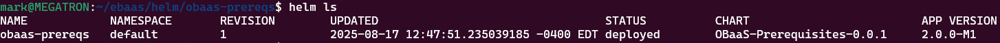
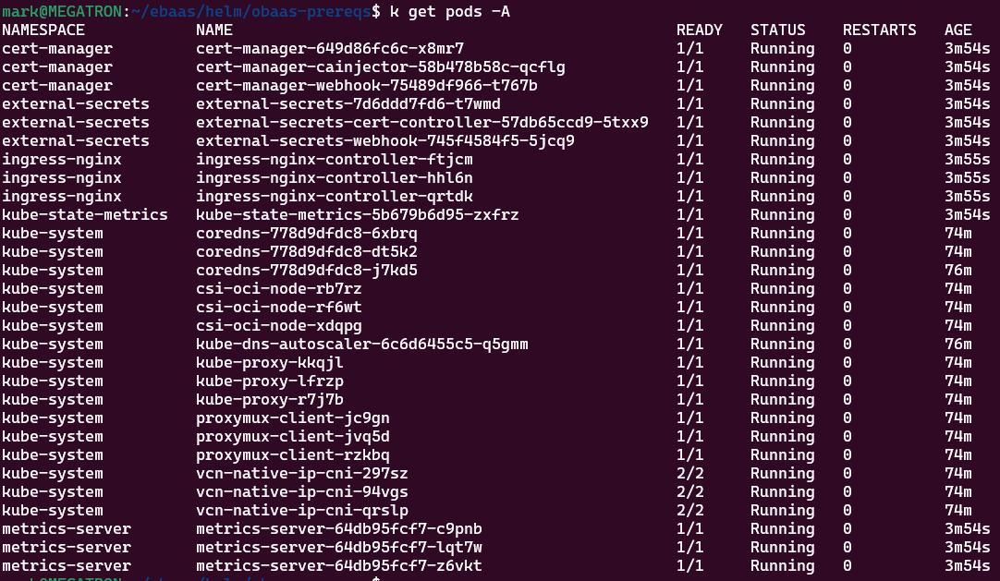

## Prepare then install OBaaS Prerequisites Helm chart

For this step, you will need the **obaas-prereqs** directory, which contains the following files:

```bash
cd obaas-prereqs/
ls
Chart.yaml LICENSE README.md templates values.yaml
```

You must edit the **values.yaml** file as follows:

- If you are using a private repository, you must update each
    **image** entry to point to your private repository instead of the
    public repositories.

- Optional. Each component listed in the file (e.g.,
    kube-state-metrics, metrics-server, cert-manager, etc.) has an
    **enabled: true** entry. If you want to omit a component, you must
    change the setting to **false**. Please note the following
    limitations:

  - Metrics-server is required if you wish to use the Horizontal Pod
        Autoscaling feature.

  - Cert-manager is required.

Choose a name for this OBaaS installation. In this document, we use **obaas-dev** as the name. Please note that the **targetNamespace** should match the namespace you created in the previous step, and that this namespace must already exist.

Install the Helm chart using the following command:

```bash
helm install obaas-prereqs ./
NAME: obaas-prereqs
LAST DEPLOYED: Sun Aug 17 12:47:51 2025
NAMESPACE: default
STATUS: deployed
REVISION: 1
TEST SUITE: None
```

In this command, note that **obaas-prereqs** is the name of the Helm release.  Note that obaas-prereqs is shared across all instances in the cluster, so we recommend that you do NOT set the `obaasName` and `targetNamespace` for this chart/release.

When the installation has completed, you can use this command to view the installed charts:

```bash
helm ls
```



If you overrode the individual component namespaces, you should now see the requested namespaces have been added (for example see below). Otherwise, all of the pods will be in the **obaas-dev** namespace (or whatever name you chose).

```bash
kubectl get ns
NAME                STATUS AGE
cert-manager        Active 3m37s
default             Active 77m
external-secrets    Active 3m37s
ingress-nginx       Active 3m54s
kube-node-lease     Active 77m
kube-public         Active 77m
kube-state-metrics  Active 3m37s
kube-system         Active 77m
metrics-server      Active 3m37s
```

And you should see the following pods running (note that they may take a few minutes to reach running and ready status):

```bash
kubectl get pods --A
```


