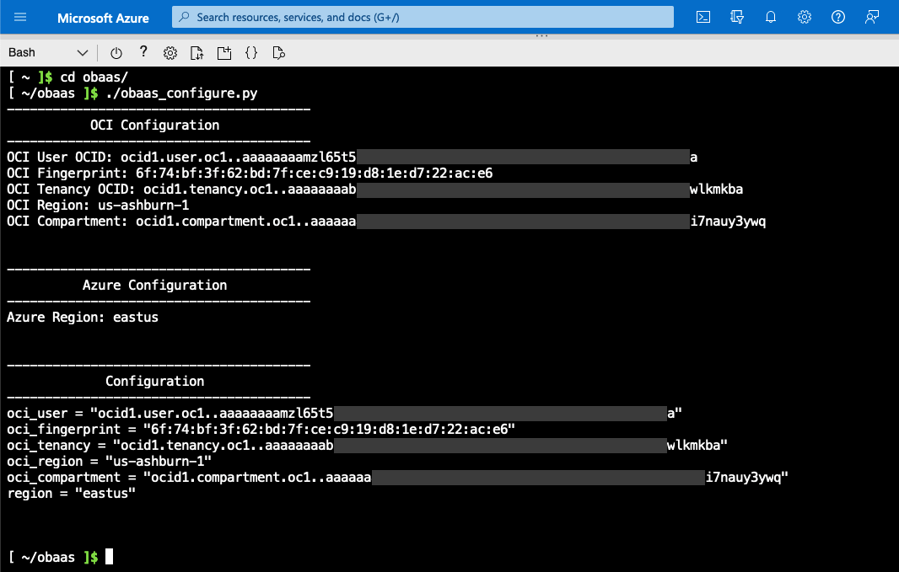

The Oracle Backend for Spring Boot and Microservices is available to install in Multicloud (Microsoft Azure (Azure) and Oracle Cloud Infrastructure (OCI)). This installation
deploys the Oracle Backend for Spring Boot and Microservices in Azure with an Oracle Autonomous Database running in OCI.

## Prerequisites

You must meet the following prerequisites to use the Oracle Backend for Spring Boot Multicloud (Azure and OCI). You need:

* An account on Azure.
* An account on OCI.

## Overview of the Setup Process

Watch this video for a quick overview of the setup process.



## Download

Download [Oracle Backend for Spring Boot and Microservices](https://github.com/oracle/microservices-datadriven/releases/download/OBAAS-1.0.0/azure-ebaas_latest.zip).

## Setup

A few setup steps are required in both OCI and Azure to deploy the Oracle Backend for Spring Boot and Microservices application.

### OCI

The Multicloud installation provisions an Oracle Autonomous Database in OCI using
the [Oracle Database Operator for Kubernetes (OraOperator)](https://github.com/oracle/oracle-database-operator).

To allow the OraOperator access to OCI, an [API Key](https://docs.oracle.com/en-us/iaas/Content/API/Concepts/apisigningkey.htm) must be
generated using these steps:

1. Log in to OCI.
2. Open the **Profile** menu  and click **User** settings.
3. In the **Resources** section at the lower left, click **API Keys**.
4. Click **Download Private Key** and save the key as `private_key.pem`. You do not need to download the public key.
5. Click **Add**.

The key is added and the Configuration File Preview is displayed. The file snippet includes the required parameters and values. Copy
and paste the configuration file snippet from the text box and save for later steps.

### Azure

The Multicloud installation is done using the Azure Cloud Shell. The following steps are required in Azure to prepare for the installation:

1. Log in to Azure.

2. Open the Azure Cloud Shell. For example:

   

3. Upload the [Oracle Backend for Spring Boot and Microservices](https://github.com/oracle/microservices-datadriven/releases/download/OBAAS-1.0.0/azure-ebaas-platform_latest.zip) stack. For example:

   

4. Upload the API Private Key (`private_key.pem`).

5. Unzip the stack to a directory called `obaas`. For example:

   `unzip azure-ebaas_latest.zip -d ~/obaas`

6. Move the `private_key.pem` file to the `obaas` directory. For example:

   `mv private_key.pem ~/obaas/`

7. Run the configuration Helper script using the values from the API Key. For example:

   ```bash
   cd ~/obaas
   ./obaas_configure.py
   ```

   


## Install Ansible

Install Ansible to run the Configuration Management Playbook.  The Helper script creates a Python virtual environment and installs
Ansible and some additional modules. For example:

```bash
cd ~/obaas/ansible
./setup_ansible.sh /tmp
source ./activate.env /tmp
```

## Deploy the Infrastructure

From the Azure Cloud Shell, run these commands to deploy the infrastructure:

```bash
cd ~/obaas
terraform init
terraform plan -out=multicloud.plan
terraform apply "multicloud.plan"
```
