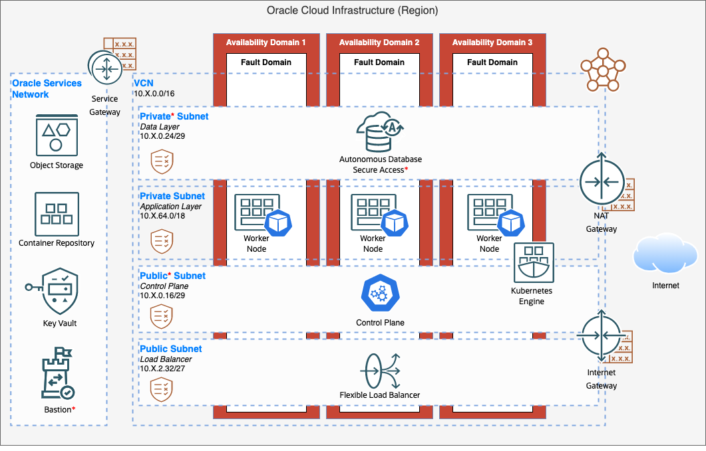

## Infrastructure Architecture

## Considerations

The following points are considered when designing the infrastructure:

### Performance

The ability to scale both vertically on all tiers and horizontally on the web tier.   Resources should be able automatically scale vertically based unpredictable, changing workloads.

### Security

The database should not be accessible directly from the internet.   Data should be encrypted at rest and, when traversing networks, in motion.  The Kubernetes control plane and worker nodes should not be accessible directly from the internet.  

A Bastion Service should be use for directly accessing the Database and Kubernetes when required.

### Availability

Remove a single point of failure by introducing redundancy via Availability and Fault Domains and native ADB solutions.

### Extensibility and Flexibility

Designed to seamlessly cater for the addition or removal of resources, capabilities and/or functionality.

---

## Components

The infrastructure has the following components:

### Region

An Oracle Cloud Infrastructure region is a localized geographic area that contains one or more data centres, called availability domains.

### Availability domains

Availability domains are stand-alone, independent data centres within a region.  The physical resources in each availability domain are isolated from the resources in the other availability domains, which provides fault tolerance.

### Fault domains

A fault domain is a grouping of hardware and infrastructure within an availability domain.  Each availability domain has three fault domains with independent power and hardware.  Applications can tolerate physical server failure, system maintenance, and power failures inside a fault domain.

### Virtual cloud network (VCN), Public and Private Subnets

A VCN is a customizable, software-defined network.  Like traditional data centre networks, VCNs give complete control over the network environment.  A VCN can have multiple non-overlapping CIDR blocks which can be segmented into subnets.  A subnet can be public or private.

### Service gateway

The service gateway provides access from a VCN to other services, such as Oracle Cloud Infrastructure Object Storage. The traffic from the VCN to the Oracle service travels over the Oracle network fabric and never traverses the internet.

### Security List/Network Security Group (NSG)

For each subnet, Security Lists and/or Network Security Groups are used to specify the source, destination, and type of traffic that must be allowed in and out of the subnet.

### Load Balancer

The Oracle Cloud Infrastructure Load Balancing service provides automated traffic distribution from a single entry point to one or multiple servers in the back end.

### Bastion Services

The Bastion as a Service provides restricted and time-limited secure access to the ORDS Server(s) and the Autonomous Data Warehouse.  These resources do not have public endpoints and require strict resource access controls.

### Autonomous Transaction Processing Database (ATP)

By default, Autonomous Databases are highly available, incorporating a multi-node configuration to protect against localized hardware failures that do not require fast disaster recovery.

### Container Engine for Kubernetes

Oracle Cloud Infrastructure Container Engine for Kubernetes is a fully managed, scalable, and highly available service that you can use to deploy your containerized applications to the cloud. You specify the compute resources that your applications require, and Container Engine for Kubernetes provisions them on Oracle Cloud Infrastructure in an existing tenancy. Container Engine for Kubernetes uses Kubernetes to automate the deployment, scaling, and management of containerized applications across clusters of hosts.

### Control Plane Services & Pods

The Control Plane manages the worker nodes and the Pods in the Kubernetes cluster. The worker nodes run the containerized applications. Every cluster has at least one worker node. The worker node(s) host the Pods that are the components of the application workload.

### Object Storage

Object Storage offers reliable and cost-efficient data durability, it provides quick access to large amounts of structured and unstructured data of any content type, including database data, analytic data, images, videos and more. We recommend using standard storage to ingest data from external sources because applications and users can access it quickly. You can build a lifecycle policy to move the data from standard storage to archive storage when it’s no longer required to be accessed frequently.

### Registry

Oracle Cloud Infrastructure Registry is an Oracle-managed registry that enables you to simplify your development-to-production workflow. Registry makes it easy for you to store, share, and manage development artifacts, like Docker images. The highly available and scalable architecture of Oracle Cloud Infrastructure ensures that you can deploy and manage your applications reliably.

## Recommendations

Requirements might differ or change from the architecture proposed.  Use the following recommendations as a starting point to adjusting the architecture; changes may impact pricing:

### Dedicated Networking (Chargeable)

Access to/from an On-Premise data centre will require additional networking configuration including but not limited to FastConnect and Dynamic Routing Gateways.

### Security Zones (Free)

For resources that require maximum security, Oracle recommends to use security zones.  A security zone is a compartment associated with an Oracle-defined recipe of security policies that are based on best practices.  For example, the resources in a security zone must not be accessible from the public internet and they must be encrypted using customer-managed keys.  When creating or updating resources in a security zone, OCI validates the operations against the policies in the security-zone recipe, and denies operations that violate any of the policies.

### Web Application Firewall (Chargeable)

Web Application Firewall (WAF) protects applications from malicious and unwanted internet traffic. WAF can protect any internet facing endpoint, providing consistent rule enforcement across a customer's applications.  WAF provides the ability to create and manage rules for internet threats including Cross-Site Scripting (XSS), SQL Injection and other OWASP-defined vulnerabilities. Unwanted bots can be mitigated while tactically allowed desirable bots to enter. Access rules can limit based on geography or the signature of the request.

### ATP CPU Auto-Scaling (Chargeable)

It is recommend to leave auto-scaling enabled; this will allow the increase and decrease of the databases CPU and I/O resources.  Use Apache JMeter to load test functional behavior and measure the performance.

### Autonomous Data Guard (Chargeable)

Autonomous Data Guard monitors the primary database and if the Autonomous Database instance goes down, then the standby instance assumes the role of the primary instance adding additional fault tolerance.

### Data Catalog (Chargeable)

OCI Data Catalog is a fully managed, self-service data discovery and governance solution for your enterprise data. Data Catalog provides a single collaborative environment to manage technical, business, and operational metadata
