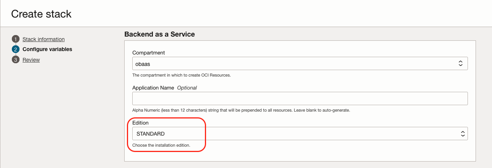
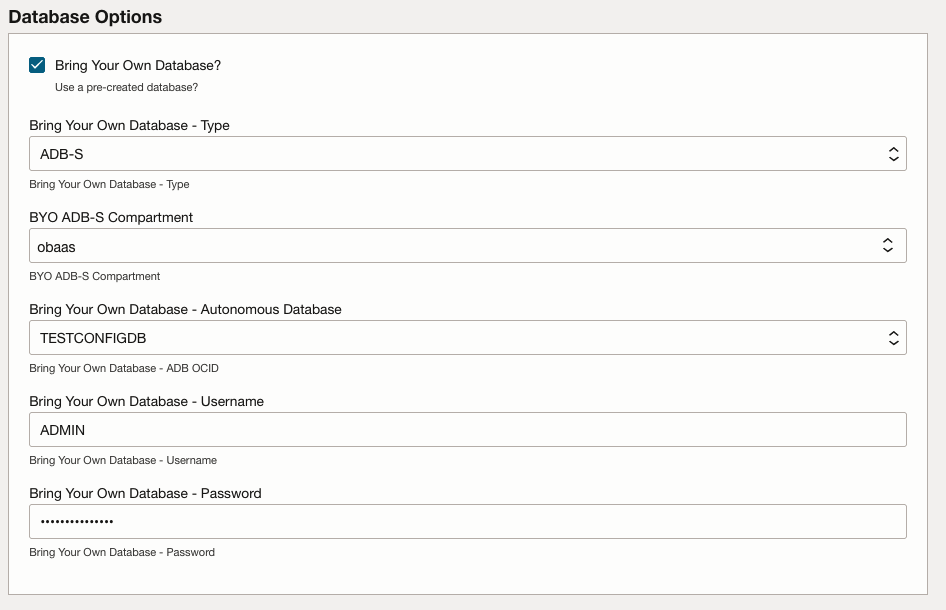
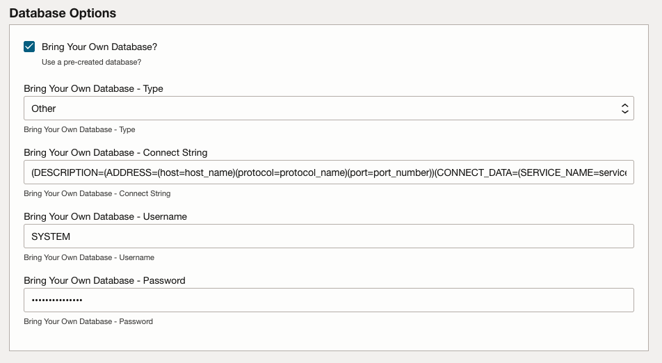

The Oracle Backend for Spring Boot and Microservices use the Oracle Database as a persistent data store for metadata and the Spring Cloud Config Server.  This documentation will refer to this database as the **Metadata Database**.

> **NOTE:** Oracle recommends that you install an addition Container Database (CDB) and Pluggable Databases (PDBs) for your production applications inline with the Database-Per-Service pattern.  This document will refer to these databases as the **Application Database**.  

The following chart presents the options for the Metadata Database, based on the installation type:

| Installation  | ADB-S | BYO ADB-S  | BYO BaseDB | BYO Containerized | BYO External |
|---------------|-------|------------|------------|-------------------|--------------|
| OCI Community | ✓     |            |            |                   |              |
| OCI Standard  | ✓     | ✓          | ✓          |                   | ✓            |
| Custom        | ✓     | ✓          | ✓          | ✓                 | ✓            |

> For **custom installations**, including On-Premises, it is the responsibility of the customer to ensure network access controls to provide both operational access and security.  The Oracle Cloud Infrastructure (OCI) [Networking](../networking) setup can be used as a general template.

# Bring Your Own Database - Standard Edition

Using the **Standard Edition** you can use a pre-created Oracle Database for the Oracle Backend for Spring Boot and Microservices **Metadata Database**.  

The following are minimum requirements for a BYO Oracle Database:

* Version: 19c+
* Network Access to the Database Listener
* Database User with appropriate privileges (see below)

## Database User Privileges

The database user for the the Oracle Backend for Spring Boot and Microservices **Metadata Database** is used to create other users and allow them to proxy through this user for database access.  While the `SYSTEM` or `ADMIN` (for ADB-S) will work, they are over-privileged and should not be used in production environments.

It is recommended to create a user, in this example, named `OBAAS` with a default tablespace of `DATA`:

```sql
CREATE USER OBAAS IDENTIFIED BY "Sup3r_St0ng_P4s5w0rd!";
ALTER USER OBAAS QUOTA UNLIMITED ON DATA;
GRANT ALTER USER TO OBAAS;
GRANT CREATE USER TO OBAAS;
GRANT CONNECT TO OBAAS WITH ADMIN OPTION;
GRANT CREATE SESSION TO OBAAS WITH ADMIN OPTION;
GRANT RESOURCE TO OBAAS WITH ADMIN OPTION;
GRANT SELECT ON DBA_USERS TO OBAAS;
GRANT CREATE ANY INDEX TO OBAAS;
GRANT ALTER ANY TABLE TO OBAAS;
GRANT COMMENT ANY TABLE TO OBAAS;
GRANT CREATE ANY TABLE TO OBAAS;
GRANT INSERT ANY TABLE TO OBAAS;
GRANT SELECT ANY TABLE TO OBAAS;
GRANT UPDATE ANY TABLE TO OBAAS;
GRANT CREATE ANY SEQUENCE TO OBAAS;
GRANT SELECT ANY SEQUENCE TO OBAAS;
GRANT CREATE ANY TRIGGER TO OBAAS;
-- Additional for PARSE
GRANT SODA_APP TO OBAAS WITH ADMIN OPTION;
GRANT CREATE TABLE TO OBAAS WITH ADMIN OPTION;
```

## Configuration

1. During the configuration of the Oracle Backend for Spring Boot and Microservices, ensure that the **Edition** is set to **Standard**:

    

1. Enable and Configure *Bring Your Own Virtual Network*

1. Tick the Bring Your Own Database" checkbox and, depending on the *Bring Your Own Database - Type*, provide the appropriate values.

### ADB-S

   - `BYO ADB-S Compartment` : The compartment of the existing ADB-S.
   - `Bring Your Own Database - Autonomous Database` : The ADB-S name.
   - `Bring Your Own Database - Username` : The existing database user with the appropriate privileges.
   - `Bring Your Own Database - Password` : The password for the existing database user.

        

### Other

   - `Bring Your Own Database - Connect String` : The connect string for the database (PDB) in Long Format.
   - `Bring Your Own Database - Username` : The existing database user with the appropriate privileges.
   - `Bring Your Own Database - Password` : The password for the existing database user.

        

   The *Connect String* should be in Long Format, for example:
   ```bash
   (DESCRIPTION=(ADDRESS=(host=oracle://somedb.example.com)(protocol=TCP)(port=1521))
      (CONNECT_DATA=(SERVICE_NAME=orclpdb)))
   ```