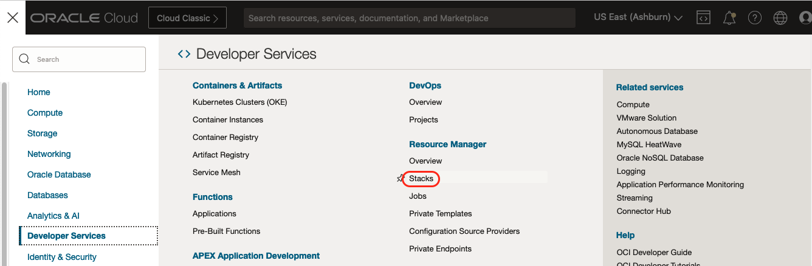
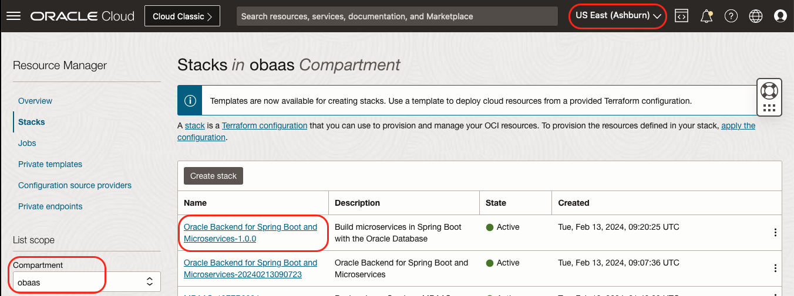
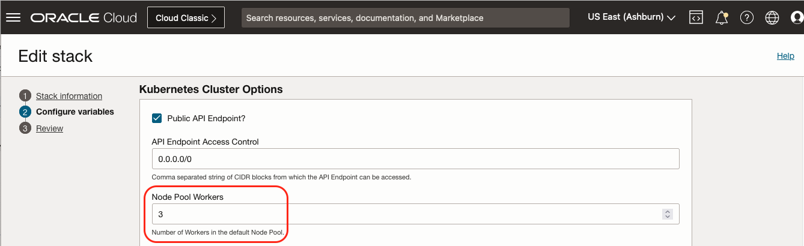
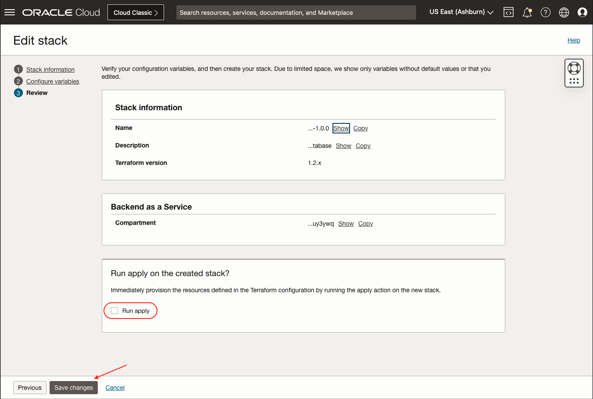
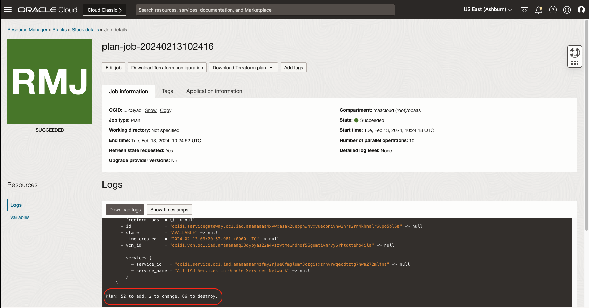

The Oracle Backend for Microservices and AI requires a Kubernetes cluster where the components are deployed.  You can bring your own cluster or, in OCI, have a [Oracle Kubernetes Engine](https://www.oracle.com/uk/cloud/cloud-native/container-engine-kubernetes/) (OKE) deployed for you.

## Kubernetes Namespaces

The following table lists the namespaces getting created when deploying Oracle Backend for Microservices and AI.

| Namespace                                  | Functionality                                                                                                                                                                              |
|--------------------------------------------|--------------------------------------------------------------------------------------------------------------------------------------------------------------------------------------------|
|     admin-server                           |     Spring   Boot Admin is a monitoring tool that aims to visualize information provided   by Spring Boot Actuators                                                                        |
|     apisix                                 | Apache APISIX API Gateway                                                                                                                                                                  |
|     application                            |      Cloudbank demo application. NS is created when deploying the application.                                                                                                           |
|     azn-server                             |     Spring   Boot Authentication Server. Used by the CLI (and REST API to authenticate and   authorize OBaaS users).                                                                       |
|     cert-manager                           |      Cert-manager   creates TLS certificates for workloads in your Kubernetes. Required for the   DB Operator.                                                                             |
|     coherence                              |      Coherence   Operator                                                                                                                                                                  |
|     conductor-server                       |      Conductor   Workflow Server                                                                                                                                                           |
|     config-server                          |     Spring   Cloud Config server with Oracle Database as the backend storage.                                                                                                              |
|     eureka                                 |      Eureka   service discovery                                                                                                                                                            |
|     external-secrets                       |      External   secrets operator                                                                                                                                                           |
|     ingress-nginx                          |      NGINX   ingress controller/                                                                                                                                                           |
|     kafka                                  |     Kafka   3.8.0 including Zookeeper                                                                                                                                                      |
|     kaniko                                 |     Used   when deploying OBaaS to build OBaaS images.                                                                                                                                     |
|     kube-state-metrics                     |     kube-state-metrics   collect a comprehensive set of metrics about the cluster, and publishes them   in prometheus format                                                               |
|     metrics-server                         |     metrics-server is   a very lightweight metrics collector that just collects some basic resource   usage metrics, it is used by the horizontal pod autoscaler (among other   things)    |
|     obaas-admin                            |      Admin   component of OBaaS. Deploying applications, managing OBaaS users (not DB   users)                                                                                             |
|     observability                          |      Signoz   and OTEL collector                                                                                                                                                           |
|     oracle-database-exporter               |     Unified   Observability for the Oracle Database. Exports Database Metrics in Prometheus   format.                                                                                      |
|     oracle-database-operator-system        |     Oracle   Database Operator for Kubernetes                                                                                                                                              |
|     otmm                                   |     Oracle   Transaction Manager for Microservices                                                                                                                                         |

## OKE Access

At the end of setup, you are provided with a command in the log of the apply job to create a Kubernetes configuration file to access that cluster:


For more information about working with the Kubernetes cluster, see [Setting Up Cluster Access](https://docs.oracle.com/en-us/iaas/Content/ContEng/Tasks/contengdownloadkubeconfigfile.htm#localdownload) in the Oracle Cloud Infrastructure documentation.


</br>

```txt
kubeconfig_cmd = "oci ce cluster create-kubeconfig
                    --cluster-id ocid1.cluster.oc1.iad.xxx
                    --file $HOME/.kube/config
                    --region us-ashburn-1
                    --token-version 2.0.0
                    --kube-endpoint PUBLIC_ENDPOINT"
```

**NOTE:** The generated `kubeconfig` file works if you are using the `DEFAULT` profile in your Oracle Cloud Infrastructure (OCI) CLI
configuration file. If you are using a different OCI CLI profile, you must add `--profile <PROFILE-NAME>` to the command. For example:

```txt
kubeconfig_cmd = "oci ce cluster create-kubeconfig
                    --cluster-id ocid1.cluster.oc1.iad.xxx
                    --file $HOME/.kube/config
                    --region us-ashburn-1
                    --token-version 2.0.0
                    --kube-endpoint PUBLIC_ENDPOINT"
                    --profile <PROFILE-NAME>
```

You must also edit the the generated Kubernetes configuration file and add the following lines:

```yaml
- name: user-xxxx
  user:
    exec:
      apiVersion: client.authentication.k8s.io/v1beta1
      args:
      - ce
      - cluster
      - generate-token
      - --cluster-id
      - ocid1.cluster....xxxx
      - --region
      - us-ashburn-1
      - --profile
      - <PROFILE-NAME>
      command: oci
```

### Using OCI Cloud Shell

A simple alternative is to use the [OCI Cloud Shell](https://docs.oracle.com/en-us/iaas/Content/API/Concepts/cloudshellintro.htm), which is
provided in the OCI Console. You can open the OCI Cloud Shell by clicking **Developer Tools** in the upper right corner of the OCI Console.
For example:

<!-- spellchecker-disable -->

<!-- spellchecker-enable -->

Run the provided command to create your Kubernetes configuration file after which you can access the Kubernetes cluster. For example, you can
list the Pods in your cluster:

```cmd
Welcome to Oracle Cloud Shell.

Update: Cloud Shell will now use Oracle JDK 11 by default. To change this, see Managing Language Runtimes in the Cloud Shell documentation.

Your Cloud Shell machine comes with 5GB of storage for your home directory. Your Cloud Shell (machine and home directory) are located in: US East (Ashburn).
You are using Cloud Shell in tenancy xxxx as an OCI user xxxx

Type `help` for more info.
user@cloudshell:~ (us-ashburn-1)$ oci ce cluster create-kubeconfig --cluster-id ocid1.cluster.oc1.iad.xxx
 --file $HOME/.kube/config --region us-ashburn-1 --token-version 2.0.0 --kube-endpoint PUBLIC_ENDPOINT
Existing Kubeconfig file found at /home/user/.kube/config and new config merged into it
user@cloudshell:~ (us-ashburn-1)$ kubectl get pods -A
NAMESPACE         NAME                                        READY   STATUS      RESTARTS        AGE
ingress-nginx     ingress-nginx-controller-7d45557d5c-bqwwp   1/1     Running     0               4h18m
ingress-nginx     ingress-nginx-controller-7d45557d5c-klgnb   1/1     Running     0               4h18m
ingress-nginx     ingress-nginx-controller-7d45557d5c-l4d2m   1/1     Running     0               4h18m
kube-system       coredns-746957c9c6-hwnm8                    1/1     Running     0               4h27m
kube-system       csi-oci-node-kqf5x                          1/1     Running     0               4h23m
kube-system       kube-dns-autoscaler-6f789cfb88-7mptd        1/1     Running     0               4h27m
kube-system       kube-flannel-ds-hb6ld                       1/1     Running     1 (4h22m ago)   4h23m
kube-system       kube-proxy-v5qwm                            1/1     Running     0               4h23m
kube-system       proxymux-client-vpnh7                       1/1     Running     0               4h23m
.........
user@cloudshell:~ (us-ashburn-1)$
```

## Manually Scaling OKE

To add additional nodes to the OKE cluster, the Marketplace installation stack can be re-applied after increasing the number of worker nodes.

> **NOTE**: If changes to the infrastructure were made outside the stack, re-applying the stack may revert those changes back to their original values.  It is important to *PLAN* and review the proposed changes before running *APPLY*.  This will ensure there are no unintentional modifications to the infrastructure.

1. In the OCI Console, navigate to Developer Services -> Resource Manager -> Stacks


2. Ensure the compartment is set to where the Marketplace Stack was deployed, and Select the stack.


3. Edit the Stack and Click Next


4. Increase the Node Pool Workers


5. Click Next and Save Changes


6. Run Plan


7. Carefully review the proposed changes


8. Run Apply after reviewing the proposed changes
![OCI Apply Changes](images/apply.png "OCI Apply Changes"
