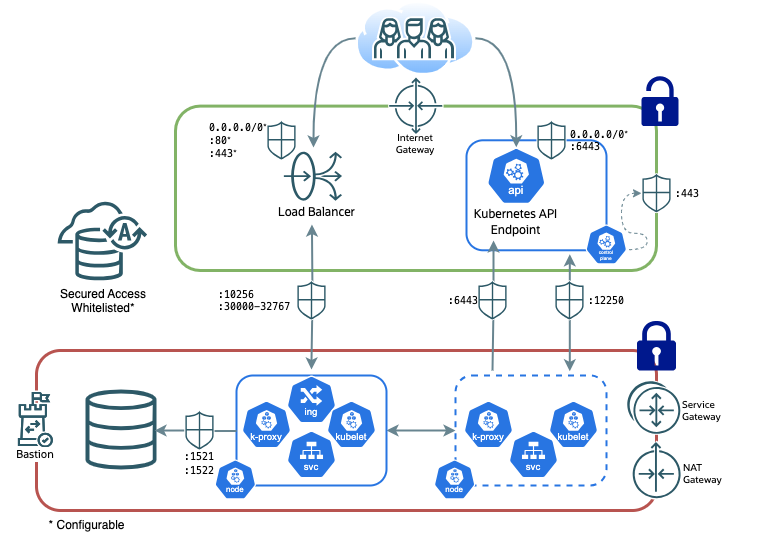
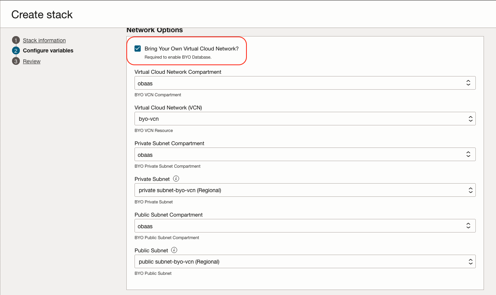
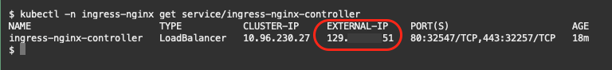

The Oracle Backend for Spring Boot and Microservices has specific networking requirements to ensure resource communication while providing security through isolation and networking rules.  

The **standard installation** will provision a new Virtual Cloud Network (VCN) with the required subnets all networking rules to get started using the Oracle Backend for Spring Boot and Microservices quickly.  To use an existing VCN, please follow the [Bring Your Own VCN](#bring-your-own-oci-vcn) instructions.

> For **custom installations**, including On-Premises, it is the responsibility of the customer to ensure network access controls to provide both operational access and security.  The Oracle Cloud Infrastructure (OCI) **standard installation** setup can be used as a general template.

# Network Infrastructure Overview



## OCI Network Infrastructure

All infrastructure resources are split between two subnets: one public and one private subnet with access restricted by Network Security Groups (Firewalls).  All access is blocked by default with specific IP and Port opened, as documented below, for proper operation.

> Note minimum CIDRs are based on an Oracle Cloud Infrastructure (OCI) deployments.  Other cloud vendors reserve usable IPs within a CIDR reducing the usable IPs that can be used by the infrastructure.

### Public Subnet

The public subnet allows external access to the Oracle Backend for Spring Boot and Microservices resources.  Ingress/Egress to the Public Subnet and from the Internet is provided by an Internet Gateway.

At a minimum, the public subnet requires two usable IP Addresses (`/30`).

ICMP traffic is allowed between the Public and Private Subnets for resource discovery. 

#### Load Balancer

An external Load Balancer is used in conjunction with Ingress resources to expose Services to the internet.  Ingress to the Load Balancer should be restricted by CIDR and Ports (default: `0.0.0.0/0`; `80`,`443`).  All TLS communications terminate at the LoadBalancer.  For more information on the certificate for TLS, please follow [OCI Load Balancer TLS Certificate Setup](#oci-loadbalancer-tls-certificate-setup).

#### Kubernetes API Endpoint

The Kubernetes API Endpoint, within the Control Plane, is used to manage the Kubernetes Cluster as well as providing access to Kuberenetes services that are not exposed to the Load Balancer via Port Forwarding.  Ingress to the Endpoint is restricted to port `6443` and should be further restricted by CIDR (default: `0.0.0.0/0`).

In Oracle Cloud Infrastructure (OCI), the Oracle Kubernetes Engine (OKE) Control Plane is allowed egress to OCI services via port `443`.  Access to these services are required for the OKE Managed Control Plane.

### Private Subnet

The private subnet isolates its resources from direct external access.  Ingress to resources in the private subnet is restricted to the Load Balancer and Kubernetes API Endpoint via specific Network Security Group (Firewall) rules.  Optionally, a Bastion Service, within the Private subnet, can provide additional non-restricted access to the resources in the Private Network.

Egress to the Internet is provided by a NAT Gateway, while Egress to other Cloud Services (such as a Container Repository) is provided by a Service Gateway.

The CIDR of the Private Subnet is dependent on the number of Kubernete Work Nodes and other resources, such as databases.  It is recommended to specify a CIDR providing at least six usable IP Addresses (`/29`).

ICMP traffic is allowed between the Public and Private Subnets for resource discovery. 

#### Kubernetes Worker Nodes

The Worker Nodes are allowed to communicate with other Worker Nodes on all ports.

#### Worker Nodes and Load Balancer

The Woker Nodes and Load Balancer are allowed to communicate on port `10256` for Health Check/Availability purposes and ports `30000-32767` for forwarding external internet access to exposed services.

#### Worker Nodes and Kuberenetes API Endpoint

Worker Nodes are allowed to communicate with the API Endpoint on port `6443`.

#### Worker Nodes and Control Plane

The Kuberenetes Control Plane is allowed to communicate to Worker Nodes on all ports.  The Worker Nodes are allowed to communicate with the Control Plane on port `12250`.

#### Oracle Database

It is recommended to place Oracle Databases inside the Private Subnet.  Worker Nodes and the Oracle Database will be allowed to communicate freely within the Private Subnet.

When using the Oracle Autonomous Database (ADB), it can either be placed in the Private Subnet with a *Private Endpoint*, or outside the Virtual Cloud Network with *Secured Access*.  When the ADB is configured for *Secured Access*, access is allowed from the Virtual Cloud Network and additional, configurable IPs.

# Bring Your Own OCI VCN

Using the **Standard Edition** you can use a pre-created VCN for the Oracle Backend for Spring Boot and Microservices resources.  

The following are minimum requirements for a BYO VCN:

* *Public Subnet*
    * Minimum CIDR: `/30`
    * Route Table:
        * Internet Gateway to `0.0.0.0/0`
* *Private Subnet*
    * Minimum CIDR: `/29`
    * Route Table:
        * Service Gateway to "All `<Region>` Services in the Oracle Services Network"
        * NAT Gateway to `0.0.0.0/0`

## Configuration

During the configuration of the Oracle Backend for Spring Boot and Microservices, ensure that the **Edition** is set to **Standard**:


Tick the "Bring Your Own Virtual Network" checkbox and fill in the appropriate values for the VCN Compartment and Name, Public Subnet Compartment and Name, and Private Subnet and Name:

   - `Virtual Cloud Network Compartment` : The compartment of the existing VCN.
   - `Virtual Cloud Network (VCN)` : The VCN name.
   - `Private Subnet Compartment` : The compartment of the existing Private Subnet in the VCN.
   - `Private Subnet` : The Private Subnet name.
   - `Public Subnet Compartment` : The compartment of the existing Public Subnet in the VCN.
   - `Public Subnet` : The Public Subnet name.



# OCI LoadBalancer TLS Certificate Setup

In OCI, example self-signed certificates are used for TLS communication to the Load Balancer.  The self-signed certificates should be replaced with certificates signed by a publicly trusted certificate authority (CA).

## Setup

1. Ensure your Domain Name System (DNS) entry points to the public IP address associated with the `service/ingress-nginx-controller` in the `ingress-nginx` namespace:

    

2. Obtain a new TLS certificate. In a production environment, the most common scenario is to use a public certificate that has been signed by a certificate authority.

3. Create a new Kubernetes secret in the `ingress-nginx` namespace.  For example:

    ```bash
    kubectl -n ingress-nginx create secret tls my-tls-cert --key new-tls.key --cert new-tls.crt
    ```

4. Modify the service definition to reference the new Kubernetes secret by changing the `service.beta.kubernetes.io/oci-load-balancer-tls-secret` annotation in the service configuration. For example:

    ```bash
    kubectl patch service ingress-nginx-controller -n ingress-nginx \
        -p '{"metadata":{"annotations":{"service.beta.kubernetes.io/oci-load-balancer-tls-secret":"my-tls-cert"}}}' \
        --type=merge
    ```