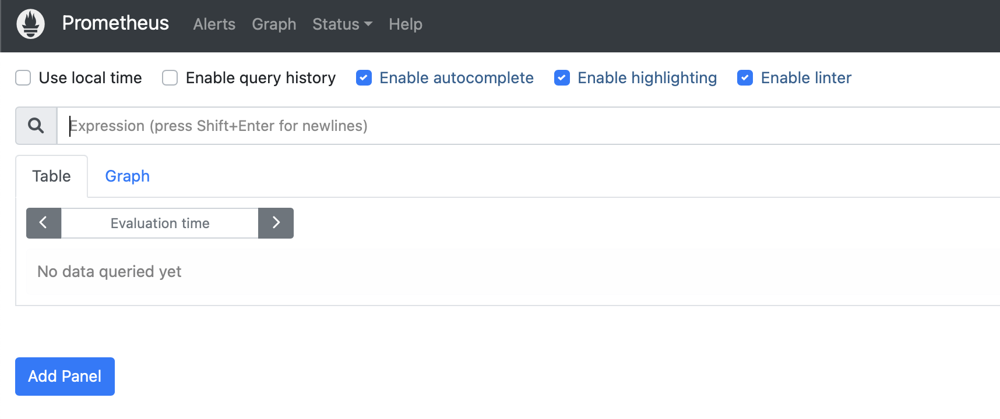
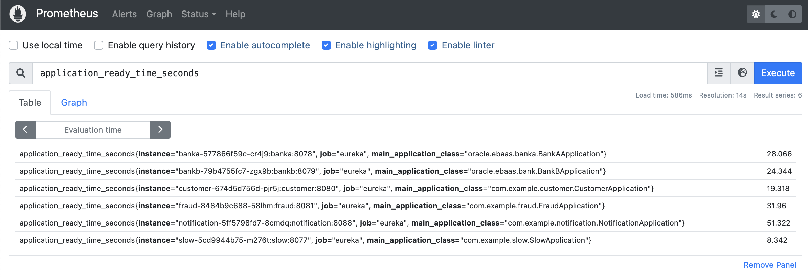
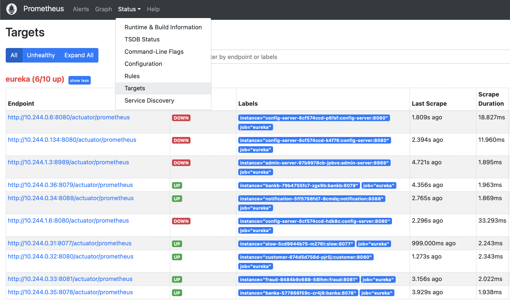
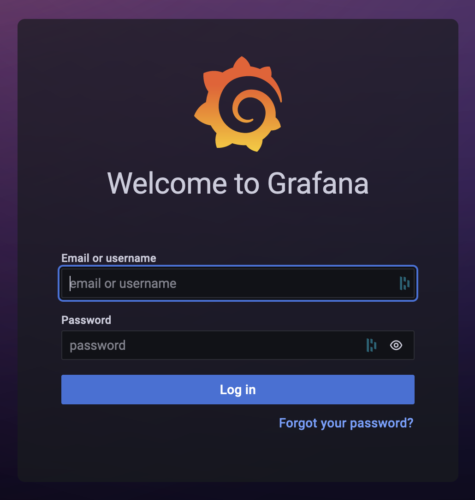
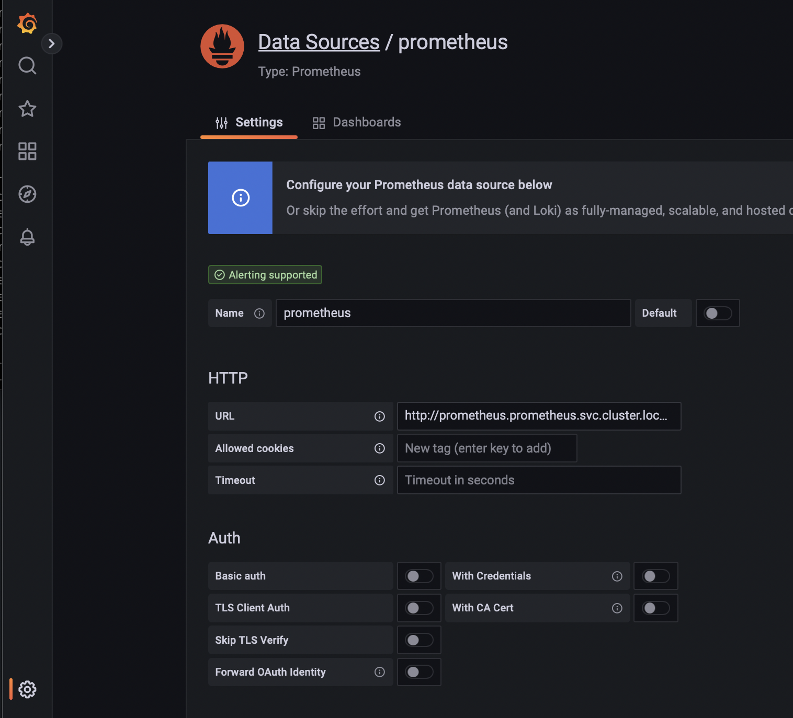
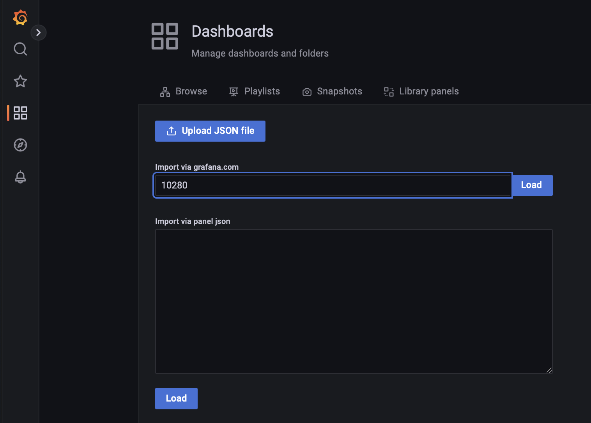
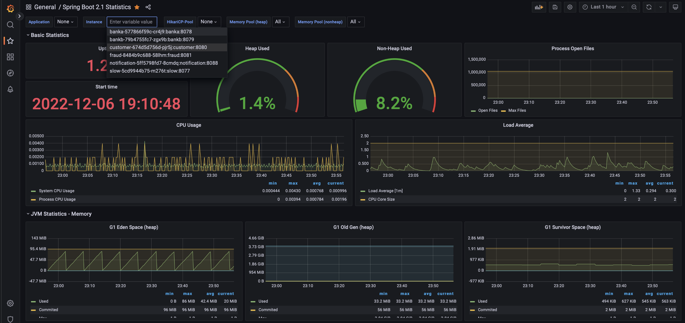
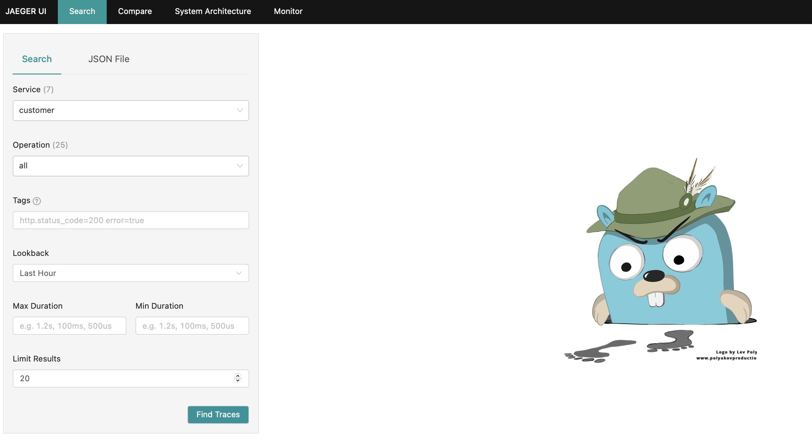
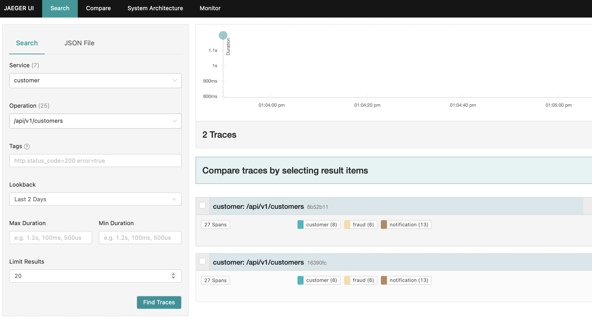
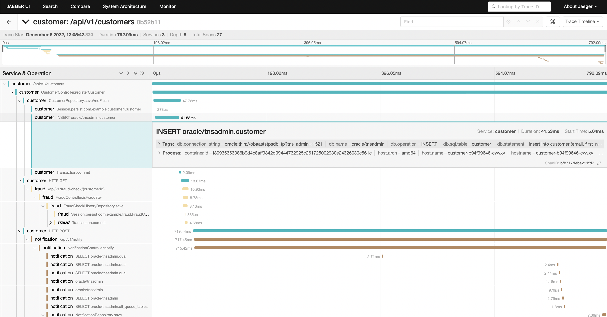

## Introduction

This lab helps you know how to configure and test Observability concerns from OBaaS.

Estimated Time: 15 minutes

### Objectives

* View metrics from the application in Prometheus
* View details of the application in Grafana
* View application traces in Jaeger

### Prerequisites

* Have successfully completed the earlier labs

## Task 1: View metrics from the application in Prometheus

Prometheus is an open-source systems monitoring and alerting. Prometheus collects and stores its metrics as time series data, i.e. metrics information is stored with the timestamp at which it was recorded, alongside optional key-value pairs called labels.

1. Exposing Prometheus UI using `port-forward`

    ```shell
    <copy>
    kubectl port-forward -n prometheus svc/prometheus 9090:9090
    </copy>
    ```

2. Open the Prometheus UI URL: <http://localhost:9090>

    

3. In the Prometheus UI, home page you can search for metrics.

    * In the search bar, search for application_ready_time_seconds and hit Execute
    * Notice you see metrics for the sample applications

        

4. In the Prometheus UI, the `Status` Menu Item allow you list all targets being monitored by Prometheus.

    * In the top menu, choose Status and then Targets
    * Notice targets "slow", "customer" and others are in "UP" status and others are in "Down".

        

## Task 2: View details of the application in Grafana

[Grafana](https://grafana.com/docs/grafana/latest/introduction/) open source software enables you to query, visualize, alert on, and explore your metrics, logs, and traces wherever they are stored. Grafana OSS provides you with tools to turn your time-series database (TSDB) data into insightful graphs and visualizations.

1. Exposing Grafana using `port-forward`

    ```shell
    <copy>
    kubectl -n grafana port-forward svc/grafana 8080:80
    </copy>
    ```

2. Open the Grafana UI URL: <http://localhost:8080>

    * username: `admin`
    * To get the password run this command:

        ```shell
        kubectl -n grafana get secret grafana -o jsonpath='{.data.admin-password}' | base64 -d
        ```

        > **Note:** If you don't have "base64" leave off the last part ("| base64 -d") and then copy the output and use this website to decode it: <https://www.base64decode.org/>. The password will be a long string of characters like this 210BAqNzYkrcWjd58RKC2Xzerx9c0WkZi9LNsG4c (yours will be different)

    

3. Setup Prometheus Datasource

    * On the left hand side menu, down the bottom, click on the cog wheel and choose Data Sources
    * Click on the second data source, its called "Prometheus"
    & In the address (be careful to get the address field, not the name field), change the address from  <http://prometheus:9090>    to <http://prometheus.prometheus.svc.cluster.local:9090>
    * Down the bottom of the page click on save & test and wait for the green icon to say the datasource is working (takes 2-3 seconds)

    

4. Setup Dashboard

    * Now in the left hand side menu up the top, find the dasbhoards link and click on that
    * Click on the blue button on the right to add a new dashboard, and in the pull down select "import"
    * In the field for the grafana dashboard ID, paste in this value: `10280`
    * Click on next
    * In the datasource field, choose the one called "prometheus"
    * Click on save

    

5. Navigate in Spring Boot Dashboard

    * Now you should see the new dashboard in the list - its called Spring Boot Dashboard 2.1 - click on it to open it
    * You should automatically see details for the sample applications in the dashboard
    * Go and do a few more curls to create some traffic and observe the dashboard - there is a little round arrow thing in the top right corner that lets you tell it to automatically refresh every 5 seconds (or whatever period you choose)

    

## Task 3: View application traces in Jaeger UI

Spring Boot Admin is a web application, used for managing and monitoring Spring Boot applications. Each application is considered as a client and registers to the admin server. Behind the scenes, the magic is given by the Spring Boot Actuator endpoints.

1. Exposing Jaeger UI using `port-forward`

    ```shell
    <copy>
    kubectl -n observability port-forward svc/jaegertracing-query 16686:16686
    </copy>
    ```

2. Open the Jaeger UI URL: <http://localhost:16686>

    

3. In the Jaeger UI, the `Search` Tab allow you list tracings using diverse criterias. Let's test with Customer Microservice

    * Select Service `customer` and Operation `/api/v1/customers`
    * Click on the search button -- Several traces will appear (one for each time you curl'ed)

        

    * Click on any one of them to view the trace that include multiple services and going into the DB and AQ

        
