## Introduction

This lab helps you know how to configure and test security concerns from OBaaS.

Estimated Time: 15 minutes

### Objectives

* View details of the application using the Spring Admin Dashboard
* Validate the application registered with Eureka (Service Registry)
* Deploy and Secure OBaaS Sample Apps APIs using APISIX

### Prerequisites

* Have successfully completed the earlier labs

## Task 1: View application details using the Spring Admin Dashboard

Spring Boot Admin is a web application, used for managing and monitoring Spring Boot applications. Each application is considered as a client and registers to the admin server. Behind the scenes, the magic is given by the Spring Boot Actuator endpoints.

1. Exposing Spring Admin Dashboard using `port-forward`

    ```shell
    <copy>
    kubectl -n admin-server port-forward svc/admin-server 8989:8989
    </copy>
    ```

2. Open the Spring Admin Dashboard URL: <http://localhost:8989>

    * username: `admin`
    * password: `admin`

    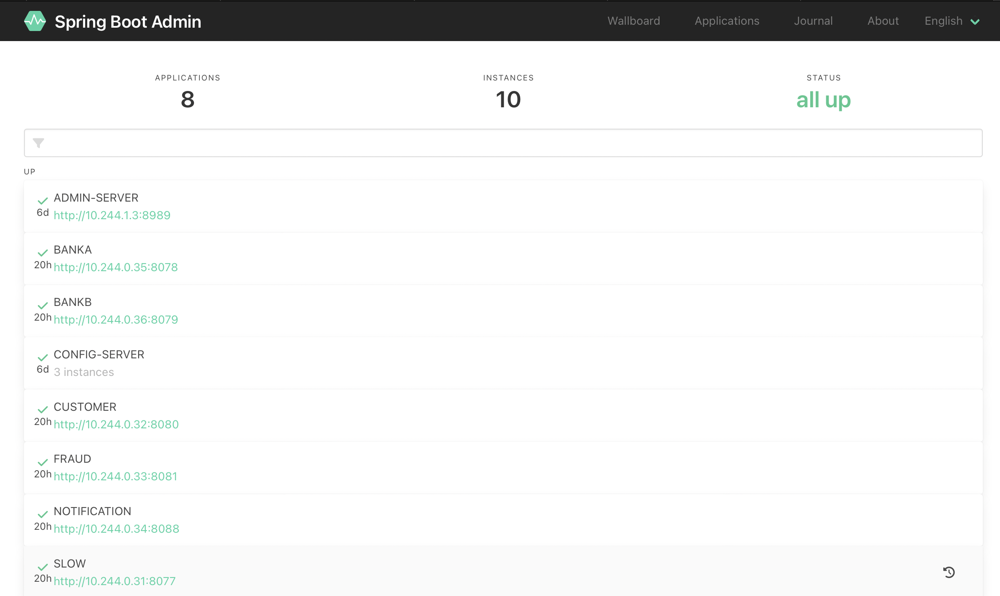

3. On the web page, navigate to the applications tab

    * Find the "slow" entry and click on it to expand it
    * Click on the instance of the service
    * Notice you can see details about the service instance, metrics, configuration, etc.

    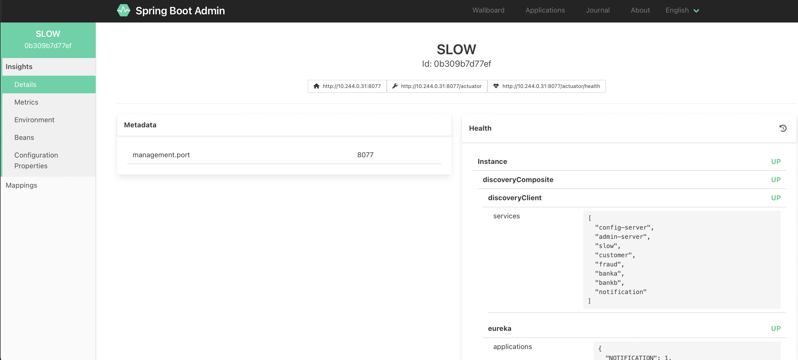

## Task 2: Validate the application registered with Eureka

Spring Cloud Netflix provides Netflix OSS integrations for Spring Boot apps through autoconfiguration and binding to the Spring Environment and other Spring programming model idioms. The patterns provided include Service Discovery (Netflix Eureka service registry).

Eureka Server is an application that holds the information about all client-service applications. Every microservice will register into the Eureka server and Eureka server knows all the client applications running on each port and IP address.

1. Exposing Eureka Dashboard using `port-forward`

    ```shell
    <copy>
    kubectl port-forward -n apisix svc/apisix-dashboard 8761:8761
    </copy>
    ```

2. Open the Eureka Dashboard URL: <http://localhost:8761>

    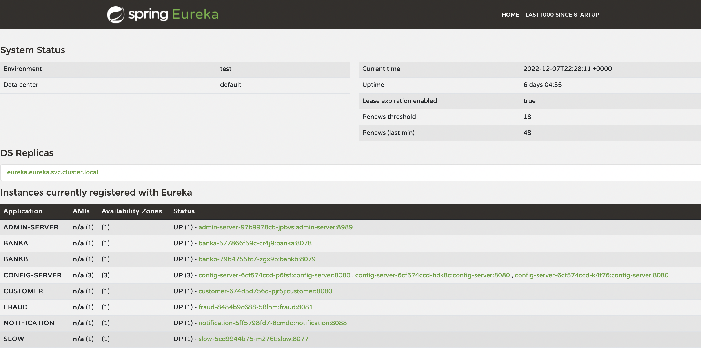

    * On the web page, look for an entry called "SLOW" - the presence of this entry confirms that the application successfully registered itself with the service registry
    * You should also see "CONFIG-SERVER" and "ADMIN-SERVER" there


## Task 3: Deploy and Secure OBaaS Sample Apps APIs using APISIX

[Apache APISIX](https://apisix.apache.org) is an open source cloud native API platform that support the full lifecycle of API management as publishing, traffic management, deployment strategies, circuit breaking, and so on. OBaaS deploys APISIX inside `apisix` namespace as detailed bellow and to you have access to APISIX Dashboard for this version of OBaaS you have to request a port-foward from the `service/apisix-dashboard`.

```shell
<copy>
kubectl --namespace apisix get all
</copy>
```

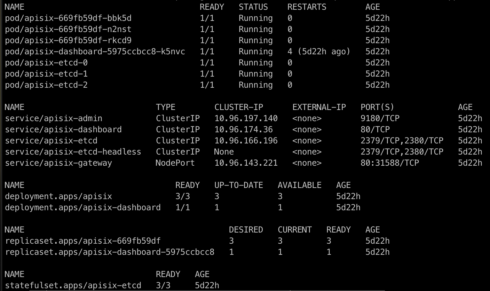

1. Exposing APISIX Dashboard using `port-forward`

    ```shell
    <copy>
    kubectl port-forward -n apisix svc/apisix-dashboard 8080:80
    </copy>
    ```

2. Open the APISIX Dashboard URL: http://localhost:8080

    * username: `admin`
    * password: `admin`

    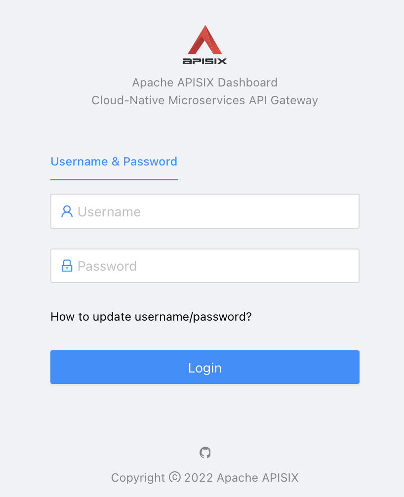

## Task 2: Expose Spring application through API Gateway and Load Balancer

Now that the application is running, you want to expose it to the outside world.  This is done by creating something called a "route" in the APISIX API Gateway.

1. Create a Route to the Service

    * Then click on the "Routes" option in the menu on the left hand side.

        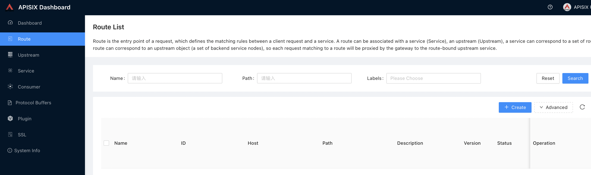

    * Click on the "Create" button to create a new route.
    * Fill out the following details (anything not mentioned here can be left at the default value):
        * name = slow
        * path = /fruit*
        * method = get, options
        * upstream type = service discovery
        * discovery type =eureka
        * service name = SLOW     (note that this is case sensitive, it is on Eureka Service dashboard)

        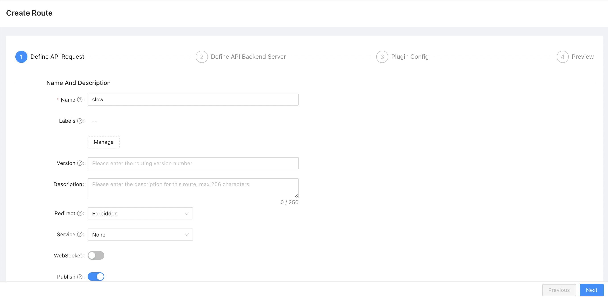
        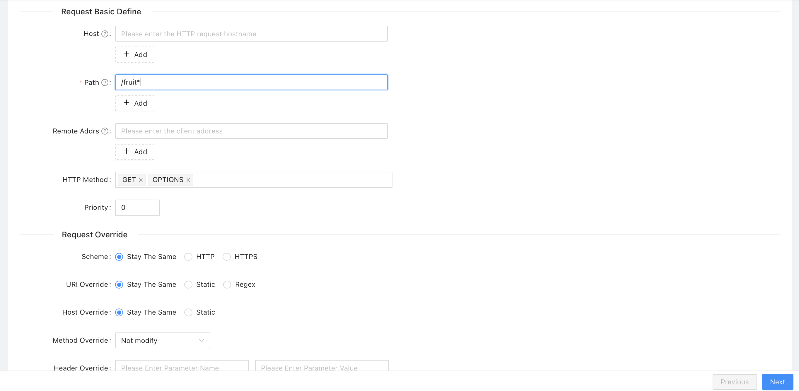
        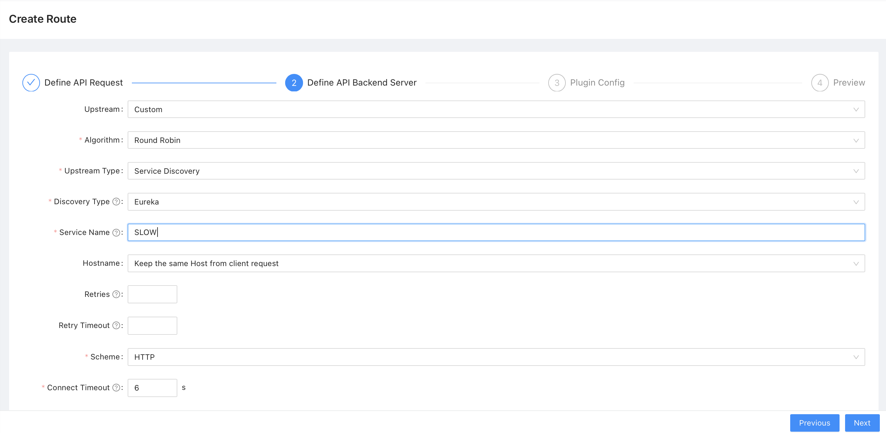

    * Save the route you created.
        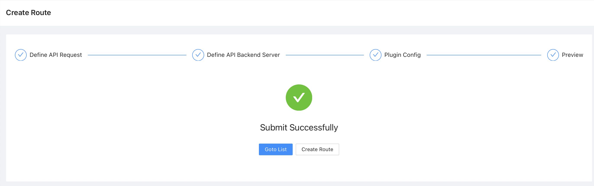
        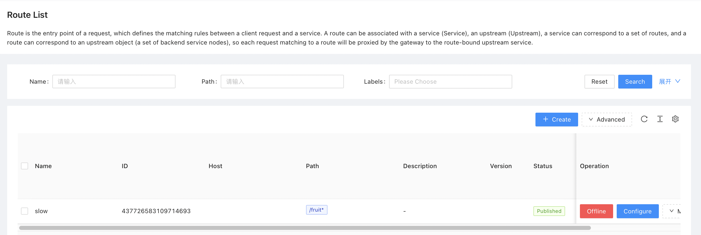

2. Test a Route to the Service

    * Get the APISIX Gateway External IP

        ```shell
        <copy>
        kubectl --namespace apisix get ingress/apisix-gateway
        </copy>
        ```

    * Call API using APISIX Gateway address plus path

        ```shell
        <copy>
        curl http://141.148.168.140/fruit
        </copy>
        ```

        You should get "banana" or "fallback fruit is apple" back as the response.
