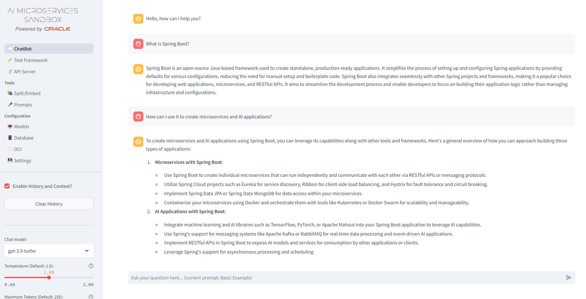

## Developer Preview Feature - Oracle AI Explorer for Apps

Oracle Backend for Microservices and AI Version 1.4.0 introduces [Oracle AI Explorer for Apps](https://github.com/oracle-samples/oaim-sandbox) as a *Developer Preview* feature.  

The Oracle AI Explorer for Apps provides a streamlined environment where developers and data scientists can explore the potential of Generative Artificial Intelligence (GenAI) combined with Retrieval-Augmented Generation (RAG) capabilities. By integrating Oracle Database 23ai AI Vector Search, the Sandbox enables users to enhance existing Large Language Models (LLMs) through RAG.

It provides a "sandbox" for experimentation and iteration, allowing you to easily optimize a chatbot/RAG use case by exploring different models, chunking strategies, vector similarity algorithms, prompts, model parameters, memory, re-ranking, and evaluation.  

This feature is provided as a "developer preview" meaning it is provided for developers to experiment with, without any formal support, but with the expectation that it may become a formal feature in a future release.  You may open issues in GitHub and best-effort assistance will be provided. Please be aware that this feature is under development, and not yet considered stable. Functionality, interfaces, etc., may change in non-backwards compatible ways.  

For more information about this developer preview feature, please visit:

- the [GitHub repo](https://github.com/oracle-samples/oaim-sandbox)
- the [Documentation](https://oracle-samples.github.io/oaim-sandbox/)
- this OCI Cloud Coaching session titled [Building a real chatbot with Oracle Database 23ai](https://www.youtube.com/watch?v=oG9MPCpwUlU), (video) which includes discussion of the background concepts and a demonstration of this feature.
