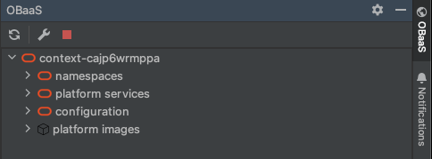
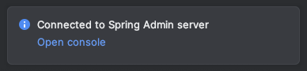

## GA 1.4.0 - July, 2025

General Updates.


The IntelliJ plugin is supported with IntelliJ version IntelliJ IDEA 2024.3.6 and earlier versions. Version 2025.x will not work.


## GA 1.3.1 - October, 2024

General updates.

## GA 1.3.0 - September, 2024

Oracle Backend for Microservices and AI (OBaaS) is an IntelliJ plugin to browse, deploy, and modify workloads on the Oracle Backend for Microservices and AI platform.This plug-in implements the functionalities available in the [Oracle Backend for Microservices and AI CLI](../../development/cli), simplifying  access to Oracle Backend for Microservices and AI deployments from an IntelliJ IDE. 

The plug-in allows access to the Oracle Backend for Microservices and AI platform services, including the SigNoz, Spring, APISIX and Eureka web admin consoles. Additionally, you may create and bind workloads to your  Oracle Backend for Microservices and AI database deployment. Users may inspect Oracle Backend for Microservices and AI deployment namespaces, workloads, and related configuration.

See the Oracle Free Use Terms and Conditions [License](https://oss.oracle.com/licenses/upl/)

## Prerequisites

* An operational Oracle Backend for Microservices and AI deployment, as configured through platform [setup](../../setup/).
* Access to a Kubernetes cluster where Oracle Backend for Microservices and AI is deployed from your IntelliJ IDE.

## Installation

1. Download the IntelliJ plugin ZIP file from [here](https://github.com/oracle/microservices-datadriven/releases/tag/OBAAS-1.3.1).

2. On the IntelliJ Settings plugins page, click the "gear" icon and select **Install Plugin from Disk...**. Browse your filesystem for the IntelliJ plugin ZIP file, and select it.

    

3. Click **OK**, and restart your IDE to load the Oracle Backend for Microservices and AI plugin.

4. If you do not see the Oracle Backend for Microservices and AI icon on your IDE's toolbar, navigate to View -> Tool Windows, and select "OBaaS" to add it to your IDE's tool window bar.

### Proxy Configuration

If you are connecting to your Kubernetes cluster through a proxy server, configure your IntelliJ proxy settings from Settings -> Proxy. The Oracle Backend for Microservices and AI will use your IntelliJ system proxy settings to connect to your Kubernetes cluster.

## Configuring the Oracle Backend for Microservices and AI Connection

1. Open the plugin tool window by clicking the "OBaaS" icon on the IntelliJ tool bar, and click the "wrench" icon to open the Oracle Backend for Microservices and AI connection settings.

    

2. Enter the Oracle Backend for Microservices and AI username, password, kubeconfig for the Kubernetes cluster, and the local port the Oracle Backend for Microservices and AI admin tunnel will bind to. The default kubeconfig and context may already be selected.

   

3. When you're done, click "Test Connection" to verify the Oracle Backend for Microservices and AI connectivity. If you've configured your kubeconfig and Oracle Backend for Microservices and AI credentials correctly, you should see a connection successful message:

    

### Known issue with Kubernetes authentication

If you are using a Kubeconfig shell exec config to authenticate to your Kubernetes cluster from the Oracle Backend for Microservices and AI, you may need to provide the full path to the authenticating binary:

```yaml
users:
- name: my-user
  user:
    exec:
      apiVersion: client.authentication.k8s.io/v1beta1
       # Provide the full path to the authenticating binary here
      command: /usr/local/bin/oci
```

### Managing Oracle Backend for Microservices and AI Connection States

To refresh the Oracle Backend for Microservices and AI connection, click the "Refresh" button at the top of the Oracle Backend for Microservices and AI tool window.

To cancel all active connections, click the red "Close Connections" button at the top of the Oracle Backend for Microservices and AI tool window.

## Explore Oracle Backend for Microservices and AI Resources

Once you are connected to Oracle Backend for Microservices and AI, click on the context node in the tool window tree to view Oracle Backend for Microservices and AI resources in your cluster.

- Oracle Backend for Microservices and AI namespaces are shown in the "namespaces" section, each namespace containing a list of applications.
- Links to platform service dashboards are shown in the "platform services" section.
- Configuration properties are listed in the "configuration" section.
- Platform images built with OBaaS.



## Working with namespaces and workloads
   
### Create a new namespace

To create a new namespace, right click on the namespace and select "Add Namespace". 


After you click OK, the namespace will be created and appear in the namespace list in a few moments.


You can delete a namespace by right clicking on that namespace, and selecting "Delete Namespace". When a namespace is deleted, all applications in the namespace will also be deleted.

### Creating a datastore to bind workloads to the database

All OBaaS workloads that connect to the database require a datastore reference, or binding. Each datastore represents an Oracle Database user, and one or more workloads may be bound to the same datastore.

To create a datastore, right click a namespace and click "Add Datastore".


Enter a datastore ID, username, and password, and then click OK to create the datastore. The username and password must be valid for Oracle Database. 


The new datastore `my-ds` should be visible as a red database icon in the `my-app` namespace. Once a datastore is created, you may right-click that datastore to delete it, or to update the datastore password. Note that password updates may require a workload restart to resume database connectivity.


### Creating a workload

To deploy a workload into a namespace, right click that namespace and select "Add Workload".


On the Add Workload form, you'll be prompted to enter information about the workload.

- Name: The name or ID of the workload.
- Profile: The active Spring profile.
- Initial Replicas: How many replicas of the workload to create.
- Port: The workload's application port.
- Add health probe: Whether to add liveness and readiness probes.
- CPU Request: How much CPU to request for the workload. 500m = 1/2 core.
- Image version: The version or tag of the workload image.
- Workload artifact: Path to the workload's JAR or native binary on your system.
- Base image: The base image used when building the workload image.
- Datastore: the datastore to use for database connectivity.
- Liquibase username: Optional username for Liquibase scripts.

Note that you may leave the datastore dropdown blank if your workload does not require access to the database.


When you click OK, the JAR or binary file will be uploaded to Oracle Backend for Microservices and AI, an image is built, and the workload deployed to the cluster namespace. The task duration will vary depending on the size of the upload file and your network connection for upload.

Once the task is complete, the workload will appear under the namespace it was created in. If you bound your workload to a datastore, an icon representing that binding will appear under the workload.


Once a workload has been created, it can be updated or deleted by right-clicking that workload and selecting "Update Workload" or "Delete Workload". 

For Update, if you do not specify a new base image and workload artifact, only the workload's parameters, such as Replicas, will be updated.

### Autoscaling workloads

To create an autoscaler for a workload, right-click the workload and select "Autoscaling". Autoscalers are configured on the workload's percent CPU utilization, specifying minimum and maximum autoscaling replicas.

)

To update an autoscaler, click right-click a workload and select "Autoscaling" again. The same form will appear, allowing you to edit values. You may also delete a workload's autoscaler from the workload context menu.

### Publishing workloads

A workload can be published on an APISIX route by right-clicking the workload, providing the APISIX admin key and the desired route.


## Accessing Oracle Backend for Microservices and AI Platform Services

To access the web console of an Oracle Backend for Microservices and AI platform service (SigNoz, Spring Admin, APISIX, or Eureka), right-click on the service's name under the "platform services" section and click "Connect".


Once the connection is complete, click the "Open console" link on the completion message to navigate to the service's web console.



## Configuration Properties

Workload configuration can be browsed and edited through the "configuration" section. To add a new configuration property, right-click either the top-level configuration section or a specific configuration node.

A property is associated with a given configuration service, and may have a label, profile, key, and value.

## Platform Images

Successfully created platform images can be browsed through the "platform images" section. These images are informational references to built images, not images from container registry.
