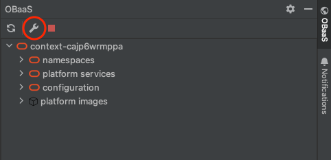

## GA 1.3.0 - September, 2024

Oracle Backend for Spring Boot and Microservices (OBaaS) is an IntelliJ plugin to browse, deploy, and modify workloads on the Oracle Backend for Spring Boot and Microservices platform.This plug-in implements the functionalities available in the [Oracle Backend for Spring Boot and Microservices CLI](../../development/cli), simplifying  access to Oracle Backend for Spring Boot and Microservices deployments from an IntelliJ IDE. 

The plug-in allows access to the Oracle Backend for Spring Boot and Microservices platform services, including the Grafana, Spring, APISIX, Eureka and Jaeger web admin consoles. Additionally, you may create and bind workloads to your  Oracle Backend for Spring Boot and Microservices database deployment. Users may inspect Oracle Backend for Spring Boot and Microservices deployment namespaces, workloads, and related configuration.

See the Oracle Free Use Terms and Conditions [License](https://oss.oracle.com/licenses/upl/)

## Prerequisites

* An operational Oracle Backend for Spring Boot and Microservices deployment, as configured through platform [setup](../../setup/).
* Access to a Kubernetes cluster where Oracle Backend for Spring Boot and Microservices is deployed from your IntelliJ IDE.

## Installation

1. Download the IntelliJ plugin ZIP file from [here](https://github.com/oracle/microservices-datadriven/releases/tag/OBAAS-1.3.0).

2. On the IntelliJ Settings plugins page, click the "gear" icon and select **Install Plugin from Disk...**. Browse your filesystem for the IntelliJ plugin ZIP file, and select it.

    

3. Click **OK**, and restart your IDE to load the Oracle Backend for Spring Boot and Microservices plugin.

4. If you do not see the Oracle Backend for Spring Boot and Microservices icon on your IDE's toolbar, navigate to View -> Tool Windows, and select "OBaaS" to add it to your IDE's tool window bar.

## Configuring the Oracle Backend for Spring Boot and Microservices Connection

1. Open the plugin tool window by clicking the "OBaaS" icon on the IntelliJ tool bar, and click the "wrench" icon to open the Oracle Backend for Spring Boot and Microservices connection settings.

    

2. Enter the Oracle Backend for Spring Boot and Microservices username, password, kubeconfig for the Kubernetes cluster, and the local port the Oracle Backend for Spring Boot and Microservices admin tunnel will bind to. The default kubeconfig and context may already be selected.

   

3. When you're done, click "Test Connection" to verify the Oracle Backend for Spring Boot and Microservices connectivity. If you've configured your kubeconfig and Oracle Backend for Spring Boot and Microservices credentials correctly, you should see a connection successful message:

    

### Managing Oracle Backend for Spring Boot and Microservices Connection States

To refresh the Oracle Backend for Spring Boot and Microservices connection, click the "Refresh" button at the top of the Oracle Backend for Spring Boot and Microservices tool window.

To cancel all active connections, click the red "Close Connections" button at the top of the Oracle Backend for Spring Boot and Microservices tool window.

## Explore Oracle Backend for Spring Boot and Microservices Resources

Once you are connected to Oracle Backend for Spring Boot and Microservices, click on the context node in the tool window tree to view Oracle Backend for Spring Boot and Microservices resources in your cluster.

- Oracle Backend for Spring Boot and Microservices namespaces are shown in the "namespaces" section, each namespace containing a list of applications.
- Links to platform service dashboards are shown in the "platform services" section.
- Configuration properties are listed in the "configuration" section.

## Working with namespaces and workloads
   
### Create a new namespace

To create a new namespace, right click on the namespace and select "Add Namespace". 

After you click OK, the namespace will be created and appear in the namespace list in a few moments.

You can delete a namespace by right clicking on that namespace, and selecting "Delete Namespace". When a namespace is deleted, all applications in the namespace will also be deleted.

### Deploying workloads into namespaces

To deploy a workload into a namespace, right click that namespace and select "Add Workload -> Upload .jar" for JVM workloads or "Add Workload -> Upload .exec" for GraalVM native workloads.

On the Add Workload form, enter workload data.
- Database username will default to the workload name if not specified, and is used for Java Message Service Transaction Event Queue authentication.

When you click OK, the JAR/exec file will be uploaded to Oracle Backend for Spring Boot and Microservices, an image is built, and the workload deployed to the cluster namespace. The task duration will vary depending on the size of the upload file and your network connection for upload.

### Workload autoscalers

To create an autoscaler for a workload, right-click the workload and select "Create Autoscaler". Autoscalers are configured on workload CPU, and specify minimum and maximum scale replicas.

You may also deletea workload's autoscaler from the workload context menu.

### Publishing workloads

A workload can be published on an APISIX route by right-clicking the workload, providing the APISIX admin key and the desired route.

## Accessing Oracle Backend for Spring Boot and Microservices Platform Services

To access the web console of an Oracle Backend for Spring Boot and Microservices platform service (Grafana, Spring Admin, APISIX, Eureka, or Jaeger), right-click on the service's name under the "platform services" section and click "Connect".

Once the connection is complete, click the "Open console" link on the completion message to navigate to the service's web console.

## Configuration Properties

Workload configuration can be browsed and edited through the "configuration" section. To add a new configuration property, right-click either the top-level configuration section or a specific configuration node.

A property is associated with a given configuration service, and may have a label, profile, key, and value.
