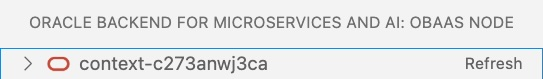
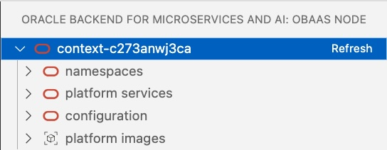
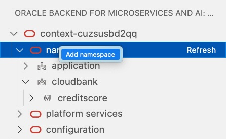
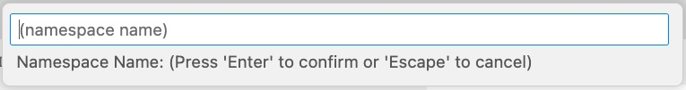

**GA 1.0 - October, 2023**

Oracle Backend for Spring Boot and Microservices Visual Studio Code (VS Code) plugin is an extension to browse and deploy applications on the Oracle Backend for Spring Boot and Microservices platform. This plugin inspects the content of an Oracle Backend for Spring Boot and Microservices deployment, in terms of applications, services, and related configurations. It simplifies access to the installed platform services (like Grafana, Spring, Apache APISIX, Eureka, and Jaeger) creating `ssh` tunnels on-demand and providing access to their respective web administrator consoles. It adds credentials to access and bind services to the Oracle Database included in the Oracle Backend for Spring Boot and Microservices deployment. This plugin replicates the functionalities available in [OBaas CLI](../../development/cli) and simplifies access to Oracle Backend for Spring Boot and Microservices deployments from an integrated development environment (IDE) like VS Code.

See the Oracle Free Use Terms and Conditions [License](https://oss.oracle.com/licenses/upl/).

## Prerequisites

You must have already installed and configured the following software which required for the Oracle Backend for Spring Boot and Microservices [Setup](../../setup/):

* Kubernetes command-line interface (`kubectl`)
* Oracle Cloud Infrastructure command-line interface
* OpenJDK Runtime Environment GraalVM 22.3 or above (optional).

## Installation

1. Download the plug-in from [here](https://github.com/oracle/microservices-datadriven/releases/tag/OBAAS-1.0.0).

2. On the VS Code left menu bar, click on the **Extensions** symbol:

    

3. From the upper right menu, select **Install from VSIX...** and upload the plugin binaries that were previously downloaded:

    

4. Restart VS Code to make the plugin fully operational.

5. If you do not see the plugin in the left menu bar, with the Oracle logo (as shown here), click on **Additional Views** to select
   the **Oracle Backend for Spring Boot and Microservices**:

    

## Using VS Code Plugin

After selecting the plugin from the left menu bar, the Oracle Backend for Spring Boot and Microservices VS Code plugin asks you to specify the full path for the
Kubernetes configuration file. For example:


By default, it shows the path in the user's `Home` directory `.kube/config` in which `kubectl` stores all of the information regarding the
configured K8s clusters. You can set the full path of another Kubernetes configuration file. If the file is correctly loaded, the plugin
shows the list of contexts available from which you can select one:


If successful, you should see a tree view with one node and the selected context. For example:



If the file path has not been correctly set, it returns an error message. For example:


To restart the plugin and proceed with setting the Kubernetes configuration file, execute a window reload in the command palette:


### How to Access the Cluster

Until you create a dedicated `ssh` tunnel to the Kubernetes cluster, and if you do not connect to Oracle Backend for Spring Boot and Microservices administrative
services, you cannot browse resources included in the Oracle Backend for Spring Boot and Microservices deployment. To do this, follow these steps:

1. Select the cluster and right-click, choosing **Set UID/PWD** menu item to insert credentials related to your user account. For example:

   

2. Specify the **OBSBM Admin ID** for the Oracle Backend for Spring Boot and Microservices user for deployment. For example:

   

3. On the top menu, the Oracle Backend for Spring Boot and Microservices administrator **OBSBM Admin password** is required. For example:

   


4. Two dialog boxes confirm that the credentials have been set correctly. For example:

   

   **NOTE:** If you do not process these steps and try to expand the Kubernetes context, you receive this informational message:

   

5. Select the cluster again and right-click on **Create Admin tunnel**. VS Code opens two new terminal that tries to open two tunnels to the Kubernetes cluster on a local port, for the KubeProxy on port 7080 and to Backend starting from `8080`. For example:

   

6. Before proceeding to the connection, wait until the tunnel are established and the terminals show a message similar to this:

   

   **NOTE:** If the K8s cluster is not related to an Oracle Backend for Spring Boot and Microservices deployment, the tunnel creation fails, because it will look for the **services/obaas-admin** in the namespace **obaas-admin**. In this case, execute
             a window reload to chose another cluster from the command palette. If you have any problem with the connection, start another tunnel.
			 The plugin tries to connect to the cluster on another local port.

7. Select the cluster again and right-click **Connect**. This creates a session with the credentials set up in the first step.

8. If your intention is to use the service provided by the Oracle Backend for Spring Boot and Microservice to compile the Spring Boot application via GraalVM and run a native service, you have to open another tunnel to the GraalVM compiler, choosing from the same menu used so far the **Create GraalVM tunnel** item. The final status should be as shown in this picture:

   


### Explore Resources

When the steps to create the tunnel are completed and you are connected to the backend, it is possible to expand and **Refresh** the tree related to the deployment. For example:

   

You see four top classes of resources that can be expanded in underlying items:

* **applications** : The list of applications deployed and the holding services.
* **ADB database** : In this release there is one Oracle Database in which the configurations and schemas related to deployed services are stored.
* **platformServices** : The list of Oracle Backend for Spring Boot and Microservices deployed services, like Grafana, Spring, Apache APISIX, Eureka and Jaeger.
* **oBaasConf** : The list of keys defined by the applications, stored in the Oracle Database, that are provisioned and available to share configurations information among services in each application.

## Applications

Let's look at the operations that you can do on Applications root item of the browse tree:

1. Open the list by clicking on the arrow to the left of **applications**:

   

2. Expand the application you are interested to see the list of included services:

   

### Applications level commands
At the root level, right-click on **applications**, you have the following list of commands available right-clicking on the line:

 

* **Add application**
* **Compilation progress**
* **Compile .jar in .exec**
* **Download compiled file in .exec**
* **Purge compilation files**

#### Add application
With this option you can create a Kubernetes namespace will hold single Spring Boot microservice. It will be prompted the name of the application:



With this operation will be injected in the namespace a set of Secrets needed to run the microservices will be deployed.

#### Compilation progress
If it has been started a compilation with the command **Compile .jar in .exec**, you will see the tail of logs collected during the jar file compilation with GraalVM, in a single windows pane. You can re-submit the command to see the progress, as shown here:


If the compilation process is over successfully, you will see something like this:


#### Compile .jar in .exec
This option allows you to upload a .jar file to the Oracle Backend for Spring Boot and Microservices to a GraalVM compiler service. This service will start a compilation of your microservice in a native file, that it will be executed without JVM support.
Since the compilation of a .jar file via the tool `native-image` does not support cross-compilation, so it must be on the same kind of platform where the application will run, this service guarantees a compilation in the same Operating System and CPU type where the service it will be executed on the Kubernetes cluster.
The Spring Boot application **pom.xml** with the plugin:
```
<plugin>
    <groupId>org.graalvm.buildtools</groupId>
    <artifactId>native-maven-plugin</artifactId>
</plugin>
```
it should be previously compiled on the developer desktop with GraalVM 22.3 or above through an **mvn** command like:

`mvn -Pnative native:compile -Dmaven.test.skip=true`

This pre-compilation on your desktop needs not only to check if there are any issues on libraries used in your Spring Boot microservice but also, as you can read [here](https://docs.spring.io/spring-boot/docs/current/reference/html/native-image.html#native-image.advanced.converting-executable-jars), your executable jar file must include AOT generated assets such as generated classes and JSON hint files.

As soon as you upload the .jar file, the process will start showing these messages:


 
#### Download compiled file in .exec
If the compilation progress report a "**Finished generating '...**" message, you can download locally the **.exec** file to be used to deploy a new microservice under an application namespace. It will be only required to choose a directory in which to save the file.

**NOTE**: if you'll ask to download a file before the compilation is over, you will have a message like this:


#### Purge compilation files
After you have compiled and downloaded the executable file, it's a good practice to purge files created on the compilation service before proceeding to other compilations. This command will delete the files related to the latest compilation.

### Application level commands
Expanding a single application, in which you are interested to see the list of included services, you will see a tree like in this picture:


To show the updated list, click on the **Refresh** button to the right of **application**.

Right-clicking on each application, you can:
  *  **Add native service -> upload .exec** 
  *  **Add service -> upload .jar** 
  *  **Bind a service**
  *  **Delete application**

  as shown here:

   

#### Add native service -> upload .exec

The VS Code command palette prompts for the required parameters to upload an executable file coming from a compilation done with the service offered by Oracle Backend for Spring Boot and Microservices. At the end of compilation process, you can download the **.exec** file and use it to create a native executable Spring Boot microservices on the backend platform.
Choosing this item menu, the parameters will be required are:

1. A popup dialog box opens to select the local Spring Boot **.exec** file, that will be the only type that you can select:

    

2. **Service Name**  

3. **Spring Binding Prefix** (Default: `spring.datasource`)

4. **Do you want to bind a schema? : [True]/[False]** (Default: `True`)

5. **Bind :[True]/[False]** (Default: `True`)

6. **Service Port** (Default: `8080`)

7. **Service Profile** (Default: `obaas`)

8. **Image Version** (Default: `0.1`)

9. **Initial Replicas** (Default: `1`)

10. **Redeploy?: [True]/[False]** (Default: `True`)

11. **Add Health probe? : [True]/[False]** (Default: `True`)

At the end of the parameters collection, a process, that includes the .exec file upload, building image and deploying, starts. It generates a sequence of messages showing the status. These messages end with "Service deployed successfully!" or "Deploy failed". The size and network constraints determine the amount of time for the process to terminate.


#### Add service -> upload .jar

The **Add -> upload .jar** command uploads a Spring Boot Microservice to an application packaged as a **.jar** file.
Choosing this item menu, selecting a single application, the parameters will be required are:

1. A popup dialog box opens to select the local Spring Boot **.jar file**

2. **Do you want to bind a schema? : [True]/[False]** (Default: `True`)

3. **Service Name**

4. **Spring Binding prefix** (Default: `spring.datasource`)

5. **Image Version** (Default: `0.1`)

6. **Java image** (Default: `ghcr.io/graalvm/jdk:ol7-java17-22.2.0`)

7. **is it a redeploy? : [True]/[False]** (Default: `True`)

8. **Add Health probe? : [True]/[False]** (Default: `True`)

9. **Service Port** (Default: `8080`)

10. **Service Profile** (Default: `obaas`)

11. **Initial Replicas** (Default: `1`)

12. **Inform the database name for Liquibase**: username for Liquibase.

At the end of the parameters collection, a process, that includes the .jar upload, building image and deploying, starts. It generates a sequence of messages showing the status. These messages end with "Service deployed successfully!" or "Deploy failed". The size and network constraints determine the amount of time for the process to terminate.

#### Bind a Service
This command create/update a user on the Oracle DB according the service name typed, or optionally to a different user schema, to which bind a Spring Boot microservice that will store data into the DB. It also store secrets with the user credentials into the application namespace, in order to inject them into the related pods. If the schema exists, it impose to change the user password will be stored in the namespace.
The parameters required are:

1. **Service Name:**
2. **DB User (optional):**
3. **DB User Password:**
4. **Spring Binding Prefix (optional):** (Default: `spring.datasource`)
5. **Update? [True]/[False]** (Default: `True`)

#### Delete Application
This command removes the application and all the services included. At the end of process, you see one of two messages: "Delete successful" or "Delete application failed!". Refresh the tree at **applications** level to show the current application list. The termination of Pods and applications isn't a synchronous operation. You may have to refresh more than one time for a clean view.

### Service level commands
With a right click on a single service you will have the following commands:

* **Delete service**
* **Publish service**

as shown here:

   

#### Delete service
Selecting the service from the tree, under a specific application, you will remove the service deployment, and the active pods will be removed.

#### Publish service
This command creates a route in the APISix Gateway available in the Oracle Backend for Spring Boot and Microservices, in order to expose on Internet the selected service. To be performed, this command requires the APISix AdminKey, and a port-forward to the APISix engine.
You can get the AdminKey from the APISix configmap, using a kubectl command:

   `kubectl -n apisix get configmap apisix -o yaml`

looking for the `-name: "admin"` key.

The parameters you have to provide are:

1. **APISix AdminKey:**
2. **Url base path:** (Default: `/api/v1/`). This path will be automatically appended by the service name to create the route accessible from an url like: `http(s)://[LB_IP]/api/v1/[servicename]*`

A successful operation will return the Route ID recorded into the APISix, as shown in this example:


This is a shortcut with a standard registration: to customize the route, or start from scratch, is suggested the usage of APISix console.


## ADB Database
For each Oracle Backend for Spring Boot and Microservices, an Oracle Autonomous Transaction Processing database is provisioned on OCI to hold the schema for the Spring Boot services and backend's configuration details. The icon remembers the component deployed with the backend platform.

## platformServices

The **platformServices** option can be expanded to show the services available in the Oracle Backend for Spring Boot and Microservices platform. For each service,
right-click on the symbol to open an `ssh` tunnel to the service, on a specific local port that is automatically chosen. A link opens in the
default web browser for the administrator console of each platform service.

   

For example, by right-clicking on **grafana monitor**, a tunnel will be opened with a message holding a button to open a web browser on the administrator's Grafana console. For example:

   

The **apisix console** shows one more command compared with the others, that allows you to open a tunnel to the engine, that is listening on a different port than the console. This enable the **Publish service** command available on each service.

   

**NOTE:** If the port is already used or the connection times out, right clicking again it will automatically open on another port.

## oBaasConf Configuration

With Oracle Backend for Spring Boot and Microservices, developers can store the metadatas and configurations to share among Pods in an
application. The VS Code plugin can browse the content of this Key/Values store and add, update and delete keys as needed.
Expand **oBaasConf configuration** to see the applications that are deployed and, expanding each of them, the Key/Value pair. 
For example:

   

Hover the mouse over each Key/Value pair to see the other metadata related to the key: **profile** and **label**, as shown here:

   

You can process the following operations:

* **Add key** : By right-clicking **oBaasConf configuration** or one of the **service-conf** options in the VS Code command palette, you will set the following key parameters:
   
   1. **service name** (mandatory)
   2. **label**
   3. **profile**
   4. **propKey**
   5. **value**

   Click on **Refresh** button to see the new key added.

   **NOTE:** You can add configuration properties for a service that is not yet deployed. In some cases, it is mandatory to prepare properties before deploying services in order to correctly start them.

* **Edit key** : Right-click on a selected key in the VS Code command palette to update the current content of **Value**.

* **Delete key** : Right-click on a selected key to delete it.
