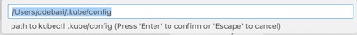
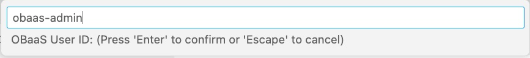

**Developer Preview 0.3.7 - April, 2023**

Oracle Backend for Spring Boot VS Code plugin is an extension to browse and deploy applications on the Oracle Backend for Spring Boot platform. This plugin allows to inspect the content of an Oracle Backend for Spring Boot deployment, in terms of applications, services and related configurations. It simplifies the access to the Platform Services installed, like Grafana, Spring, Apisix, Eureka and Jaeger creating ssh tunnels on-demand, and providing access to their respective web admin consoles. It allows to add credentials to access and bind services to the Oracle Autonomous DB included into Oracle Backend for Spring Boot deployment. This plug-in replicates the functionalities available in [OBaas CLI](../../development/cli) and simplify the access to Oracle Backend for Spring Boot deployments from a development IDE like VS Code.

Oracle Free Use Terms and Conditions [License](https://oracle.gallerycdn.vsassets.io/extensions/oracle/oracledevtools/21.5.0/1662759024144/Microsoft.VisualStudio.Services.Content.License)

## Prerequisites

Already installed and configured:

* The Kubernetes command-line tool (**kubectl**)
* Oracle Cloud Infrastructure Command Line Interface (CLI)

as required for the Oracle Backend for Spring Boot [setup](../../setup/).

## Installation

* Download the plug-in from [here](https://github.com/oracle/microservices-datadriven/releases/tag/OBAAS-1.0.0)

* On the VS Code right menu bar, click on **Extensions** item:

    

* From the up-right corner menu, choose **Install from VSIX...**:

    

and upload plug-in binaries previously downloaded.

* Re-start VS Code to make fully operative the plugin.

* If you don't see the plugin in the left bar, with the Oracle logo, as shown here:

    

click on **Additional Views** menu to select the **eBaaS Explorer**.

## Using VS Code plugin

Selecting the plugin from the left plugin menu bar, the Oracle Backend for Spring Boot VS Code plugin will ask to specify the Kubernetes config file full path as shown here:

By default it's shown the path in the user's Home directory **.kube/config** in which normally **kubectl** stores all the information regarding the K8S clusters configured. You could set the full path of another Kubernetes config file.
If the file is correctly loaded, the plugin will show the list of contexts available in which select one:

In positive case, you should see a tree view with one node and the context chosen:

If the file path it hasn't been correctly set, it will shown an error message:

To restart the plugin and proceed again in Kubernetes config file setting, in command palette execute a window reload:

### How to access to cluster

Until you create a dedicated ssh tunnel to the Kubernetes cluster, and you don't connect to Oracle Backend for Spring Boot admin services, you will not be able to browse resources included into the Oracle Backend for Spring Boot deployment. To do this, follow these steps:

* Select the cluster and click on the wheel symbol to set the credentials:

   

   On top menu, it will be required the Oracle Backend for Spring Boot admin **password**:

   

   and **admin** Oracle Backend for Spring Boot's user for the deployment:

   

   Two message boxes will confirm credentials have been set correctly:

   

   **NOTE**: if you don't execute this steps and try to expand the kubernetes context, you will receive a message:

   

* Select again the cluster and click the right mouse button and choose **Create tunnel** menu item. VS Code will open a new terminal that will try to open a tunnel to the Kubernetes cluster on a local port, starting from 8081:

   

   Before proceed to connection, please wait until the tunnel is established and the terminal shows a message like this:

   

   NOTE: if the K8s cluster it's not related to an Oracle Backend for Spring Boot deployment, the tunnel creation will fail. In this case in command palette execute a window reload to chose another cluster. If you have any problem in connection, you could start another tunnel: the plugin will try on another local port to connect to the cluster.

* Again select the cluster and by clicking the right mouse button choose **Connect** menu item. This will create a session with credentials set at the first step.

### Explore resources

As soon as completed the steps to create tunnel and you get connected to the backend, it's possible to expand or refresh the tree related to the deployment.

   

You'll see four top classes of resources that can be exploded in underlying items:

* **applications**: the list of applications deployed and the services holding
* **ADB**: in this release we have one ADB in which are stored configuration and schema related to services deployed
* **platformServices**: the list of Oracle Backend for Spring Boot deployed services, like Grafana, Spring, Apisix, Eureka and Jaeger.
* **oBaasConf**: the list of keys defined by application, stored in the ADB provisioned and available to share configuration information among services in each application.

Let's go to show the operations you can do on each item of browse tree.

## Applications

Open the list clicking on the arrow at the left of **applications**:

   

and then expand the application about you want to know which services includes:

   

At root level, by clicking the right mouse button on **applications** leaf, chose **Add application** to create a new application. On VS Code Command Palette will appear the prompt to set the application name it will be created:

   

To show the list updated, click on the **Refresh** icon on right side of **applications** item.

   

On each application, you can **Add service -> upload .jar** or **Delete Application**.

### Add Service

The Add Service command imply the upload of a Spring Boot microservice in an Application context.
Clicking **Add service -> upload .jar** menu item on a specific application:

   

in the VS Code Command Palette prompt will be required the parameters needed, in this order:

* A popup will be opened to select the local Spring Boot **.jar file**
* if you need to bind the service to an user/schema in DB:

   

* **Service Name**
* **DB User Password** you have to set only if you have chosen to bind a schema on DB the service you are deploying:

   

* **Spring Binding prefix** (Default: spring.datasource)
* **Image Version** (Default: 0.1)
* **Java image** (Default: ghcr.io/graalvm/jdk:ol7-java17-22.2.0)
* **Redeploy** (Default: false)
* **Add Health probe** (Default: false)
* **Service Port** (Default: 8080)
* **Service Profile** (Default: obaas)

At the end of parameters collection, it will be started the binding and upload process that will generate a sequence of messages showing the status. These messages will end with "Service deployed successfully!" or "Deploy failed". According to the size and network constraints, the process will take more or less time to terminate.

### Delete Service

You can delete an existing service or one you have deployed from VS Code extension. In either cases, you have to select the service and click the right mouse button to select the only command available, i.e. **Delete service**. Also in this case, you should refresh the tree at application level to have an updated view and, sometimes, more than one time.

### Delete Application

This command will remove the application and all the services included. At the end of process it will be shown a message "Delete successful" or "Delete application failed!". After that you can refresh the tree, at single **application** level and then at **applications** level. Take in consideration that the termination of pods and application isn't synchronous operation: so it could happen you have to refresh more than one times to have a clean view.

## ADB database

For each Oracle Backend for Spring Boot is provisioned an Oracle Autonomous Transaction Processing Database to hold the schema related to the Spring Boot services and configuration details. To store the Admin DB Password you can click the wheel shown next to the ADB database item. In the VS Code Command Palette will be prompted the password:

   

## platformServices

This leaf of tree can be expanded to show the services available in the Oracle Backend for Spring Boot platform. For each of them, by clicking the right mouse button on the leaf you can open an ssh tunnel to the service on a specific local port automatically chosen. At the end, it will prompted a link to open in the default web browser the admin console of each platform services.
For example, by clicking the right mouse button on **grafana console**:

   

it will be opened a tunnel and a message with a button opening a web browser on the admin Grafana's console will be shown:

   

NOTE: if something goes wrong, like port already used or a timeout opening the connection, you can open another ssh tunnel: it will be automatically opened on another port.

## oBaasConf

Oracle Backend for Spring Boot offers to developers a store for the metadata and configurations useful to share info among pods in an application. The VS Code plug-in can browse the content of this key-value store, add, update and delete keys according the needs.
Expanding the leaf **oBaasConf** you will see the applications deployed and, expanding each of them, the key-value pair, as shown in the following pictures:

   

Moving mouse on each key-value pair, you can see the other metadata related to the key, **profile** and **label**.
In the following picture, the key **spring.datasource.url** with value **'jdbc:oracle:thin:@$....'** has the property **application** coming from the root, i.e. **cloudbank**,  **profile**=**1.0** and **label**=**kube**.

   

The operation that can be done are:

* **Add key**: by clicking the right mouse button on an **oBaasConf** or **service-conf** item, in the VS Code Command Palette will be requested:
  * Service name
  * Label
  * Profile
  * PropKey
  * Value

    NOTE: you can add a config properties also for a Service not yet deployed. In some case it is mandatory to prepare properties before deploy services in order to correctly startup them.

* **Edit key**: by clicking the right mouse button on a selected key, in the VS Code Command Palette will be requested to update the current content **Value**

* **Delete key**: by clicking the right mouse button on a selected key, it will possible delete it.
