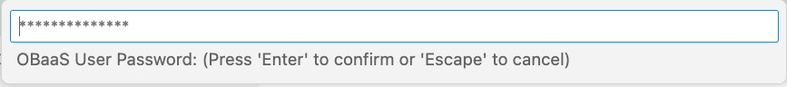

**Developer Preview 0.3.9 - July, 2023**

Oracle Backend for Spring Boot Visual Studio Code (VS Code) plugin is an extension to browse and deploy applications on the Oracle Backend for Spring Boot platform. This plugin inspects the content of an Oracle Backend for Spring Boot deployment, in terms of applications, services, and related configurations. It simplifies access to the platform services installed (like Grafana, Spring, Apache APISIX, Eureka, and Jaeger) creating ssh tunnels on-demand and providing access to their respective web administrator consoles. It adds credentials to access and bind services to the Oracle Autonomous Database included in the Oracle Backend for Spring Boot deployment. This plug-in replicates the functionalities available in [OBaas CLI](../../development/cli) and simplifies the access to Oracle Backend for Spring Boot deployments from an integrated development environment (IDE) like VS Code.

Oracle Free Use Terms and Conditions [License](https://oracle.gallerycdn.vsassets.io/extensions/oracle/oracledevtools/21.5.0/1662759024144/Microsoft.VisualStudio.Services.Content.License)

## Prerequisites

You must have already installed and configured the following as required for the Oracle Backend for Spring Boot [setup](../../setup/):

* Kubernetes command-line tool (**kubectl**)
* Oracle Cloud Infrastructure command-line interface (CLI)

## Installation

* Download the plug-in from [here](https://github.com/oracle/microservices-datadriven/releases/tag/OBAAS-1.0.0).

* On the VS Code left menu bar, click on **Extensions**:

    

* From the upper right menu, choose **Install from VSIX...** and upload plug-in binaries previously downloaded:

    

* Restart VS Code to make the plugin fully operational.

* If you do not see the plugin in the left bar, with the Oracle logo (as shown here), click on **Additional Views** menu to select the **eBaaS Explorer**:

    

## Using VS Code plugin

Selecting the plugin from the left plugin menu bar, the Oracle Backend for Spring Boot VS Code plugin asks you to specify the Kubernetes configuration file full path. For example:

By default, it shows the path in the user's Home directory **.kube/config** in which **kubectl** stores all of the information regarding the configured K8s clusters. You could set the full path of another Kubernetes configuration file.
If the file is correctly loaded, the plugin shows the list of contexts available from which you can select one:

If successful, you should see a tree view with one node and the context chosen. For example:

If the file path has not been correctly set, it shows an error message. For example:

To restart the plugin and proceed again in Kubernetes configuration file setting, in the command palette, execute a window reload:

### How to access the cluster

Until you create a dedicated ssh tunnel to the Kubernetes cluster, and if you do not connect to Oracle Backend for Spring Boot adminstrative services, you cannot browse resources included in the Oracle Backend for Spring Boot deployment. To do this, follow these steps:

* Select the cluster and click on the system setup icon to set the credentials. For example:

   

   On the top menu, the Oracle Backend for Spring Boot administrator **password** is required. For example:

   

   Specify **admin** for the Oracle Backend for Spring Boot user for deployment. For example:

   

   Two message boxes confirm that the credentials have been set correctly. For example:

   

   **NOTE**: If you do not execute these steps and try to expand the Kubernetes context, you receive this message:

   

* Select the cluster again, click the right mouse button, and choose the **Create tunnel** menu item. VS Code opens a new terminal that tries to open a tunnel to the Kubernetes cluster on a local port, starting from 8081. For example:

   

   Before proceeding to the connection, wait until the tunnel is established and the terminal shows a message like this:

   

   **NOTE**: If the K8s cluster is not related to an Oracle Backend for Spring Boot deployment, the tunnel creation fails. In this case, in command palette, execute a window reload to chose another cluster. If you have any problem with the connection, start another tunnel. The plugin tries to connect to the cluster on another local port.

* Select the cluster again and, by clicking the right mouse button, choose the **Connect** menu. This creates a session with credentials set at the first step.

### Explore resources

When the steps to create the tunnel are completed and you are connected to the backend, it is possible to expand or refresh the tree related to the deployment. For example:

   

You will see four top classes of resources that can be expanded in underlying items:

* **applications**: The list of applications deployed and the holding services.
* **ADB database**: In this release, there is one Autonomous Database in which the configuration and schema related to deployed services are stored.
* **platformServices**: The list of Oracle Backend for Spring Boot deployed services, like Grafana, Spring, Apache APISIX, Eureka, and Jaeger.
* **oBaasConf**: The list of keys defined by the application, stored in the Autonomous Database, that are provisioned and available to share configuration information among services in each application.

Let's look at the operations that you can do on each item of browse tree.

## Applications

Open the list clicking on the arrow to the left of **applications**:

   

Expand the application for which you want to know the included services:

   

At root level, right click on the **applications** leaf, and chose **Add application** to create a new application. A VS Code command palette appears, prompting for the application name that is to be created. For example:

   

To show the updated list, click on the **Refresh** symbol to the right of **applications**. For example:

   

On each application, you can **Add service -> upload .jar** or **Delete Application**.

### Add Service

The **Add service** command uploads a Spring Boot microservice to an Application.
Click the **Add service -> upload .jar** menu for a specific application. For example:

   

The VS Code command palette will prompt for the required the parameters, in this order:

* A popup opens to select the local Spring Boot **.jar file**
* You need to bind the service to a user or schema in the database. For example:

   

* **Service Name**
* **DB User Password**: You have to set this only if you have chosen to bind a schema on the database for the service you are deploying. For example:

   

* **Spring Binding prefix** (Default: spring.datasource)
* **Image Version** (Default: 0.1)
* **Java image** (Default: ghcr.io/graalvm/jdk:ol7-java17-22.2.0)
* **Redeploy** (Default: false)
* **Add Health probe** (Default: false)
* **Service Port** (Default: 8080)
* **Service Profile** (Default: obaas)

At the end of the parameters collection, the binding and upload process, that will generate a sequence of messages showing the status, will start. These messages will end with "Service deployed successfully!" or "Deploy failed". The size and network constraints determine the amount of time for the process to terminate.

### Delete Service

You can either delete an existing service or one that you have deployed from VS Code extension. In either case, you have to select the service and right click to select the only command available, that is, **Delete service**. Refresh the tree at the application level to update the view. You may need to refresh more than once.

### Delete Application

This command removes the application and all of the services included. At the end of process, you will see one of two messages: "Delete successful" or "Delete application failed!". Refresh the tree at the single **application** level and then at the **applications** level. The termination of pods and application is not a synchronous operation. You may have to refresh more than one time to have a clean view.

## Autonmous Database (ADB) database

For each Oracle Backend for Spring Boot, an Oracle Autonomous Transaction Processing database is provisioned to hold the schema for the Spring Boot services and configuration details. To store the administrator database password, click the system setup symbol shown next to **ADB database**. The VS Code command palette prompts for the password. For example:

   

## platformServices

The **platformServices** can be expanded to show the services available in the Oracle Backend for Spring Boot platform. For each service, right click on the leaf to open an ssh tunnel to the service on a specific local port automatically chosen. A link will open in the default web browser for the administrator console of each platform service.

   

For example, by right clicking on **grafana console**, a tunnel will open with a message and a button to open a web browser on the administrator's Grafana console. For example:

   

**NOTE**: If the port is already used or the connection times out, open another ssh tunnel. It will automatically open on another port.

## oBaasConf configuration

With Oracle Backend for Spring Boot, developers can store the metadata and configurations that are useful to share information among pods in an application. The VS Code plug-in can browse the content of this Key/Value store and add, update and delete keys as needed.
Expand **oBaasConf configuration** to see the applications that are deployed and, expanding each of them, the Key/Value pair. For example:

   

Hover the mouse over each Key/Value pair to see the other metadata related to the **key**, **profile** and **label**.
The key **spring.datasource.url:** with the value **'jdbc:oracle:thin:@$(db.service)...'** has the property **application** coming from the root (that is, **cloudbank**,  **profile**=**1.0** and **label**=**kube**).

   

You can execute the following operations:

* **Add key**: By right clicking **oBaasConf configuration** or one of the **service-conf** items in the VS Code command palette, you can request the following:
  * Service name
  * Label
  * Profile
  * PropKey
  * Value

    **NOTE**: You can add configuration properties for a service not yet deployed. In some case, it is mandatory to prepare properties before deploying services in order to correctly start them.

* **Edit key**: Right click on a selected key in the VS Code command palette to update the current content of **Value**.

* **Delete key**: Right click on a selected key to delete it.
