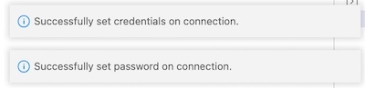

**Developer Preview 0.3.9 - July, 2023**

Oracle Backend for Spring Boot and Microservices Visual Studio Code (VS Code) plugin is an extension to browse and deploy applications on the Oracle Backend
for Spring Boot platform. This plugin inspects the content of an Oracle Backend for Spring Boot and Microservices deployment, in terms of applications, services,
and related configurations. It simplifies access to the installed platform services (like Grafana, Spring, Apache APISIX, Eureka, and Jaeger)
creating `ssh` tunnels on-demand and providing access to their respective web administrator consoles. It adds credentials to access and bind
services to the Oracle Autonomous Database included in the Oracle Backend for Spring Boot and Microservices deployment. This plugin replicates the functionalities
available in [OBaas CLI](../../development/cli) and simplifies access to Oracle Backend for Spring Boot and Microservices deployments from an integrated
development environment (IDE) like VS Code.

See the Oracle Free Use Terms and Conditions [License](https://oracle.gallerycdn.vsassets.io/extensions/oracle/oracledevtools/21.5.0/1662759024144/Microsoft.VisualStudio.Services.Content.License).

## Prerequisites

You must have already installed and configured the following which required for the Oracle Backend for Spring Boot and Microservices [Setup](../../setup/):

* Kubernetes command-line interface (`kubectl`)
* Oracle Cloud Infrastructure command-line interface

## Installation

1. Download the plug-in from [here](https://github.com/oracle/microservices-datadriven/releases/tag/OBAAS-1.0.0).

2. On the VS Code left menu bar, click on the **Extensions** symbol:

    

3. From the upper right menu, select **Install from VSIX...** and upload the plugin binaries that were previously downloaded:

    

4. Restart VS Code to make the plugin fully operational.

5. If you do not see the plugin in the left menu bar, with the Oracle logo (as shown here), click on **Additional Views** to select
   the **eBaaS Explorer**:

    

## Using VS Code Plugin

After selecting the plugin from the left menu bar, the Oracle Backend for Spring Boot and Microservices VS Code plugin asks you to specify the full path for the
Kubernetes configuration file. For example:

By default, it shows the path in the user's `Home` directory `.kube/config` in which `kubectl` stores all of the information regarding the
configured K8s clusters. You can set the full path of another Kubernetes configuration file. If the file is correctly loaded, the plugin
shows the list of contexts available from which you can select one:

If successful, you should see a tree view with one node and the selected context. For example:

If the file path has not been correctly set, it returns an error message. For example:

To restart the plugin and proceed with setting the Kubernetes configuration file, process a window reload in the command palette:

### How to Access the Cluster

Until you create a dedicated `ssh` tunnel to the Kubernetes cluster, and if you do not connect to Oracle Backend for Spring Boot and Microservices adminstrative
services, you cannot browse resources included in the Oracle Backend for Spring Boot and Microservices deployment. To do this, follow these steps:

1. Select the cluster and click on the system setup symbol to set the credentials. For example:

   

2. On the top menu, the Oracle Backend for Spring Boot and Microservices administrator **password** is required. For example:

   

3. Specify **admin** for the Oracle Backend for Spring Boot and Microservices user for deployment. For example:

   

4. Two dialog boxes confirm that the credentials have been set correctly. For example:

   

   **NOTE:** If you do not process these steps and try to expand the Kubernetes context, you receive this informational message:

   

5. Select the cluster again and right-click on **Create tunnel**. VS Code opens a new terminal that tries to open a tunnel to the Kubernetes
   cluster on a local port, starting from `8081`. For example:

   

6. Before proceeding to the connection, wait until the tunnel is established and the terminal shows a message similar to this:

   

   **NOTE:** If the K8s cluster is not related to an Oracle Backend for Spring Boot and Microservices deployment, the tunnel creation fails. In this case, process
             a window reload to chose another cluster from the command palette. If you have any problem with the connection, start another tunnel.
			 The plugin tries to connect to the cluster on another local port.

7. Select the cluster again and right-click **Connect**. This creates a session with the credentials set up in the first step.

### Explore Resources

When the steps to create the tunnel are complete and you are connected to the backend, it is possible to expand or refresh the tree related to the
deployment. For example:

   

You see four top classes of resources that can be expanded in underlying items:

* **applications** : The list of applications deployed and the holding services.
* **ADB database** : In this release, there is one Autonomous Database (ADB) in which the configuration and schema related to deployed services are stored.
* **platformServices** : The list of Oracle Backend for Spring Boot and Microservices deployed services, like Grafana, Spring, Apache APISIX, Eureka, and Jaeger.
* **oBaasConf** : The list of keys defined by the application, stored in the Autonomous Database, that are provisioned and available to share configuration information among services in each application.

## Applications

Let's look at the operations that you can do on each item of the browse tree:

1. Open the list by clicking on the arrow to the left of **application**:

   

2. Expand the application to see the list of included services:

   

3. At the root level, right-click on **application**, and select **Add application** to create a new application. A VS Code command palette
   appears, prompting for the application name that is to be created. For example:

   

4. To show the updated list, click on the **Refresh** symbol to the right of **application**. For example:

   

5. On each application, you can **Add service -> upload .jar** or **Delete Application**.

### Add Service

The **Add service** command uploads a Spring Boot Microservice to an application. Click **Add service -> upload .jar** for a specific
application. For example:

   

The VS Code command palette prompts for the required the parameters, in this order:

1.  A popup dialog box opens to select the local Spring Boot **.jar file**

2.  You need to bind the service to a user or schema in the database. For example:

    

3.  **Service Name**

4.  **DB User Password** : Set this only if you have chosen to bind a schema on the database for the service that you are deploying. For example:

    

5.  **Spring Binding prefix** (Default: `spring.datasource`)

6.  **Image Version** (Default: `0.1`)

7.  **Java image** (Default: `ghcr.io/graalvm/jdk:ol7-java17-22.2.0`)

8.  **Redeploy** (Default: `false`)

9.  **Add Health probe** (Default: `false`)

10. **Service Port** (Default: `8080`)

11. **Service Profile** (Default: `obaas`)

At the end of the parameters collection, the binding and upload process that generates a sequence of messages showing the status starts. These
messages end with "Service deployed successfully!" or "Deploy failed". The size and network constraints determine the amount of time for the
process to terminate.

### Delete Service

You can either delete an existing service or delete one that you have deployed from the VS Code extension. In either case, you have to select
the service and right-click to select the only command available **Delete service**. Refresh the tree at the application level to update the
view. You may need to refresh more than once.

### Delete Application

This command removes the application and all of the services included. At the end of process, you see one of two messages: "Delete successful" or
"Delete application failed!". Refresh the tree at the single **application** level and then at the **applications** level. The termination of Pods and
applications is not a synchronous operation. You may have to refresh more than one time for a clean view.

## Autonmous Database (ADB)

For each Oracle Backend for Spring Boot and Microservices, an Oracle Autonomous Transaction Processing database is provisioned to hold the schema for the Spring Boot
services and configuration details. To store the administrator database password, click the system setup symbol shown next to **ADB database**. The
VS Code command palette prompts for the password. For example:

   

## platformServices

The **platformServices** option can be expanded to show the services available in the Oracle Backend for Spring Boot and Microservices platform. For each service,
right-click on the symbol to open an `ssh` tunnel to the service on a specific local port that is automatically chosen. A link opens in the
default web browser for the administrator console of each platform service.

   

For example, by right-clicking on **grafana monitor**, a tunnel opens with a message and a button to open a web browser on the administrator's Grafana
console. For example:

   

**NOTE:** If the port is already used or the connection times out, open another `ssh` tunnel. It automatically opens on another port.

## oBaasConf Configuration

With Oracle Backend for Spring Boot and Microservices, developers can store the metadata and configurations between Pods in an
application. The VS Code plugin can browse the content of this Key/Value store and add, update and delete keys as needed.
Expand **oBaasConf configuration** to see the applications that are deployed and, expanding each of them, the Key/Value pair. For example:

   

Hover the mouse over each Key/Value pair to see the other metadata related to the **key**, **profile** and **label**.
The key **spring.datasource.url:** with the value **'jdbc:oracle:thin:@$(db.service)...'** has the property **application** coming from the root
(that is, **cloudbank**,  **profile**=**1.0** and **label**=**kube**).

   

You can process the following operations:

* **Add key** : By right-clicking **oBaasConf configuration** or one of the **service-conf** options in the VS Code command palette, you can request the following:
  * Service name
  * Label
  * Profile
  * PropKey
  * Value

    **NOTE:** You can add configuration properties for a service that is not yet deployed. In some cases, it is mandatory to prepare properties before deploying services in order to correctly start them.

* **Edit key** : Right-click on a selected key in the VS Code command palette to update the current content of **Value**.

* **Delete key** : Right-click on a selected key to delete it.
