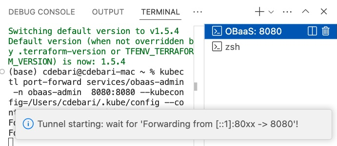
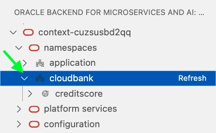
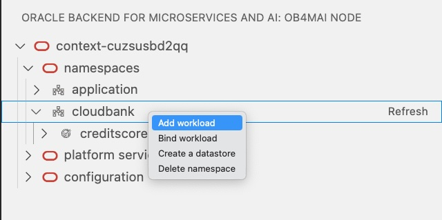
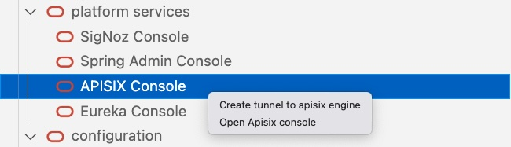

## GA 1.4.0 - June, 2024
"Oracle Backend for Microservices and AI" is a VS Code extension to browse and deploy applications on the Oracle Backend for Microservices and AI platform. This plugin allows to inspect the content of an Oracle Backend for Microservices and AI deployment, in terms of applications, services and related configurations. It simplifies the access to the Platform Services installed, like Grafana, Spring, Apisix, Eureka and Jaeger creating ssh tunnels on-demand, and providing access to their respective web admin consoles. It allows to add credentials to access and bind services to the Oracle Autonomous DB included into Oracle Backend for Microservices and AI deployment. This plug-in replicates the functionalities available in [OBaas CLI](../../development/cli) and simplify the access to Oracle Backend for Microservices and AI deployments from a development IDE like VS Code.

In this release has been removed the support for GraalVM compilation since a native app could be compiled externally and uploaded as possible in the past releases, and it has been added the datastore management and visualization.

See the Oracle Free Use Terms and Conditions [License](https://oss.oracle.com/licenses/upl/)

## Prerequisites

You must have already installed and configured the following software which required for the Oracle Backend for Microservices and AI [Setup](../../setup/):

* Kubernetes command-line interface (`kubectl`)
* Oracle Cloud Infrastructure command-line interface
* OpenJDK Runtime Environment GraalVM 22.3 or above (optional).

## Installation

1. Download the plug-in from [here](https://github.com/oracle/microservices-datadriven/releases/tag/OBAAS-1.4.0).

2. On the VS Code left menu bar, click on the **Extensions** symbol:

    

3. From the upper right menu, select **Install from VSIX...** and upload the plugin binaries that were previously downloaded:

    

4. Restart VS Code to make the plugin fully operational.

5. If you do not see the plugin in the left menu bar, with the Oracle logo (as shown here), click on **Additional Views** to select
   the **Oracle Backend for Microservices and AI**:

    

## Using VS Code Plugin

After selecting the plugin from the left menu bar, the Oracle Backend for Microservices and AI VS Code plugin asks you to specify the full path for the
Kubernetes configuration file. For example:


By default, it shows the path in the user's `Home` directory `.kube/config` in which `kubectl` stores all of the information regarding the
configured K8s clusters. You can set the full path of another Kubernetes configuration file. If the file is correctly loaded, the plugin
shows the list of contexts available from which you can select one:


If successful, you should see a tree view with one node and the selected context. For example:


To restart the plugin and proceed with setting the Kubernetes configuration file, execute a window reload in the command palette:


### How to Access the Cluster

Until you create a dedicated `ssh` tunnel to the Kubernetes cluster, and if you do not connect to Oracle Backend for Microservices and AI administrative
services, you cannot browse resources included in the Oracle Backend for Microservices and AI deployment. To do this, follow these steps:

1. Select the cluster and right-click, choosing **Set UID/PWD** menu item to insert credentials related to your user account. For example:

   

2. Specify the **OBaaS User ID** for the Oracle Backend for Microservices and AI user for deployment. For example:

   

3. On the top menu, the Oracle Backend for Microservices and AI administrator **OBaaS User Password** is required. For example:

   


4. Select the cluster again and right-click on **Create Admin tunnel**. VS Code opens one new terminal that tries to open two tunnels to the Kubernetes cluster on a local port for Backend starting from `8080`. For example:

   

5. Before proceeding to the connection, wait until the tunnel are established and the terminals show a message similar to this:

   

   **NOTE:** If the K8s cluster is not related to an Oracle Backend for Microservices and AI deployment, the tunnel creation fails, because it will look for the **services/obaas-admin** in the namespace **obaas-admin**. In this case, execute a window reload to chose another cluster from the command palette. If you have any problem with the connection, start another tunnel. The plugin tries to connect to the cluster on another local port.

6. Select the cluster again and right-click **Connect**. This creates a session with the credentials set up in the first step.

### Explore Resources

When the steps to create the tunnel are completed and you are connected to the backend, it is possible to expand and **Refresh** the tree related to the deployment. For example:

   

You see four top classes of resources that can be expanded in underlying items:

* **namespaces** : The list of namespaces deployed and holding services.
* **platform services** : The list of Oracle Backend for Microservices and AI deployed services, like SigNoz, Spring, Apache APISIX and Eureka.
* **configuration** : The list of keys defined by the applications, stored in the Oracle Database, that are provisioned and available to share configurations information among services in each application.
* **platform images**: the list of container images deployed and available.

## Namespaces

Let's look at the operations that you can do on Namespaces root item of the browse tree:

1. Open the list by clicking on the arrow to the left of **namespaces**:

   

2. Expand the namespace you are interested to see the list of included services:

   

### Namespaces level commands

At the root level, right-click on **namespaces**, you have the following list of commands available right-clicking on the line:

 


#### Add namespace

With this option you can create a Kubernetes namespace will hold single Spring Boot or a native microservice. It will be prompted the name of the namespace:


With this operation will be injected in the namespace a set of Secrets needed to run the microservices will be deployed.


### Application level commands

Expanding a single application, in which you are interested to see the list of included services, you will see a tree like in this picture:


To show the updated list, click on the **Refresh** button to the right of **application**.

Right-clicking on each application, you can:

* **Add workload**
* **Bind workload**
* **Create a datastore**
* **Delete namespace**

as shown here:



#### Add workload

The **Add workload** command uploads a Spring Boot or a native microservice and deploy as a pod.
Choosing this item menu, selecting a single application, the parameters will be required are:

1. A popup dialog box opens to select the local Spring Boot **.jar file** or native file. It's possible to select **.jar**,**.sh** and no-extension files.

1. **Workload Name** (Default: ``) 

1. **CPU request** (Default: `100m`) 

1. **Image Version** (Default: `0.0.1`)

1. **Java image** (Default: `ghcr.io/oracle/openjdk-image-obaas:21`)

1. **Add Health probe? : [True]/[False]** (Default: `True`)

1. **Service Port** (Default: `8080`)

1. **Service Profile** (Default: `obaas`)

1. **Initial Replicas** (Default: `1`)

1. **Inform the database name for Liquibase**: (Default: ``) username for Liquibase.

At the end of the parameters collection, a process, that includes the .jar/native app upload, building image and deploying, starts. It generates a sequence of messages showing the status. These messages end with "Service deployed successfully!" or "Deploy failed". The size and network constraints determine the amount of time for the process to terminate.

If successful, going with mouse cursor on each workload, you will get details about the workload, like shown in this snapshot:


Hoovering over the workload you can access to its details:


#### Bind workload

This command create/update a binding between an existing datastore with a workload that will store data into the DB.
The parameters required are:

1. **Workload:**
2. **Datastore:**: choose from the listbox an existing Datastore
3. **Spring Binding Prefix (optional):** (Default: `spring.datasource`)
4. **Update? [True]/[False]** (Default: `True`)


#### Create datastore

This command create an user and related schema to be used by the **Bind workload** command and associated to one or more workload. It also store secrets with the user credentials into the application namespace, in order to inject them into the related pods. To create will be asked for:

1. **Datastore Name:** (Default: ``)
2. **Username:** (Default: ``)
3. **Password:** (Default: ``)

and at the end, and after refreshing the tree, you'll see a new entry like `accountdb` in the following snapshot:


#### Delete namespace

This command removes the namespace and all the workloads included. At the end of process, you see one of two messages: "Delete successful" or "Delete namespace failed!". Refresh the tree at **namespaces** level to show the current namespace list. The termination of workload and namespace isn't a synchronous operation. You may have to refresh more than one time for a clean view.

### Workload level commands

With a right click on a single service you will have the following commands:

* **Create/update autoscaler**
* **Delete autoscaler**
* **Delete workload**
* **Publish workload**

as shown here:

   

#### Create/update autoscaler

Create a Kubernetes autoscaler for the selected pod.

* **minReplicas** (Default: `1`)
* **maxReplicas** (Default: `1`)
* **cpuPercent** (Default: ``)

The effect will be that, providing the related kubctl command, you will see an answer like this:
```
(base) cdebari@cdebari-mac ~ % kubectl get hpa --all-namespaces
NAMESPACE   NAME          REFERENCE                TARGETS       MINPODS   MAXPODS   REPLICAS   AGE
cloudbank   creditscore   Deployment/creditscore   cpu: 3%/50%   1         2         1          2m15s
```

#### Delete autoscaler

Delete an existing autoscaler on a workload

#### Delete workload

Selecting the workload from the tree, under a specific namespace, you will remove the service deployment, and the active pods will be removed.

#### Publish workload

This command creates a route in the APISix Gateway available in the Oracle Backend for Microservices and AI, in order to expose on Internet the selected workload. To be performed, this command requires the APISix AdminKey, and a port-forward to the APISix engine.

You can get the AdminKey from the APISix configmap, using a kubectl command:

   `kubectl -n apisix get configmap apisix -o yaml`

looking for the `-name: "admin"` key.

The parameters you have to provide are:

1. **APISix AdminKey:**
1. **Url base path:** (Default: `/api/v1/`). This path will be automatically appended by the service name to create the route accessible from an url like: `http(s)://[LB_IP]/api/v1/[servicename]*`

A successful operation will return the Route ID recorded into the APISix, as shown in this example:


This is a shortcut with a standard registration: to customize the route, or start from scratch, is suggested the usage of APISix console.

## Datastore

For each Datastore created at **namespace** level in the Oracle Backend for Microservices and AI, it is possible to manage its lifecycle through these commands:

* **Delete a datastore**
* **Update a datastore**

### Delete a datastore

It removes the user and related schema from the DB.

### Update a datastore

You can modify even username and password related to an existing datastore:

1. **Username:** (Default: *current username*).
1. **Password:** (Default: *current password*).


## platform services

The **platformServices** option can be expanded to show the services available in the Oracle Backend for Microservices and AI platform. For each service,
right-click on the symbol to open an `ssh` tunnel to the service, on a specific local port that is automatically chosen. A link opens in the
default web browser for the administrator console of each platform service.

   

For example, by right-clicking on **SigNoz Console**, a tunnel will be opened with a message holding a button to open a web browser on the administrator's Grafana console. For example:

   

The **Apisix Console** shows one more command compared with the others, the **create tunnel to apisix engine**,  that allows you to open a tunnel to the engine, that is listening on a different port than the console. This enable the **Publish workload** command available on each service.

   

**NOTE:** If the port is already used or the connection times out, right clicking again it will automatically open on another port.

## configuration

With Oracle Backend for Microservices and AI, developers can store the metadata and configurations to share among Pods in an
application. The VS Code plugin can browse the content of this Key/Values store and add, update and delete keys as needed.

Expand **configuration** to see the workloads that have been deployed and, expanding each of them, the Key/Value pair.
For example:

   

Hover the mouse over each Key/Value pair to see the other metadata related to the key: **profile** and **label**, as shown here:

   

You can process the following operations:

* **Add key** : By right-clicking **configuration** or one of the **workload** options in the VS Code command palette, you will set the following key parameters:

   1. **workload name** (mandatory)
   1. **label**
   1. **profile**
   1. **propKey**
   1. **value**

   Click on **Refresh** button to see the new key added.

   **NOTE:** You can add configuration properties for a service that is not yet deployed. In some cases, it is mandatory to prepare properties before deploying services in order to correctly start them.

* **Edit key** : Right-click on a selected key in the VS Code command palette to update the current content of **key value**.

* **Delete key** : Right-click on a selected key to delete it.


## GA 1.3.1 - October, 2024

General updates.

## GA 1.3.0 - September, 2024

General updates.

**(C) 2023,2024, Oracle and/or its affiliates**