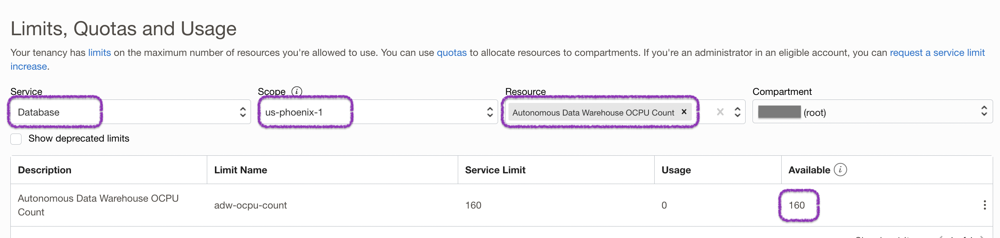
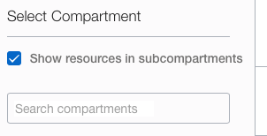
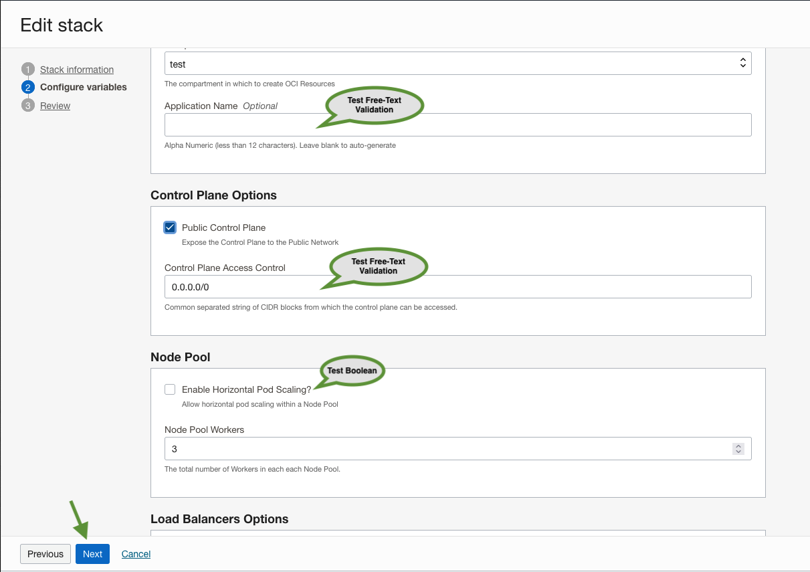
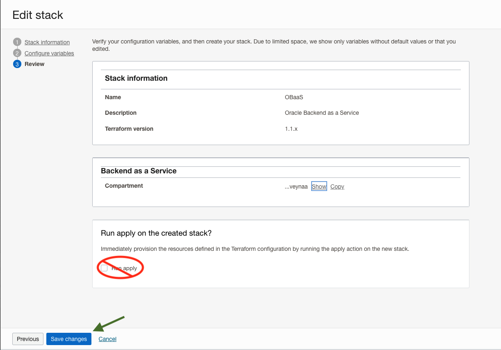
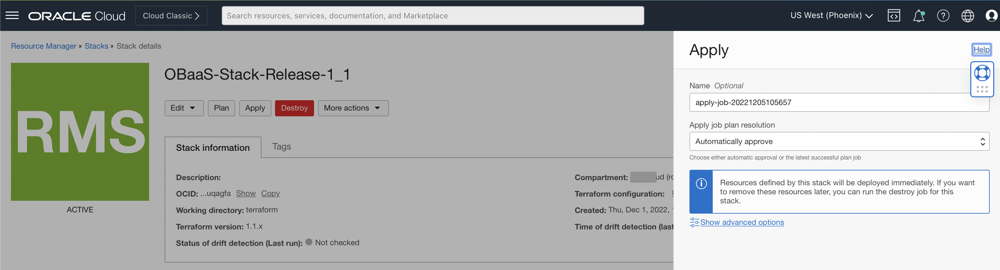
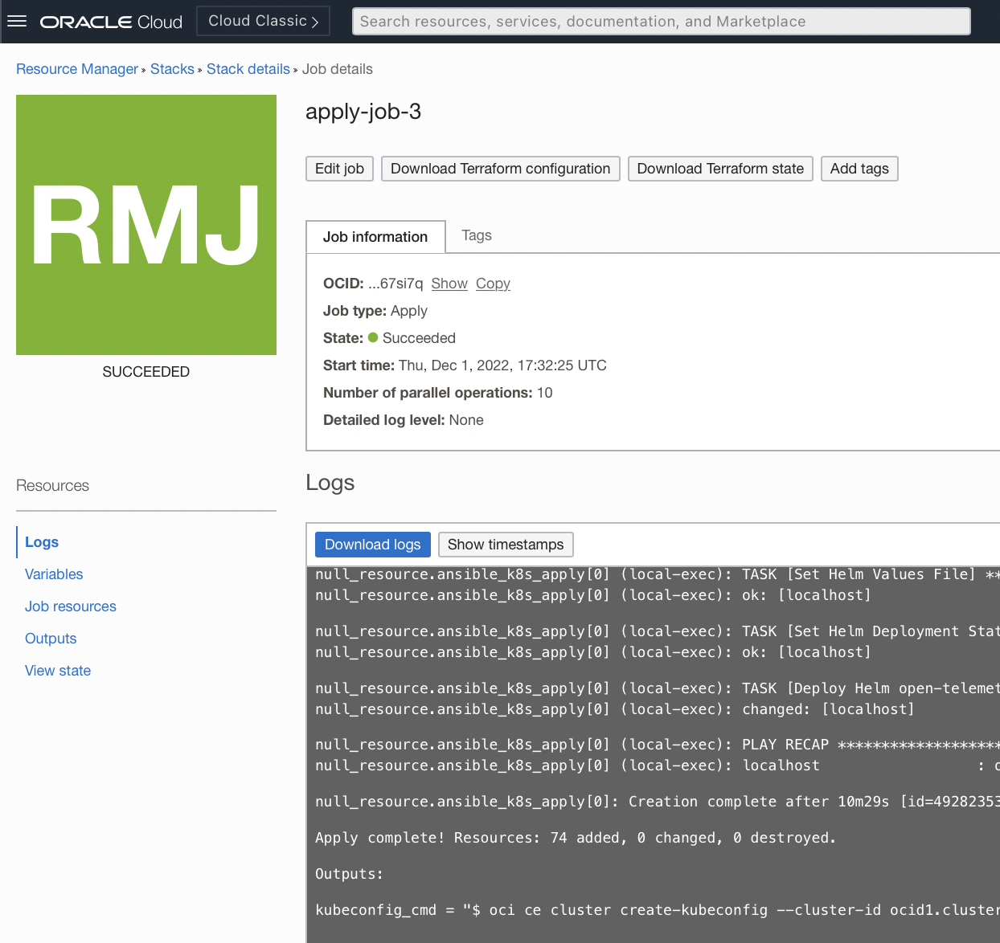
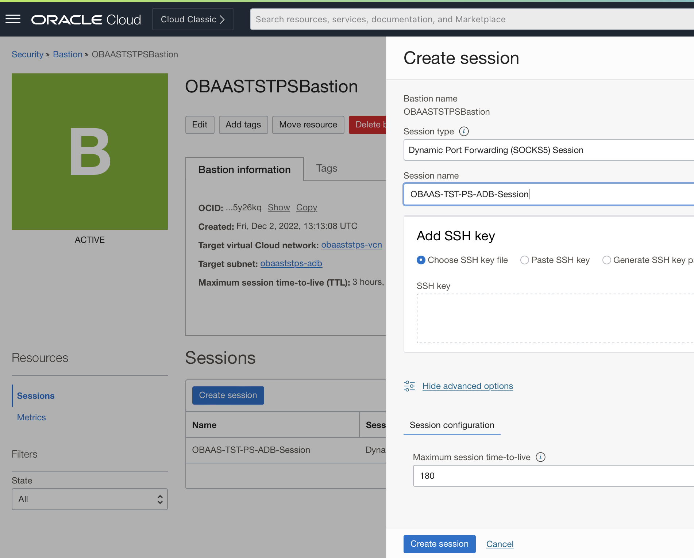
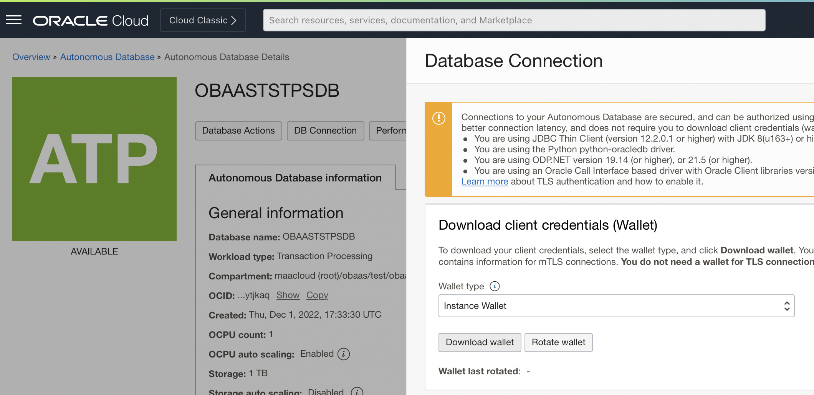

## Introduction

In this lab, we will provision and setup the resources to execute OBaaS and Sample Applications in your tenancy.

Estimated Time: 25 minutes

### Objectives

* Install OBaaS in your tenancy and region
* Clone the setup and microservices code
* Execute setup

## Log in to the Oracle Cloud Console

1. If you haven't already, sign in to your account.

## Check Your Tenancy Service Limits

If you have a **fresh** free trial account with credits then you can be sure that you have enough quota and you can proceed to the next step.

If, however, you have already used up some quota on your tenancy, perhaps while completing other workshops, there may be insufficient quota left to run this workshop. The most likely quota limits you may reach are summarized in the following table.

| Service          | Scope  | Resource                                             | Available | Free Account Limit |
|------------------|:------:|------------------------------------------------------|:---------:|:------------------:|
| Container Engine | Region | Cluster Count                                        |   **1**   |         1          |
| Database         | Region | Autonomous Transaction Processing Total Storage (TB) |   **1**   |         2          |
|                  | Region | Autonomous Transaction Processing OCPU Count         |   **1**   |         8          |
| LBaaS            | Region | 100Mbps Load Balancer Count                          |   **1**   |         3          |

1. Quota usage and limits can be check through the console: **Limits, Quotas and Usage** in the **Governance & Administration** section , For example:

    

2. The Tenancy Explorer is used to locate existing resources: **Governance & Administration** --> **Governance** --> **Tenancy Explorer**. Use the "Show resources in subcompartments" feature to locate all the resources in your tenancy:

    

    It may be necessary to delete some resources to make space to run the workshop. Once you have enough space you may proceed to the next step.

## Setup OBaaS Environment

1. Install OBaaS from OCI Marketplace 

    ***write me***

    Fill the configuration variables and select `Next`

    * `Application Name` (Optional)
    * OKE Control Plane Options.
        * `Public Control Plane`: this option allow you access the OKE Control Plane from the Internet (Public IP)
        * `Control Plane Access Control`: IP range enabled to access the control plane (recommended)
        * `Enable Horizontal Pod Scaling?`: The [Horizontal Pod Autoscaler](https://docs.oracle.com/en-us/iaas/Content/ContEng/Tasks/contengusinghorizontalpodautoscaler.htm#Using_Kubernetes_Horizontal_Pod_Autoscaler) can help applications scale out to meet increased demand, or scale in when resources are no longer needed.
        * `Node Pool Workers`: Number of VMs of the OKE Cluster.

    

    Now you can review the stack configuration and save the changes. Please, *DO NOT* check the `Run apply` box

    

3. Apply the Stack from the OBaaS Template

    After you create your Stack, you will be able to test the Plan, Edit the Stack, Apply the Stack or Destroy.

    We recommend you test the Plan before apply the stack, the objective is review the plan and prevent run in issues.

    After plan test, you can apply the stack and create your OBaaS Environment.

    

    The OCI Resource Manager will apply your stack and generate the execution logs.

    

## Task 5: Get access to the OBaaS OKE Cluster and ADB

After create the OBaaS Environment, you will have get access to Autonoums Database and OKE Cluster to create the Database objects and deploy the sample applications. 

1. Create Dynamic port forwarding (SOCKS5) session using Bastion service.

    Let's start with ADB access that was created with private end point access only following security guidance. To allow you get access to ADB to execute sql commnads you will need to stablish an session between your local workstation and ADB passing by the Bastion service.

    We will create a [Dynamic port forwarding (SOCKS5) session](https://docs.oracle.com/en-us/iaas/Content/Bastion/Tasks/managingsessions.htm#).

   

    After session create you will be able to stablish the tunnel with your ADB Instance issuing a SSH command that you can obtain clicking on three dots menu on right side of the session created.

    ```shell
    ssh -i <privateKey> -N -D 127.0.0.1:<localPort> -p 22 ocid1.bastionsession.oc1.phx....@host.bastion.us-phoenix-1.oci.oraclecloud.com
    ```

2. Connect with ADB Instance using SQLcl

    With tunnel stablished, you will be able to connect with ADB instance. First export the Oracle Net port executing the next commmand:

    ```shell
    <copy>
    export CUSTOM_JDBC="-Doracle.net.socksProxyHost=127.0.0.1 -Doracle.net.socksProxyPort=<PORT> -Doracle.net.socksRemoteDNS=true"
    </copy>
    ```

    Download ADB client credentials (Wallet):

    

    Connect with SQLcl

    ```shell
    sql /nolog
    ```

    ```sql
    set cloudconfig <WALLET>.zip
    connect ADMIN@<ADB SERVICE>
    ```

3. Connect with OKE Instance

    To deploy Sample Applications to OBaaS OKE Cluster, you should setup your local Kubectl following the [Setting Up Cluster Access](https://docs.oracle.com/en-us/iaas/Content/ContEng/Tasks/contengdownloadkubeconfigfile.htm#localdownload) documentation.
