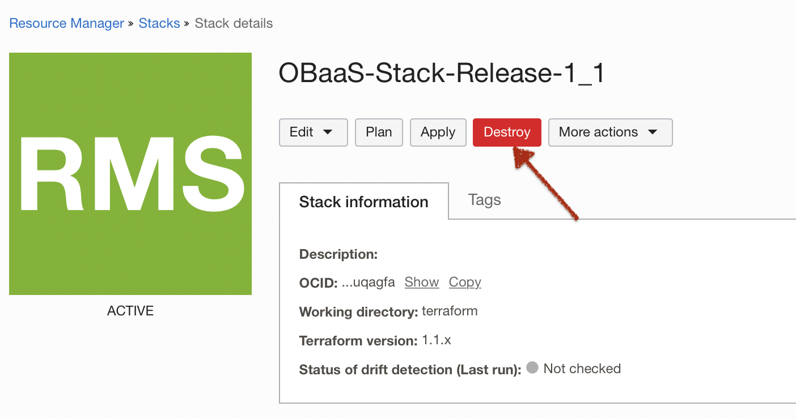
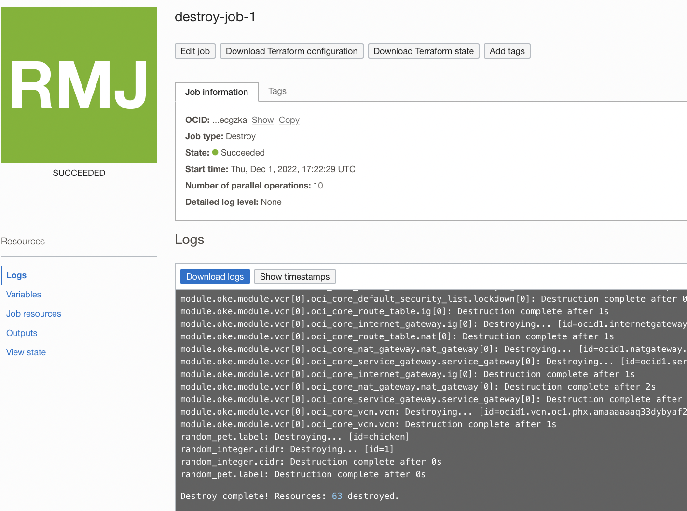

## Introduction

In this lab, we will tear down the resources created in your tenancy.

Estimates Time: 10 minutes

### Objectives

- Clean up your tenancy

### Prerequisites

- Have successfully completed the earlier labs

## **Task 1:** Delete the Test Resources

1. To delete all OBaaS resources created to this test except the compartment, you can use the `Destroy` button in Stack details.

    

    The OCI Resource Manager will use stack definition to destroy all resources.

    

