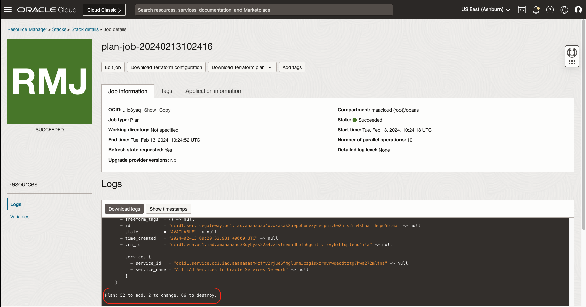

The world of Microservices moves fast.  In order to keep up with new software versions and provide additional features, regular updates and patches are provided for the Oracle Backend for Microservices and AI.  

Depending on the original installation method and the state of your infrastructure, these patches and upgrades can either be preformed in-place or out-of-place. Oracle recommends, despite which option you choose, to have a backup of your applications and database in order to recover from any unintentional loss.

There are various methods to perform an upgrade including:

* [In-Place Marketplace Upgrade](#in-place-marketplace-upgrade)
* [Out-of-Place Marketplace Upgrade](#out-of-place-marketplace-upgrade)
* [In-Place Custom Upgrade](#custom-in-place-upgrade)
* [Out-of-Place Custom Upgrade](#custom-out-of-place-upgrade)

# In-Place Marketplace Upgrade

The in-place Marketplace upgrade can be performed when there has been no external modifications of the infrastructure after the original installation of the Marketplace stack; or you wish to reconcile the infrastructure back to the delivered Marketplace infrastructure.

The in-place method will both modify the infrastructure and patch/upgrade the delivered Oracle Backend for Microservices and AI applications.

This method is recommended for development deployments, or after testing the upgrade using the [Out-of-Place Upgrade](#out-of-place-marketplace-upgrade) for production deployments.

> **Warning**: to ensure no unintentional outage or infrastructure destruction; do not directly apply the upgrade stack.  Plan and review the actions that will be performed prior to its application.  If in doubt about the potential loss of data or infrastructure, opt for the Out-of-Place method.

## Download the Marketplace Upgrade Stack

Visit the [Release](https://github.com/oracle/microservices-backend/releases/) page and download the `marketplace_upgrade.zip` file for the version you are upgrading to.

## Update the Current Stack

In Oracle Cloud Infrastructure, navigate to Developer Services -> Stacks. Ensure the region and compartment is set to the location where the Marketplace stack was first installed, and select the stack.


Edit the Stack, and upload the `marketplace_upgrade.zip` file.  


Click through the wizard and ensure the "Apply" checkbox is not ticked.  Save Changes.


## Plan the Upgrade

Run the plan Job and review the proposed actions.


Generally, any proposed destruction of the Database or Kubernetes cluster should be avoided unless you are confident that you can recover both your applications and data. If the plan shows the destruction of these resources, the [Out-of-Place Upgrade](#out-of-place-marketplace-upgrade) should be used as an alternative.



## Apply the Upgrade


# Out-of-Place Marketplace Upgrade

The out-of-place Marketplace upgrade can be used when manual changes to the original infrastructure have been made after the initial installation of the Oracle Backend for Microservices and AI. It is the recommended Marketplace method for production installations as it allows you to test the upgrade prior to go live, while leaving the old infrastructure in place for rollbacks.

> The out-of-place method deliver new infrastructure and Oracle Backend for Microservices and AI applications. You will need to migrate your applications to the new platform.

Follow the [instructions](../setup/) to install the latest Marketplace version.

## Clone Database

Depending on the Oracle Database that was used during the initial installation, the method of cloning the database will vary. For example:

* [Oracle Autonomous Database](https://docs.oracle.com/en/cloud/paas/autonomous-database/serverless/adbsb/clone-autonomous-database.html)
* [Oracle BaseDB](https://docs.oracle.com/en-us/iaas/base-database/doc/clone-db-system.html)
* On-Premises options include:
  * [PDB Clone](https://docs.oracle.com/en/database/oracle/oracle-database/21/multi/cloning-a-pdb.html)
  * [RMAN Duplicate](https://docs.oracle.com/en-us/iaas/Content/Database/Tasks/mig-rman-duplicate-active-database.htm)
  * [Datapump](https://docs.oracle.com/en/database/oracle/oracle-database/19/sutil/oracle-data-pump-overview.html)

## Load Custom Applications

Once the database has been cloned, re-load your applications into the new Kubernetes environment.

## Clean Up Old Installation

Follow the [uninstall guide](../uninstall/) to clean up the old Marketplace installation.

# Custom In-Place Upgrade

The Custom In-Place upgrade can be applied to any existing installation of the Oracle Backend for Microservices and AI. It will not modify any infrastructure and only apply changes to existing and install new Oracle Backend for Microservices and AI applications.

## Download the Latest Installation

Visit the [Release](https://github.com/oracle/microservices-backend/releases/) page and download the `custom-ebaas_latest.zip` file for the version you are upgrading to.

Unzip the `custom-ebaas_latest.zip` file.

## Define the Infrastructure

From the original installation source, copy the following infrastructure definitions, where they exist, to the new release source:

* ansible/roles/common/vars/main.yaml
* ansible/roles/registry/vars/main.yaml
* ansible/roles/database/vars/main.yaml
* ansible/roles/oci/vars/main.yaml
* ansible/roles/azure/vars/main.yaml

## Perform the Upgrade

From the unzipped source, run the following commands:

```bash
./setup_ansible.sh
source activate.env
ansible-playbook ansible/k8s_apply.yaml -t full
```

# Custom Out-of-Place Upgrade

The custom out-of-place upgrade assumes you have out-of-place infrastructure to install into. The existing Oracle Database should be cloned for use with the new version.

## Download the Latest Installation

Visit the [Release](https://github.com/oracle/microservices-backend/releases/) page and download the `custom-ebaas_latest.zip` file for the version you are upgrading to.

Unzip the `custom-ebaas_latest.zip` file.

## Clone Database

Depending on the Oracle Database that was used during the initial installation, the method of cloning the database will vary. For example:

* [Oracle Autonomous Database](https://docs.oracle.com/en/cloud/paas/autonomous-database/serverless/adbsb/clone-autonomous-database.html)
* [Oracle BaseDB](https://docs.oracle.com/en-us/iaas/base-database/doc/clone-db-system.html)
* On-Premises options include:
  * [PDB Clone](https://docs.oracle.com/en/database/oracle/oracle-database/21/multi/cloning-a-pdb.html)
  * [RMAN Duplicate](https://docs.oracle.com/en-us/iaas/Content/Database/Tasks/mig-rman-duplicate-active-database.htm)
  * [Datapump](https://docs.oracle.com/en/database/oracle/oracle-database/19/sutil/oracle-data-pump-overview.html)

## Update the Infrastructure

From the original installation source, copy the following infrastructure definitions, where they exist, to the new release source:

* ansible/roles/common/vars/main.yaml
* ansible/roles/registry/vars/main.yaml
* ansible/roles/database/vars/main.yaml
* ansible/roles/oci/vars/main.yaml
* ansible/roles/azure/vars/main.yaml

**Update the files to point to the new out-of-place infrastructure.**

## Perform the Upgrade

From the unzipped source, run the following commands:

```bash
./setup_ansible.sh
source activate.env
ansible-playbook ansible/k8s_apply.yaml -t full
```

## Load Custom Applications

Once the upgrade is complete, re-load your applications into the new Kubernetes environment.
