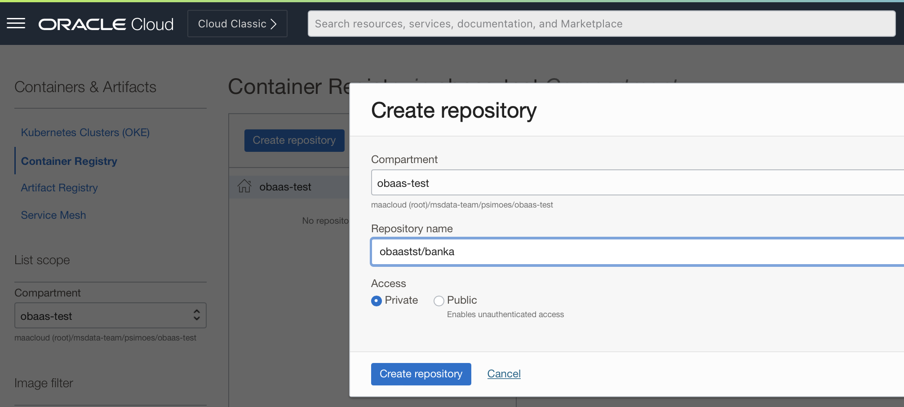
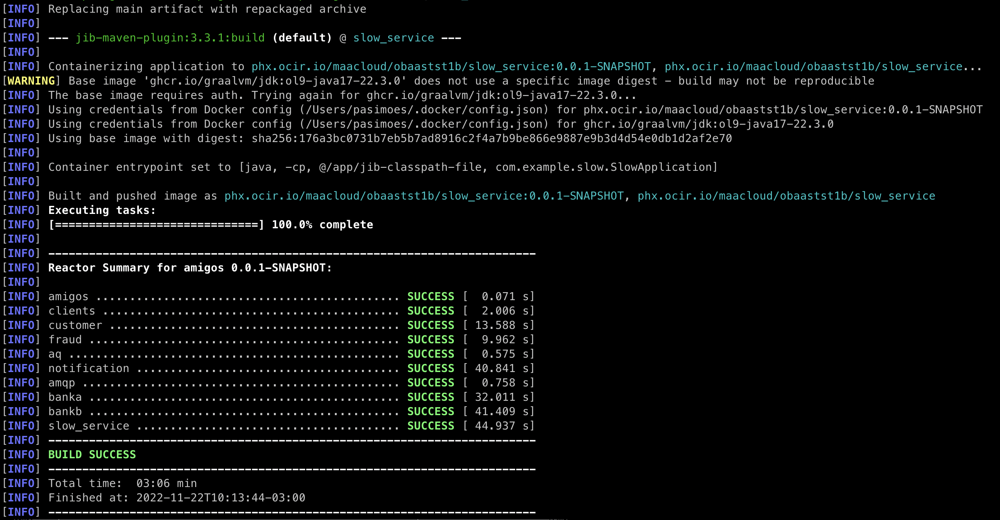
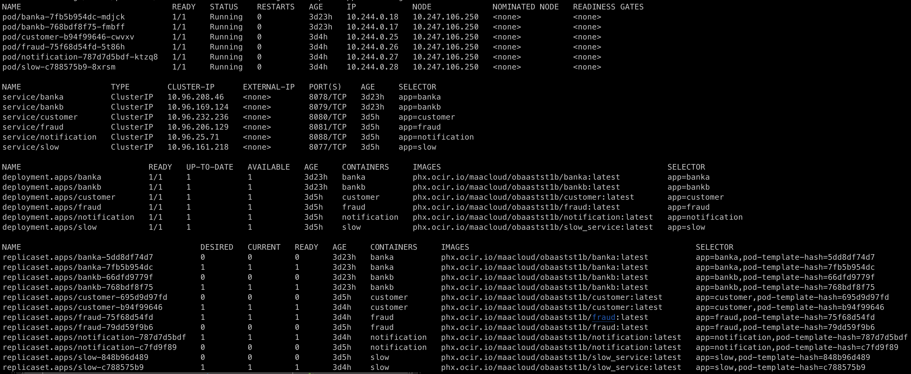

## Introduction

This lab helps you know how to test OBaaS using a set of sample applications.

Estimated Time: 15 minutes

### Objectives

* Deploy and test the Sample Applications

### Prerequisites

* GraalVM or OpenJDK 17
* Apache Maven 3.8+
* A Docker Cli (to use for login against OCI-R)

## Task 1: Make a Clone of the Sample Apps Source Code

Now that you have your OBaaS environment available and accessible, we can start deploying the Sample applications.

1. To work with the application code, you need to make a clone from the OraHub repository using the following command.  

 ```shell
 <copy>
 git clone xxxxxxx
 </copy>
 ```

You should now see the directory `ebaas-sample-apps` in the directory that you created.

## Task 2: Create OCI Repositories to Sample Applications

1. You have to create the repositories for each sample application in your compartment. The name of the repository should follow the pattern `<project name>/<app name>`

    

    The repositories are:

    * `<project>/banka`
    * `<project>/bankb`
    * `<project>/customer`
    * `<project>/fraud`
    * `<project>/notification`
    * `<project>/slow_service`

2. Create the auth-token to login to OCI-R using kubectl following the instructions on [Generating an Auth Token to Enable Login to Oracle Cloud Infrastructure Registry](https://docs.oracle.com/en-us/iaas/Content/Functions/Tasks/functionsgenerateauthtokens.htm)

3. Now you can login to OCI-R to allow you push the Sample Applications container images, executing the following commnad:

    ```shell
    docker login <region>.ocir.io
    username: <tenancy>/oracleidentitycloudservice/<username>
    password: <auth-token>
    ```

## Task 3: Build Sample Applications and push container images

1. Update the `pom.xml` in the root directory to set your Container Registry. Configure region/tenancy and the right project name:

    ```xml
        <properties>
            <container.registry>region ocir address/tenancy name/project name</container.registry>
        </properties>
    ```

    For example, if your region is Phoenix and prject name is `myproject`

    ```xml
        <properties>
            <container.registry>phx.ocir.io/mytenancy/myproject</container.registry>
        </properties>
    ```

2. Run package using Maven with this profile:

    ```shell
    <copy>
    mvn package -P build-docker-image
    </copy>
    ```

    Finishing the build and push process, you will be able to see a message similar to the one below portraying that all modules were builded successfully.

    

## Task 4: Update Images in Kubernetes Deployment Descriptors

You also have to update the address of images in application deployment descriptor editing each `01--deployment--APPLICATION_NAME.yaml`.

```yaml
    spec:
      containers:
      - name: app_name
        image: phx.ocir.io/mytenancy/myproject/app_image:latest
```

## Task 5: Create Samples Applications Database Objects

Connected to the ADB instance using aforementioned instructions execute the sql commands for each application but before we have to adjust configurations for the applications inside `db-02-<application>-configserver-props.sql` file.

```sql
INSERT INTO CONFIGSERVER.PROPERTIES(APPLICATION, PROFILE, LABEL, PROP_KEY, "VALUE")
VALUES ('APPLICATION_NAME', 'kube', 'latest', 'spring.datasource.url', 'jdbc:oracle:thin:@DATABASE_SERVICE?TNS_ADMIN=/oracle/tnsadmin');

INSERT INTO CONFIGSERVER.PROPERTIES (APPLICATION, PROFILE, LABEL, PROP_KEY, VALUE)
VALUES ('APPLICATION_NAME', 'kube', 'latest', 'spring.datasource.username', 'DATABASE_USERNAME');

INSERT INTO CONFIGSERVER.PROPERTIES (APPLICATION, PROFILE, LABEL, PROP_KEY, VALUE)
VALUES ('APPLICATION_NAME', 'kube', 'latest', 'spring.datasource.password', 'DATABASE_PASSWORD');

INSERT INTO CONFIGSERVER.PROPERTIES (APPLICATION, PROFILE, LABEL, PROP_KEY, VALUE)
VALUES ('APPLICATION_NAME', 'kube', 'latest', 'spring.datasource.driver-class-name', 'oracle.jdbc.OracleDriver');

COMMIT;
```

1. Customer microservice

    * db-01-customer-create-user.sql
    * db-02-customer-configserver-props.sql

2. Fraud microservice

    * db-01-fraud-create-user.sql
    * db-02-fraud-configserver-props.sql

3. Notification microservice

    * db-01-notification-create-user.sql
    * db-02-notification-configserver-props.sql
    * db-03-notifications-db-queue.sql

## Task 6: Deploy Samples Applications

1. Apply Application deployment using kubectl

    ```shell
    cd <app dir>
    kubectl apply -f 01--deployment--<app name>.yaml
    ```

2. Deploy Application Service using kubectl

    ```shell
    kubectl apply -f 02--service--<app name>.yaml
    ```

3. Deploy Application Ingress using kubectl

    ```shell
    kubectl apply -f 03--ingress--<app name>.yaml
    ```

    After deploy all microservices, you will be able to check them executing on Kubernetes executing the following command:

    ```shell
    kubectl --namespace=application get all -o wide
    ```

    

## Task 7: Samples Applications Testing

### Amigos Microservices APIs

1. Create customer

    ```shell
    curl -X POST -H 'Content-Type: application/json' -d '{"firstName": "bob", "lastName": "smith", "email": "bob@bob.com"}' http://<ExternalIP>/customer/api/v1/customers
    ```

2. Send notification

    ```shell
    curl -X POST -H 'Content-Type: application/json' -d '{"toCustomerId": 1, "toCustomerEmail": "bob@bob.com", "message": "hi bob"}' http://<ExternalIP>/notification/api/v1/notify
    ```

3. Fraud check

    ```shell
    curl -X GET http://<ExternalIP>/fraud/api/v1/fraud-check/1
    ```

### CloudBank APIs

1. Transfer

    ```shell
    curl  -X POST -H 'Content-Type: application/json' -d '{"fromAccount": "1", "toAccount": "2", "amount": 500}'   http://<ExternalIP>/banka/transfer
    ````

> **Note:** We also made available a `postman` collection that you can import in your postman application. You have to adjust the endpoints for your environment. [Sample Applications Postman Collection](../../tests/obaas-tests.postman_collection.json)

You may now proceed to the next lab.

