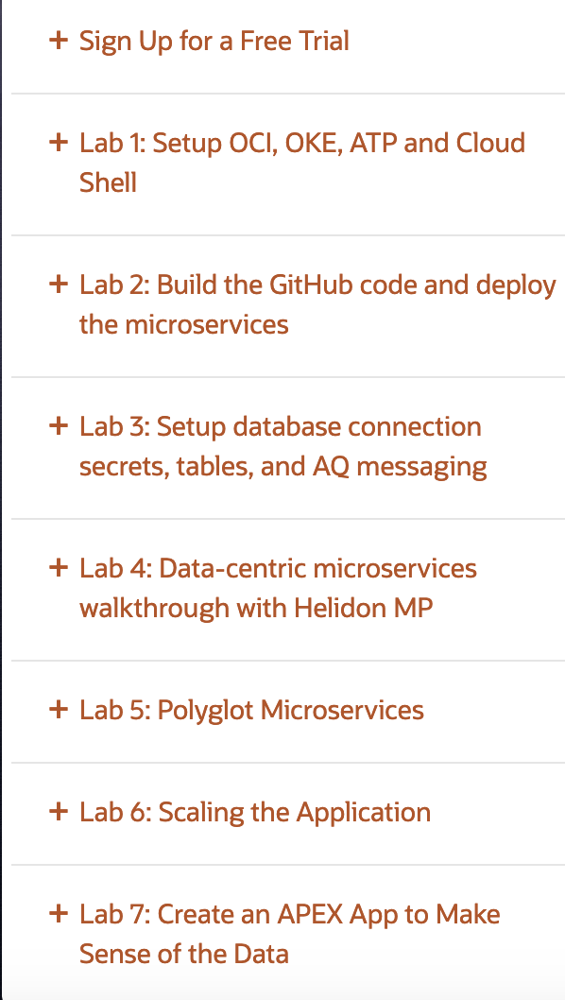

Copyright (c) 2021 Oracle and/or its affiliates.
Licensed under the Universal Permissive License v 1.0 as shown at https://oss.oracle.com/licenses/upl.

Simplifying Microservices Architecture With Oracle Converged Database and Helidon

GrabDish is a sample application for mobile-food ordering. This code illustrates the simplicity of architecting a data-driven microservices platform using the Oracle converged database and OCI services.
                    
This repository contains the source code for the Oracle LiveLabs for GrabDish accessible at https://oracle.github.io/learning-library/developer-library/microservices-with-converged-db
                    
Often there are tough architecture choices for setting up the infrastructure, operating it, tuning it, upgrading it and scaling it. In this workshop you will simplify the process by setting up Transactional Event Queues in the Oracle Autonomous Database which brings the best of JMS messaging and Kafka produce/consume together with transactions. This combination of data and and events delivered with notifications is ideal to build scalable microservices using a multi-model, multi-tenant architecture.
                    
This workshop will help you understand the technical capabilities inside and outside the Oracle database to support scalable data and event-driven microservices architecture.
                    
You will create a highly scalable application that relies on Oracle Container Engine for Kubernetes to build, deploy and manage the Helidon and WebLogic front-end microservices that interact through Oracle Cloud Infrastructure Service Broker, JMS and Kafka streaming platform with the back-end datastores deployed as Oracle pluggable databases inside Oracle Autonomous Transaction Processing. You will see the scaling of both application layer and data platform layer, as well as experience the polyglot support – programming in Java with Helidon MP and SE, Python, and node.js.
                    
The workshop in this repository is divided into the 7 following labs. First you have to start with creating a free trial account on OCI if you don’t have one. These steps can be done in the lab at https://oracle.github.io/learning-library/developer-library/microservices-with-converged-db/ . The code here is deployed in Lab 1, Step 2. We’re open sourcing the code here for developers to access the underlying boilerplates for simplifying microservices with Oracle’s converged database as a persistent store.

                    
The steps followed in the labs above follow the order of scripts being executed below

| Step | Description
| ------ | ------ |
| 1 | #download src |
| 2 | #create compartment (if necessary) and k8s cluster in console, note compartment ocid and region id
| 3 | ./setCompartmentId.sh <COMPARMENT_OCID> <REGION_ID> #writes msdataworkshopcompartmentid.txt and msdataworkshopregion.txt   |
| 4 | #create vault secrets for db admin pw and frontend microservice auth in console, note ocids |
| 5 | ./createATPPDBs.sh <MSDATAWORKSHOP_ADMIN_PW_SECRET_OCID> <FRONTEND_AUTH_PW_SECRET_OCID>  #writes msdataworkshoporderdbid.txt and msdataworkshopinventorydbid.txt |
| 6 | #create OCIR registry in console, note namespace and repos name  |
| 7 | ./addOCIRInfo.sh <OCIR_NAMESPACE> <OCIR_REPOS_NAME> #writes msdataworkshopocirnamespace.txt and msdataworkshopreposname.txt |
| 8 | #create auth token in console, note it |
| 9 | ./dockerLogin.sh <USERNAME> "<AUTH_TOKEN>" #writes msdataworkshopdockerregistry.txt |
| 10 | ./verifyOKEAndCreateKubeConfig.sh #generates ~/.kube/config |
| 11 | ./installGraalVMJaegerAndFrontendLB.sh #writes msdataworkshopgraalvmhome.txt |
| 12 | ./setJaegerAddress.sh #writes msdataworkshopjaegeraddress.txt |
| 13 | ./build.sh #builds and pushes images |
| 14 | ./frontend-helidon/deploy.sh #deploy and verify frontend ms |
| 15 | #download wallet from console, add to objectstore and create link, note link |
| 16 | ./atp-secrets-setup/createAll.sh <MSDATAWORKSHOP_DB_WALLET_OBJECTSTORAGE_LINK> #creates wallet secret |
| 17 | ./atpaqadmin/deploy.sh #deploy admin service and use it to create DB and AQ queue propagation setup |
| 18 | #deploy.sh other microservices (order, inventory, and supplier) from here and test app|

Please send any questions or comments to this workshop's Livelabs page of the Groundbreakers Developer Community at https://community.oracle.com/tech/developers/categories/building-microservices-with-oracle-converged-database
                    
For Helidon questions use the Helidon Slack at https://helidon.slack.com/archives/CCS216A5A 
                   
