# Building Microservices with Converged Oracle Database On-Premises Workshop

This workshop will help you understand the technical capabilities inside and outside the Oracle converged database to support a scalable data and event-driven microservices architecture.

You will create an application with Helidon microservices and a Javascript front-end, deployed to a minikube kubernetes cluster, using REST and messaging for communication and accessing pluggable Oracle databases. Oracle Database is hosted on a docker container.

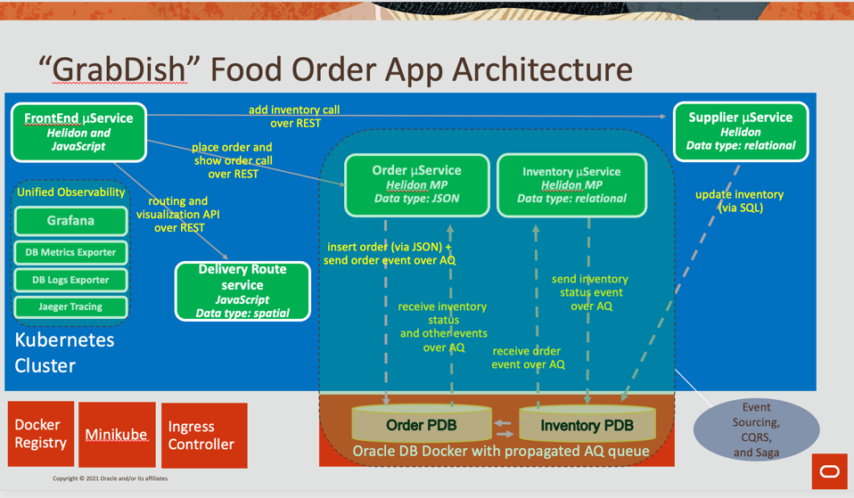

# microservices-datadriven-infra

Describe the application here,...

    For additional details regarding Microservices Data-driven applications on Oracle Converged Database check,

    https://github.com/oracle/microservices-datadriven

Lab 1:Setup

1. Click on 

2. Login to your Cloud Account 

3. Accept the Oracle Terms of Use

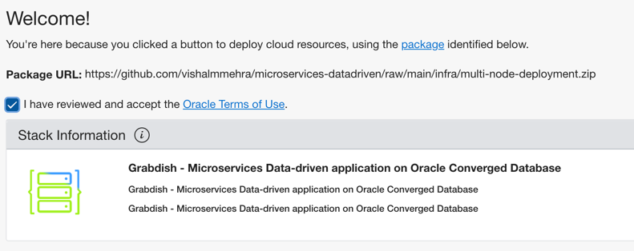

4. Select the compartment in which you want to deploy this application

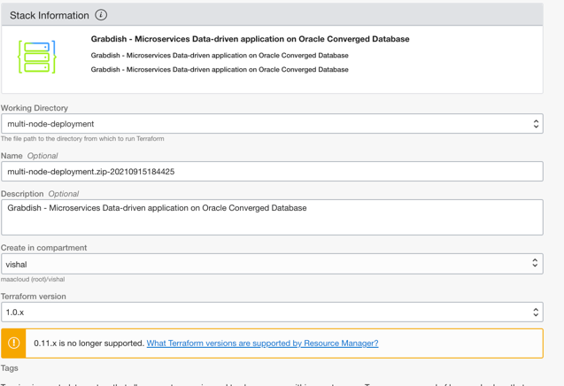

5. Click on Next (Left Bottom Screen)

6. Pick the Compute (FrontEnd) and Oracle Database Instance Shape 

 Shape VM.Standard.E2.2 or higher is strongly recommended 

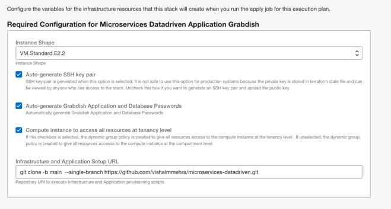

7. (optional) Upload SSH Keys if you have already crated SSH Keys

8. (optional) Provide Database and/or Application Passwords - auto-generated Passwords are strongly recommended

9. Ensure "Infrastructure and Application Setup URL" is correct (will change post GA)

10. Click on Next (Left Bottom Screen)

11. Verify your configuration (ensure Run Apply checkbox is selected)

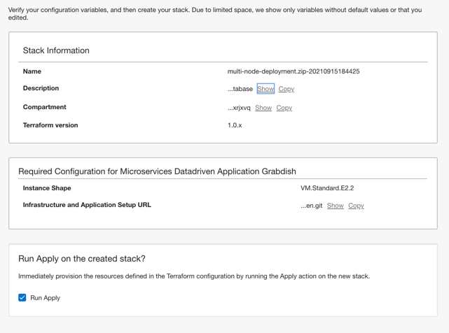

12. Click on Create Button (Left Bottom Screen)

13. Check if your Job has been accepted (Job takes around 5 minutes to create the infrastructure)

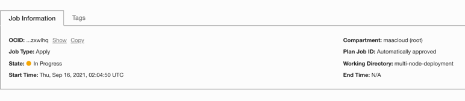

14. Wait for this job to complete (Job takes around 5 minutes to create the infrastructure)

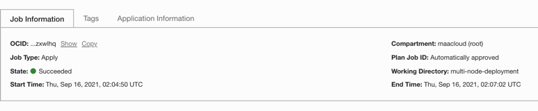

15. Confirm the output (Click on Logs and Outputs under Resources Section)

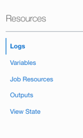

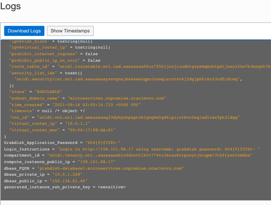

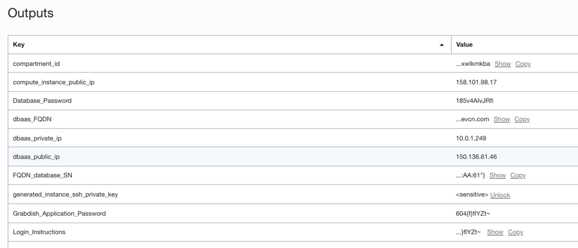

**Key Points**

<li> Make a note of variable dbaas_public_ip - this is your Database instance public IP address </li>

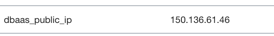

<li>Make a note of variable compute_instance_public_ip - this is your Application (FrontEnd) instance public IP address </li>

<li> Make a note of variable Grabdish_Application_Password - this is your Application (FrontEnd) password </li>

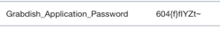

<li> Make a note of variable Login_Instructions - using these you can login to the Grabdish FrontEnd Application </li>

<li> Access generated SSH Keys - Click on unblock to display generated_instance_ssh_private_key</li>

<li> Copy the generated key and safe it to a filename (like grabdish-on-premises.key) of your choice

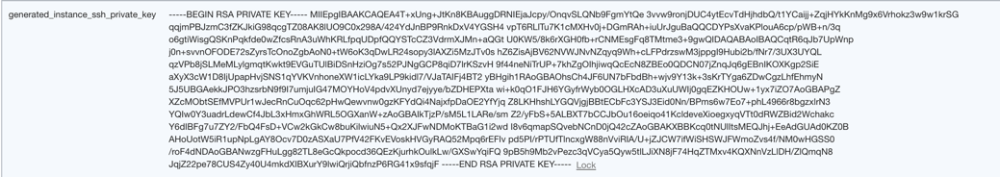

16. Tail Database Logs (optional)

`ssh -i grabdish-on-premises.key opc@150.136.61.46`

`cd; tail -f microservices-infra-install.log`

check if the Database Provisioning including generation of PDBs has been completed

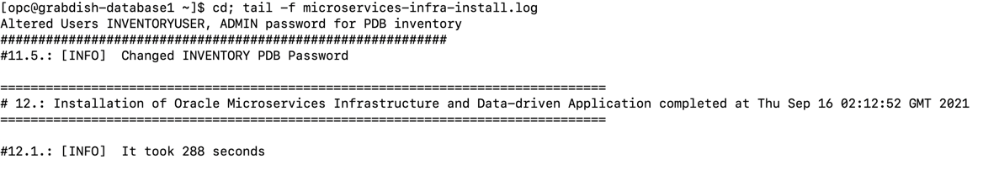

17. Tail Application Server Logs (optional)

`ssh -i grabdish-on-premises.key opc@158.101.98.17`

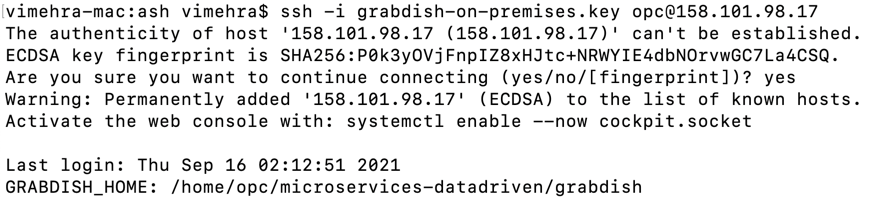

`cd; tail -f infra-install.log`

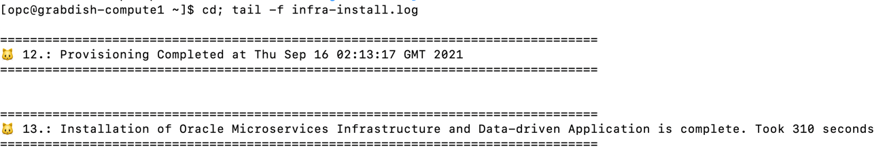

Lab 2: Data-centric microservices walkthrough with Helidon MP

Task 1: Access the FrontEnd UI

You are ready to access the frontend page. Open a new browser tab and enter the external IP URL:

https://<EXTERNAL-IP>

Note that for convenience a self-signed certificate is used to secure this https address and so it is likely you will be prompted by the browser to allow access.

You will then be prompted to authenticate to access the Front End microservices. The user is grabdish and the password is the one you entered in Lab 1.

You should then see the Front End home page. You've now accessed your first microservice of the lab!

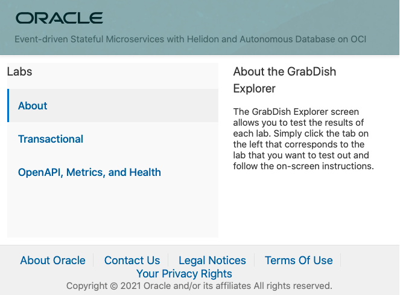

We created a self-signed certificate to protect the frontend-helidon service. This certificate will not be recognized by your browser and so a warning will be displayed. It will be necessary to instruct the browser to trust this site in order to display the frontend. In a production implementation a certificate that is officially signed by a certificate authority should be used.

Task 2: Verify the Order and Inventory Functionality of GrabDish store

Click Transactional under Labs.

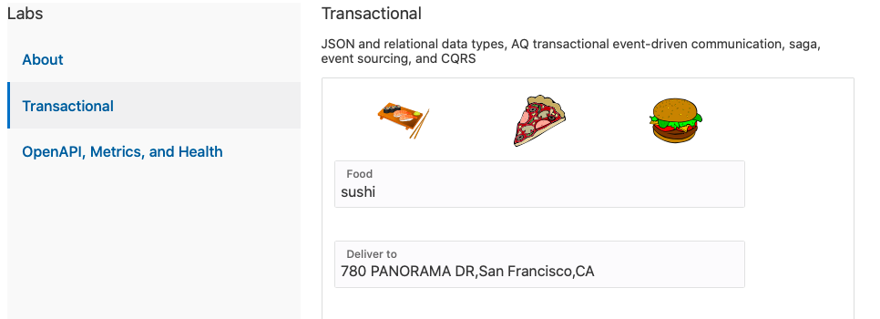

Check the inventory of a given item such as sushi, by typing sushi in the food field and clicking Get Inventory. You should see the inventory count result 0.

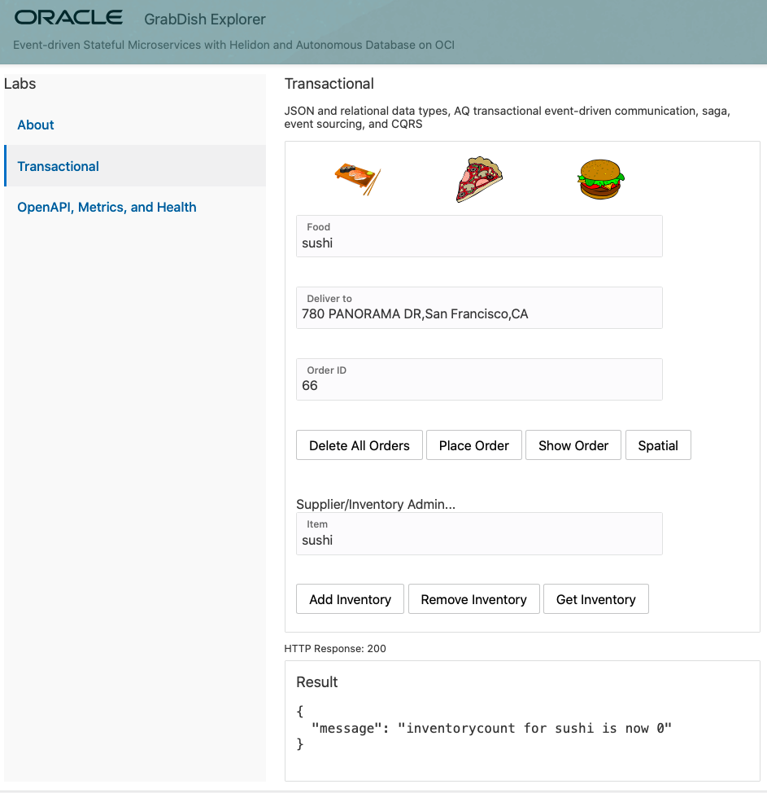

(Optional) If for any reason you see a different count, click Remove Inventory to bring back the count to 0.

Let’s try to place an order for sushi by clicking Place Order.

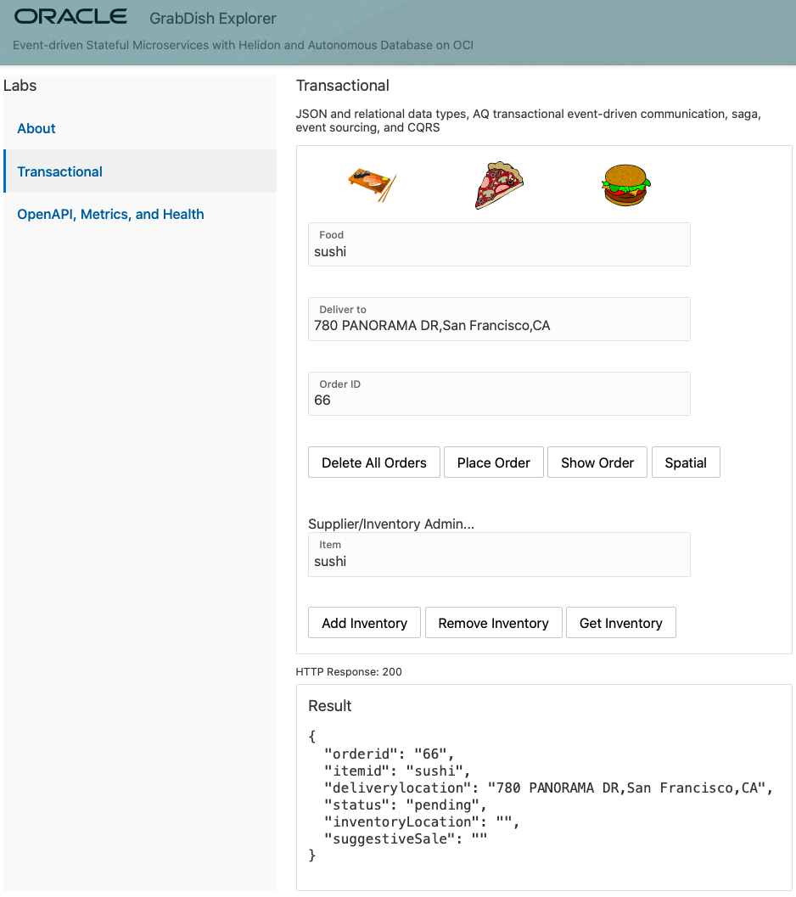

To check the status of the order, click Show Order. You should see a failed order status.

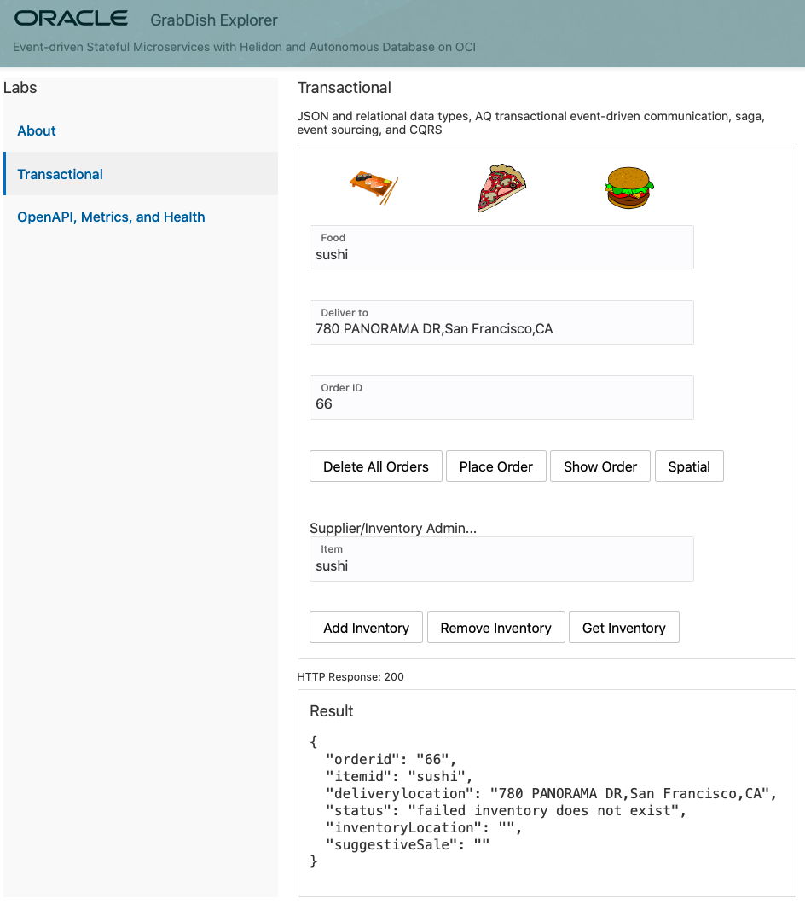

This is expected, because the inventory count for sushi was 0.

Click Add Inventory to add the sushi in the inventory. You should see the outcome being an incremental increase by 1.

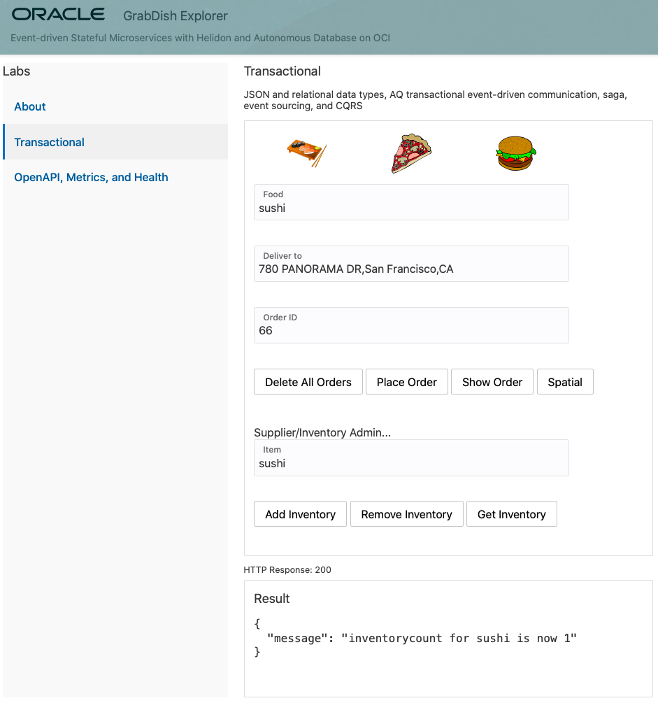

Go ahead and place another order by increasing the order ID by 1 (67) and then clicking Place Order. Next click Show Order to check the order status.

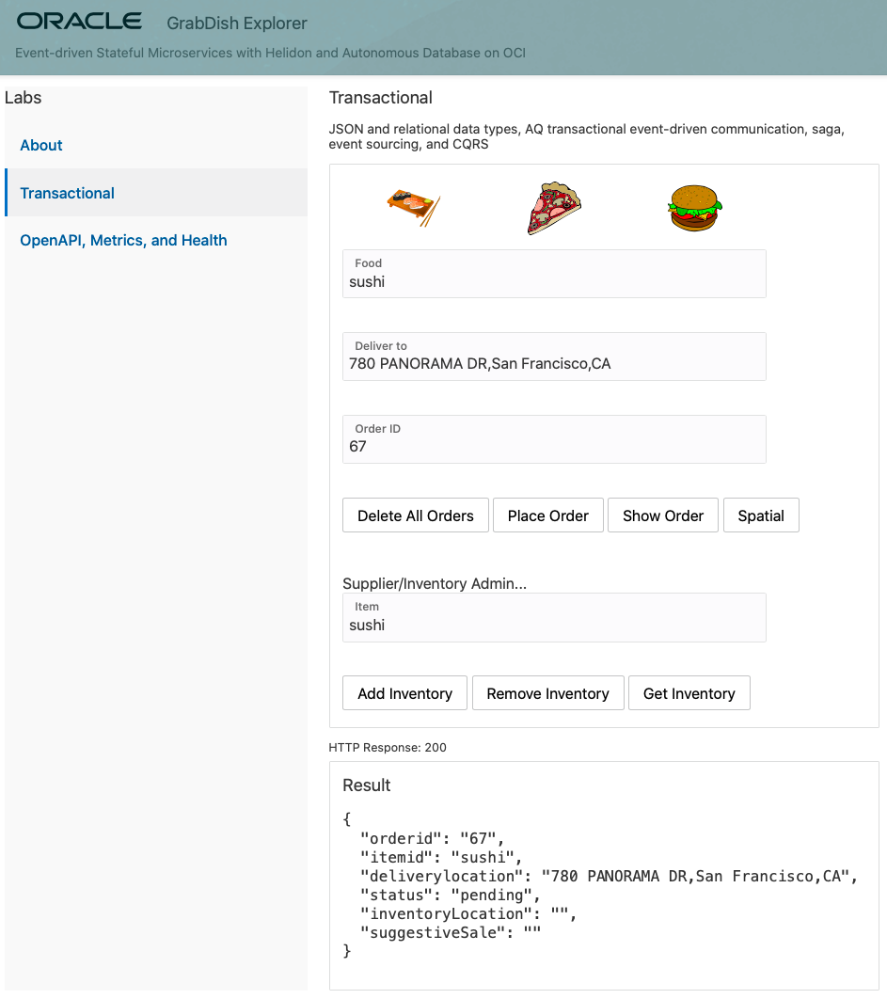

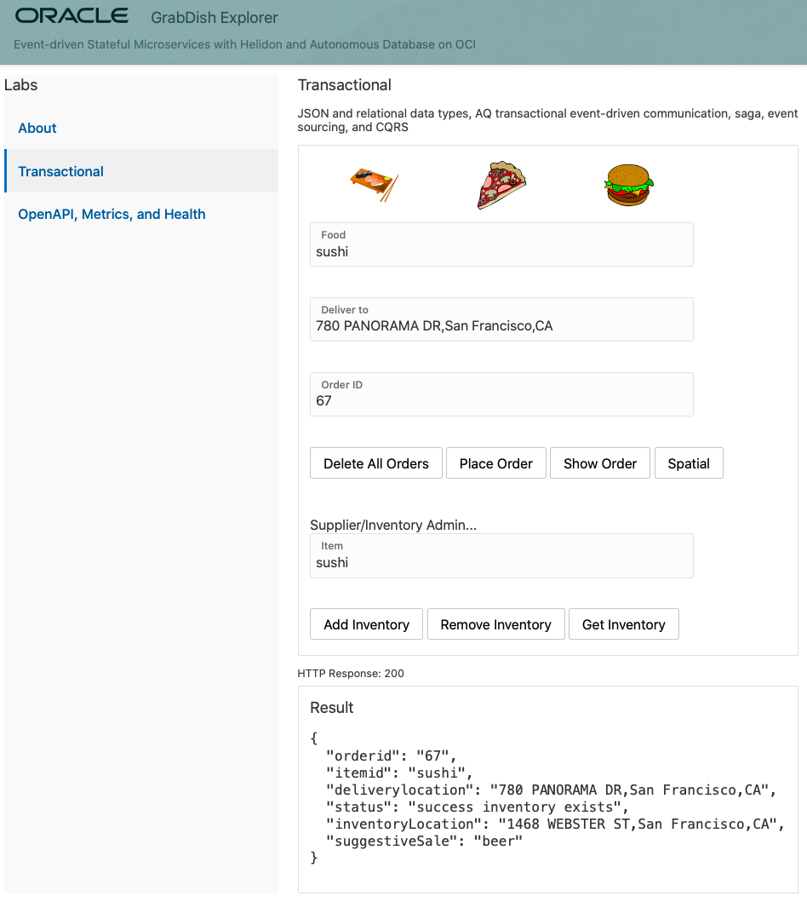

The order should have been successfully placed, which is demonstrated with the order status showing success.

Although this might look like a basic transactional mechanic, the difference in the microservices environment is that it’s not using a two-phase XA commit, and therefore not using distributed locks. In a microservices environment with potential latency in the network, service failures during the communication phase or delays in long running activities, an application shouldn’t have locking across the services. Instead, the pattern that is used is called the saga pattern, which instead of defining commits and rollbacks, allows each service to perform its own local transaction and publish an event. The other services listen to that event and perform the next local transaction.

In this architecture, there is a frontend service which mimics some mobile app requests for placing orders. The frontend service is communicating with the order service to place an order. The order service is then inserting the order into the order database, while also sending a message describing that order. This approach is called the event sourcing pattern, which due to its decoupled non-locking nature is prominently used in microservices. The event sourcing pattern entails sending an event message for every work or any data manipulation that was conducted. In this example, while the order was inserted in the order database, an event message was also created in the Advanced Queue of the Oracle database.

Implementing the messaging queue inside the Oracle database provides a unique capability of performing the event sourcing actions (manipulating data and sending an event message) atomically within the same transaction. The benefit of this approach is that it provides a guaranteed once delivery, and it doesn’t require writing additional application logic to handle possible duplicate message deliveries, as it would be the case with solutions using separate datastores and event messaging platforms.

In this example, once the order was inserted into the Oracle database, an event message was also sent to the interested parties, which in this case is the inventory service. The inventory service receives the message and checks the inventory database, modifies the inventory if necessary, and sends back a message if the inventory exists or not. The inventory message is picked up by the order service which based on the outcome message, sends back to the frontend a successful or failed order status.

This approach fits the microservices model, because the inventory service doesn’t have any REST endpoints, and instead it purely uses messaging. The services do not talk directly to each other, as each service is isolated and accesses its datastore, while the only communication path is through the messaging queue.

This architecture is tied with the Command Query Responsibility Segregation (CQRS) pattern, meaning that the command and query operations use different methods. In our example the command was to insert an order into the database, while the query on the order is receiving events from different interested parties and putting them together (from suggestive sales, inventory, etc). Instead of actually going to suggestive sales service or inventory service to get the necessary information, the service is receiving events.

Let’s look at the Java source code to understand how Advanced Queuing and Oracle database work together.

What is unique to Oracle and Advanced Queuing is that a JDBC connection can be invoked from an AQ JMS session. Therefore we are using this JMS session to send and receive messages, while the JDBC connection is used to manipulate the datastore. This mechanism allows for both the JMS session and JDBC connection to exist within same atomic local transaction.

Task 3: Verify Spatial Functionality 

Click Spatial on the Transactional tab

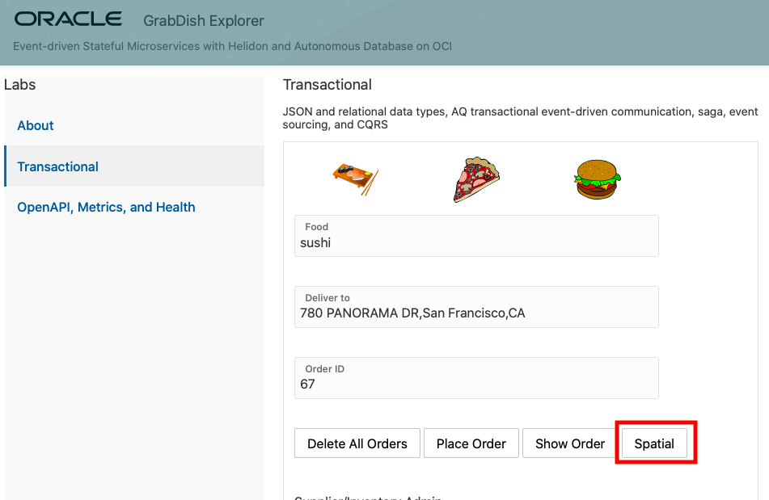

Check Show me the Fusion menu to make your choices for the Fusion Cuisine

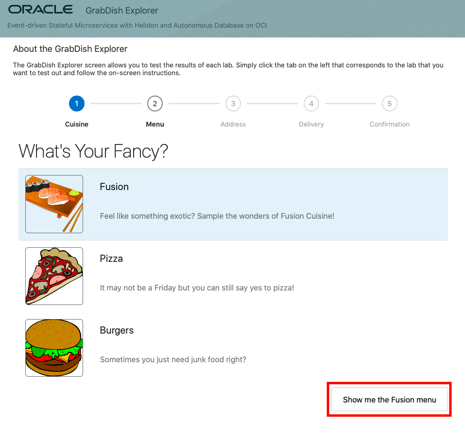

Click the plus sign to add Makizushi, Miso Soup, Yakitori and Tempura to your order and click Ready to Order.

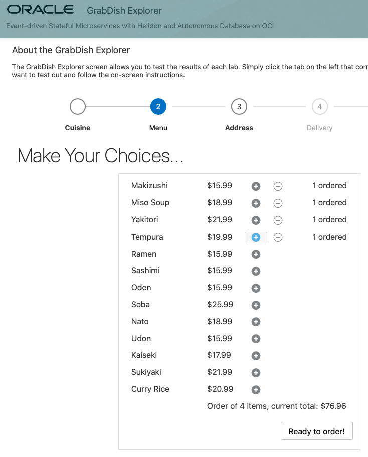

Click Deliver here to deliver your order to the address provided on the screen

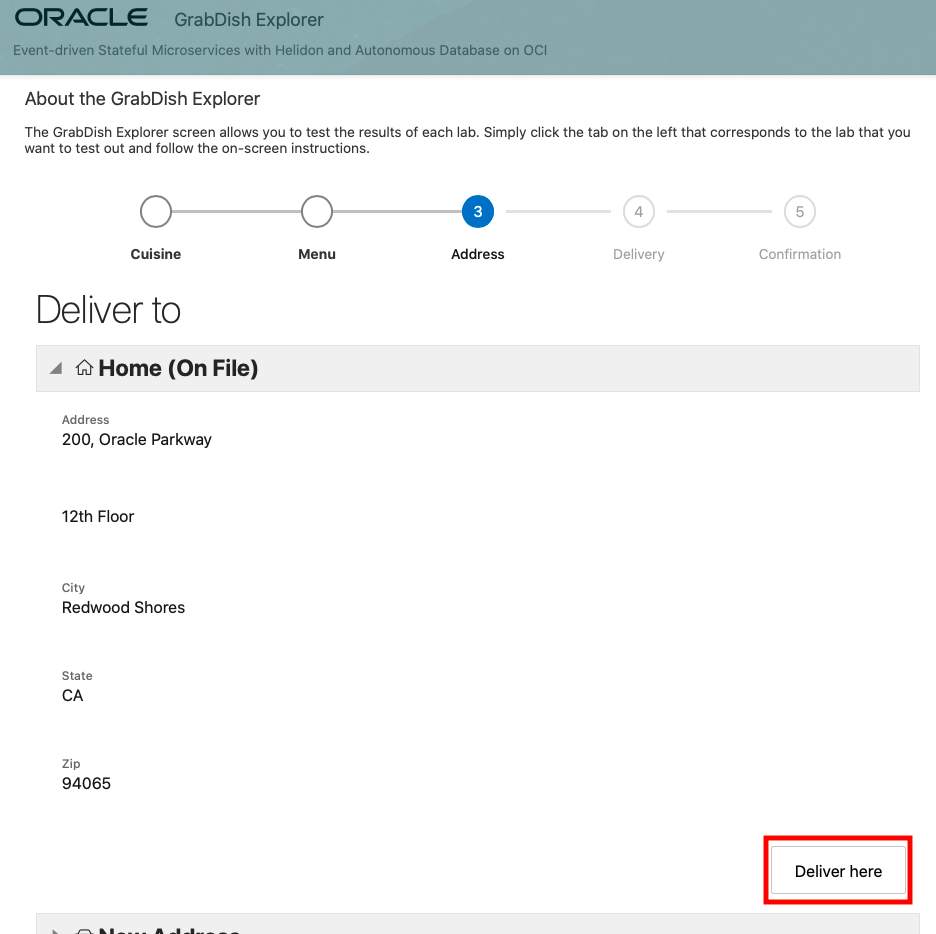

Your order is being fulfilled and will be delivered via the fastest route.

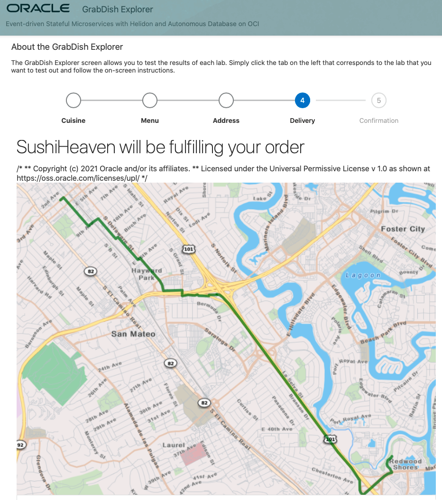

Go to the other tab on your browser to view the Transactional screen.

This demo demonstrates how geocoding (the set of latitude and longitude coordinates of a physical address) can be used to derive coordinates from addresses and how routing information can be plotted between those coordinates. Oracle JET web component provides access to mapping from an Oracle Maps Cloud Service and it is being used in this demo for initializing a map canvas object (an instance of the Mapbox GL JS API's Map class). The map canvas automatically displays a map background (aka "basemap") served from the Oracle Maps Cloud Service. This web component allows mapping to be integrated simply into Oracle JET and Oracle Visual Builder applications, backed by the full power of Oracle Maps Cloud Service including geocoding, route-finding and multiple layer capabilities for data overlay. The Oracle Maps Cloud Service (maps.oracle.com or eLocation) is a full Location Based Portal. It provides mapping, geocoding and routing capabilities similar to those provided by many popular commercial online mapping services.

Task 4: Show Metrics

Notice @Timed and @Counted annotations on placeOrder method of $GRABDISH_HOME/order-helidon/src/main/java/io/helidon/data/examples/OrderResource.java

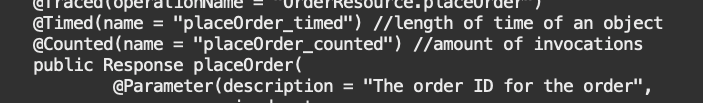

Click Tracing, Metrics, and Health

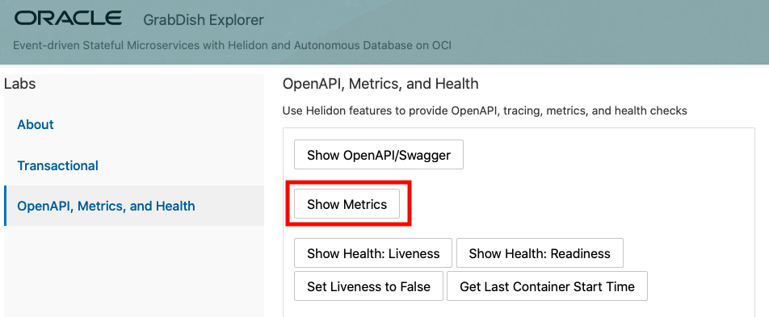

Click Show Metrics and notice the long string of metrics (including those from placeOrder timed and counted) in prometheus format.

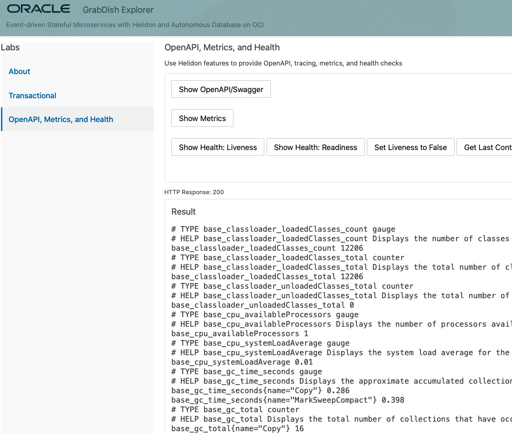

Task 5: Verify Health

Oracle Cloud Infrastructure Container Engine for Kubernetes (OKE) provides health probes which check a given container for its liveness (checking if the pod is up or down) and readiness (checking if the pod is ready to take requests or not). In this STEP you will see how the probes pick up the health that the Helidon microservice advertises. Click Tracing, Metrics, and Health and click Show Health: Liveness

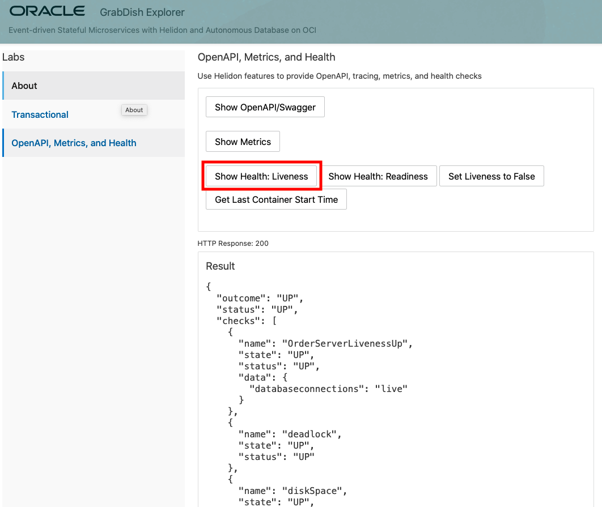

Notice health check class at $GRABDISH_HOME/order-helidon/src/main/java/io/helidon/data/examples/OrderServiceLivenessHealthCheck.java and how the liveness method is being calculated.

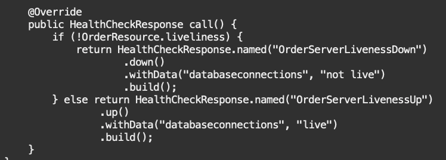

Notice liveness probe specified in $GRABDISH_HOME/order-helidon/order-helidon-deployment.yaml The livenessProbe can be set up with different criteria, such as reading from a file or an HTTP GET request. In this example the OKE health probe will use HTTP GET to check the /health/live and /health/ready addresses every 3 seconds, to see the liveness and readiness of the service.

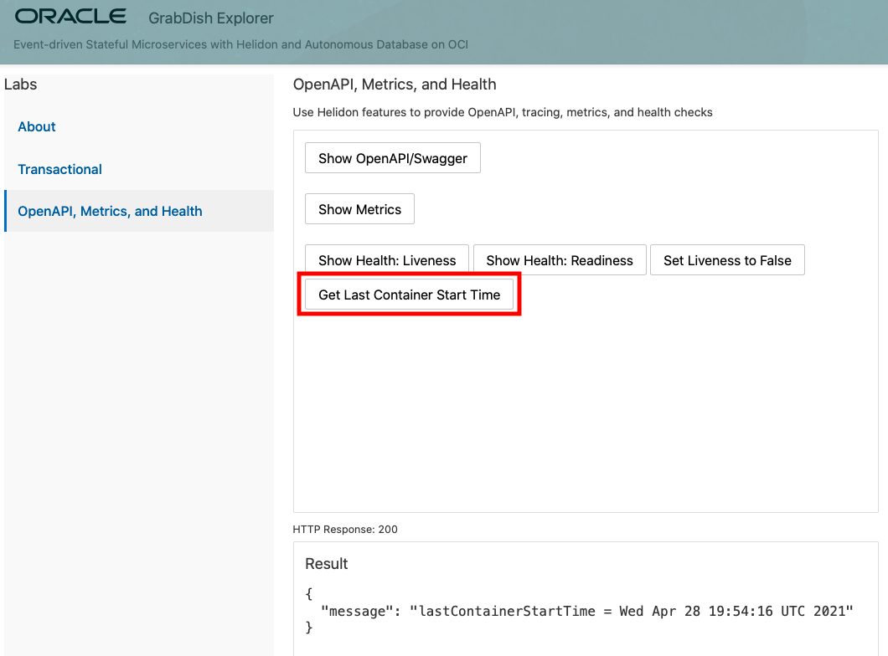

In order to observe how OKE will manage the pods, the microservice has been created with the possibility to set up the liveliness to “false”. Click Get Last Container Start Time and note the time the container started.

Click Set Liveness to False . This will cause the Helidon Health Check to report false for liveness which will result in OKE restarting the pod/microservice

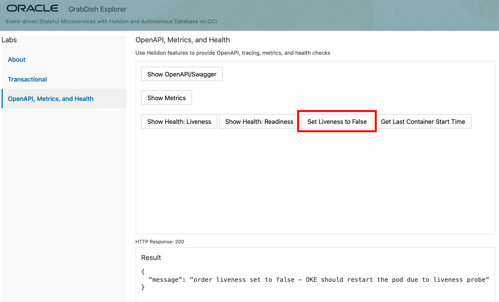

Click Get Last Container Start Time. It will take a minute or two for the probe to notice the failed state and conduct the restart and as it does you may see a connection refused exception.

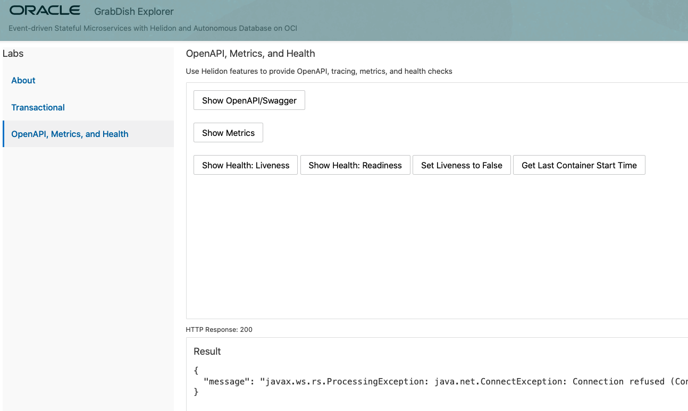

Eventually you will see the container restart and note the new/later container startup time reflecting that the pod was restarted.

 
   Lab 3: Polyglot Microservices
   

The illustration below shows four microservices – Order, Inventory, Delivery, Supplier, and the infrastructure required to run them.

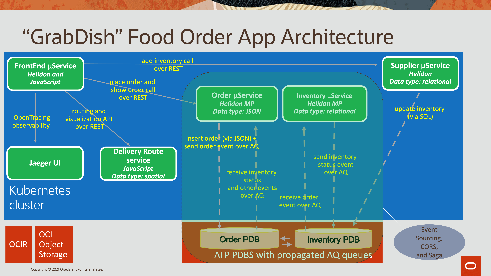

For more information on microservices visit http://developer.oracle.com/microservices

This lab will show you how to switch the Inventory microservice to a Python, Node.js, .NET, Go, Spring Boot or Java Helidon SE implementation while retaining the same application functionality.

Estimates Lab Time - 10 minutes

**Objectives**

Undeploy the existing Java Helidon MP Inventory microservice
Deploy an alternate implementation of the Inventory microservice and test the application functionality

**Prerequisites**

This lab assumes you have already completed the previous labs.

Task 1: Undeploy the Java Helidon MP Inventory Microservice
 

To undeploy the Inventory Helidon MP service, open the Cloud Shell and go to the inventory-helidon folder, using the following command.

`$GRABDISH_HOME/inventory-helidon ; ./undeploy.sh`

Task 2: Deploy an alternate implementation of the Inventory Microservice

In this step you can choose between six different implementations of the Inventory Microservice: PL/SQL, Python, NodeJS, .NET, Go, or Java Helidon SE.

Select one of the alternate implementations and deploy the service for the selected implementation.

If you selected PL/SQL, deploy this service:

`cd $GRABDISH_HOME/inventory-plsql; ./deploy.sh`

If you selected Python, deploy this service:

`cd $GRABDISH_HOME/inventory-python; ./deploy.sh`

If you selected Node.js, deploy this service:

`cd $GRABDISH_HOME/inventory-nodejs; ./deploy.sh`

If you selected .NET, deploy this service:

`cd $GRABDISH_HOME/inventory-dotnet; ./deploy.sh`

If you selected Go, deploy this service:

`cd $GRABDISH_HOME/inventory-go; ./deploy.sh`
If you selected Spring Boot, deploy this service:

`cd $GRABDISH_HOME/inventory-springboot; ./deploy.sh`
If you selected Java Helidon SE, deploy this service:

`cd $GRABDISH_HOME/inventory-helidon-se; ./deploy.sh`

Task 3: Verify application functionality

Repeat Lab 2: Step 3 to verify that the functionality of the GrabDish store remains the same while using the new implementation. You will need to use different order ID's, for example 166 and 167.
Task 4: Re-deploy the Java Helidon MP Inventory Microservice
To undeploy any other inventory services and then deploy the Inventory Helidon MP service, issue the following commands.

`for i in inventory-plsql inventory-helidon-se inventory-python inventory-nodejs inventory-dotnet inventory-go inventory-springboot; do cd $GRABDISH_HOME/$i; ./undeploy.sh; done
cd $GRABDISH_HOME/inventory-helidon ; ./deploy.sh
cd $GRABDISH_HOME`

 
   Lab 4: Observability (Metrics, Tracing, and Logs)
   

 Task 1: Install and configure observability software as well as metrics and log exporters

Run the install script to install Jaeger, Prometheus, Loki, Promtail, Grafana and an SSL secured LoadBalancer for Grafana

`cd $GRABDISH_HOME/observability;./install.sh`

Run the /createMonitorsAndDBAndLogExporters.sh script. This will do the following…

Create Prometheus ServiceMonitors to scrape the Frontend, Order, and Inventory microservices.

Create Prometheus ServiceMonitors to scrape the Order PDB, and Inventory PDB metric exporter services.

Create configmpas, deployments, and services for PDB metrics exporters.

Create configmaps, deployments, and services for PDB log exporters.

`cd $GRABDISH_HOME/observability;./createMonitorsAndDBAndLogExporters.sh`

Task 2: Configure Grafana 

Identify the EXTERNAL-IP address of the Grafana LoadBalancer by executing the following command:

`services`

Note that it will generally take a few minutes for the LoadBalancer to provision during which time it will be in a pending state

Open a new browser tab and enter the external IP URL :

https://<EXTERNAL-IP>

Note that for convenience a self-signed certificate is used to secure this https address and so it is likely you will be prompted by the browser to allow access.

Login using the default username admin and password prom-operator

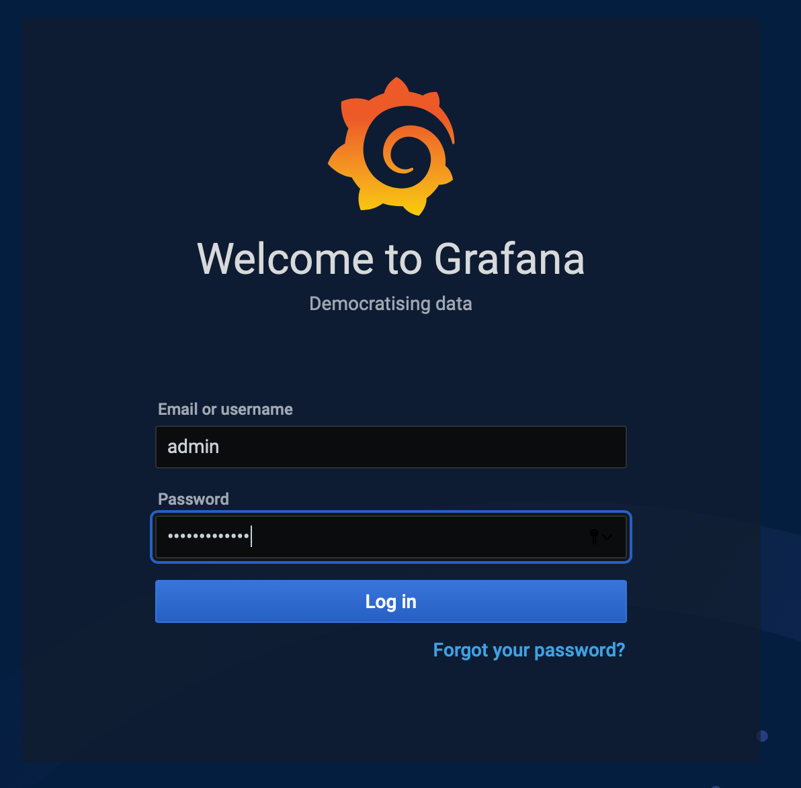

View pre-configured Prometheus data source…

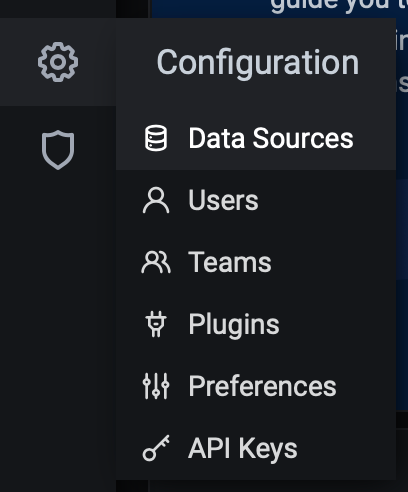

Select the Configuration gear icon on the left-hand side and select Data Sources.

Click select button of Prometheus option.

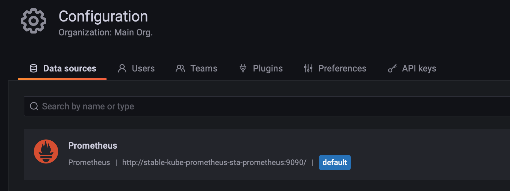

The URL for Prometheus should be pre-populated

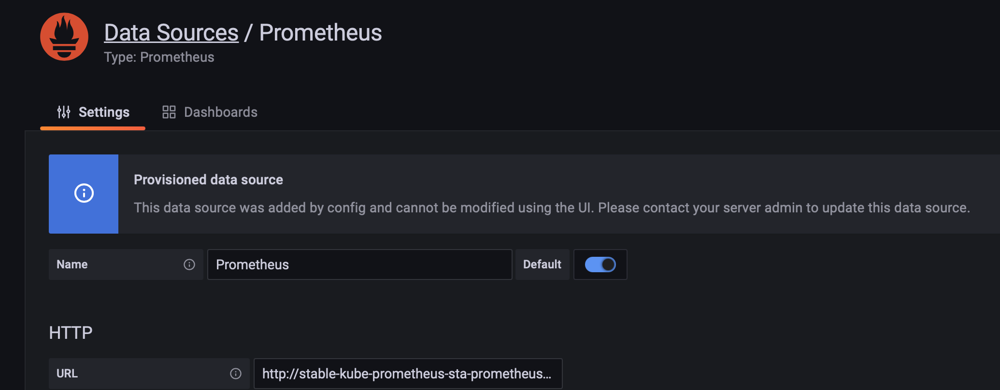

Click Test button and verify success.

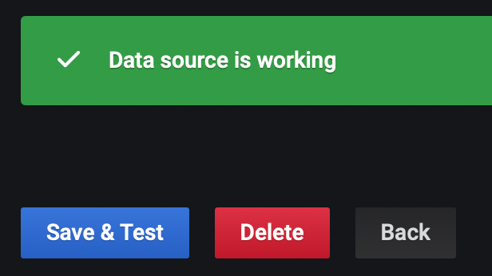

Click the Back button.

Select the Data sources tab and select Jaeger

Click Add data source.

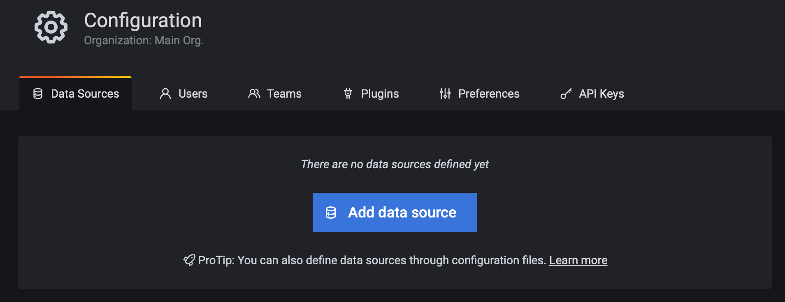

Click select button of Jaeger option.

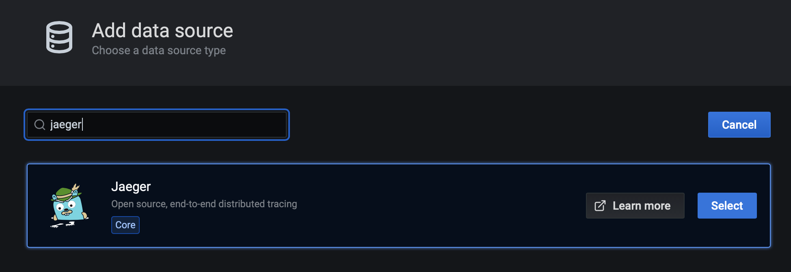

Enter http://jaeger-query.msdataworkshop:8086/jaeger in the URL field.

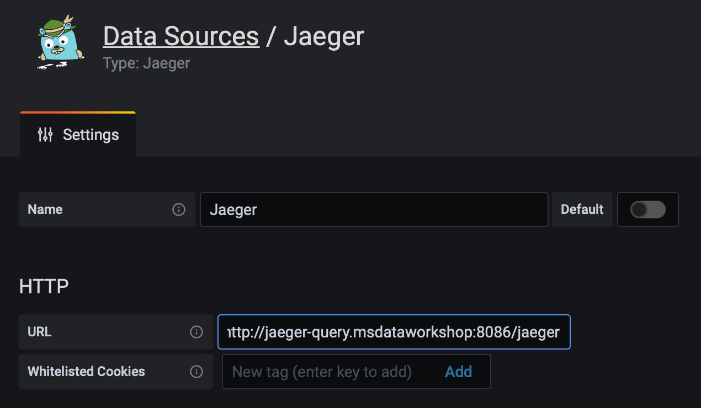

Click the Save and test button and verify successful connection message.

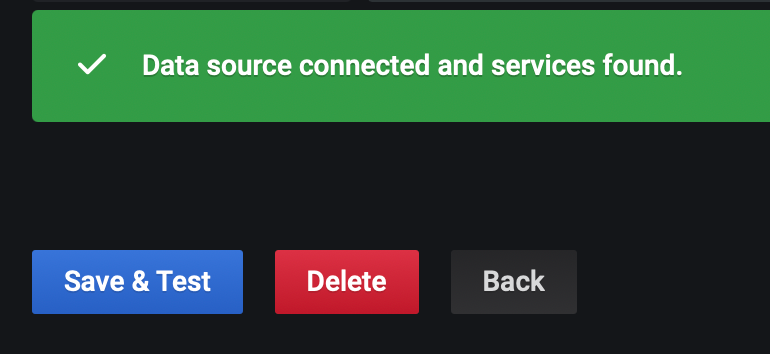

Click the Back button.

Add and configure Loki data source…

Click Add data source.

Click select button of Loki option.

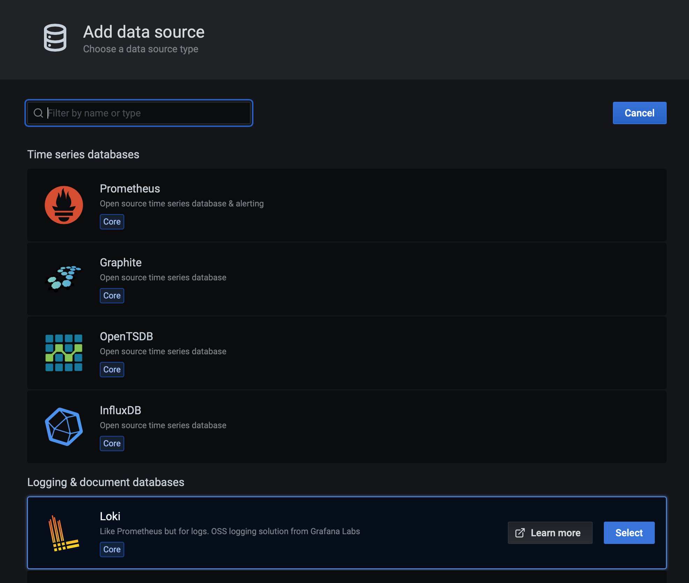

Enter http://loki-stack.loki-stack:3100 in the URL field

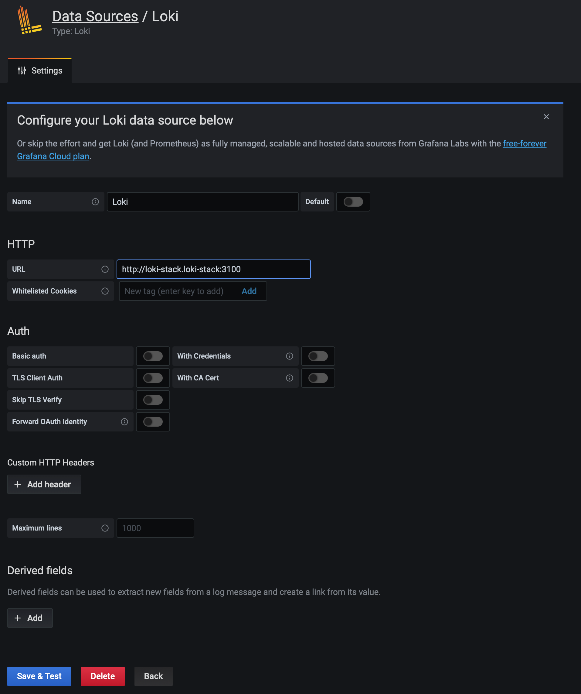

Create the two Derived Fields shown in the picture below. The values are as follows:

Name: traceIDFromSpanReported
Regex: Span reported: (\w+)
Query: ${__value.raw}
Internal link enabled and `Jaeger` selected from the drop-down list.
(Optional) Debug log message: Span reported: dfeda5242866aceb:b5de9f0883e2910e:ac6a4b699921e090:1

Name: traceIDFromECID
Regex: ECID=(\w+)
Query: ${__value.raw}
Internal link enabled and `Jaeger` selected from the drop-down list
(Optional) Debug log message: ECID=dfeda5242866aceb

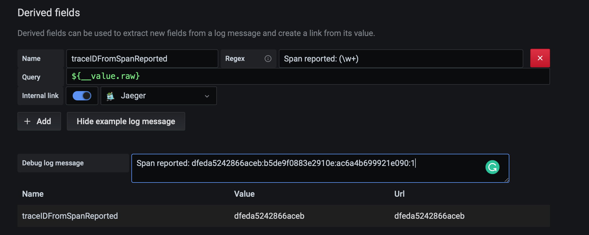


Click the Save & Test button and verify successful connection message.


Click the Back button.

Install the GrabDish Dashboard

Select the + icon on the left-hand side and select Import


Copy the contents of the GrabDish Dashboard JSON found here


Paste the contents in the Import via panel json text field and click the Load button

Confirm upload and click Import button.


 Task 3: Open and study the main GrabDish Grafana Dashboard screen and metrics

Select the four squares icon on the left-hand side and select 'Dashboards'


In the Dashboards panel select GrabDish Dashboard


Notice the collapsible panels for each microservices and their content which includes


Metrics about the kubernetes microservice runtime (CPU load, etc.)

Metrics about the kubernetes microservice specific to that microservice (PlaceOrder Count, etc.)

Metrics about the PDB used by the microservice (open sessions, etc.)

Metrics about the PDB specific to that microservice (inventory count)


By default the status will show a value of 1 for UP status.


This can be corrected by selecting the Edit item in the/a Status panel dropdown

Add a value mapping where value of 1 results in text of UP) under the Field tab as shown here:


Click the Apply button in the upper right to apply changes.

If not already done, place an order using the application or run the scaling test in previous labs in order to see the metric activity in the dashboard.

Select the 'Explore' option from the drop-down menu of any panel to show that metric and time-span on the Explore screen


Task 4: Use Grafana to drill down on metrics, tracing, and logs correlation and logs to trace feature

Click the Split button on the Explore screen.


Click the Loki option from the drop-down list on the right-hand panel.

Click the chain icon on either panel. This will result in the Prometheus metrics on the left and Loki logs on the right are of the same time-span.


Click the Log browser drop-down list on the right-hand panel and select the app label under "1. Select labels to search in"


Select the order (microservice) and db-log-exporter-orderpdb values under "2. Find values for selected label" and click Show logs button.


Select one of the green info log entries to expand it. Notice the Jaeger button next to the trace id.


Click the Jaeger to view the corresponding trace information and drill down into detail.


 
   Lab 5: Teardown
   

**Introduction**
In this lab, we will tear down the resources created in your tenancy and the directory in the Oracle cloud shell.

Click on Stack Details (Under Resource Manager)

Click the Destroy (Red Color) Button

Chick Destroy Again


