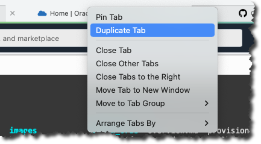

# Access ORDS and DB Server using Bastion

The Terraform IaC includes creating a Bastion Service and Bastion Sessions.

1. Managed SSH: Used for accessing the ORDS Server
2. SSH Port fwarding: Used for accessing ATP-S on private endpoint

## Task 1. ORDS Server access (from on-prem and Cloud Shell)

If you are using Cloud Shell, you need to open a new browser tab. s best not to use the original browser window or not to refresh it as this may disturb the setup or you might lose your shell session. Most browsers have a "duplicate" feature that will allow you to quickly create a second window or tab.



Make sure that you are in the directory where the terraform code lives. Get access the ORDS via the SSH Tunnel (using the Bastion Service) by executing the following commands:

```bash
<copy>
SSH_ords=$(terraform output -json bastion_ssh_cmd | jq -r '.');
eval "$SSH_ords"
</copy>
```

You have to answer yes a few times if this is the first time you access the ORDS server.

## Task 2: Access the ADB-S with a private endpoint (from on-prem and Cloud Shell)

If you are using Cloud Shell, you need to open a new browser tab. s best not to use the original browser window or not to refresh it as this may disturb the setup or you might lose your shell session. Most browsers have a "duplicate" feature that will allow you to quickly create a second window or tab.


To access the ATP you need to create a SSH Tunnel and start the tunnel in a new terminal window or browser tab if you're using Cloud Shell. This command needs to be executed from the workshop directory.

```bash
<copy>
SSH_tunnel=$(terraform output -json forward_ssh_cmd | jq -r '.');
eval "$SSH_tunnel"
</copy>
```

This will start the SSH Tunnel. If you close the terminal window you need to restart the SSH tunnel to be able to access the ADB-S instance.

### 1. Create the connection string to the ADB-S instance

Open a **new** terminal window or browser tab (if you're using Cloud Shell) Make sure that the tunnel is still running and go to the directory where the terraform code lives end execute the following commands to get the connecton string to the ADB-S and modify the connection string to work with the tunnel e.g. connect to localhost on port 1521 instead of the private endpoint name.

```bash
<copy> 
source ./terraform-env.sh;
export uppercase=$(echo ${TF_VAR_proj_abrv}${TF_VAR_size} | tr '[:lower:]' '[:upper:]');
export LOCAL_endpoint=${uppercase}ADBPrivateEndpoint.adb.${TF_VAR_region}.oraclecloud.com; 
echo $LOCAL_endpoint
</copy>
```

The output should look similar to this `[ABBRV]XSPrivateEndpoint.adb.us-ashburn-1.oraclecloud.com` e.g., your region is part of the variable and the [ABBRV] part is in your environment variables.

Create the connection string:

```bash
<copy> 
export CONN_string=$(terraform output -json dbconn |jq -r '.' | sed "s/$LOCAL_endpoint/localhost/g" | sed "s/"\'"/"\""/g" | sed "s/yes/no/");
echo $CONN_string
</copy>
```

The output should have the host variable to be set to localhost (as we are connecting via a SSH tunnel to the ADB-S instance).

```bash
(description= (retry_count=20)(retry_delay=3)(address=(protocol=tcps)(port=1521)(host=**localhost**))(connect_data=(service_name=dvtweegblahblah_atdbxs_tp.adb.oraclecloud.com))(security=(ssl_server_dn_match=no)))
```

### 2. Connect to the ADB-S instance from local machine

Connect to the ADB-S instance: (did you remember to change the ADMIN password in the OCI Console). Mke sure that you surround the `$CONN_string` variable with ".

```bash
<copy>
sql ADMIN/<YOUR_PASSWORD>@"$CONN_string"
</copy>
```

Successful connection will look like this:

```bash
% sql ADMIN/<YOUR_PASSWORD>@"$CONN_string"

SQLcl: Release 22.2 Production on Tue Jul 05 15:44:14 2022

Copyright (c) 1982, 2022, Oracle.  All rights reserved.

Last Successful login time: Tue Jul 05 2022 15:44:15 -05:00

Connected to:
Oracle Database 19c Enterprise Edition Release 19.0.0.0.0 - Production
Version 19.16.0.1.0

SQL>
```

## Task 3 (Optional): Access the ADB-S with a private endpoint from ORDS Server

### 1. Get the connection string

In the workshop directory execute the following command and copy the output as you will need this information on task 2.3.

```bash
<copy>
terraform output -json dbconn | jq -r '.'
</copy>
```

The output should look something like this:

```bash
(description= (retry_count=20)(retry_delay=3)(address=(protocol=tcps)(port=1521)(host=ATXSADBPrivateEndpoint.adb.us-ashburn-1.oraclecloud.com))(connect_data=(service_name=dvtweeblahblah_atdbxs_tp.adb.oraclecloud.com))(security=(ssl_server_dn_match=yes)))
```

### 2. Connect to the ORDS VM

Make sure that you are in the directory where the terraform code lives. Get access the ORDS via the SSH Tunnel (and Bastion Service) by executing the following commands:

```bash
<copy>
SSH_ords=$(terraform output -json bastion_ssh_cmd | jq -r '.');
eval "$SSH_ords"
</copy>
```

You have to answer yes a few times if this is the first time you access the ORDS server.

### 3. Access the ORDS VM

SQLcl is already installed on the ORDS Server. To connect to the ADB-S database run the following command:

```bash
<copy>
sql ADMIN/<YOUR_PASSWORD>@<PASTE_THE_CONNECTIONSTRING>
</copy>
```

Successful connection will look like to this:

```bash
% sql ADMIN/<YOUR_PASSWORD>@(description= (retry_count=20)(retry_delay=3)(address=(protocol=tcps)(port=1521)(host=ATXSADBPrivateEndpoint.adb.us-ashburn-1.oraclecloud.com))(connect_data=(service_name=dvtweeblahblah_atdbxs_tp.adb.oraclecloud.com))(security=(ssl_server_dn_match=yes)))

SQLcl: Release 22.2 Production on Tue Jul 05 15:44:14 2022

Copyright (c) 1982, 2022, Oracle.  All rights reserved.

Last Successful login time: Tue Jul 05 2022 15:44:15 -05:00

Connected to:
Oracle Database 19c Enterprise Edition Release 19.0.0.0.0 - Production
Version 19.16.0.1.0

SQL>
```

## Learn More

* Ask for help and connect with developers on the [Oracle DB Microservices Slack Channel](https://bit.ly/oracle-database-microservices-slack).  Search for and join the `oracle-db-microservices` channel.

## Acknowledgements

* **Author** - Andy Tael, Developer Evangelist;
               Corrado De Bari, Developer Evangelist
* **Contributors** - John Lathouwers, Developer Evangelist
* **Last Updated By/Date** - Andy Tael, July 2022
