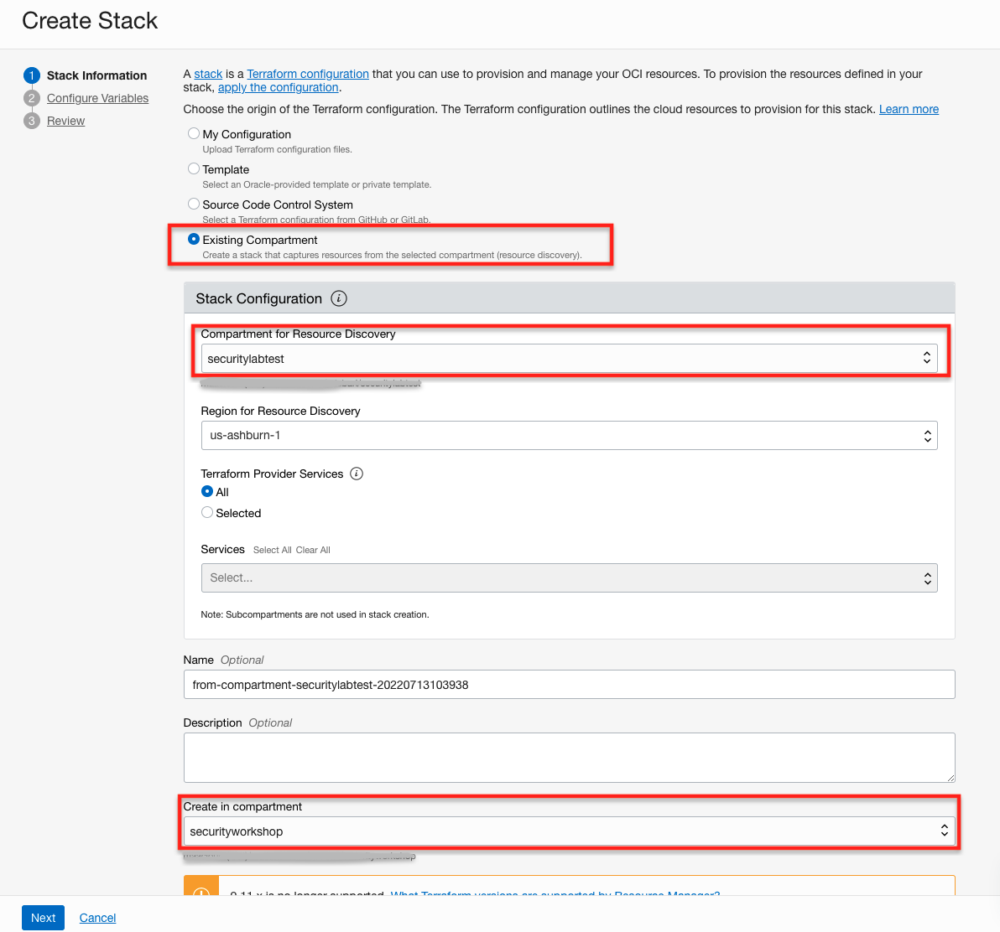
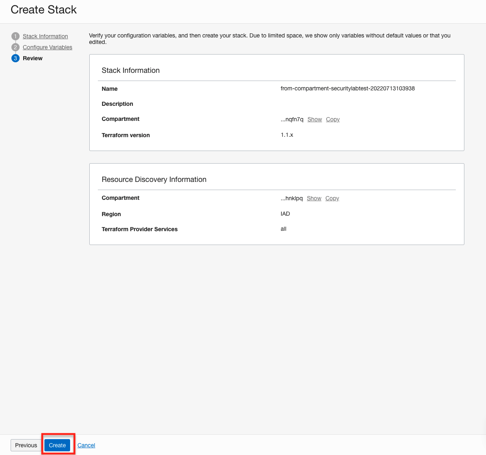
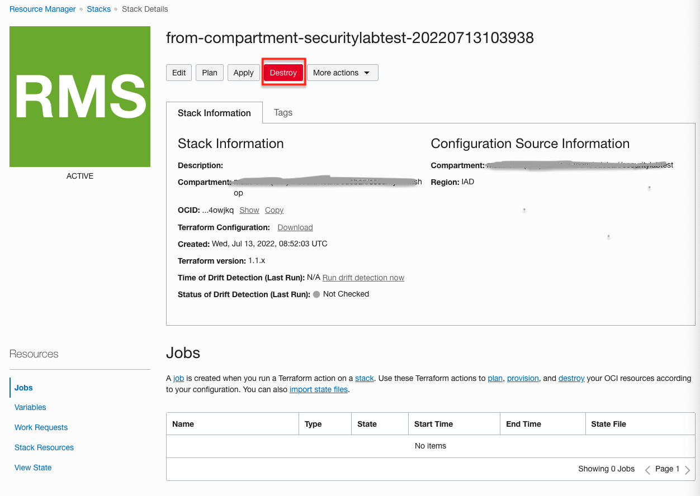

# Teardown process

* In the shell used so far (Cloud Shell or Desktop), start to delete API GW resources (make sure that you are in the directory where the iAC code lives):

```bash
<copy>
source ./terraform-env.sh
source ./env-refresh.sh
oci api-gateway deployment delete --deployment-id ${api_gw_deploy} --force --wait-for-state SUCCEEDED; 
oci api-gateway gateway delete --gateway-id ${api_gw_id} --force --wait-for-state SUCCEEDED; 
oci network nsg delete --nsg-id ${TF_VAR_nsg_apigw} --force --wait-for-state TERMINATED;
export policy_id=$(oci iam policy list --compartment-id ${TF_VAR_compartment_ocid} --name apigw_policy --query 'data[0]."id"' --raw-output);
oci iam policy delete --policy-id ${policy_id} --force --wait-for-state DELETED;
</copy>
```

* Delete manually  **Data Safe Private Endpoint** and, on Autonomous DB console, deregister from Data Safe:


* Proceed with deletion of resource provisioned via Terraform: (ANDY: this will never succeed as we have modified the AT-security-group-adb NSG and the Data Safe private endpoint is using this. Maybe only use ORM to destroy the environment or remove the NSG/Private endpoint manually via OCI CLI?)

```bash
<copy>
terraform destroy
</copy>
```

**NOTE**: if eventually process stops for conflicts, for example:

```text
│ Error: 412-PreconditionFailed, NetworkSecurityGroup ocid1.networksecuritygroup.oc1.iad.aaaaaaaaniioablahblahblah cannot be deleted since it still has vnics attached to it
│ Suggestion: Please retry or contact support for help with service: Core Network Security Group
│ Documentation:
....
....
....
```

run the destroy process again.

```bash
<copy>
terraform destroy
</copy>
```

* For resource related to Data Safe, Under main Menu tree, select **Developer Services**/**Resource Manager**/**Stacks** and click on **Create Stack** button.
* Select for the Terraform configuration the **Existing Compartment**, that will create a Terraform script for the compartment you have chosen for deployment and that you have to select under **Compartment for Resource Discovery**. For **Terraform Provider Services** select **All** and eventually select another compartment as a target for **Create in compartment**. Then click on **Next** button two times.


* Click on **Create** button to start the process.


* When the Terraform script creation is finished (this will take a few minutes), click on **Destroy** button and wait for the process to complete.


Run the destroy process again. If issues remain, delete manually the resources that hang the process, for example object storage bucket related to log files, and re-create a stack and apply destroy on it. (ANDY:There seems to be some leftovers from Data Safe after deletion, such as Audit policy that I can't figure out how to delete)

## Learn More

* Ask for help and connect with developers on the [Oracle DB Microservices Slack Channel](https://bit.ly/oracle-database-microservices-slack)  
Search for and join the `oracle-db-microservices` channel.

## Acknowledgements

* **Author** - Andy Tael, Developer Evangelist;
               Corrado De Bari, Developer Evangelist
* **Last Updated By/Date** - Corrado De Bari, July 2022
